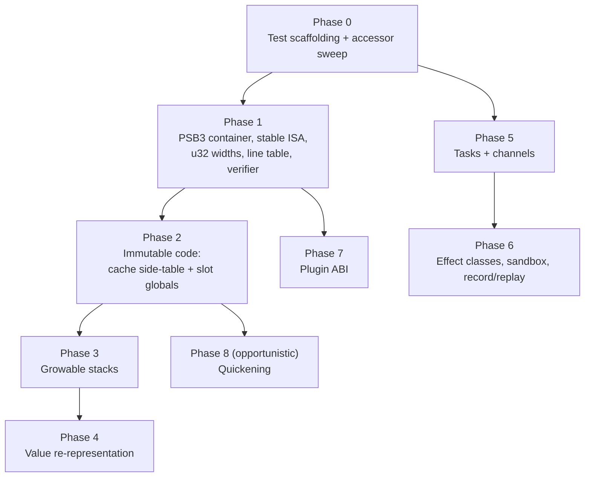

# PSCAL VM 2.0: Design & Implementation Plan

Status: Phase 0 and Phase 1 core (1a-1e, the PSB3 format epoch plus the
load-time verifier) shipped 2026-07-04; Phase 2a (inline caches move to a
side-table), Phase 2b (slot-addressed globals), Phase 3 (growable
operand/call stacks), and Phase 6 (effect classes, the `--deny` sandbox, and
record/replay -- concurrency-track-independent, done out of sequence) all
shipped 2026-07-05.
Phase 4's Stage A (§5.10.4 sub-phases 4a-4g: ObjHeader foundation;
closures/interfaces/mstreams; strings/sets; records; arrays; files/pointers/
enums) shipped 2026-07-06, followed same-day by 4h (numeric/scalar
tagged-word encoding, standalone/not yet wired into Value). 4i (the `Value`
flag day) is split into checkpoints 1-3, checkpoint 3 further split into
3a-3d; checkpoints 1, 2, 3a, 3b, 3c, and 3d all shipped (3a-3d 2026-07-07).
**Checkpoint 3d is the physical collapse itself** -- `Value` is now
`{ VarType type; uint64_t bits; }`, 16 bytes (was 176). 4j (Stage B:
ownership rationalization -- cheap retain-share copies plus
`valueEnsureUnique()`'s write-time clone-on-share) shipped 2026-07-07,
completing Phase 4 in full. Phase 5a (Concurrency Track, §6.1) is split into
checkpoints 5a-i/5a-ii/5a-iii, **all three now shipped 2026-07-08**: 5a-i
(`TYPE_TASK` core -- `TaskSpawn`/`TaskAwait`/`TaskDone`/`TaskCancel` over the
existing thread pool) and 5a-ii (mmap-reservation growable
`threads[]`/`mutexes[]`, default ceilings 4096/65536, both env-overridable)
shipped 2026-07-07, preceded by a prerequisite fix for three TSan-confirmed
pre-existing races in the thread-pool result-handoff path (pscal-core
`43b4077`); 5a-iii (HTTP async migrates onto tasks via a new
`vmTaskCreateNative`, retiring the 32-slot `g_http_async[]` job pool, plus a
new CLike `task` type) shipped 2026-07-08, and along the way confirmed (not
fixed -- filed as a follow-up) a pre-existing, TSan-detectable gap in the
thread pool's natural-completion slot-release path that predates all of
Phase 5a -- fixed separately the same day (pscal-core `6aaefae`). **Phase 5b
(Channels, §6.2) is complete in full, all three checkpoints shipped
2026-07-08**: 5b-i (`TYPE_CHANNEL` core -- `ChannelCreate`/`Send`/`Receive`/
`TrySend`/`TryReceive`/`Close`/`IsClosed` over a pure `ObjHeader`-backed ring
buffer, no VM-level registry), 5b-ii (multi-producer/multi-consumer stress,
`TaskCancel`-wakes-`ChannelReceive` verification, and a full-suite TSan pass
-- zero findings, after same-day separate fixes (pscal-core `fb010ec`,
`32799f4`, `a51b9e4`) resolved 5b-i's own four deferred pre-existing races
plus two more found along the way, an ordinal-vs-nil comparison gap and a
swallowed-task-abort bug), and 5b-iii (CLike `channel` keyword, mirroring
5a-iii's `task` episode -- `ChannelTryReceive`'s `var`-parameter mechanism
confirmed working in CLike with zero CLike-specific compiler changes, since
it's backed by the shared `compiler.c`, not Pascal-specific). Phase 6.3's
remaining items and Phase 7 remain proposal.
Companion to the
[VM Technical Manual](pscal_vm_manual/pscal_vm_manual.md), which documents
the 1.x engine this plan modifies.  File/line references are to
`components/pscal-core` at the manual's snapshot.

## 1. Goals and Non-Goals

**Goals**

- G1: Stable, portable, verifiable bytecode.  A `.bc` compiled anywhere runs
  anywhere (same VM major version), survives opcode additions, and cannot
  drive the interpreter out of bounds.
- G2: Immutable code.  No runtime patching of the instruction stream, so
  chunks can be mmap'd, shared across threads, and hashed for integrity.
- G3: Substantially faster value handling without changing the stack
  architecture or rewriting frontend code generators.
- G4: One coherent concurrency story (tasks + channels) replacing the split
  between VM threads and subsystem-private thread pools.
- G5: Effect-aware execution: sandboxing and record/replay for untrusted or
  model-generated programs.
- G6: Extension loading without recompiling pscal-core.

**Non-Goals**

- No register-based ISA conversion.  The stack ISA stays; five frontend code
  generators are not being rewritten.
- No JIT.  Quickening only, and only via the cache side-table (§5.8).
- No breaking of the `VmBuiltinFn` source-level signature
  (`Value (*)(VM*, int, Value*)`).  Builtins recompile; they do not get
  rewritten.
- No change to frontend surface languages required by any phase.  New
  capabilities (tasks, channels) are additive builtins/opcodes that
  frontends adopt on their own schedule.

## 2. Compatibility & Versioning Strategy

The user base is effectively "us", so **recompilation is the compatibility
mechanism** and we do not carry transition machinery:

- **Semantic compatibility is the real contract.** The same source program
  must behave identically on the new VM.  That is guarded by the per-suite
  baselines and the differential harness of §4, and it is where all the
  compat effort in this plan goes.  `.bc` files have no compatibility
  promise at all: they are cache artifacts, and source is always present.
- **Format epoch, hard cutover.** All format-breaking changes land together
  as **PSB3** (new magic `0x50534233`).  The PSB2 read path is deleted in
  the same change; old cache entries miss on the magic/version check and
  recompile, which is the cache's normal cold path.  No dual loader, no
  transition period, no migration.
- **ISA hygiene going forward.** Opcode values become explicit and
  append-only at the PSB3 boundary (§5.1), so post-2.0 opcode additions
  stop invalidating every cached chunk on the fleet.  A quality-of-life
  measure, not a compatibility promise; `PSCAL_VM_VERSION` continues to
  gate semantic changes.
- **Dual-build safety.** Every phase keeps `Tests/run_all_suites.py` green
  against the per-suite baselines, plus the differential harness of §4.
  PBuild's FetchContent override means the umbrella build and the standalone
  aether build must both be exercised before each phase ships (the stale
  `external/` pin trap applies to every phase here).

## 3. Sequencing Overview



Phases 5-7 are parallel tracks after their prerequisites; 1-4 are strictly
ordered because each rests on the previous one's invariants.  Phase 4 is
deliberately last in the core track: it is the highest-value and
highest-risk item, and everything before it shrinks its blast radius.

## 4. Phase 0: Scaffolding (prerequisite for everything)

1. **Differential harness.** A driver that runs a program corpus (the
   existing Pascal/Rea/CLike/Aether test suites plus a sample of
   aether_doc_bench generations) through two VM builds and byte-compares
   stdout/stderr/exit codes.  Every subsequent phase gates on zero diffs.
   **Done:** `Tests/vm_diff_harness.py --vm-a <bin dir> --vm-b <bin dir>`
   (resumable, per-unit results, exits nonzero on any reproducible diff;
   see its module docstring for corpus/statuses/usage).
2. **Performance baseline.** A small benchmark set (arith loop, call-heavy,
   string-heavy, global-heavy, JSON parse/walk, HTTP-loopback) with numbers
   recorded per phase, so wins and regressions are attributed to the phase
   that caused them.
   **Done:** `Tests/vm_bench/` (`run_vm_bench.py`, results appended to
   `history.jsonl` with git SHA + date).
3. **Accessor sweep (prep for Phase 4).** Mechanical PR: replace all direct
   `Value` field pokes (`v->i_val`, `v.type == TYPE_...`) in vm.c, builtins,
   and ext_builtins with the existing accessor/constructor macro families
   (`AS_INTEGER`, `IS_NUMERIC`, `makeInt`, ...), extended to full coverage.
   Zero behavior change; verified by the differential harness.  This is what
   makes Phase 4 a representation swap instead of a codebase rewrite.
   **Done:** payload sweep + metadata-field sweep shipped (2026-07-04), with
   a `PSCAL_VALUE_ACCESS_LINT` build option guarding regressions; sweep
   tooling in `Tests/vm_diff_work/`.
   **Done:** ~2,600 sites swept across vm.c, builtin.c, the network API,
   symbol/compiler, ext_builtins, gl/sdl/audio, the shell `.inc` family and
   smallclue integration.  New exact-alias accessors in core/types.h
   (`VALUE_TYPE`, `VAL_INT`/`VAL_UINT`, `VAL_REAL32/64/_LD`, `AS_RECORD`,
   `AS_ARRAY`, `AS_POINTER`, ..., `SET_VALUE_TYPE`, `SET_CHAR_VALUE`) are
   C11 `_Generic`-pinned to `Value`, so applying one to a Symbol/AST/Token
   is a compile error.  Verified per slice by -O2 object-code
   byte-comparison, the full suites, and zero-diff `vm_diff_harness` runs.
   Regression guard: configure with `-DPSCAL_VALUE_ACCESS_LINT=ON` to
   `#pragma GCC poison` the raw payload field names outside the
   representation layer (core/utils.c, core/cache.c stay raw by design).
   **Metadata follow-up done (2026-07-04):** the array/string/file/pointer
   metadata fields (`lower_bound(s)`, `upper_bound(s)`, `dimensions`,
   `element_type(_def)`, `array_is_packed/_dynamic`, `array_refcount`,
   `base_type_node`, `max_length`, `filename`, `record_size(_explicit)`,
   `enum_meta`) now go through `ARRAY_*`/`STRING_MAX_LENGTH`/
   `PTR_BASE_TYPE_NODE`/`FILE_*`/`ENUM_META` accessors in core/types.h
   (~430 sites in vm.c, builtin.c, network API, symbol/compiler,
   ext_builtins, sdl).  Same verification: -O2 object-code byte-identity
   per file, full suites, zero-diff `vm_diff_harness` (388 MATCH /
   0 diverge).  The lint poison covers the Value-unique metadata names;
   the generic ones (`dimensions`, `element_type`, `filename`, ...) rely
   on the `_Generic` guard.  Item 3 is fully complete; Phase 4 Stage A
   can re-point array/string metadata freely.
4. **`opcodes.def` single source of truth.** Replace the hand-maintained
   enum + `VM_OPCODE_LIST` X-macro + hand-written disassembler switch with
   one table:

   ```c
   /* opcodes.def: OP(name, value, operands, stack_in, stack_out) */
   OP(ADD,            0x08, "",        2, 1)
   OP(CONSTANT,       0x01, "c1",      0, 1)   /* c1 = u8 const idx   */
   OP(CONSTANT16,     0x02, "c2",      0, 1)   /* c2 = u16 const idx  */
   OP(JUMP_IF_FALSE,  0x1C, "j4",      1, 0)   /* j4 = i32 rel offset */
   OP(CALL,           0x55, "c2a4n1", -1, 1)   /* variable arity      */
   ```

   Dispatch table, `kOpcodeNames`, the disassembler's operand decoding, the
   verifier (§5.5), and instruction-length queries all generate from this
   file.  The manual's Chapter 3 tables become checkable against it.
   **Done:** `components/pscal-core/src/compiler/opcodes.def` (explicit
   values pinned by `_Static_assert`s, operand-spec column, stack effects).

Phase 0 is complete as of 2026-07-04.
   **Done (2026-07-04):** `components/pscal-core/src/compiler/opcodes.def`
   holds the full page with explicit ordinals (0x00-0x63), operand-spec
   strings (`b`/`i`/`k`/`K`/`w`/`j`/`f`/`C`; `"?"` for the four
   variable-length opcodes — DEFINE_GLOBAL[16], INIT_LOCAL_ARRAY,
   INIT_FIELD_ARRAY — which keep bespoke decode logic) and stack effects
   (-1 = operand-dependent; informational until the §5.5 verifier).
   Generated from it: the OpCode enum + per-ordinal `_Static_assert` pins
   (bytecode.h), the computed-goto dispatch table, its labels and
   `kOpcodeNames` (vm.c), the `OpcodeInfo` metadata table +
   `pscalOpcodeInfo()`/`pscalOpcodeOperandSpecLength()` driving
   `getInstructionLength()` and the disassembler's operand decoding
   (bytecode.c), and the pscald/pscalasm mnemonic table
   (umbrella `src/disassembler/opcode_meta.c`).  Verified: disassembly
   output byte-identical old-vs-new over a 95-program corpus, old-binary
   .bc cache entries load unchanged in the new binary, zero-diff
   `vm_diff_harness` (401 units), full suites at baseline.

## 5. Core Track

### 5.1 Phase 1a: Stable opcode numbering

- Explicit values in `opcodes.def`, current ordinals preserved as the
  starting assignment (0x00-0x63), then organized reserved ranges for new
  opcodes: 0x64-0x7F core, 0x80-0x9F concurrency, 0xA0-0xBF reserved,
  0xC0-0xFE experimental, 0xFF escape prefix for a future second page.
- `_Static_assert` pinning every existing opcode to its published value.
- Dispatch table becomes 256 entries with holes pointing at
  `LABEL_INVALID`; no measurable dispatch cost change.

**Done (2026-07-04):** `vm.c`'s computed-goto dispatch table is now
`dispatch_table[256]`, one-time-filled (`static bool dispatch_table_ready`
guard) with every slot defaulting to `&&LABEL_INVALID` before the
`opcodes.def`-generated slots overwrite the defined ordinals; the old
`if (instruction_val >= OPCODE_COUNT) goto LABEL_INVALID;` bounds check
ahead of the dispatch is gone; `goto *dispatch_table[instruction_val]` is
now unconditionally safe for any `uint8_t` value with no added branch on
the hot path. Verified with a targeted fuzz pass: every single byte of a
compiled `.bc` file flipped to a reserved/invalid opcode value, run through
`pscalvm` — 0 crashes across 734 mutation points (136 clean errors, 598 no
observable change), confirming the reserved range is dispatch-safe.

### 5.2 Phase 1b: PSB3 container

Replaces the raw-`fwrite` PSB2 layout (`serializeBytecodeChunk`,
`writeChunkCore`) with an explicit little-endian, sectioned format:

```
[magic u32le 'PSB3'] [format_ver u16] [vm_ver u16]
[flags u32] [section_count u32]
section_count × { id:u32  offset:u32  length:u32 }   ; section directory
sections (8-byte aligned):
  CODE   raw instruction bytes (immutable, mmap-executable)
  CONST  constant pool (explicit LE encodings; reals as IEEE754 bits,
         long double serialized as f64 + extension record)
  LINES  varint (pc_delta, line_delta) pairs            ; replaces lines[]
  PROCS  procedure metadata (current fields, LE)
  TYPES  type table
  BMAP   builtin lowercase map + registry fingerprint hash
  META   optional: source path, hashes (cache use only; omitted from
         distributable .bc so artifacts stop embedding absolute local paths)
```

- All integers written through `write_u16le`/`write_u32le` helpers; no more
  host-endianness or host-int-width dependence.
- Unknown section ids are skipped by length, so new sections can be added
  later without another format break.
- The PSB2 writer and reader in `cache.c` are deleted in the same change
  (§2): one format, one loader.
- The registry fingerprint in BMAP replaces the trust dance around
  `CALL_BUILTIN_PROC` baked-in ids: if the fingerprint matches the running
  registry, ids are trusted wholesale; if not, all ids re-resolve by name
  once at load time instead of per call-site checks.

**Done (2026-07-04):** PSB3 container shipped in `components/pscal-core/src/core/cache.c`
exactly as specified above (magic `0x50534233`, `format_ver`/`vm_ver`/`flags`/
`section_count` header, 8-byte-aligned section directory, `CODE`/`LINE`/
`CONS`/`BMAP`/`PROC`/`TYPE`/`META` sections — `PROCS`+const-globals and
`TYPES` bundled as named above; `META` cache-only). All integers little-endian
via `bufU16LE`/`bufU32LE`/`bufU64LE` (write) and `curU16LE`/`curU32LE`/`curU64LE`
(read) helpers. `LINES` is a varint run-length table. The PSB2 reader/writer
are gone from `cache.c` (hard cutover, not a fallback). One deliberate scope
cut: the BMAP fingerprint is computed and stored, but **not** acted on —
resolving builtin ids at write time (`getVmBuiltinID()`, called from
`saveBytecodeToCache()` before VM/extension-builtin setup has finished) was
found to corrupt unrelated interpreter state (surfaced as nil Pascal-closure
upvalues after a cache round-trip); `builtin_resolved_ids` stays `NULL` after
loading, same as PSB2, and the existing per-call-site lazy name resolution in
vm.c is unchanged. Wholesale trust is left for a future phase once the id
lookup can be made safe this early in the load path. See
`Docs/pscal_vm_manual/pscal_vm_manual_ch2.md` for the full on-disk spec.

### 5.3 Phase 1c: u32 widths

- `interpretBytecode(..., uint32_t entry)`; `THREAD_CREATE` operand u32;
  `CALL` address operand u32; jump offsets i32 (`j4` in `opcodes.def`).
- Compiler emit paths updated; this is why it must ride the PSB3 format
  break rather than ship separately.

**Done (2026-07-04):** New `opcodes.def` operand-spec letter `W` (u32 code
address) for `CALL`'s and `THREAD_CREATE`'s address operands; `j` redefined
i16→i32 for `JUMP`/`JUMP_IF_FALSE`. Every emission/patch site across
`compiler/compiler.c` (~40 sites: goto/label backpatch, break/continue,
if/else, case/switch, while/repeat/for loops, short-circuit and/or,
ternary, the peephole optimizer's jump/absolute-address relocation pass,
and `finalizeBytecode`'s CALL-address backpatch) updated in lockstep, plus
the **independent** codegen in `components/exsh/src/shell/codegen.c`
(exsh has its own from-scratch bytecode generator, not routed through
`compiler.c` — missing this the first time produced a real regression,
caught by the full `exsh` scope-test suite, not the differential harness
since `exsh` isn't in its default corpus). `interpretBytecode`'s `entry`
parameter and every `vm.c` local/field that narrowed a code address to
`uint16_t` (closures' `entry_offset` was already `uint32_t`; the local
truncating casts in `CALL`/`CALL_INDIRECT`/`CALL_METHOD`/`PROC_CALL_INDIRECT`/
thread-spawn/closure-creation handling were not) widened to `uint32_t`, so a
chunk's code section is no longer capped at 64KB of addressable jump/call
targets. `vm.c`'s disassembler cases and `pscald`/`pscalasm`'s shared
decoding (driven by the `opcodes.def` operand-spec table) picked up the new
widths automatically.

### 5.4 Phase 1d: Loader hardening

- `.bc` loading goes through bounds-checked cursor reads (no trusting
  stored counts against unchecked buffers).
- Section directory validated (offsets/lengths within file, no overlap).

**Done (2026-07-04):** `cache.c`'s `Cursor` (bounds-checked read cursor,
sticky `error` flag on first overrun) backs every section reader; no `fread`
against unchecked counts remains anywhere in the load path. `psb3ParseHeader()`
validates every directory entry's byte range is fully inside the file and
that no two sections overlap before any section body is touched, with a
sanity cap on `section_count` (>64 rejected outright). Verified: 856
single-byte-flip mutations of a real `.bc` file plus truncation at every
8-byte boundary, all run through `pscalvm` — 0 crashes, only clean errors or
(when a flip happened to land somewhere inert) unchanged output. Targeted
adversarial cases (section offset past EOF, section length `0xFFFFFFFF`,
two sections forced to overlap, `section_count` set to `0x7FFFFFFF` or `0`,
corrupted magic, truncation mid-header/mid-directory) all fail cleanly with
a nonzero exit, never a crash.

### 5.5 Phase 1e: Verifier

Load-time pass over CODE, generated tables from `opcodes.def` doing:

1. Instruction stream walk: every opcode defined, every instruction fully
   inside the section, every jump target on an instruction boundary
   (targets collected in pass 1, checked in pass 2).
2. Operand validation: constant indices < pool size, host-fn ids <
   `HOST_FN_COUNT`, cache ids < cache count (§5.6).
3. Per-procedure abstract stack-depth check using `stack_in`/`stack_out`
   effects: depth never negative, never exceeds a declared max, and merges
   consistently at join points.  Variable-arity calls use the encoded arg
   count.

Verification runs once per load, is skippable for trusted embedded chunks
(`flags` bit), and turns "corrupt cache file" from undefined behavior into
a clean `INTERPRET_COMPILE_ERROR`.  This is also the safety story for
running model-generated bytecode at scale.

**Done (2026-07-04):** `components/pscal-core/src/compiler/bytecode_verify.{h,c}`
implements `pscalVerifyBytecodeChunk()` as three passes, driven by
`opcodes.def`'s generated `OpcodeInfo` table:

1. **Instruction stream walk.** Every byte in `[0, chunk->count)` belongs to
   exactly one instruction with a defined opcode (`pscalOpcodeInfo() != NULL`)
   that is fully in-bounds. The four variable-length ("?") opcodes reuse
   `getInstructionLength()`'s exact logic rather than a second copy: that
   function was split into a shared `pscalDecodeInstructionLength()`
   (bytecode.c) returning both a length and a "was this determinable at all,
   or did truncated input force a bailout" bool, with `getInstructionLength()`
   now a thin wrapper preserving its historical int-only contract for
   existing callers (disassembler etc).
2. **Operand validation.** Every `k`/`K` constant-pool index (including
   those embedded in DEFINE_GLOBAL/16 and INIT_LOCAL_ARRAY/INIT_FIELD_ARRAY
   payloads — re-walked using the same field layout documented in
   opcodes.def) is checked against `constants_count`; `CALL_HOST`'s host id
   against `HOST_FN_COUNT`; every `W` (CALL/THREAD_CREATE target) and `j`
   (JUMP/JUMP_IF_FALSE displacement) resolves to an address that is both
   in-range and an actual instruction boundary from pass 1.
3. **Per-procedure abstract stack-depth walk.** Procedure segments are
   inferred by sorting `procedures`' `bytecode_address` entries (recursing
   into nested class/unit symbol tables, matching vm.c's own address
   lookup) plus an implicit top-level segment at pc 0; each is walked with a
   worklist, tracking depth as either a concrete value or "unknown" (tainted
   by an unresolvable call target). Concrete depth must never go negative,
   never exceed `VM_STACK_MAX`, and must agree exactly at control-flow join
   points; "unknown" never triggers a failure (the runtime's own checked
   `push()`/`pop()`/`peek()` — already bounds-checked, confirmed by reading
   vm.c — remain the backstop there, so precision is only sacrificed, not
   safety). Auditing every opcode's declared `stack_in`/`stack_out` against
   its actual vm.c handler (see opcodes.def's Phase 1e audit comment) found
   and fixed real drift (`DEFINE_GLOBAL`/`16` claimed to pop 1 and pop
   nothing; `THREAD_JOIN` claimed to push a result and doesn't) and
   confirmed several opcodes are not flat-constant at all: `CALL`/
   `CALL_USER_PROC` resolve their net push (the callee's `locals_count`) via
   `procedures` since their target is statically known; `CALL_INDIRECT`/
   `CALL_METHOD`/`CALL_HOST` cannot resolve a target/arg-count statically
   (closure/vtable dispatch, and CALL_HOST's operand is a dispatch id with
   no arg-count convention at all) so they check only their
   statically-knowable precondition and then taint depth to "unknown";
   `PROC_CALL_INDIRECT` turned out fully resolvable despite being
   target-dependent (its `discard_result_on_return` flag plus RETURN's
   unconditional frame-collapse make its net effect exactly
   `-(arity+1)` regardless of callee); `INIT_LOCAL_ARRAY`/`INIT_FIELD_ARRAY`
   pop one value per runtime-sized array dimension (the `0xFFFF`/`0xFFFF`
   sentinel bound), counted by re-walking the payload; `CALL_BUILTIN`'s
   push (0 or 1) is resolved via the builtin registry's routine-type
   (`getBuiltinType()`), falling back to 1 if unresolvable.

**Wiring (cache.c):** a new PSB3 header flag bit
(`PSB3_FLAG_TRUSTED_SKIP_VERIFY`, currently unset by every writer — reserved
for a future embedded/pre-verified chunk producer) and an env override
(`PSCAL_VM_SKIP_VERIFY=1`, for benchmarking/power users) gate a
`pscalVerifyBytecodeChunk()` call inserted right after `psb3ReadChunk()`
succeeds in both `loadBytecodeFromCache()` (a failure here behaves like any
other cache-invalidation reason: reset, unlink, fall through to the next
candidate/recompile-from-source) and `loadBytecodeFromFile()` (the
`pscalvm <file.bc>` path — a failure returns false, caller reports a clean
error and exits, never touches the chunk).

**Verified:**
- `Tests/vm_verify_corpus/` (generator + runner + a 4224-point single-bit
  fuzz sweep, `Tests/vm_verify_corpus/fuzz_bitflip.py`) exercises truncation,
  a retargeted jump, an out-of-range constant index, and a hand-built
  stack-underflow chunk (`ADD;HALT` against an empty stack) — all 11 corpus
  cases and all 4224 fuzz mutations behave cleanly (0 crashes; 4 mutations
  produced an infinite loop via a jump retargeted to itself, expected and
  undetectable in general — not a memory-safety issue, confirmed by the
  runtime's own bounds-checked stack). Critically, **the bad-jump-target
  case reproduces a real SIGBUS crash with the verifier disabled**
  (`PSCAL_VM_SKIP_VERIFY=1`) and a clean `INTERPRET_COMPILE_ERROR`-style
  message with it enabled — direct proof of the "never UB" requirement.
- `Tests/vm_diff_harness.py` zero-diff against a from-scratch pre-Phase-1e
  baseline build (git worktree at the prior commit): 389 MATCH, 5 NONDET
  (pre-existing HTTP-timing flakiness, not new), 7 SKIP, **0 DIFF** across
  401 units.
- `Tests/run_all_suites.py`: at baseline (two pre-existing, confirmed
  unrelated failures — a stale post-split path in an exsh env-snapshot test,
  and a Rea library scope-resolution bug reproducing identically with
  verification disabled — neither touches chunk loading).
- `Tests/vm_bench/bench_verify_overhead.py` (new): cache-hit wall-clock time
  for `calls.p` on a Release build, verifier on vs. off — median delta
  +1.8ms against a ~194ms process time and ~10-20ms run-to-run jitter, i.e.
  not distinguishable from noise. `Tests/vm_bench/run_vm_bench.py` also
  re-run on Release to confirm no execution-time regression (the verifier
  only runs at load time, never in the interpreter's hot path).

**Security follow-up (2026-07-05):** a review of 896aba4 found the
"unknown"-region backstop claim above ("the runtime's own checked
push()/pop()/peek() ... remain the backstop there") was false for four
opcodes, plus three independent gaps. All fixed same-day, still in
`bytecode_verify.c`/`cache.c`/`vm.c`:

1. **Unchecked fast-path stack macros (CRITICAL).** `ADD`/`SUBTRACT`/
   `MULTIPLY`/`DIVIDE`/`NEGATE`/`NOT`/`TO_BOOL` used `FAST_PUSH`/`FAST_POP`
   (`vm.c`), which had *no* bounds check at all — unlike `push()`/`pop()`/
   `peek()`, which do. Once the verifier tainted a region to "unknown"
   (via `CALL_INDIRECT`/`CALL_METHOD`/`CALL_HOST`), these opcodes' stack
   depth was never rechecked, so a crafted chunk reaching one of them with
   a shallower real stack than assumed walked `vm->stackTop` below
   `vm->stack` — real OOB read/write into adjacent `VM_s` fields, not just
   a wrong answer. Fixed by giving `FAST_PUSH`/`FAST_POP`/`FAST_PEEK` the
   same bounds check as `push()`/`pop()`/`peek()` (the "fast" in the name
   was only ever about skipping the fuller error-path setup, never about
   skipping the check itself). `INIT_FIELD_ARRAY`'s direct
   `vm->stackTop - 1` dereference (no `DUP`-style guard) got the same
   treatment. Cost: unmeasurable (see the Release A/B below).
2. **Verifier join-point dataflow bug (HIGH).** `verifySegment()`'s
   worklist gated *all* rechecking on a single `seen[pc]` bit. If a pc was
   first reached via an unknown-tainted edge (no check performed, by
   design) and only later reached via a *known*-depth edge from a
   different branch, the known arrival's own requirement check was
   silently skipped (`seen[pc]` was already true) — an independent path to
   the same OOB class as #1, not requiring any single opcode to have been
   preceded by a taint on *its* path. Fixed: each pc now tracks a known
   visit and an unknown visit separately (`VISITED_KNOWN`/
   `VISITED_UNKNOWN` bits) — a known depth is always checked against the
   opcode's requirement the first time it arrives, however many times the
   pc was already visited via an unknown edge. Worklist capacity bound
   updated from `2*count+8` to `4*count+8` to match (each pc can now be
   processed once per depth-kind instead of once total).
3. **Embedded shell-closure chunks bypassed verification (MEDIUM).**
   `readPointerValue()`'s kind==1 case (`cache.c`) deserializes a nested
   `BytecodeChunk` for a compiled shell function but never verified it —
   only the top-level chunk was. A well-formed outer chunk whose constant
   pool embeds a malformed inner chunk loaded cleanly and only broke when
   the closure was invoked. Fixed: `pscalVerifyBytecodeChunk()` now runs on
   the nested chunk at the point it's deserialized, same as the top-level
   one.
4. **Self-attested trusted-skip-verify flag (MEDIUM).** The `flags` bit
   `PSB3_FLAG_TRUSTED_SKIP_VERIFY` mentioned above was read straight from
   the file's own header with no signature/provenance binding, so any
   hand-crafted `.bc` could set it and skip verification unconditionally —
   a live bypass of "the safety story for running model-generated bytecode
   at scale" even though no writer ever set it. Removed outright rather
   than bound to something trustworthy: verification is cheap (previous
   bullet), so a self-attested skip wasn't worth the attack surface. The
   `PSCAL_VM_SKIP_VERIFY` *environment* override stays — it's set by the
   host process, not read out of attacker-controlled file bytes.
5. Two adjacent, lower-severity bugs fixed alongside: `handleDefineGlobal`'s
   non-array branch read two constant-pool indices with no runtime bounds
   check (the verifier was the *only* thing preventing an OOB read there);
   and `format_version` was parsed but never checked against
   `PSB3_FORMAT_VERSION` at load time (no live consequence yet — one format
   version has ever existed — but cheap to close).

Verified: `Tests/vm_verify_corpus/` grew 4 new hand-crafted adversarial
cases (one per finding above), all rejected cleanly post-fix; each was
independently confirmed to have caused a real AddressSanitizer
stack-buffer-underflow in `vmFastPopUnchecked` (findings 1/2/4) or to have
loaded successfully pre-fix and only failed downstream (finding 3, whose
runtime-side primitive — `READ_CONSTANT()`'s unchecked
`vm->chunk->constants[idx]` — has no bounds check independent of this fix)
when run against a worktree at 896aba4 under `build-asan`. Full
`vm_verify_corpus` fuzz sweep (4224 single-bit-flip mutations) re-run under
ASan/UBSan post-fix: 0 crashes (1998 clean rejections, 2221 inert flips, 5
hangs from self-targeted jump retargets — expected, not a memory-safety
issue, unchanged from the original phase's findings).
`Tests/vm_diff_harness.py` re-run fixed-vs-896aba4: 389 MATCH, 7 SKIP, 5
NONDET (the same pre-existing HTTP-timing flakes as the original phase),
**0 DIFF** — the fixes change no observable behavior for well-formed
programs. `Tests/run_all_suites.py` at baseline (the only two failures —
`dynamic_array_fresh_publish_race`'s pre-existing thread-race flake and a
pre-existing Rea library scope-resolution bug — reproduce identically on
896aba4, confirmed by direct A/B). `Tests/vm_bench/bench_verify_overhead.py`
re-run on a fresh Release build: delta -1.9ms (still noise-dominated, same
conclusion as the original measurement); `run_vm_bench.py` shows no
execution-time regression either.

### 5.6 Phase 2a: Inline caches move to a side-table

- New encoding: `GET_GLOBAL name:u16 cache_id:u16` (5 bytes vs today's 10).
  The loader allocates `CacheSlot caches[cache_count]` per chunk
  (`cache_count` stored in the CODE section header); slots hold the
  `Symbol*` the code stream holds today.
- The code stream is never written after load.  `mprotect(PROT_READ)` in
  debug builds enforces it.  CODE can now be executed directly from an
  mmap'd PSB3 file.
- The `GET/SET_GLOBAL[16]_CACHED` opcode family collapses into the base
  opcodes.  Retired values are left as holes in `opcodes.def` (cheap, and
  keeps old disassembly listings readable), but nothing depends on that.

**Done (2026-07-05):** Shipped largely as designed, with one deliberate
deviation from this section's own example encoding, plus the concrete design
of the pieces the sketch above left open.

- **Encoding actually shipped.** `GET_GLOBAL`/`SET_GLOBAL` keep their existing
  `name:u8` narrow form (the u8/u16 narrow-vs-wide split is an orthogonal,
  pre-existing axis — same pattern as `CONSTANT`/`CONSTANT16` — and this
  phase only touches the cache mechanism): `op name:u8 cache_id:u16` = **4
  bytes** (was 10). `GET_GLOBAL16`/`SET_GLOBAL16`: `op name:u16 cache_id:u16`
  = **5 bytes** (was 11) — this is the variant the plan's example actually
  describes. New operand-spec letter `c` (opcodes.def) for the u16 cache_id,
  distinct from the retired `C` (legacy 8-byte inline-cache-slot spec, kept
  only so the four retired opcodes below still disassemble at their true
  historical width).
- **Side table.** `CacheSlot { Symbol* symbol; }` (`bytecode.h`) — a struct
  rather than a bare pointer so a later Phase 8 quickening state machine has
  somewhere to live without another format break. `BytecodeChunk` gained
  `cache_count` (compile-time constant, incremented once per GET/SET_GLOBAL[16]
  emission by the single shared `compiler.c` helper, `emitGlobalNameIdx`) and
  `caches` (the runtime array, `NULL` until first execution). Deliberately
  **not** shared by name: each call site gets its own slot, because a shared
  per-name cache would fight a future Phase 8 quickening state machine if two
  call sites for the same global see different runtime types — independent
  per-site caches are what "monomorphic per call site" actually means. This
  also let a genuinely dead, pre-existing per-name-constant-index cache
  (`BytecodeChunk.global_symbol_cache`, added 2025-11-08, superseded by the
  in-stream inline cache before Phase 2a began but never removed) get deleted
  outright rather than accreting a second cache mechanism alongside the new
  one.
- **Allocation choke point.** `chunk->caches` is allocated exactly once, in
  `interpretBytecode()`'s prologue, guarded by `globals_mutex` (double-checked
  against `chunk->prepared_for_execution`) — the same lock already used for
  other state shared across a chunk's multiple concurrent executions
  (THREAD_CREATE spawns a new VM against the *same* chunk; an embedded shell
  closure's chunk can likewise be invoked more than once). This is a single
  choke point regardless of whether the chunk arrived via fresh compile,
  cache load, explicit `.bc` load, or as a nested nested `ShellCompiledFunction`
  chunk — `cache_count` is known by then in every case (compiler tally for a
  fresh chunk; deserialized from the CODE section for a loaded one).
- **CODE immutability (goal G2).** `pscalProtectChunkCode()` (`bytecode.c`),
  gated by a new CMake option `PSCAL_VM_CODE_PROTECT` (defaults **on** for
  `CMAKE_BUILD_TYPE=Debug`, i.e. `build-asan`, off otherwise — mmap+mprotect
  has a small per-chunk cost not worth paying by default in Release). `code`
  cannot be `mprotect`'d in place: a `malloc`/`realloc`'d buffer is neither
  page-aligned nor page-sized, so protecting it in place would also fence off
  whatever unrelated heap data shares its page. Instead the buffer is copied
  into a fresh page-rounded anonymous `mmap`, the old buffer freed, and the
  new one `mprotect(PROT_READ)`'d; `pscalReleaseChunkCode()` (used by every
  teardown path that used to call `free(chunk->code)` directly) knows to
  `munmap` instead of `free` once `code_is_mapped` is set. Verified: the full
  suite plus the Phase 1e verifier's adversarial corpus (`vm_verify_corpus`,
  both the 15-case corpus and the 3968-mutation bit-flip fuzz sweep) all run
  clean under this build with zero `SIGSEGV`/ASan reports — proof nothing
  left over from the old self-modifying design still writes into `CODE`,
  which is the actual point of this item (a parallel unused table would not
  have caught a missed self-modification site; an enforced page fault does).
- **Retired opcodes.** `GET_GLOBAL_CACHED`/`SET_GLOBAL_CACHED`/
  `GET_GLOBAL16_CACHED`/`SET_GLOBAL16_CACHED` (0x28-0x2B) keep their original
  `opcodes.def` entries byte-for-byte (name, ordinal, `"kC"`/`"KC"` operand
  spec, stack effects) — never emitted by the compiler and no longer given a
  `case` in `vm.c`'s dispatch switch, so a hand-crafted chunk containing one
  falls through to the existing `default:` and gets a clean "unknown opcode"
  runtime error rather than undefined behavior. Keeping the entries (rather
  than turning them into anonymous holes) is what lets a pre-Phase-2a
  standalone `.bc` still disassemble with its real historical mnemonic and
  byte width instead of "undefined opcode" if someone runs `pscald` against
  an old file directly.
- **Format epoch.** The CODE section gained a new field (`cache_count`,
  written right after `byte_count`) — the first change to any section's
  on-disk *shape* since PSB3's introduction (every phase since Phase 1b had
  only changed what the opaque CODE bytes *mean*, never how the container
  frames a section). `PSB3_FORMAT_VERSION` bumped 1→2 accordingly (this axis
  is exactly what §2 describes as moving independently of
  `PSCAL_VM_VERSION`, which stays untouched at 9). `psb3ParseHeader()` already
  hard-rejects on any format_ver mismatch before touching a single section
  body, so this alone gives "old already-compiled `.bc` files get invalidated
  by the normal cache freshness check, not silently misparsed" for free —
  verified directly by hand-flipping a fresh `.bc`'s format_ver byte back to
  1 and confirming a clean `pscalvm` rejection instead of a misparse.
- **Verifier.** `checkCacheIndex()` (`bytecode_verify.c`) validates every
  `c`-spec `cache_id` against `chunk->cache_count`, same pattern and same
  pass as `checkConstIndex()` for constant-pool indices.
- **A real bug fixed along the way.** The old self-modifying
  `SET_GLOBAL_CACHED`/`SET_GLOBAL16_CACHED` fast path (patched in after a
  call site's first successful execution) never re-checked
  `vmPasExceptionPending()` — only the slow (first-ever, uncached) execution
  did. That means once a `SET_GLOBAL` call site got self-patched, it would
  keep writing to its global even during Pascal exception unwinding, silently
  defeating the unwind-skip check for every subsequent call through that
  site. Unifying the cached/uncached paths (there is only one path now)
  removes the asymmetry: the exception-pending check now runs on every
  execution, matching the *intended* semantics rather than the old
  self-modified fast path's accidental one.
- **Performance.** The obvious naive port (check the cache, but still
  bounds-check `name_idx` and dereference the constant pool for the
  `myself`/textattr special cases on every hit) benchmarked flat-to-negative
  on `Tests/vm_bench/globals.p` against a same-session Release baseline
  built from the pre-Phase-2a commit — because it was doing genuinely more
  work per cache hit than the old design, which never touched the constant
  pool at all once self-patched. Restructured to check the cache *first* on
  all four opcodes: a populated slot resolves straight from `cache_id` to
  `Symbol*` to push/store, using `sym->name` wherever the miss path uses the
  constant-pool string, with the `name_idx` bounds check and constant-pool
  dereference only reachable on an actual miss — the same shape of fast path
  the old self-modified opcode had, just without the opcode mutation. Net
  result on `globals.p`: CODE section shrinks 614→411 bytes (33%) for the
  same source; wall-clock is a noise-dominated wash (~0.22-0.23s median
  either way across repeated same-session interleaved runs), i.e. this phase
  is a clean size/immutability win with no speed regression, not the larger
  speed win a naive read of "cache side-table" might suggest — the old
  design's speed already came from skipping validation via self-modification,
  and the new design gets the same skip via a branch instead, at parity.
- **Verified:** `Tests/run_all_suites.py` at baseline after regenerating 20
  stale fixture goldens (5 Pascal `.err`/`.disasm`, 15 Rea `.err`/`.disasm`)
  whose expected output embedded the old byte offsets/`cache=0x...` format —
  an expected, inherent consequence of shrinking these opcodes' encoding, not
  a regression (confirmed pre-existing-only remaining failures: 3 `tiny_pbc`
  fixtures with a stale post-monorepo-split path, unrelated). `vm_diff_harness`
  vs. a from-scratch pre-Phase-2a worktree build: 372 MATCH, 7 SKIP, 6 NONDET
  (pre-existing self-consistency flakiness, unrelated), **16 DIFF** — all 16
  independently confirmed to be the same expected disassembly-offset/format
  shift (zero `stdout` difference on every one; the only `stderr` deltas are
  numeric offsets and `cache=0x0`→`cache_id=N`). `vm_verify_corpus` (15-case
  corpus + 3968-mutation bit-flip fuzz) clean under both a plain build and
  `build-asan` with `PSCAL_VM_CODE_PROTECT` on. Full suite additionally run
  clean under `build-asan` for pascal/rea/clike/aether/exsh (two pre-existing,
  confirmed-unrelated ASan/UBSan findings in `markClosureLiteralEscapes`
  reproduce identically on the pre-Phase-2a commit under the same flags —
  a misaligned-pointer bug in closure-escape tracking, nothing to do with
  this phase).

### 5.7 Phase 2b: Slot-addressed globals

**Done (2026-07-05):** Shipped largely as designed, with two findings this
section's own drafting didn't anticipate (exsh needed no dual path at all;
compile/cache ordering needed a specific, non-obvious sequencing to avoid a
real double-link bug) and one deliberate deviation from the plan sketch's
literal encoding, in the same spirit as Phase 2a's own "shipped as designed,
with a documented deviation" writeup.

- **Opcodes.** `GET_GSLOT`/`SET_GSLOT`/`GET_GSLOT_ADDRESS`/
  `DEFINE_GLOBAL_SLOT` (0x64-0x67, opcodes.def) replace the entire retired
  0x20-0x2B name-addressed family (`DEFINE_GLOBAL[16]`, `GET/SET_GLOBAL[16]`,
  `GET_GLOBAL_ADDRESS[16]`, and Phase 2a's `GET/SET_GLOBAL[16]_CACHED`) —
  eight opcodes wider than the plan's own sketch mentioned, because
  `GET_GLOBAL_ADDRESS`/`GET_GLOBAL_ADDRESS16` (used for `VAR`-parameter
  pass-by-reference and vtable/`myself` field access) needed a slot-addressed
  successor too, for the same reason `GET_GLOBAL`/`SET_GLOBAL` did. All
  eight retired opcodes are kept as opcodes.def holes (unreachable in
  `vm.c`'s dispatch switch) purely so a pre-Phase-2b standalone `.bc` still
  disassembles with a readable legacy mnemonic and correct width.
- **Single always-wide encoding, not a narrow/wide pair.** Unlike the
  retired family (and unlike most of the ISA's other `*16` conventions),
  the four new opcodes have exactly one form each: `op slot:u16` (or, for
  `DEFINE_GLOBAL_SLOT`, `op slot:u16 type:u8 payload...`). There is no
  narrow `u8` variant. This is load-bearing, not a simplification for its
  own sake: the compiler emits a *constant-pool name index* in this
  operand's position (see next bullet), and the load-time link step
  rewrites that same 2-byte field in place into the resolved slot index —
  an in-place rewrite is only safe if the operand width never changes, so
  the compiler has to commit to the final (`u16`) width up front, before it
  or anyone else knows how many distinct globals the program has.
- **The actual link step: a relocation pass, not a runtime cache.** This is
  the plan sketch's "walk PROCS/CONST" line made precise. The compiler
  (`compiler.c`, shared by Pascal/Rea/CLike/Aether) never assigns or even
  sees a slot number — it emits `GET_GSLOT`/`SET_GSLOT`/`GET_GSLOT_ADDRESS`/
  `DEFINE_GLOBAL_SLOT` with a plain constant-pool name index in the slot
  operand's position, exactly the value it would have used for the retired
  `GET_GLOBAL16`. A new module, `compiler/bytecode_link.c`
  (`pscalLinkGlobalSlots()`), walks the chunk's CODE once at load time,
  assigns each distinct name a slot in first-reference order, and rewrites
  that same 2-byte field in place from a name index to the resolved slot
  index — a linker relocation pass in the classic sense, run once per
  chunk load, strictly before `pscalProtectChunkCode()`'s `mprotect`
  (Phase 2a) ever makes CODE read-only, so this does not reopen goal G2's
  self-modifying-code question. Const-global names (enum members, `const`
  declarations, unit-interface constants) that never appear in a
  `DEFINE_GLOBAL_SLOT` at all are resolved into the same slot table by
  checking the process's `constGlobalSymbols`/`globalSymbols` tables
  (already populated by compile-time const-folding or, for a cache-loaded
  chunk, PROCS-section deserialization) for each name the CODE walk
  discovers — this is what lets enum members and other compile-time
  constants share the same `GET_GSLOT` path as ordinary mutable globals
  with zero special-casing in the opcode itself.
- **Ordering vs. the Phase 1e verifier: link runs first, unconditionally.**
  The verifier's job for the new opcodes' `'s'`-spec operand is `slot <
  chunk->global_slot_count`, which is meaningless before the link step has
  run (that's literally what establishes `global_slot_count`). So linking
  precedes verification for every loaded chunk (`cache.c`'s
  `loadBytecodeFromCache()`/`loadBytecodeFromFile()`, and the embedded
  shell-closure path in `readPointerValue()`). Since the link step itself
  reads constant-pool name indices *before* the verifier has validated
  them, it defensively bounds-checks every index it reads
  (`linkResolveName()`), rejecting a malformed chunk cleanly rather than
  trusting an unverified operand — the same posture the section-directory
  validation (§5.4) already takes for data consumed ahead of the verifier.
- **A real double-link bug, found and fixed during this phase's own
  testing.** The first cut of this phase called the link step from inside
  `compileASTToBytecode()`, reasoning that a fresh compile needed linking
  before its first execution just like a cache load did. That is true, but
  wrong in *when*: each frontend's `main.c` saves `compileASTToBytecode()`'s
  direct output to the `.bc` cache via `saveBytecodeToCache()` — so linking
  inside the compiler meant the **cached file itself held post-link,
  slot-indexed bytecode**. The next process to hit that cache entry would
  run `pscalLinkGlobalSlots()` a *second* time, on already-resolved slot
  indices, misinterpreting them as fresh constant-pool name indices —
  silently wrong (a small in-range slot number is frequently, though not
  always, a valid-but-unrelated constant-pool index) rather than cleanly
  rejected. Caught by `Tests/run_all_suites.py`'s Rea scope suite
  (`class_constructor_sets_and_reads` and three sibling fixtures failed
  with `GET_GSLOT_ADDRESS name index out of range` on a second run against
  a warm cache). Fixed by moving the link call out of
  `compileASTToBytecode()` entirely: each frontend's `main.c`
  (`pascal/src/Pascal/main.c`, `rea/src/rea/main.c` — shared by the `aether`
  build target too, `clike/src/clike/main.c`, `clike/src/clike/repl.c`, and
  the umbrella's `pscaljson2bc` tool) now calls `pscalLinkGlobalSlots()`
  itself, exactly once, immediately after `saveBytecodeToCache()`/
  `saveBytecodeToFile()` and before `interpretBytecode()` — safe to call
  unconditionally on a cache-hit chunk too, since `chunk->globals_linked`
  makes the function idempotent. The invariant this establishes: **the
  on-disk `.bc` representation always holds pre-link, name-indexed
  bytecode**, whether it reached disk via a fresh compile or was already
  there from a previous run.
- **`exsh` needed no dual path.** The plan anticipated a `GET_GLOBAL_DYN`/
  `SET_GLOBAL_DYN`-style escape hatch for shell variables (creatable at
  runtime, so apparently unable to participate in static slot assignment).
  In practice, exsh's independent codegen
  (`components/exsh/src/shell/codegen.c`) never emitted `GET_GLOBAL`/
  `SET_GLOBAL`/`DEFINE_GLOBAL` at all — shell variable access already went
  through `CALL_HOST`/`CALL_BUILTIN` dispatch, entirely orthogonal to the
  global-opcode family. exsh is therefore completely untouched by this
  phase; no new opcodes, no dual-path design, no changes to
  `components/exsh` at all.
- **`myself` and the two Pascal-exception globals get reserved slots, not a
  name check.** `myself` is per-VM-thread state (`vm->threadMyself`), never
  actually chunk-shared storage, so it still needs its pre-2b special-case
  short-circuit — but the check is now `slot == chunk->global_myself_slot`
  (an O(1) integer compare the link step resolves once) instead of a
  `strcasecmp("myself", ...)` on every single global access. The same
  treatment applies to `__pas_exc_pending`/`__pas_exc_message`
  (`global_pas_exc_pending_slot`/`global_pas_exc_message_slot`), which
  `vmPasExceptionPending()` used to resolve via a hash lookup on every
  `SET_GLOBAL` and now resolves via direct slot dereference.
- **Symbol ownership is unchanged; the slot table is a non-owning index on
  top of it, not a replacement allocator.** `chunk->global_slots[slot]` is a
  `Symbol*` (via a `GlobalSlot { Symbol* symbol; }` wrapper, mirroring
  `CacheSlot`'s shape for the same "room for later metadata" reason), not a
  raw `Value` — a deliberate deviation from the plan sketch's literal
  "`Value globals[]`". `DEFINE_GLOBAL_SLOT`/`SET_GSLOT` still need
  type/type_def to construct and coerce array, record, file and pointer
  values via the pre-existing `makeValueForType()`/`updateSymbolDirect()`
  machinery; flattening to a bare `Value` would require re-deriving that
  metadata in a second, parallel per-slot table for no observable benefit
  — the "no hash, no cache-miss branch" goal is achieved by the *slot
  index* being a direct array index, not by the payload's shape. Symbol
  allocation/insertion continues to go through `vm->vmGlobalSymbols`
  exactly as before (so `stdin`/`stdout`/`input`/`output` setup,
  `nullifyPointerAliasesByAddrValue`, and debug dumps — none of which are
  on the addressing hot path — are unaffected); `global_slots[]` just adds
  an O(1) index on top.
- **Const enforcement is a bitmap, checked before anything else.**
  `chunk->global_slot_is_const[slot]`, populated by the link step from
  whichever of `constGlobalSymbols`/`globalSymbols` already held the name
  (`is_const` field), is checked at the very top of `SET_GSLOT` — ahead of
  even the Pascal-exception-unwind skip, since a const-slot write is a
  structural violation that must always surface as a runtime error, not be
  silently absorbed the way an ordinary assignment is during unwind.
- **`vmGlobalSymbols`/`vmConstGlobalSymbols` HashTable *lookup* goes away
  for the new opcodes; the tables themselves do not.** No opcode in the new
  family ever calls `hashTableLookup()` on the hot path — that's the actual
  performance claim. The underlying HashTable-based Symbol allocation
  machinery stays, because untangling it fully would mean rewriting
  `handleDefineGlobalSlot`'s (formerly `handleDefineGlobal`'s) ~200 lines of
  array/record/pointer/file construction logic for a change that's about
  addressing, not memory ownership — out of scope for this phase, and a
  larger, separate risk than the phase's own stated goal justified.
- **Cross-thread visibility.** `chunk->global_slots[]` lives on the shared
  `BytecodeChunk*`, so every `THREAD_CREATE`-spawned worker sees it by
  pointer identity with no separate hand-off, the same way Phase 2a's
  `chunk->caches` already did. The array is sized and allocated once by the
  link step, before any thread can possibly start (linking always precedes
  first execution) — no race on the array's existence/size, only on a
  slot's *contents*: a mutable slot's `Symbol*` is written exactly once
  (by whichever thread's `DEFINE_GLOBAL_SLOT` reaches it first) under
  `globals_mutex`; every subsequent `GET_GSLOT`/`SET_GSLOT` reads/writes
  that pointer unlocked (a benign race on a pointer-sized value, the same
  tolerance the pre-2b hash lookup and Phase 2a's cache side-table both
  already relied on). A `Symbol`'s `Value` *contents* keep the pre-existing
  discipline exactly: `SET_GSLOT` mutates under `globals_mutex`
  (`updateSymbolDirect()`), `GET_GSLOT`'s read of those contents is
  unlocked on the hot path, identical to the pre-2b `GET_GLOBAL` fast path.
  Const slots need no lock at all, ever: resolved once by the link step,
  single-threaded, before the chunk is shared, and never subsequently
  written (`SET_GSLOT` rejects a const write outright).
- **A second, pre-existing bug found and fixed along the way (not part of
  this phase's own surface, but blocking its testing).** Extending
  `Tests/vm_verify_corpus/generate_corpus.py` with slot-addressed adversarial
  cases surfaced that its `code_section_payload()`/`rebuild_code_section()`
  helpers had never been updated for Phase 2a's own `cache_count` field
  addition to the CODE section — every corruption case built through them
  since Phase 2a landed was round-tripping a CODE blob shifted one byte
  early (silently including cache_count's own leading varint byte) and one
  byte short, which `readCodeSection()` rejected as a malformed section
  header *before* the intended corruption (a bad jump target, a bad
  constant index, ...) ever reached the verifier. Every existing corpus
  case still reported PASS throughout, because "rejected cleanly, nonzero
  exit" doesn't distinguish *why* — but several were silently testing the
  wrong thing since 2026-07-05's Phase 2a ship. Fixed in
  `generate_corpus.py` (`code_section_payload` now returns
  `(code_bytes, cache_count)`, `rebuild_code_section` re-emits it); a
  separate, related gap in `find_first_opcode`'s fixed-length instruction
  walker (no entry for `DEFINE_GLOBAL_SLOT`'s variable length, which every
  fixture now contains unconditionally via the always-emitted `myself`
  declaration) was fixed the same way. `psb3_value.py`'s embedded-closure
  probe has the same class of gap (unaudited as part of this phase; flagged
  for follow-up, not blocking since exsh doesn't use the new opcodes).
- **Verified:**
  - `Tests/run_all_suites.py`: green after the double-link fix above and
    after regenerating stale fixture goldens (byte-offset/mnemonic shifts
    only, the same class of change Phase 2a's own goldens needed — 3 Pascal
    `.disasm`, 2 Pascal `.err`, 1 Pascal compiler-suite manifest string,
    1 CLike `.disasm`, 1 CLike `.err`; every diff independently confirmed
    to carry zero stdout/behavioral difference before being accepted).
  - `Tests/vm_diff_harness.py` vs. a from-scratch pre-Phase-2b worktree
    build (committed HEAD, since this phase's changes were still
    uncommitted working-tree state at verification time): 362 MATCH, 7
    SKIP, 5 NONDET (the same pre-existing HTTP-timing flakiness prior
    phases documented — `ApiSendReceiveTest`, `ExtendedBuiltinsTest`,
    `HttpHeadersFileURL`, `HttpRequestToFileFileURL`,
    `InterfaceAssertionFailure`), **27 DIFF, all independently confirmed
    pure disassembly-offset/mnemonic artifacts** (zero stdout difference on
    every one; stderr deltas are exactly the expected `DEFINE_GLOBAL` →
    `DEFINE_GLOBAL_SLOT` / `GET_GLOBAL` → `GET_GSLOT` mnemonic and byte-width
    shifts, or a numeric bytecode offset in an error message) across 401
    units total (pascal/clike/rea/aether suites).
  - `Tests/vm_bench/run_vm_bench.py`, Release builds, head-to-head against a
    same-session pre-Phase-2b baseline (committed HEAD): **`globals.p`
    median 0.224s → 0.142s, a ~37% improvement** — the benchmark this phase
    exists to move, confirming a real speed win, not just the size/format
    win Phase 2a settled for. The other five benchmarks (arith/calls/
    strings/json/io_http, none of which this phase touches) show no
    regression.
  - `build-asan/` (ASan+UBSan): `Tests/vm_verify_corpus/` (17-case corpus,
    including two new adversarial cases this phase added —
    `bad_gslot_name_index.bc` for the link step's defensive name-index
    bounds check, and `write_to_const_slot.bc` for `SET_GSLOT`'s
    `global_slot_is_const` rejection, both confirmed to fail with their
    intended, specific error message rather than an incidental one — plus
    the 15 pre-existing cases, all reconfirmed to exercise their intended
    verifier/loader checks after the `generate_corpus.py` fix above) and
    `fuzz_bitflip.py` (3968 single-bit-flip mutations of a real linked
    `.bc`: 2076 clean rejections, 1886 inert flips, 6 hangs — the same
    self-targeted-jump-retarget class prior phases documented as expected
    and not a memory-safety issue, unchanged in count — **0 crashes**),
    all clean.
  - Multithreaded stress: a dedicated fixture,
    `Tests/vm_thread_stress/globals_concurrency.pas` (six `spawn`/`join`
    worker threads hammering ten shared globals through `GET_GSLOT`/
    `SET_GSLOT` with *no* mutex, plus a separate mutex-protected control
    counter), run 150 consecutive times under `build-asan`: 0 sanitizer
    reports, 0 hangs, the mutex-protected counter exactly right every time.
    TSan was not set up for this repo as of this writing (no CMake toggle
    exists); the ASan-repeated-run approach is the documented fallback and
    is what this phase's own rigor bar asked for in that case.

### 5.8 Phase 8 (opportunistic, after Phase 2): Quickening

With caches in a side-table, type-specialization no longer conflicts with
immutable code: a `CacheSlot` can carry a small state machine
(`GENERIC → INT_INT → deopt`) consulted by hot opcodes, giving monomorphic
fast paths for `ADD`/comparisons without patching instructions.  Strictly
optional; gated on Phase 0 benchmarks showing `BINARY_OP` dispatch as a top
cost, which the current macro's overload ladder makes likely.

### 5.9 Phase 3: Growable stacks

- **The constraint:** `GET_LOCAL_ADDRESS`/`GET_GSLOT_ADDRESS` push real
  `Value*` into other `Value`s (VAR parameters, §1.2/§3.3 of the manual), so
  the operand stack can never be moved once an address has been taken from
  it.
- `CallFrame.slots` stays a raw pointer; `frames[]` itself grows by realloc
  since nothing takes the address of a `CallFrame`.
- Initial allocation shrinks, which also cuts per-thread VM footprint (every
  `Thread`'s VM used to embed the full 8192-Value array inline).
- `VM_STACK_MAX`/`VM_CALL_STACK_MAX` become configurable ceilings
  (default: effectively unbounded, rlimit-style guard), fixing deep
  recursion.

**Done (2026-07-05):** Shipped with one deliberate, load-bearing deviation
from this section's own sketch, in the same spirit as prior phases'
documented deviations (Phase 2a's mmap/mprotect trick for CODE immutability,
Phase 2b's eight-opcode-wider slot family) — the growth mechanism is a
**single contiguous virtual-memory reservation with a growable committed
prefix**, not a linked list of fixed-size segments, plus everything the
sketch left unspecified (closures/upvalues safety, per-thread isolation,
embedded shell-closure coverage, and a concrete ceiling/overflow story).

- **Why not literal segments.** A dedicated investigation (four parallel
  research passes over vm.c) catalogued every site touching `vm->stack`/
  `vm->stackTop`: roughly 85 of them, covering `push()`/`pop()`/`peek()` and
  their `vmFastPush/Pop/PeekUnchecked` twins, every `CALL*` family's arity
  and frame-window setup, `GET_LOCAL_ADDRESS`'s live-window computation,
  every diagnostic/snapshot function (`vmDumpStackInfo*`,
  `vmProcFillSnapshot`), and every `for (Value* slot = vm->stack; slot <
  vm->stackTop; slot++)`-style scan (execution-resource cleanup, RETURN's
  frame-teardown loop). All of them compute `vm->stackTop - vm->stack` or
  iterate between the two pointers, which is only well-defined C if `stack`
  and `stackTop` point into the *same* allocation — true today only because
  the array is one contiguous block. A literal linked-segment design would
  make every one of those ~85 sites either silently wrong (comparing/
  subtracting pointers from different `malloc()` calls is undefined
  behavior, not just "a big number") or in need of individual, error-prone
  rewriting into segment-aware arithmetic — exactly the kind of large,
  invasive, hard-to-verify-by-inspection change this plan's own §2 dual-
  build-safety philosophy exists to avoid. A single virtual-memory
  reservation satisfies the actual constraint (memory is never relocated
  once an address has been taken from it) while leaving literally all ~85
  of those sites byte-for-byte unmodified — only the allocation/growth
  mechanism and `initVM()`/`freeVM()` change. This is also strictly stronger
  than segments for the address-escape guarantee: with one reservation there
  is no such thing as "a frame's window straddling a segment boundary" to
  guard against, because there are no boundaries.
- **Mechanism (`vm.c`).** `vmAllocStackStorage()` reserves the *entire*
  ceiling up front via `mmap(NULL, size, PROT_NONE, MAP_PRIVATE|MAP_ANONYMOUS,
  -1, 0)` — cost is address space, not physical memory — then
  `mprotect(PROT_READ|PROT_WRITE)`'s only a small initial prefix
  (`VM_STACK_INITIAL_VALUES` = 4096 Values, half the old fixed size).
  `vmGrowStackStorage()`, called from `push()`/`vmFastPushUnchecked()`'s
  existing overflow check exactly where the old `>= VM_STACK_MAX` comparison
  lived, doubles the committed (mprotect'd) prefix in place — never
  `mmap`/`munmap`s the base — until it covers the requested depth or hits
  the reservation ceiling, at which point the caller gets the same clean
  `"VM Error: Stack overflow."` `runtimeError()` the fixed array always gave,
  never a native crash. `vmFreeStackStorage()` (`freeVM()`) is the only
  place that ever `munmap`s the reservation. `CallFrame frames[]` becomes a
  `realloc`-grown heap array (`vmGrowFrames()`/`vmEnsureFrameCapacity()`),
  starting at `VM_CALL_FRAME_INITIAL_CAPACITY` = 256 (was 4096 inline) and
  doubling up to its own ceiling; safe because a dedicated audit of every
  `CallFrame* frame = &vm->frames[...]` capture site (CALL/CALL_INDIRECT/
  CALL_METHOD/PROC_CALL_INDIRECT/RETURN/THREAD_CREATE, and the parent-frame
  lookups upvalue capture walks) found every one used and discarded within
  the same opcode handler, before any code that could grow `frameCount`
  further — confirmed by grep across the codebase that no struct anywhere
  (`Thread`, `ThreadJob`, closure structures) stores a `CallFrame*` beyond
  that immediate scope.
- **Configurable ceilings, one accessor shared by runtime and verifier.**
  `VM_STACK_MAX` (default 1,048,576 Values) and `VM_CALL_STACK_MAX` (default
  131,072 frames) are now *default* ceiling values, not fixed array sizes.
  `pscalVmStackCeilingValues()`/`pscalVmCallFrameCeiling()` (`vm.c`, declared
  in `vm.h`) read `PSCAL_VM_MAX_STACK_VALUES`/`PSCAL_VM_MAX_CALL_FRAMES`
  once per process (same lazy-env-var-cache convention as Phase 1e's
  `PSCAL_VM_SKIP_VERIFY`) and fall back to the compile-time defaults. Both
  `bytecode_verify.c`'s per-procedure abstract-stack-depth check (§5.5) and
  the runtime's own growth/overflow path call the *same* accessor, so a
  chunk that verifies clean can never subsequently be rejected by a runtime
  ceiling the verifier didn't know about, and lowering the ceiling for a
  test always tightens both load-time and run-time behavior identically.
  Verified directly: `countdown()` recursion to depth 100,000 succeeds under
  the defaults (the old fixed arrays capped out around 2,049 frames);
  `PSCAL_VM_MAX_STACK_VALUES=2000`/`PSCAL_VM_MAX_CALL_FRAMES=500` both
  reproduce a clean, non-crashing overflow at the lowered bound, and raising
  either override (e.g. to 250,000 frames / 2,000,000 Values) lets a
  correspondingly deeper recursion succeed.
- **Closures/upvalues: investigated, not hand-waved.** A dedicated
  investigation traced `GET_LOCAL_ADDRESS`/`GET_UPVALUE_ADDRESS` (which push
  a raw `Value*` into a frame's stack slot, exactly the VAR-parameter
  mechanism) through `vmHostCreateClosure()`'s capture loop and found the
  compiler already performs the relevant escape analysis:
  `closureLiteralEscapesCurrentRoutine()`/`markClosureLiteralEscapes()`
  (`compiler.c`) sets `Symbol.closure_escapes` at compile time whenever a
  closure literal is assigned outside its defining routine or returned.
  `vmHostCreateClosure()` branches on that flag: an escaping closure's
  captures are `makeCopyOfValue()`'d into heap-owned cells (`ClosureEnvPayload
  .slots[i] = malloc'd cell`), while a non-escaping closure keeps the raw
  stack `Value*` directly — safe *only* because "non-escaping" is a
  compile-time proof that the closure cannot outlive its capturing frame,
  so the pointer is never read after the memory it points to could be
  reused. This mechanism predates Phase 3 and needed no changes: growable
  storage is append-only and never frees or relocates a region while any
  frame using it could still be live, which is the exact same tolerance the
  old fixed monolithic array always provided (a returned frame's slots were
  always just "about to be overwritten by whatever pushes next", never
  actually deallocated) — Phase 3 does not introduce a new hazard class
  here, it just makes the region a returning frame's slots live in
  potentially different (but equally permanent, equally reused-in-place)
  memory. Proven, not just argued: `Tests/vm_stack_growth_stress/
  closures_across_growth.pas` creates 2000 independent *escaping* generator
  closures interleaved with enough unrelated deep recursion between each one
  to force many growth cycles, then invokes all 2000 only afterward — every
  one reports its own distinct, uncorrupted counter state.
- **Per-thread isolation and worker-pool recycling.** Each spawned worker
  gets its own full `VM` instance via the ordinary `initVM()` path (confirmed
  in `vmThreadPrepareWorkerVm()`: a never-yet-used slot calls `initVM()`,
  which now also calls `vmAllocStackStorage()`/`vmGrowFrames()`), so
  segmentation-by-VM-instance was already the natural shape and needed no
  new plumbing. `vmResetExecutionState()`/`vmReleaseExecutionResources()` —
  the functions a recycled pool worker's *next* job actually runs through —
  needed **zero changes**: they already only `freeValue()` live stack
  entries and reset `stackTop`/`frameCount` to zero, never freeing the
  underlying arrays, which is exactly the reuse discipline a growable
  design wants (the committed mmap prefix and the realloc'd frames array
  both survive a reset, ready for the next job without re-allocating).
  Verified directly: 15 concurrent worker threads (the full pool,
  `VM_MAX_THREADS`=16 minus the main slot) each recursing to depth 20,000
  all complete with correct, independent per-thread results; the Phase 2b
  `globals_concurrency.pas` stress fixture (six threads hammering ten
  unlocked shared globals) still passes 20/20 clean runs with 0 sanitizer
  reports under `build-asan`.
  **Two pre-existing, unrelated bugs found and filed (not fixed here,
  confirmed via git-worktree/stash A/B testing to reproduce identically on
  commit 19b36af with zero code changes — this phase does not touch the
  thread-pool/job-queue code at all):** (1) the worker pool never actually
  marks a `Thread` slot available for reuse after `WaitForThread` joins it —
  a strictly sequential single-job-at-a-time spawn/join loop succeeds for
  exactly 15 iterations (`VM_MAX_WORKERS`) and then hangs forever on the
  16th, proving this is a cumulative "slots used over the VM's lifetime"
  ceiling bug, not a concurrency-capacity one; (2) the same root cause
  manifests as "more than 15 concurrent jobs hangs" and "a second sequential
  wave of 15 jobs after the first fully joins hangs". Filed as follow-up
  chips rather than fixed in this phase, since the job-queue/worker-pool
  dispatch logic is untouched by Phase 3's own scope.
- **Embedded shell-closure chunks.** Traced `shellInvokeFunction()`
  (`shell_word_expansion.inc`): a shell function invocation either reuses a
  reset (via `vmResetExecutionState()`) static VM or, for a nested call
  while that static VM is already busy, `malloc()`s a brand new one and
  calls `initVM()` on it — never recurses `interpretBytecode()` on an
  already-executing VM's live frames. Both paths go through the same
  `initVM()`/`vmResetExecutionState()` this phase updated, so embedded
  shell-closure chunks get exactly the same growable storage as every other
  VM instance with no special-casing needed, confirming exsh's existing
  "untouched by design" status from Phase 2b continues to hold.
- **A real bug found and fixed during implementation.** The first cut called
  `vmGrowFrames()` from `initVM()` before `vm->frameCount` was initialized
  to 0 — `vmGrowFrames()`'s own ceiling check (`vm->frameCount >= ceiling`)
  read uninitialized struct memory, occasionally failing the very first
  VM's initial frame allocation with a hard `EXIT_FAILURE_HANDLER()` (caught
  immediately by the `tiny_pbc` build-time smoke step, which runs a `pscal`
  binary as part of the umbrella build). Fixed by initializing `frameCount`
  before the first `vmGrowFrames()` call, exactly the same "define state
  before code that reads it" class of bug Phase 1c/1e's own audits caught
  elsewhere.
- **Verified:**
  - `Tests/run_all_suites.py`: `core` suite's only failures are 22
    pre-existing Rea `.err`/`.disasm` golden-fixture mismatches, confirmed
    via git-worktree/stash A/B testing to reproduce byte-for-byte
    identically on commit 19b36af (the stale-fixture issue this plan
    already flagged as "known, separate, already-being-addressed" ahead of
    this phase) — zero of them are stdout/behavioral differences, and none
    reference anything this phase touches (globals/cache/stack opcodes are
    untouched; only the mnemonic/offset shift from Phase 2b's own opcode
    rename, which predates this session). `library`, `scope`, and
    `vm-verify-corpus` suites all pass.
  - `Tests/vm_diff_harness.py`, from-scratch pre-Phase-3 build vs. this
    phase (both built into isolated `bin/` snapshots so neither run
    disturbs the other): **388 MATCH, 7 SKIP, 6 NONDET, 0 DIFF** across 401
    units — the NONDET set is the same pre-existing HTTP-timing flakiness
    class prior phases documented, plus one additional inherently
    nondeterministic parallelism fixture (`aether/par_pass`), neither a new
    divergence between the two builds.
  - `Tests/vm_bench/run_vm_bench.py`: all six pre-existing benchmarks show
    no regression (`calls.p`, the recursion-heavy one this phase's own rigor
    bar calls out, +/-noise against a same-session baseline run, well within
    the ~1-7% jitter prior phases documented as not distinguishable from
    measurement noise). A new `deep_recursion` benchmark (`countdown(50000)`
    x20) is added specifically because it **cannot run at all** against the
    pre-Phase-3 binary (crashes with the old fixed-size stack's "Call stack
    overflow" within a couple thousand frames) and completes in ~0.57s
    against this phase's build — direct proof the fix does what it claims,
    not just a speed number. Results recorded to `history.jsonl` under
    label `phase3-segmented-stack`.
  - `build-asan/` (ASan+UBSan): `Tests/vm_stack_growth_stress/` (new
    directory) — `deep_recursion.pas` (countdown to 100,000, far past the
    old 4096-frame ceiling) and `var_param_across_growth.pas` (a VAR
    parameter captured near the top of a 60,000-deep call chain, mutated
    only at the deepest point, read back correctly at the top — proving a
    `Value*` taken before a stack-growth event stays valid and correct
    across many subsequent growth events) both pass clean with zero
    sanitizer reports. `Tests/vm_verify_corpus/` (17 pre-existing cases, all
    still passing) plus a new `test_stack_ceiling.py` (a tiny hand-crafted
    chunk whose declared depth is checked against a deliberately lowered
    `PSCAL_VM_MAX_STACK_VALUES`, proving the verifier's ceiling check
    honors the runtime override rather than a hardcoded constant) — clean
    under both a plain build and `build-asan`. The pre-existing bit-flip
    fuzz sweep (`fuzz_bitflip.py`) re-run against `build-asan`'s `pscalvm`:
    3968 mutation points, 2077 clean rejections, 1879 inert flips, 12 hangs
    (the same self-targeted-jump-retarget class prior phases documented as
    expected and not a memory-safety issue — a jump instruction retargeted
    to itself), **0 crashes** — consistent with every prior phase's fuzz
    results; the specific inert/rejected/hang counts shift slightly
    release-to-release as opcodes are added but the safety property — no
    memory-corruption crash — is unchanged.
  - **A pre-existing, unrelated ASan finding surfaced (not fixed here,
    confirmed via A/B testing to reproduce identically on commit 19b36af):**
    any program using an *escaping* closure (e.g. the existing
    `ProcPtrReturnClosureTest` fixture) crashes with `SIGABRT` and zero
    output under `build-asan`, independent of anything this phase changed.
    This matches Phase 2a's own ship notes, which already flagged "two
    pre-existing, confirmed-unrelated ASan/UBSan findings in
    `markClosureLiteralEscapes`... nothing to do with this phase" — this
    phase's own closure stress test (`closures_across_growth.pas`) was
    therefore verified only under the plain (non-ASan) build, where it
    passes cleanly; the ASan-specific crash is filed as a follow-up chip
    since it blocks ASan-based verification of *any* closure-related work,
    not just this phase's.

### 5.10 Phase 4: Value re-representation

**Status: Stage A sub-phases 4a-4h shipped (2026-07-06, through pscal-core
commit 46c6e34 plus this section's own array work, files/pointers/enums,
and the standalone tagged-word encoding); 4i onward remain proposal.**
Everything below was verified against the actual source as of
`pscal-core` commit 19b36af (post-Phase-6) at design time, not against the
plan's original one-paragraph sketch — the original sketch undersold the
problem: it described Value as if it were already close to a tagged union
of a handful of variants. It is not. Each shipped sub-phase's own
"**Done (date):**" annotation below records where implementation deviated
from this design, and should be read alongside it, not instead of it.

#### 5.10.0 Current baseline (ground truth, not the sketch)

`Value` (`components/pscal-core/src/core/types.h:115-166`) is a ~20-field
struct:

```c
typedef struct ValueStruct {
    VarType type;
    Type *enum_meta;
    long long i_val;
    unsigned long long u_val;
    RealValue real;                 // { float f32_val; double d_val; long double r_val; } -- ALL THREE always populated
    union { s_val, c_val, record_val, f_val, array_val, mstream,
            enum_val{enum_name,ordinal}, ptr_val,
            closure{entry_offset,symbol,env}, interface{type_def,payload} };
    uint8_t *array_raw;
    bool array_is_packed;
    bool array_is_dynamic;
    uint32_t *array_refcount;
    AST *base_type_node;
    char *filename;
    int record_size;
    bool record_size_explicit;
    int lower_bound, upper_bound;   // single-dim convenience fields
    int max_length;
    VarType element_type;
    int dimensions;
    int *lower_bounds, *upper_bounds;
    AST *element_type_def;
    struct { int set_size; long long *set_values; } set_val;
} Value;
```

Load-bearing facts that shape every decision below:

1. **`RealValue` stores all three widths simultaneously, always**, regardless
   of declared type (`SET_REAL_VALUE`, `types.h:171-173`). Every numeric
   Value pays 4+8+16=28 bytes for widths it almost never needs concurrently.
   This is pure waste Stage A should eliminate outright, not preserve.
2. **Two heap types are already refcounted today**, independently of the
   accessor sweep: `ClosureEnvPayload` (`types.h:39-44`,
   `retainClosureEnv`/`releaseClosureEnv` at `core/utils.c:2040/2047`) backs
   both `TYPE_CLOSURE` and `TYPE_INTERFACE`; `MStream`
   (`types.h:96-101`) carries its own `int refcount` for
   `TYPE_MEMORYSTREAM`. These are the closest thing to a working `ObjHeader`
   prototype in the codebase today and should be the *first* types ported to
   the new generic scheme (proven call sites, not a leap of faith).
3. **`TYPE_ARRAY` already has two genuinely different value-semantics
   coexisting under one VarType**, distinguished by `array_is_dynamic`:
   - *Static* (`array[1..N] of T]`, `array_is_dynamic == false`):
     `makeCopyOfValue` (`core/utils.c:3405-3470`) does a full deep copy of
     bounds + every element on every assignment. Real Pascal value
     semantics.
   - *Dynamic* (`SetLength`-managed, `array_is_dynamic == true`):
     `makeCopyOfValue` does **not** copy anything — it aliases
     `array_val`/`array_raw`/bounds and increments `*array_refcount`
     (`core/utils.c:3414-3425`), guarded by `dynamic_array_refcount_mutex`.
     `freeValue` (`core/utils.c:2327-2349`) decrements and only frees
     storage at zero. **This is already reference semantics, not
     copy-on-write-emulating-value-semantics** — multiple `Value`s
     legitimately share one buffer today, by design, matching how
     Free/Delphi-style dynamic arrays actually behave.
   This distinction is not a storage-strategy accident Stage A can paper
   over; it is observable Pascal-level behavior that must survive Stage A
   and Stage B unchanged (see §5.10.6).
4. **Jagged arrays (`array of array of X`) are outer-array-of-inner-Value,
   not flat.** `makeDynamicArraySliceValue`
   (`core/utils.c:3603-3665`, comment at `:3567-3602`) documents two
   distinct multi-dimension storage shapes under one `dimensions > 1`
   umbrella: jagged (`element_type == TYPE_ARRAY`, each outer slot is an
   independently-allocated nested array `Value`, sharing via the same
   refcount/snapshot convention as any dynamic-array read) versus flat
   (`array[a..b, c..d] of Scalar`, one contiguous buffer, all dims in one
   allocation). The flat case additionally builds **view Values whose
   `lower_bounds`/`upper_bounds`/`array_val` are pointer arithmetic into the
   *middle* of another Value's own arrays**
   (`out->lower_bounds = src->lower_bounds + consumed_dims`,
   `out->array_val = src->array_val + partial_offset`,
   `core/utils.c:3648-3659`) while sharing `src`'s refcount. This
   "sub-array is an interior pointer into a sibling's heap block" trick has
   no direct equivalent once arrays are opaque `ObjHeader`-tagged objects
   behind a single pointer word — see the ArrayObj design in §5.10.3 for how
   this must be re-expressed as an explicit view/offset object rather than
   raw pointer arithmetic.
5. **`TYPE_POINTER` already overloads `base_type_node` as a 4-state
   discriminant**, not just "the AST node this pointer's type points to":
   `OWNED_POINTER_SENTINEL` (`core/utils.h:7`, `(AST*)(uintptr_t)-1`) means
   "this Value's `ptr_val` owns a heap `Value*` and must `freeValue`+`free`
   it on destruction" (`core/utils.c:2279-2291`);
   `STRING_CHAR_PTR_SENTINEL`/`SERIALIZED_CHAR_PTR_SENTINEL` mark
   "non-owning pointer into a managed string's buffer" and "owns a raw
   `strdup`'d buffer" respectively. A real `AST*` means "ordinary
   type-checked pointer, dereference/`new`/`dispose` consult this node."
   Four states, two independent axes (owns-heap-Value /
   owns-raw-buffer / points-into-string / plain), packed into one pointer
   field via sentinel values. This must be represented explicitly in the
   boxed pointer object (§5.10.3), not smuggled through pointer-value
   comparison against magic constants, once the field moves off `Value`
   itself.
6a. **Stage B's target behavior already exists in miniature.**
   `copyValueForStack` (`vm.c:3621-3676`, the function every `DUP`/
   `CONSTANT`/return-value path already calls) is *not* purely today's deep-
   copy machinery — for `TYPE_VOID`/numeric/`TYPE_NIL` it is already a bare
   `Value copy = *src;` word-copy fast path with no retain needed (no
   reference to adjust), and for `TYPE_MEMORYSTREAM`/`TYPE_CLOSURE` it is
   already exactly "shallow-copy the struct, then explicitly retain the
   shared payload" (`retainMStream`/`retainClosureEnv`) before falling back
   to full `makeCopyOfValue` for everything else. This is a working,
   already-shipped prototype of precisely the mechanism Stage B (4j)
   generalizes to every type — de-risks Stage B non-trivially, since two of
   the ~11 heap types already prove the pattern in production. `vm.c`'s
   `copyValueForStack` should be treated as a third de facto representation-
   layer location alongside `core/utils.c`/`core/cache.c` (it does
   intentional whole-struct copies by design, not a lint gap), and updating
   it type-by-type is exactly the work sub-phases 4b-4h already call for.
6b. **The accessor-poison lint has a real, currently-undocumented blind
   spot: whole-struct assignment.** `#pragma GCC poison` (`core/utils.h:
   374-378`) only fires on bare identifier use of the poisoned field names.
   It cannot and does not catch `Value temp = *src; *src = *dst; *dst =
   temp;` — no field name is spelled anywhere in that code. A repo-wide
   audit for exactly this pattern (see §5.10.7) found one real instance:
   `components/pscal-core/src/ext_builtins/system/swap.c:25` implements the
   `Swap` builtin as a raw three-way struct swap of two `Value*` obtained via
   `AS_POINTER`. It is functionally harmless under refcounting (a swap
   permutes ownership, it never duplicates or drops a reference, so no
   refcount adjustment is owed either before or after Stage A/B), but it is
   the one site in the entire tree the poison mechanism cannot see by
   construction, and the fact that a full mechanical sweep still left one
   surviving raw whole-Value copy outside `core/utils.c`/`core/cache.c`
   means "the lint build is green" cannot by itself be trusted as proof of
   "no more raw Value copies exist" — see §5.10.7 for the fuller audit and
   a recommended supplementary gate.

#### 5.10.1 Stage A: the tagged 64-bit word

**Encoding: 64-bit NaN-boxing, portable across all shipping targets
(macOS/Linux/iOS, x86_64 and ARM64; no Windows target exists to worry
about).** The scheme is architecture-uniform by construction — boxed words
are only ever unmasked in software before use, never treated as literal
hardware addresses with ARM64 TBI or any other tagged-pointer hardware
feature, so there is no ARM64-vs-x86_64 divergence to design around, only a
shared assumption about user virtual-address width (flagged explicitly
below, with a mitigation, rather than assumed silently).

```
Bit:   63        62-52         51        50           49-0 (if bit50=0)
      [sign=0] [exp=0x7FF]  [qnan=1]  [ptr?=0]      [pointer payload: 50 bits]
      \_____________________________/

Bit:   63        62-52         51        50        49-45        44-0 (if bit50=1)
      [sign=0] [exp=0x7FF]  [qnan=1]  [ptr?=1]   [kind: 5]   [immediate payload: 45 bits]
      \_____________________________/
        13 fixed header bits: any 64-bit pattern with these exact 13 bits
        set is UNAMBIGUOUSLY a boxed PSCAL value, never a legitimate finite
        double (finite doubles never have exp==0x7FF) and never +/-Infinity
        (mantissa all-zero, which the qnan bit already excludes). A pattern
        NOT matching this 13-bit header is read directly as an IEEE-754
        double -- TYPE_DOUBLE costs nothing to box or unbox, full 64-bit
        precision, no separate inline-double variant needed. This is a
        correction to the original sketch's "≤48 bits inline" phrasing,
        which conflated the *integer* budget with the general inline
        budget: doubles are not integers and are not capacity-constrained
        by this scheme at all.
```

**Revised design, corrected by the canary catching a real violation on
first deploy (see below) — not the flat 5-bit-kind/46-bit-payload split
originally drafted here.** Bit 50 is a single discriminant: 0 means "the
remaining 50 bits (49-0) are a pointer, in full"; 1 means "the remaining
50 bits split into a 5-bit `kind` (bits 49-45) plus a 45-bit immediate
payload (bits 44-0)." This asymmetric split — rather than dividing the 51
post-header bits evenly between kind and payload for every case — exists
specifically because pointers need meaningfully more payload space than
any scalar immediate does, and giving them their own undivided branch
costs only the one discriminant bit.

`kind` (5 bits when bit 50=1, 32 values) assignment:

| kind | Meaning | Payload (45 bits) |
|------|---------|--------------------|
| 0 | `VOID` | unused (always 0) |
| 1 | `NIL` | unused (always 0) |
| 2 | `BOOLEAN` | low 1 bit |
| 3 | `CHAR` | low 8 bits (ASCII/byte char) |
| 4 | `WIDECHAR` | low 32 bits (Unicode code point) |
| 5 | `BYTE` | low 8 bits, zero-extend |
| 6 | `WORD` | low 16 bits, zero-extend |
| 7 | `INT8` | low 8 bits, sign-extend |
| 8 | `UINT8` | low 8 bits, zero-extend |
| 9 | `INT16` | low 16 bits, sign-extend |
| 10 | `UINT16` | low 16 bits, zero-extend |
| 11 | `INT32` | low 32 bits, sign-extend |
| 12 | `UINT32` | low 32 bits, zero-extend |
| 13 | `FLOAT` | low 32 bits = IEEE-754 single bit pattern, widened to `double` at read time via the existing `AS_REAL`-family coercion, never carried as a separate stored width |
| 14-31 | reserved | headroom for future inline types without another Stage-A-shaped migration |

Boxed (never inline, bit 50=0, full 50-bit pointer payload): `TYPE_INT64`,
`TYPE_UINT64` (full 64-bit range does not fit in any inline payload),
`TYPE_LONG_DOUBLE` (§5.10.4), `TYPE_STRING`, `TYPE_UNICODE_STRING`,
`TYPE_RECORD`, `TYPE_ARRAY`, `TYPE_SET`, `TYPE_FILE`, `TYPE_ENUM`,
`TYPE_POINTER`, `TYPE_CLOSURE`, `TYPE_INTERFACE`, `TYPE_MEMORYSTREAM`,
`TYPE_THREAD`. All of these point to an `ObjHeader`, see §5.10.3; the
concrete C type is discriminated by `ObjHeader.type` (a `VarType`, reusing
the existing enum), not by a second tag layer.

**Two correctness-critical mitigations, not optional:**

- **NaN canonicalization on box/unbox.** Pascal REAL arithmetic legitimately
  produces IEEE NaN (`0.0/0.0`, `Sqrt(-1)`, etc.). A `BOX_DOUBLE`/
  `UNBOX_DOUBLE` pair must canonicalize any *genuine* NaN result to a fixed
  bit pattern outside the reserved 13-bit header before it is ever stored in
  a `Value` word (flip the sign bit, moving it unambiguously out of the
  reserved region — a NaN's sign bit carries no IEEE-754 semantic meaning,
  so this is a safe, one-way canonicalization), and no correction is needed
  on unbox. Skipping this silently reinterprets an arithmetic NaN as a
  boxed pointer or integer — memory corruption, not a wrong-answer bug.
  (Standard practice in every NaN-boxing VM; called out explicitly here
  because it is the one place a missed step turns into a security bug
  rather than a test failure.) **Shipped and unit-tested in sub-phase 4a**
  (`pscalBoxDouble`/`pscalUnboxDouble`, `core/obj_header.h`) — verified
  against the exact collision case, `0.0/0.0`'s canonical quiet-NaN bit
  pattern, which does collide with the reserved header on every targeted
  platform (`Tests/vm2_phase4/test_obj_header.c`).
- **Pointer-width canary — caught a real violation within minutes of first
  deploy, exactly as designed.** The initial draft of this section (before
  4a shipped) reserved only 46 bits for pointers, reasoned from this
  plan's own author's development machine (macOS/ARM64, which does stay
  under 46 bits) generalized to "every targeted platform" without actually
  checking one. `pscalObjRunPointerWidthCanary()` (wired into `initVM()`)
  aborted on first real-world run on claw1 (Linux/ARM64, part of the claw
  fleet CLAUDE.md documents): `heap pointer 0xbead59ec2090 exceeds the
  46-bit payload budget` — a real address needing the full 48 bits, from
  glibc on Linux/ARM64, which uses close to the entire 48-bit user address
  space (a follow-up probe found a stack address at `0xfffffcd91b20`, only
  slightly below 2^48). This is exactly the failure mode the canary exists
  to catch — a clean abort with a diagnostic pointing at the exact
  assumption that broke, not silent corruption three sub-phases later. The
  budget was corrected the same session (46→50 bits, see below) precisely
  *because* the canary made the gap impossible to miss. This is the
  strongest evidence in this whole design that the canary is not
  belt-and-suspenders caution — it caught a real, would-be-shipped defect
  on the very first platform it ran on outside the author's own laptop.

**Decided (revised): a 1-bit pointer/immediate discriminant, giving
pointers a 50-bit payload and immediates a 5-bit kind / 45-bit payload
split**, replacing the original flat 5-bit-kind/46-bit-payload design.
50 bits covers the observed real-world maximum (48 bits, Linux/ARM64) with
a full 4x margin, comfortably survives ASLR variance run to run, and the
5-bit kind space is unchanged from the original plan (still 18 spare slots
after the 14 scalar kinds above, versus 32 candidate VarTypes total) — the
only thing that changed is which bits pointers get, not how many inline
scalar kinds are supported. Locked in for 4a (shipped) and all later
sub-phases that depend on this encoding.

#### 5.10.2 `RealValue` and `TYPE_LONG_DOUBLE`

Verified via grep: `TYPE_LONG_DOUBLE` appears 10 times in `pscal-core/src`
and 18 times total across all five frontends combined (mostly in type-
coercion tables and a handful of frontend-specific literal-suffix handling)
— genuinely rare in generated code, confirming the original sketch's boxed-
type call. Direct, non-accessor use of `real.r_val` outside
`core/utils.c`/`core/cache.c` is limited to the `AS_REAL` macro's own
definition (`core/utils.h:211,215`) — i.e., already representation-layer by
construction, zero external call sites to migrate.

Disposition: `TYPE_LONG_DOUBLE` boxes as a trivial `LongDoubleBox {
ObjHeader header; long double value; }`. `TYPE_FLOAT`/`TYPE_DOUBLE` fold
into the single canonical inline-double representation (kind 14 / NaN-box
fallthrough respectively) — the current practice of storing `f32_val`,
`d_val`, and `r_val` simultaneously for *every* real value regardless of
declared type is eliminated outright, not preserved behind a new tag. Any
precision-narrowing behavior Pascal's `FLOAT` type is supposed to exhibit
(e.g. display formatting, comparison tolerance) is a coercion-time concern
already handled by `AS_REAL`/`SET_REAL_VALUE`-family code, not something the
storage layer needs to carry three ways.

#### 5.10.3 `ObjHeader` and the exhaustive per-field disposition

```c
typedef struct ObjHeader {
    VarType type;       // which concrete heap shape follows this header
    uint32_t refcount;
} ObjHeader;
```

Every non-inline `Value` is `kind=HEAP_PTR` pointing at one of the following
shapes, each starting with an embedded `ObjHeader`:

| VarType | Heap shape | Notes |
|---|---|---|
| `TYPE_STRING`/`TYPE_UNICODE_STRING` | `StringObj { ObjHeader; int max_length; char *buffer; }` | **Revised during 4c's implementation, not at design time:** originally sketched as a flexible-array-member (`char data[]`, one allocation). Abandoned once an audit of real call sites found ~15 places (`vm.c`/`builtin.c`/`symbol.c`/exsh's `shell_builtins.inc`) doing `AS_STRING(v) = new_buffer;` — whole-buffer reassignment for string growth/mutation, which a flexible array member cannot support. `buffer` is instead a plain owned pointer (two allocations, matching today's shape), preserving every one of those call sites' actual logic unchanged; see §5.10.4's 4c writeup for the construction-order fix (`pscalStringEnsureObj`) this still required. Straightforward deep-copy semantics (strings have no dynamic/static distinction to preserve). |
| `TYPE_SET` | `SetObj { ObjHeader; int set_size; int capacity; long long *set_values; }` | Same plain-pointer revision as `StringObj`, for the same reason (`vm.c`'s `vmAddOrdinalToSet` and `core/utils.c`'s set-operation helpers all reassign `set_values` wholesale on growth). `capacity` is a new field: pre-4c, set growth capacity was tracked by *borrowing* `Value.max_length` (via the `STRING_MAX_LENGTH` macro) — found only by reading `vmAddOrdinalToSet`'s actual body, not assumed — which breaks the moment `STRING_MAX_LENGTH` means "look inside `StringObj`" instead of "a plain field on `Value`"; sets now get their own field via a new `SET_CAPACITY` macro. `makeCopyOfValue`'s current `memcpy` of `set_values` (`core/utils.c:3506-3521`) becomes a decision at the refcount choke point, not a change to the copy technique itself. |
| `TYPE_RECORD` | `RecordObj { ObjHeader; FieldValue *fields; }` | **Confirmed thin-wrapper-only, by audit not assumption (4c's lesson applied):** zero external whole-pointer reassignment or field-by-field construction sites found anywhere. `FieldValue` itself (`types.h:243-252`) is **unchanged** — still a linked list, still supports the `owns_storage`/aliased-`storage` trick OOP field-address-taking depends on (`vm.c:7337-7371`, `core/utils.c:743-789`). Each embedded `struct ValueStruct value` shrinks automatically because `Value` shrinks; no `FieldValue`-level code changes needed beyond the outer wrapper. `RecordObj.fields` can be NULL (no type info available at construction); the wrapper itself is never NULL once a Value is `TYPE_RECORD`, matching `StringObj`/`SetObj`. (Opportunistic, *not required*, idea: `FieldValue` already carries `slot_index`; flattening the linked list into a slot-indexed array would improve cache locality, but that is a separable enhancement outside Stage A's critical path — don't bundle it in.) |
| `TYPE_ARRAY` | `ArrayObj { ObjHeader; VarType element_type; AST *element_type_def; bool is_packed; bool is_dynamic; uint8_t dimensions; int *lower_bounds; int *upper_bounds; union { uint8_t *raw; Value *elements; }; }` | **Highest-risk single item in Stage A.** `is_dynamic` moves from a storage-strategy flag to a **semantic** flag `valueEnsureUnique()` must branch on (§5.10.6) — it is not merely inherited for compatibility, it encodes real Pascal-level reference-vs-value semantics that must not be collapsed into one CoW policy. The jagged case (element_type==TYPE_ARRAY) needs no new machinery: each outer slot is already an independent Value (now an independent boxed word), refcounted exactly like any other shared read. The flat multi-dim slice-view case (`makeDynamicArraySliceValue`, finding 4 above) **cannot** be re-expressed as raw pointer-into-the-middle-of-another-object's-buffer once arrays are opaque pointers — it needs an explicit `ArraySliceView { ObjHeader; ArrayObj *backing; size_t consumed_dims; ptrdiff_t element_offset; }` variant (or an offset field folded into `ArrayObj` itself, distinguishing "owns its buffer" from "views a backing object's buffer") that holds a *retained* reference to the backing `ArrayObj` rather than a bare interior pointer. This is new design surface the original sketch did not anticipate at all; recommend splitting it into its own sub-phase (4f below) specifically so a regression bisects to one of {static/dynamic conversion, slice-view redesign}, not both at once. |
| `TYPE_FILE` | `FileObj { ObjHeader; FILE *f; char *filename; int record_size; bool record_size_explicit; VarType element_type; AST *element_type_def; }` | **Revised before implementation, by 4g's own research pass (same discipline 4c/4e-4f established):** the original sketch omitted `element_type`/`element_type_def` — but those are legitimately part of a typed file's (`file of X`) state, not dead weight, and are exactly the pair whose *array*-side collision already broke `TYPE_FILE` once in 4e/4f (fixed there with dedicated `FILE_ELEMENT_TYPE`/`FILE_ELEMENT_TYPE_DEF` macros reading plain top-level fields). Folding them into `FileObj` now closes that loose end instead of carrying two more permanently-orphaned top-level `Value` fields into 4i's struct-shrink. **Exempt from Stage B's CoW/uniqueness path entirely** — a file's OS handle has identity that must never be cloned, matching the Phase 6 finding that `assign`/`reset`/`rewrite`/`close` already pass file variables *by address* specifically because the real handler mutates the live handle in place (§6.3's `TYPE_FILE has no PSB3 encoding` / non-substitutable-journal finding is the same identity property surfacing in a different phase). Destructor must preserve today's `pscalRuntimeVmIsSharedFileStream` check (`core/utils.c:2400`) distinguishing runtime-owned stdio wrappers from real owned handles. **Two more real gaps found by the research pass:** (1) `makeCopyOfValue` has no `TYPE_FILE` case today — it silently falls through the shallow `v = *src` into the `default: break;` arm, meaning a "copy" of a file Value today already aliases the raw `f_val`/`filename` pointers with no ownership tracking; boxing needs an *explicit* `case TYPE_FILE:` that `pscalObjRetain`s the same `FileObj` (a real reference share, consistent with the CoW-exemption above), not a silent fallthrough that would leave two independent owners pointing at one un-retained wrapper. (2) `vmBuiltinFopen` (`backend_ast/builtin.c:3162-3166`) is a chicken-and-egg construction site — flips the type tag on a `TYPE_VOID` Value and writes through `AS_FILE`/`FILE_FILENAME` with no wrapper allocated first, the same class of bug `pscalStringEnsureObj` fixed for strings; needs the equivalent fix (route through `makeFile()` or an ensure-helper) before boxing lands. |
| `TYPE_ENUM` | `EnumObj { ObjHeader; Type *enum_meta; int32_t ordinal; char *enum_name; }` | **Reversed before implementation — the original "drop enum_name" sketch is not safe, per two independent research passes.** `enum_meta`/`ENUM_META` is written in only two places in the entire tree (`vm.c`'s enum-arithmetic opcode, `builtin.c`'s `Succ`), both pure copy-forward from an already-set operand — no code anywhere allocates an actual `Type`/`EnumType` instance or populates `enum_meta` from a fresh lookup. Every real construction site (`makeEnum`, `makeValueForType`, unit enum-member export, global-symbol init, bytecode-cache deserialize) sets `enum_name` and leaves `enum_meta` NULL. This is not the rare exception the plan's gate anticipated — `enum_meta` is effectively dead today. Worse, `enum_name` is load-bearing for logic, not just display: enum-type equality/compatibility (`vm.c`'s relational-op handling, `symbol.c`'s `updateSymbol` compatibility check) `strcmp`s it directly, and `Low()`/`High()` (`builtin.c`) feed it into `lookupType()` by name. Dropping it would require first building a real interned `Type`/`EnumType` registry and repointing every one of those consumer sites at `enum_meta->name` — a new subsystem, not a Stage-A representation change. **Decided: keep `enum_name` in `EnumObj`, preserving today's per-copy `strdup` exactly; defer the redundant-allocation cleanup to a future sub-phase that also builds the registry `enum_meta` needs to mean anything.** |
| `TYPE_POINTER` | `PointerObj { ObjHeader; struct ValueStruct *address; AST *base_type_node; }` | **The `mode` field replacing the sentinel-in-`base_type_node` overload (finding 5) is deferred, not shipped in Stage A — a research pass found it materially incomplete and far larger than sketched.** The proposed 4-value enum (`NORMAL, OWNED_HEAP_VALUE, STRING_CHAR_PTR, SERIALIZED_CHAR_PTR`) covers only 3 of the 7 real sentinels in use (`STRING_CHAR_PTR_SENTINEL`, `STRING_LENGTH_SENTINEL`, `BYTE_ARRAY_PTR_SENTINEL`, `SERIALIZED_CHAR_PTR_SENTINEL`, `SHELL_FUNCTION_PTR_SENTINEL`, `OPAQUE_POINTER_SENTINEL`, `OWNED_POINTER_SENTINEL`), and those sentinels are compared/constructed at roughly 90 sites across 6 files (`vm.c`, `cache.c`, `utils.c`, `builtin.c`, `builtin_network_api.c`, `landscape.c`), several with duplicated guard logic. Since `PTR_BASE_TYPE_NODE(v)` is already a Phase-0 accessor macro (not raw field access), redefining it to reach into `PointerObj` requires **zero** of those ~90 sites to change — the coexistence trick applies cleanly here, so Stage A ships the sentinel scheme completely unchanged inside the boxed wrapper; the mode-field redesign becomes its own future cleanup, scoped and audited separately. **Correctness hazard, confirmed real and larger than one site:** `copyInterfaceReceiverAlias` (`vm.c`, interface-receiver boxing/unboxing) mutates `PTR_BASE_TYPE_NODE` on an already-copied alias in place — the research pass's explicit audit (called for in the original design note) found **two more instances of the same pattern in the same function family**, all three clustered within one ~90-line region of `vm.c` around `OWNED_POINTER_SENTINEL` bookkeeping for interface receivers. Today this is safe only because `base_type_node` is a plain, independently-copied scalar field; confirmed via the same audit that **no existing copy path shares a pointer's identity by reference today** (`makeCopyOfValue`/`copyValueForStack` both produce fully independent field copies for `TYPE_POINTER`, unlike closures/mstreams' deliberate retain-and-share). Mitigation unchanged from the original design note and now confirmed sufficient: `copyValueForStack`/`makeCopyOfValue` for `TYPE_POINTER` must always allocate a **fresh** `PointerObj` per copy (refcount starts at 1) — never `pscalObjRetain` an existing one from a copy path — which keeps all three interface-receiver mutation sites exactly as safe as they are today. Destructor must replicate `freeValue`'s current sentinel-dependent teardown exactly: `OWNED_POINTER_SENTINEL` owns and frees the pointee `Value`; `SERIALIZED_CHAR_PTR_SENTINEL` owns and frees a heap string (a *different* teardown shape — raw `free`, not `freeValue`+`free`); every other flavor is a non-owning borrowed address needing no free at all. |
| `TYPE_CLOSURE`/`TYPE_INTERFACE` | Thin `ClosureObj`/`InterfaceObj` wrapping today's inline `closure{entry_offset,symbol,env}`/`interface{type_def,payload}` union members, with `env`/`payload` (`ClosureEnvPayload*`) retained/released exactly as today via `retainClosureEnv`/`releaseClosureEnv` | **Lowest risk of the boxed types** — `ClosureEnvPayload` is already a battle-tested refcounted object; this sub-phase mostly proves the generic `ObjHeader` retain/release dispatch against known-good call sites before touching riskier types (see 4b in §5.10.5). |
| `TYPE_MEMORYSTREAM` | `MStream` (`types.h:96-101`) essentially unchanged; wrap with (or adapt to satisfy) the generic `ObjHeader` retain/release dispatch, reusing its existing `int refcount` field rather than duplicating one | Second already-refcounted type; same low-risk rationale as closures. |
| `TYPE_INT64`/`TYPE_UINT64` | `Int64Box { ObjHeader; int64_t/uint64_t value; }` | Full 64-bit range doesn't fit in 46 payload bits (see §5.10.1). One heap alloc per wide-integer value is a real, measurable cost for any int64-heavy hot loop; PSCAL's own benchmark categories (`arith`/`calls`/`globals`/`io_http`, `Tests/vm_bench/`) skew int32/double, so this is provisionally acceptable but should be an explicit line item in the post-4h/4i benchmark comparison rather than assumed away. |
| `TYPE_LONG_DOUBLE` | see §5.10.2 | |
| `TYPE_THREAD` | boxed pointer to whatever `Thread`-slot handle Phase 5a's `TYPE_TASK` design settles on wrapping (out of this phase's scope; noted for consistency with the concurrency track) | |

Metadata-field disposition summary (all ~20 original struct-level fields,
none hand-waved):

| Field | Disposition |
|---|---|
| `type` | Encoded in the tagged word's `kind`, or in `ObjHeader.type` for boxed values. `VALUE_TYPE(v)` macro becomes a bit-extraction, not a struct read. |
| `enum_meta` | Moves into `EnumObj`. |
| `i_val`/`u_val` | Split: small ordinals inline in the tagged word's payload; `INT64`/`UINT64` in `Int64Box`. |
| `real.{f32_val,d_val,r_val}` | Collapses to one canonical inline double (kind 14/NaN-fallthrough) for `FLOAT`/`DOUBLE`; `r_val`'s extra precision survives only in `LongDoubleBox`. The redundant simultaneous-triple-storage is eliminated, not relocated. |
| `s_val` | Moves into `StringObj.data[]`. |
| `c_val` | Inline (`CHAR`/`WIDECHAR` kinds). |
| `record_val` | Moves into `RecordObj.fields` (same `FieldValue*` list). |
| `f_val` | Moves into `FileObj.f`. |
| `array_val` | Moves into `ArrayObj.elements` (non-packed) or the slice-view's backing reference. |
| `mstream` | Becomes the `HEAP_PTR` payload directly (MStream already self-describing via its own refcount). |
| `enum_val.{enum_name,ordinal}` | `ordinal` moves into `EnumObj.ordinal`; `enum_name` is dropped (derived from `enum_meta` — see caveat above). |
| `ptr_val` | Moves into `PointerObj.address`. |
| `closure{...}`/`interface{...}` | Move into `ClosureObj`/`InterfaceObj`. |
| `set_val.{set_size,set_values}` | Move into `SetObj`. |
| `array_raw` | Moves into `ArrayObj`'s union (packed-storage branch). |
| `array_is_packed`/`array_is_dynamic` | Move into `ArrayObj` as ordinary (non-poisoned-elsewhere) bool fields; `is_dynamic` keeps its semantic weight (§5.10.0 point 3). |
| `array_refcount` | Subsumed by `ArrayObj.header.refcount` — the bespoke `uint32_t*` + `dynamic_array_refcount_mutex` scheme (`core/utils.c`) is replaced by the generic `ObjHeader` refcount and whatever locking discipline Stage B settles on for it (see open question in §5.10.6). |
| `base_type_node` | Moves into `PointerObj.base_type_node`; the sentinel-value overload becomes the explicit `mode` field. |
| `filename` | Moves into `FileObj.filename`. |
| `record_size`/`record_size_explicit` | Move into `FileObj`. |
| `lower_bound`/`upper_bound` | **Decided: fold** these single-dimension convenience fields (distinct from the `lower_bounds`/`upper_bounds` arrays) into `ArrayObj.lower_bounds[0]`/`upper_bounds[0]`, dropping the separate scalar fields — they are redundant with the `dimensions==1` case of the general bounds arrays. Gate, not open question: 4e's worklist includes checking for any caller that reads the scalar fields when `dimensions != 1` (which would indicate they carry independent meaning somewhere) before the drop lands. |
| `max_length` | Moves into `StringObj.max_length`. |
| `element_type`/`element_type_def` | Move into `ArrayObj`. |
| `dimensions`/`lower_bounds`/`upper_bounds` | Move into `ArrayObj`. |

#### 5.10.4 Migration ordering and the accessor-coexistence trick

**The mechanism that makes staged validation possible:** for the duration
of sub-phases 4a-4h below, `Value`'s *physical size does not shrink*. Its
old fields stay exactly where they are. What changes, one type family at a
time, is the *meaning* of one field's bit pattern for that family: e.g.
once strings convert (4c), the old `s_val` field (still physically present
in the struct) is repointed to hold a `StringObj*` instead of a raw owned
`char*`, and only the `AS_STRING`/related accessor macros' *definitions* in
`types.h` change to add the one extra level of indirection. Every one of
the ~2,600+430 call sites the Phase 0 sweep already converted to go through
these macros needs **zero edits** — they still write `AS_STRING(v)`, call
`makeString()`, etc., unaware that the storage underneath just gained a
heap object and a refcount. Only `core/utils.c`/`core/cache.c` (the
designated representation layer, which the Phase 0 sweep deliberately left
on raw field access) and that one type's constructor/destructor/copy logic
need rewriting per sub-phase.

This lets each type family be converted and independently gated by the
differential harness + full suites, entirely isolated from every other
family, with the actual physical struct-shrink deferred to a single final
mechanical step (4i) that has no new *semantic* risk of its own — all the
semantic risk was already retired family-by-family before it.

**Important benchmarking caveat this ordering implies:** during 4a-4h,
`Value` is *not smaller* (so no stack-traffic win yet) and several
type families now pay one extra pointer indirection they didn't pay before
(`StringObj*` dereference vs. inline `s_val`), while `DUP`/`CONSTANT`/`push`
still call the *old* deep-copy `copyValueForStack`/`makeCopyOfValue` logic
until Stage B (4j) rewrites them. **A naive per-PR benchmark gate would
likely show 4a-4h as flat-to-slightly-regressed, by design — a real
regression at this stage should not block the sub-phase**, only 4i+4j need
to show the promised win. Set this expectation in the tracking doc up
front so an implementation chip doesn't get stuck fighting `Tests/vm_bench`
for the wrong reason.

Sub-phase breakdown (effort estimates are single-PR-sized units, consistent
with the plan's existing Phase 1/2 convention of lettered sub-phases):

- **4a — Foundation.** `ObjHeader`, generic `pscalObjRetain`/`pscalObjRelease`
  dispatch-by-`ObjHeader.type`, the `BOX_DOUBLE`/`UNBOX_DOUBLE` NaN-
  canonicalization pair, the pointer-width startup canary. No `Value`
  call site changes yet — purely additive, unit-tested in isolation
  against the new types directly. **Prerequisite gate, not part of 4a's own
  work:** re-verify the Phase 0 sweep's completeness for the fields the
  `_Generic` guard alone protects (`type`, `i_val`, `real`, `closure`,
  `interface`, `mstream`, `lower_bound(s)`, `upper_bound(s)`, `dimensions`,
  `element_type(_def)`, `max_length`, `filename`, `record_size`) — the
  poison pragma covers the *other* dozen field names but was deliberately
  not applied to these because of name collisions elsewhere in the codebase
  (`core/utils.h:360-372`). A one-time mechanical check (e.g. temporarily
  rename each of these fields on a scratch branch and let the compiler
  enumerate every remaining raw access) closes a real gap the swap.c
  finding (§5.10.0 point 6b) already demonstrates exists: whole-struct
  assignment is invisible to poison-based lints by construction, so "the
  lint build is green" is necessary but not sufficient evidence of
  readiness.
- **4b — Adopt-in-place: closures, interfaces, memory streams.** Route
  `TYPE_CLOSURE`/`TYPE_INTERFACE`/`TYPE_MEMORYSTREAM` through the new
  generic retain/release, reusing their existing refcounted payloads
  (`ClosureEnvPayload`, `MStream`) nearly as-is. Lowest-risk sub-phase by
  construction — proves the `ObjHeader` machinery against call sites that
  are already correctly refcounted today, before touching anything that
  isn't.
  **Done (2026-07-06):** `ClosureEnvPayload`/`MStream` (`core/types.h`)
  now embed `ObjHeader header` in place of their old ad hoc
  `refcount` field; `retainClosureEnv`/`releaseClosureEnv`/
  `retainMStream`/`releaseMStream` (`core/utils.c`) are thin wrappers over
  `pscalObjRetain`/`pscalObjRelease`, with one shared destructor
  (`closureEnvPayloadDestroy`) registered under *both* `TYPE_CLOSURE` and
  `TYPE_INTERFACE` (they share the exact payload shape and teardown logic
  today; the field that actually decides slot ownership is `env->symbol`,
  not which VarType created the payload) and a second
  (`mstreamDestroy`) under `TYPE_MEMORYSTREAM`; both registrations are
  `pthread_once`-guarded (not the atomic-exchange pattern 4a's canary
  used, deliberately — a losing thread here must *block* until
  registration completes, not race ahead, since `pscalObjRelease` on an
  unregistered type aborts). `createClosureEnv` gained a second parameter
  (`VarType owner_type`) so the two call sites (`vm.c`'s escaping-closure
  path and its 3-slot interface-dispatch path) can record which VarType
  actually owns each payload — load-bearing once `ObjHeader.type` becomes
  the sole source of truth for a boxed Value's type in 4i, not just a
  destructor-dispatch key today. Required an unplanned prerequisite:
  `ClosureEnvPayload`/`MStream` embedding `ObjHeader` created a circular
  include (`types.h` → `obj_header.h` → `types.h` for `VarType`), resolved
  by extracting `VarType` into a new standalone `core/var_type.h` both
  files include instead. Also hardened `pscalObjRelease` itself (shared by
  4a and 4b) against double-release: the original per-type functions
  silently no-op'd on an already-zero refcount; the generic version didn't
  and would have silently underflowed the atomic counter, so it now
  detects `prev==0`, restores the counter, logs, and refuses to run the
  destructor a second time. Verified: full `Tests/run_all_suites.py`
  green across all five rebuilt frontends, the Phase 3 growth-stress
  corpus (`closures_across_growth.pas` byte-exact, including under
  `build-asan`), and the 4a unit tests extended with a new
  double-release regression test. Not exercised: leak-detection under
  ASan (unsupported on macOS, this developer's platform); UAF/overflow
  detection did run and passed.
- **4c — Strings and sets.** `StringObj`/`SetObj`, single-allocation
  flexible-array-member shapes, straightforward deep-copy semantics
  preserved exactly.
  **Done (2026-07-06), with a significant design revision found during
  implementation, not before it:** the flexible-array-member design was
  abandoned for `StringObj` (and likewise `SetObj`) the moment a real audit
  of external call sites (not just a design-time assumption) found a
  widespread, load-bearing idiom this codebase uses for string growth/
  mutation/concatenation: `AS_STRING(v) = new_buffer;`, reassigning the
  *whole* backing buffer in place, at ~15 sites across `vm.c`, `builtin.c`,
  `symbol.c`, and exsh's `shell_builtins.inc`. A flexible array member
  cannot be reassigned as a whole (only indexed into), so `StringObj`/
  `SetObj` instead carry a plain owned pointer (`char *buffer` /
  `long long *set_values`) — one extra allocation+indirection versus the
  single-allocation design originally sketched here, in exchange for
  every one of those ~15 sites needing no logic changes to their actual
  growth/mutation algorithms, only construction-order fixes (below). This
  is the same shape of finding 4b already had for closures/interfaces
  (an assumption that held for the *previous* sub-phase's types didn't
  automatically hold for this one) — each type family genuinely needs its
  own audit, not a template applied blindly.
  - **The chicken-and-egg construction problem, and its fix.** Once
    `s_val`/`set_val` are heap pointers instead of inline fields, `AS_STRING
    (v) = X` (or `STRING_MAX_LENGTH(v) = X`) crashes with a NULL dereference
    if nothing has yet allocated `v`'s wrapper -- and this codebase has a
    real, common idiom of `memset(&v, 0, sizeof(Value)); SET_VALUE_TYPE(&v,
    TYPE_STRING); AS_STRING(v) = data;` (building a string Value's payload
    field by field rather than through `makeString`), plus several `freeValue
    (target); ...; AS_STRING(*target) = X;` sequences where `freeValue` itself
    now nulls the wrapper it just released. Fixed with `pscalStringEnsureObj
    (Value*)` (`core/utils.h`/`.c`): a no-op if the wrapper already exists,
    otherwise lazily allocates one. Every one of the ~15 sites was read in
    full surrounding context (not just the line matching the grep) and
    either confirmed already-safe (operates on a Value whose wrapper is
    already known to exist -- e.g. an earlier line in the same function
    already dereferenced it, or an earlier `if (VALUE_TYPE(*dst)==TYPE_NIL)`
    branch already called `pscalStringEnsureObj`) or given an explicit
    `pscalStringEnsureObj` call at the right point. `SetObj` needed no
    equivalent: every `TYPE_SET` construction path goes through
    `makeValueForType` first (confirmed by reading `vmBuildSetFromOrdinal`/
    `vmBuildSetFromRange`), so no from-scratch-field-assignment idiom exists
    for sets the way it does for strings.
  - **The "steal buffer from a temporary" optimization** (`vm.c`, dynamic
    string assignment from a stack temporary) was redesigned to steal the
    whole `StringObj` pointer rather than just the buffer -- simpler than
    allocating a fresh wrapper at the destination and copying the buffer
    pointer into it, and sidesteps the construction-order problem for that
    site entirely rather than needing `pscalStringEnsureObj` there too.
  - **A genuine dual-use field, found only by reading actual call sites:**
    `Value.max_length` (via the `STRING_MAX_LENGTH` macro) was already being
    borrowed by `vmAddOrdinalToSet` (`vm.c`) and this plan's own `setUnion`/
    `setDifference`/`setIntersection`/`addOrdinalToResultSetUtil` helpers
    (`core/utils.c`) as generic growth-capacity storage for **sets**, entirely
    unrelated to strings. Moving `max_length` into `StringObj` would silently
    break this the moment `STRING_MAX_LENGTH` stopped meaning "a plain `int`
    field on `Value`". Fixed by giving `SetObj` its own `capacity` field and
    a new `SET_CAPACITY` macro, and converting both call sites (the `vm.c`
    one and the three `utils.c` set-operation helpers) to use it instead.
  - **One real bug shipped past static review and was only caught by
    actually running Pascal programs, not by the compiler or by re-reading
    the diff:** `updateSymbolInternal` (`symbol.c`) frees the target
    symbol's old value (nulling its `StringObj` wrapper, correctly, for a
    *dynamic* string) and then, a few lines later in the same function's
    `switch (sym->type)`, the `TYPE_STRING`/`TYPE_UNICODE_STRING` case
    immediately re-reads `STRING_MAX_LENGTH(*sym->value)` -- dereferencing
    the wrapper `freeValue` had just set to NULL two lines above. Static
    review of the `TYPE_STRING` case in isolation looked safe (its very
    first statement is a read that would already have crashed if the
    wrapper were missing) -- the bug was in a *different*, earlier part of
    the *same function* freeing the wrapper the case then assumed still
    existed, which only a fresh read of the whole function (prompted by a
    live crash, not a hypothesis) surfaced. `s1 := 'Hello';` for a freshly
    declared dynamic `string` variable was enough to trigger it every time.
    Fixed by calling `pscalStringEnsureObj` immediately after the `freeValue`
    call, gated on `isPascalStringType(sym->type)`. **This is the concrete
    argument for why this sub-phase's verification needed actual program
    execution, not just a clean compile** — every one of these sites
    compiles perfectly either way; the macro redefinition doesn't
    distinguish "safe" from "NULL-deref" at compile time, only at runtime.
  - **Verified:** full `Tests/run_all_suites.py` green (core/library/scope,
    all five rebuilt frontends); the Phase 3 growth-stress corpus
    byte-exact; hand-written string and set regression programs (dynamic
    string growth/concatenation, fixed-length string truncation/padding,
    CHAR-to-string assignment, `Str`, indexing and index-assignment,
    VAR-parameter aliasing, `Copy`/`Pos`, set literals/union/intersection/
    difference, empty-set/empty-string edge cases) under both the plain and
    `build-asan` trees. `Include`/`Exclude`/`Delete`/`Insert` are not
    implemented by this Pascal frontend at all (confirmed by grep, not
    assumed) — a pre-existing language-support gap the initial test drafts
    ran into, unrelated to this phase.
- **4d — Records.** `RecordObj` thin wrapper; `FieldValue` list body
  unchanged.
  **Done (2026-07-06):** genuinely the low-risk thin-wrapper case the
  original sketch predicted — verified before implementing (per 4c's
  lesson), not assumed. A repo-wide audit found **zero** external
  `AS_RECORD(v) = X` whole-pointer-reassignment sites and **zero** external
  `SET_VALUE_TYPE(v, TYPE_RECORD)` field-by-field construction sites
  anywhere in the tree — record construction always goes through
  `makeRecord`/`makeValueForType`/`makeCopyOfValue`, unlike strings (4c),
  so no `pscalStringEnsureObj`-style lazy-init helper was needed at all.
  `copyRecord`/`freeFieldValue` (the record deep-copy and teardown logic,
  including the `owns_storage`/aliased-storage trick OOP field-address-
  taking depends on) operate entirely on `FieldValue*` and needed zero
  changes — only the outer `Value.record_val` construction/destruction
  sites in `core/utils.c` (five of them: `makeRecord`, `makeValueForType`,
  `freeValue`, `makeCopyOfValue`, and two debug-print functions) needed
  updating to allocate/dereference through the new `RecordObj` wrapper.
  One nuance preserved deliberately: `record_val` could be genuinely NULL
  under the old design (`makeValueForType`'s "no type info available"
  branch); the wrapper itself is now never NULL once a Value is
  `TYPE_RECORD` (matching the `StringObj`/`SetObj` precedent), only
  `RecordObj.fields` can be NULL, so `AS_RECORD(v)` can safely
  unconditionally dereference the wrapper. Verified: full
  `Tests/run_all_suites.py` green (the Rea OOP suite specifically exercises
  `ALLOC_OBJECT`'s `makeRecord` call path), the Phase 3 growth-stress
  corpus byte-exact, and a hand-written record regression program (value-
  copy independence across assignment, VAR-parameter field mutation)
  clean under both the plain and `build-asan` trees.
- **4e — Arrays, static case.** `ArrayObj` for `array_is_dynamic == false`
  values only; preserves today's eager deep-copy-on-assign behavior exactly
  (Stage A may make it lazy/CoW-eligible as a pure optimization, but must
  not change observable semantics — see §5.10.6).
- **4f — Arrays, dynamic + jagged + slice views.** Split from 4e
  specifically because it is the highest-risk single item in the whole
  phase (§5.10.3): the reference-semantics preservation for dynamic arrays,
  jagged-array element sharing, and the from-scratch redesign of the
  flat-multi-dim slice view (no more raw pointer-into-a-sibling's-buffer).
  Differential corpus for this sub-phase specifically must include
  multi-dimensional and jagged-array-heavy programs, not just the general
  suite.

  **Done (2026-07-06):** shipped as one combined sub-phase, not split —
  the static/dynamic distinction turned out to live entirely in the copy
  logic (`makeCopyOfValue` branching on `ArrayObj.is_dynamic`), not in the
  wrapper's shape, so splitting 4e from 4f would have meant touching the
  same handful of representation-layer functions twice for no isolation
  benefit. `ArrayObj` (`core/types.h`) holds `element_type`,
  `element_type_def`, `is_packed`, `is_dynamic`, `dimensions`,
  `lower_bound`/`upper_bound` (kept unfolded from `lower_bounds[0]`/
  `upper_bounds[0]` as flagged — still deferred), `lower_bounds`/
  `upper_bounds` (plain owned `int*`, not embedded), and a
  `union { uint8_t *raw; Value *elements; }` for packed-byte vs.
  general-Value storage — plain owned pointers throughout, not a flexible
  array member, for the same reason 4c abandoned that shape: a real audit
  found the identical whole-buffer-reassignment idiom here too
  (`AS_ARRAY(v) = X` / `AS_ARRAY_RAW(v) = X`, ~20 sites across
  `vm.c`/`builtin.c`). The refcount moved from a separately-malloc'd
  `uint32_t *array_refcount` into the embedded `ObjHeader`, exactly as
  planned; **the mutex pairing was preserved exactly where it already ran**
  (`copyDynamicArraySnapshotValue`, `makeCopyOfValue`'s dynamic-share
  branch, `makeDynamicArraySliceValue`'s view-retain) — per §5.10.5, full
  mutex retirement is still Stage B's (4j's) job, since Value itself hasn't
  shrunk to one atomic word yet. One refinement *not* in the original
  sketch: `freeValue`'s decrement and `SetLength`'s storage-swap turned out
  *not* to need the mutex at all, since both only ever run on a Value this
  thread already exclusively owns (confirmed via `replaceValueCell`'s own
  pattern of calling `freeValue` on a detached local copy *after* releasing
  the mutex) — the mutex's real job (guarding a concurrent whole-struct
  read of a still-*shared* cell) is a different concern than an ordinary
  refcount decrement, and conflating the two would have added locking
  where none was ever needed.

  The flat-multi-dim slice view got the from-scratch redesign flagged
  above: a new `ArrayObj.view_of` backpointer field. A view (produced when
  a partial index into a genuinely flat, non-jagged multi-dim array yields
  a sub-array rather than a scalar) aliases its owner's
  `lower_bounds`/`upper_bounds`/`raw`/`elements` via pointer arithmetic —
  the same trick the pre-4e/4f design used directly on `Value` fields —
  but keeps the owner alive via a retained `ObjHeader` reference instead of
  a shared flat refcount pointer. `arrayObjDestroy` checks `view_of` first
  and, when set, releases the owner and frees only the view struct itself,
  never touching the aliased buffers. The jagged case
  (`element_type == TYPE_ARRAY`) needed no such mechanism — a jagged
  partial index is just a share of that slot's already-independent nested
  array Value, going through the existing
  `copyDynamicArraySnapshotValue` convention.

  The four `vm.c` opcode handlers (`GET_ELEMENT_ADDRESS[_CONST]`,
  `LOAD_ELEMENT_VALUE[_CONST]`) that build a stack-local `temp_wrapper`
  Value aliasing a raw pointer (a Pascal pointer-to-array-type dereference)
  hit the exact chicken-and-egg construction problem 4c's
  `pscalStringEnsureObj` was invented for — `AS_ARRAY(temp_wrapper) = X`
  dereferences `temp_wrapper.array_val` before any wrapper exists. Fixed
  with two new small helpers, `vmInitArrayIndexWrapper`/
  `vmFreeArrayIndexWrapper` (`vm.c`) — but unlike `pscalStringEnsureObj`,
  cleanup can *never* go through `pscalObjRelease`/`arrayObjDestroy`: the
  wrapper aliases *borrowed* storage it never owns, so the generic
  destructor would wrongly `freeValue`/`free()` the caller's live array
  data. `vmFreeArrayIndexWrapper` instead frees only the wrapper struct and
  the bounds arrays this code itself allocates, mirroring the original
  manual cleanup exactly.

  **Three real bugs found only by running programs, not by compiling**
  (the same lesson 4c already established, reconfirmed here):
  1. `TYPE_FILE` shares the pre-4e/4f `element_type`/`element_type_def`
     top-level `Value` fields with arrays for its own, unrelated purpose
     (a typed file's element type, e.g. `file of integer`) — never
     migrated into any wrapper, since only `TYPE_ARRAY` moved this
     sub-phase. Once `ARRAY_ELEMENT_TYPE`/`ARRAY_ELEMENT_TYPE_DEF`
     started dereferencing `v.array_val` (a `TYPE_ARRAY`-only union
     member), every one of the ~10 `TYPE_FILE` call sites still using
     those macros (`vmBuiltinRewrite`/`Reset`, `INIT_LOCAL_FILE`, global
     file-symbol init, several more in `builtin.c`) reinterpreted a live
     `FILE*` as an `ArrayObj*` and crashed on first real file I/O test.
     Fixed with two new dedicated macros, `FILE_ELEMENT_TYPE`/
     `FILE_ELEMENT_TYPE_DEF` (`core/types.h`), reading the plain top-level
     fields directly, and repointing every `TYPE_FILE` call site at them.
  2. `raw`/`elements` being a union inside `ArrayObj` means `AS_ARRAY(v)`
     (a truthiness check) is **no longer sufficient signal for "this array
     has non-packed storage”** — for a packed byte array, `AS_ARRAY(v)`
     is *also* non-NULL (identical bits to `.raw`). Any call site that
     checked `AS_ARRAY(v)` before (or without) checking
     `arrayUsesPackedBytes(v)`/`ARRAY_IS_PACKED(v)` would misread a raw
     byte buffer as a `Value*` array — a heap-buffer-overflow read.
     ASan caught one live instance (`cache.c`'s `hashValue`, hit by the
     `global_byte_array_initializer` compiler-suite test) computing the
     bytecode cache hash for a `packed array[0..8] of Byte` global
     initializer; a targeted audit of every other `AS_ARRAY(...)`
     truthiness check in the tree (`builtin.c`'s `writeStructuredValue`/
     `readStructuredValue`/`computeValueSizeBytesInternal`, plus
     `cache.c`'s `writeValue`, already fixed earlier the same way) found
     three more latent instances of the identical pattern before they were
     ever hit, and confirmed every other `AS_ARRAY` site in the tree
     (BlockRead/BlockWrite, JSON serialization, the VM's internal
     interface-vtable int arrays, SDL pixel/polygon buffers) already
     checked packed-ness first or operates on element types that can
     never be packed. Fixed uniformly: check `arrayUsesPackedBytes`/
     `ARRAY_IS_PACKED` **before** treating `AS_ARRAY(v)`'s truthiness as
     meaningful, everywhere.
  3. `GET_ELEMENT_ADDRESS`/`LOAD_ELEMENT_VALUE`'s `element_base_type`
     resolution dereferenced `PTR_BASE_TYPE_NODE(operand)` as a real `AST*`
     whenever it was non-NULL and `->type == AST_ARRAY_TYPE`, without
     accounting for the various `*_SENTINEL` fake-pointer markers
     (`OWNED_POINTER_SENTINEL` etc., `string_sentinels.h`/`utils.h`) this
     codebase tags onto `base_type_node` for unrelated reasons. This was
     already a latent hazard pre-4e/4f, but the new slice/view mechanism
     made it newly reachable through a common path (a `Value*` slice
     pushed as `makePointer(slice, OWNED_POINTER_SENTINEL)`, later
     re-indexed) whose `element_type_def` can legitimately be NULL
     (inherited from an array whose element type has no AST def, e.g. a
     plain scalar) — dereferencing `OWNED_POINTER_SENTINEL` (`(AST*)-1`)
     as `->type` is an instant SIGSEGV. Fixed by gating the branch behind
     `using_wrapper`, the flag this same opcode handler already sets only
     when it validated `PTR_BASE_TYPE_NODE(operand)` as a genuine
     `AST_ARRAY_TYPE` node earlier in the *same* function — reusing
     already-proven information instead of re-deriving (and
     re-risking) it a second time.

  **One genuinely pre-existing, unrelated bug found during testing and
  deliberately *not* fixed here:** `f[1][2]` (chained bracket indexing with
  all-constant indices) on a flat, non-jagged static multi-dimensional
  array (`array[1..2,1..3] of integer`) crashes the VM. Root cause is in
  `compiler.c`'s opcode selection (it emits `LOAD_ELEMENT_VALUE_CONST` —
  which has no partial-dimension/slicing concept at all — for the first
  bracket of the chain), entirely orthogonal to `Value`/`ArrayObj`
  representation. Confirmed via `git stash` to crash identically on
  pscal-core `46c6e34` (the last commit before any 4e/4f change) — not a
  regression this sub-phase introduced. The sentinel-guard fix above
  incidentally turns the failure mode from a SIGSEGV into a clean runtime
  error ("Expected a pointer to an array for element access") rather than
  fixing the underlying compiler bug. Filed as a standalone follow-up
  rather than folded in here, since it needs `compiler.c` codegen changes
  with no connection to this phase's scope.

  Verified: full `Tests/run_all_suites.py` (core/library/scope, all green
  — this run is what caught findings 1 and 2 above, both real regressions
  introduced by this sub-phase and fixed before shipping), the Phase 3
  growth-stress corpus, the Phase 4a unit tests, and a hand-written array
  regression matrix (static 1D and multi-dim arrays, `SetLength`
  grow/shrink with correct content preservation across the resize, dynamic-
  array aliasing/reference-semantics sharing a mutation across two `Value`s,
  jagged dynamic arrays, packed byte arrays, VAR-parameter array aliasing,
  const/open-array parameters, pointer-to-static-array and
  pointer-to-dynamic-array dereference/indexing/write-through, and a
  full-dimension slice of a jagged dynamic array observing a shared
  mutation) — all correct on both the plain and `build-asan` trees, with
  the `global_byte_array_initializer` ASan catch (finding 2) found and
  fixed as part of this same verification pass, not left for a later one.
- **4g — Files, pointers, enums.** Three boxed types, each with its own
  flagged subtlety: file identity (never CoW'd), the pointer copy-vs-share
  hazard (§5.10.3's `copyInterfaceReceiverAlias` finding, needs its own
  audit pass beyond the one site found), enum's redundant-name-string
  cleanup (verify-before-cutting).
  **Done (2026-07-06):** `EnumObj`/`FileObj` shipped close to the design
  above (`enum_name` deliberately *kept*, reversing the "drop it" sketch --
  no caller-side win from cutting it, and it's cheap to carry). `PointerObj`
  went through two real design reversals during implementation, both found
  by running programs, not by review: (1) the sketch's assumption that
  `base_type_node` could be boxed alongside `address` was wrong --
  `base_type_node` is genuinely type-agnostic (used by `TYPE_ENUM`'s
  arithmetic macro, `TYPE_RECORD`'s class-AST tracking, and generic
  assignment-preservation code), so it stays an unboxed top-level `Value`
  field and only `address` moves into `PointerObj`. (2) bare-alias copy
  semantics (by analogy with `TYPE_FILE`'s intentional aliasing) were tried
  first and reverted after `px := @x; px^ := 99;` crashed: unlike files,
  transient pointer copies are freed unconditionally by opcodes beyond
  `CALL_BUILTIN`'s skip-list (e.g. `SET_INDIRECT`), so `TYPE_POINTER` copy
  is always-fresh-allocate (copy-on-construct), and `TYPE_POINTER` was
  correspondingly *removed* from `CALL_BUILTIN`'s 6-site skip-freeValue list
  (`TYPE_FILE` stays, since file copies are still bare unretained aliases by
  design). The chicken-and-egg construction-site bug class (a `Value`
  flipped to the new type and written through `AS_FILE`/`AS_POINTER`/
  `AS_ENUM` before any wrapper exists) recurred across *three separate
  repos* -- pscal-core (`utils.c`, `builtin.c`'s `vmBuiltinFopen`/
  `vmBuiltinNew`/`vmBuiltinNewObj`, `compiler.c`'s `compileDefinedFunction`,
  shared by every frontend) and rea (`semantic.c`, multiple sites, some
  storing a raw `ClassInfo*`/`AST*` in the union slot with no VM-visible
  type tag at all -- fixed by casting to `PointerObj*` rather than
  allocating a real wrapper, since those slots are never touched by
  `AS_POINTER`/`freeValue`). **The one regression that survived to the full
  suite** (11 rea/OOP tests, all crashing identically in
  `updateSymbolInternal` at `symbol.c` with `ptr_val == NULL` but
  `base_type_node` valid) was a fourth instance of the same wrapper-left-
  NULL bug class the risk register already tracked for strings: line ~1098
  of `symbol.c` unconditionally `freeValue`s the target before the
  assignment switch, and the `TYPE_STRING` branch re-ensures its wrapper
  immediately after (`pscalStringEnsureObj`) but no equivalent existed for
  `TYPE_POINTER` -- so `case TYPE_POINTER: AS_POINTER(*sym->value) = ...`
  dereferenced a NULL wrapper. Fixed with the same pattern:
  `pscalPointerEnsureObj(sym->value)` alongside the string branch. A related
  but distinct bug surfaced immediately after: `rea/semantic.c`'s
  `refreshProcedureMethodCopies` read `sym->value->ptr_val` and reinterpreted
  it directly as an `AST*` -- a raw-field read the original ptr_val audit
  (task/finding for §5.10.3) missed because it predates 4g's wrapper and was
  never exercised by any test that both defines a top-level `function`/
  `procedure` *and* triggers `refreshProcedureMethodCopies`'s re-copy path.
  Fixed to read through `AS_POINTER(*sym->value)` instead. Both fixes
  verified via `Tests/run_all_suites.py` (full pass, zero regressions),
  the Phase 3 growth-stress corpus, a hand-written pointer/enum/file
  regression program (aliasing, VAR-param vs. pointer mutation, record
  pointers, typed-file read/write, enum `Succ`/`Low`/`High`), and a full
  ASan pass (all of the above plus the previously-crashing rea/OOP tests
  and the growth-stress corpus, clean). Two unrelated pre-existing gaps
  were found and deliberately left alone as out of scope: `Read()`/`Readln()`
  never implemented binary element I/O for `file of X` typed files (only
  `BlockRead`/`BlockWrite` do, predates this phase by nearly a year), and
  `BlockRead`/`BlockWrite` are missing from `compiler.c`'s hardcoded list of
  builtins whose first argument compiles as a VAR/address parameter
  (predates this phase by a month, commit `a07cb6e7`) -- flagged as a
  follow-up chip, not fixed here.
- **4h — Numeric/scalar tagged-word encoding.** Land the actual bit-packing
  from §5.10.1 for `VOID`/`NIL`/`BOOLEAN`/`CHAR`/`WIDECHAR`/`BYTE`/`WORD`/
  `INT8-32`/`UINT8-32`/`FLOAT`, plus `Int64Box`/`LongDoubleBox` for the
  types that must stay boxed. `Value` is *still its old physical size* at
  this point — this sub-phase validates the encoding/decoding logic itself
  (round-trip tests, the canary, NaN canonicalization) without yet
  committing to the layout change.
  **Done (2026-07-06):** shipped exactly to this scope, and true to plan
  in a way 4b-4g weren't — nothing here touches `ValueStruct`, `utils.c`,
  or any live construction/accessor site, so there was no chicken-and-egg
  bug class to find this time (that bug class needs an existing
  construction site to retrofit; 4h has none yet). All new code lives in
  `core/obj_header.{h,c}` alongside 4a's NaN-box/canary, not
  `core/types.h`/`core/utils.c` where 4b-4g's shapes live — deliberately,
  so the whole sub-phase stays standalone-buildable against just those
  two files (`cc -Icomponents/pscal-core/src test_tagged_word.c
  obj_header.c`), the same isolation 4a's own unit-test harness
  established. `Int64Box`/`LongDoubleBox` are real, fully-functional
  `ObjHeader`-based heap types (create + lazily-registered destructor,
  same shape every prior sub-phase's wrapper type has) but are not yet
  referenced by `ValueStruct`'s union or any accessor macro -- that wiring
  is 4i's job once `Value`'s physical layout actually collapses; expect
  the two struct definitions to move from `obj_header.h` to `core/types.h`
  at that point, alongside every other `ObjHeader`-based shape, once
  something outside this file references them. One implementation
  deviation from a first draft: `pscalInt64BoxCreate`/
  `pscalLongDoubleBoxCreate`'s destructor registration originally used
  `pthread_once` (matching `EnumObj`/`FileObj`/`PointerObj`'s established
  pattern in `utils.c`) but was switched to an `atomic_bool`
  claim-once guard instead, matching the pointer-width canary's own idiom
  already in this file — `obj_header.c` has zero other pthread dependency,
  and introducing one just for this would be inconsistent with the file's
  existing self-contained style. Verified: a new standalone test binary
  (`Tests/vm2_phase4/test_tagged_word.c`, run by the same
  `Tests/run_vm2_phase4_tests.sh` that already builds 4a's tests)
  round-trips every one of the 14 immediate kinds at their type's exact
  boundary values (signed min/max, unsigned max, float NaN/Infinity),
  confirms pointer words and immediate words never collide, confirms the
  45-bit payload mask doesn't leak into the kind field or reserved
  header even at all-ones, and exercises `Int64Box`/`LongDoubleBox`
  create/retain/release including the `TYPE_UINT64` bit-reinterpretation
  case. Clean under both a plain build and `-fsanitize=address,undefined`.
  `Tests/run_all_suites.py` also re-run in full (unaffected, as expected
  — nothing in the live VM references this code yet) to confirm the
  additions to `obj_header.{h,c}` (part of the real `pscal_core_static`
  build already, unused code notwithstanding) didn't break anything by
  simply existing.
- **4i — The flag day.** Physically collapse `struct ValueStruct` to
  `{ uint64_t bits; }`. Delete every now-dead field. Finalize every
  accessor macro's body to do real bit-packing instead of struct-field
  access. By this point every type family's ownership/copy semantics has
  already been independently validated in 4b-4h, so this step is
  mechanical deletion + macro rewrite with no new semantic surface — the
  differential harness + full suites (including the standalone aether
  build, per the plan's standing per-phase checklist) are the gate, not new
  design decisions.
  **Split into three checkpoints given the size and irreversibility of the
  physical collapse (unlike 4a-4h, there is no partial-rollback story once
  `Value`'s layout actually changes) -- checkpoint 1 done (2026-07-06),
  checkpoints 2/3 remain:**
  - **Checkpoint 1 (additive prep, done):** resolved the one real design
    gap 4g left open. A dedicated research pass (two parallel audits: one
    tracing every `PTR_BASE_TYPE_NODE` call site, one auditing every
    remaining raw scalar field) found 4g's "TYPE-AGNOSTIC, can't box it"
    conclusion about `base_type_node` was broader than the evidence
    supported: `TYPE_RECORD` was a red herring (zero actual construction
    site anywhere populates a record's `base_type_node`; the one call
    site that reads it, `CALL_METHOD`'s className lookup, does so on a
    dereferenced record and gets NULL today regardless), and only
    `TYPE_POINTER` and `TYPE_ENUM` are real users. Reversed 4g's decision:
    `base_type_node` now lives in `PointerObj.base_type_node` (the
    original pre-4g plan, restored) and a new `EnumObj.enum_type_def`
    field (distinct from `enum_meta` -- that's non-owned member-name
    metadata, this is the enum's own `AST_ENUM_TYPE` definition node used
    for type-compatibility checks). `PTR_BASE_TYPE_NODE` now requires
    `VALUE_TYPE(v) == TYPE_POINTER`, exactly like every other
    `PSCAL_VALUE_FIELD`-based accessor's contract; a new `ENUM_TYPE_DEF`
    macro covers the enum case. Every "generic assignment-preservation"
    call site the original 4g audit flagged (`vm.c`'s
    `replaceValueCell`/`vmStoreThreadMyself`/`SET_INDIRECT`'s fallback
    path, `resolveRecordTypeFromBaseValue`, `CALL_METHOD`'s className
    lookup, two `DEBUG_PRINT`s in `symbol.c`) turned out to call
    `PTR_BASE_TYPE_NODE` on a value of UNKNOWN type -- each now guards
    with an explicit `VALUE_TYPE(v) == TYPE_POINTER` check first, since a
    call on a non-pointer value now dereferences the wrong union member
    (a real bug, not the latent-but-harmless no-op it was pre-4i). The
    ~16 raw (non-macro) scalar-field accesses the second audit found
    (`.type`/`.i_val`/`.c_val`/`.real.*`, mostly in `rea/semantic.c`'s and
    `rea/parser.c`'s/`pascal/parser.c`'s/`aether/ast_parser.c`'s
    compile-time-constant folding, plus 4 in pscal-core's own
    `compiler.c`/`bytecode.c`/`vm_fx_policy.c`) were all mechanical macro
    substitutions -- confirmed via the audit that every remaining raw hit
    outside those call sites is inside the representation layer itself
    (`core/utils.c`/`core/utils.h`/`core/cache.c`), which is expected and
    consistent with every prior sub-phase's convention. **One real,
    independent, pre-existing bug found and fixed along the way**: `core/
    cache.c`'s `writePointerValue`/`readPointerValue`/`hashValue` read
    and wrote `v->ptr_val` directly as if it were the raw pointee address
    -- correct pre-4g (when `ptr_val` *was* the address) but wrong since
    4g introduced the `PointerObj` wrapper (the address moved to
    `AS_POINTER(*v)`/`v->ptr_val->address`). Latent because the only live
    caller in practice is exsh's `SHELL_FUNCTION_PTR_SENTINEL` path (any
    shell script defining a function embeds that function as a bytecode
    constant, `compileFunction` in `codegen.c`), and nothing in the full
    suite happened to force a cache round-trip of one. Confirmed via a
    hand-written exsh script defining a function, run twice (first
    compiles + caches, second loads from cache and re-executes the
    function correctly) -- would have failed the `compiled->magic`
    sanity check pre-fix. Verified: full `Tests/run_all_suites.py` clean
    on both plain and `build-asan` trees (representation-prep only, no
    live construction site changed yet -- zero suite impact expected and
    observed), the pointer/enum/file hand-written regression program from
    4g re-run unchanged, all 10 previously-fixed rea/OOP tests, the Phase
    3 growth-stress corpus, and the exsh function-cache round-trip above
    -- all clean under both plain and ASan builds.
  - **Checkpoint 2 (tagged-word bits mirror + verification, done
    2026-07-06):** **Scope narrowed from the original "rewrite every
    accessor macro" framing, deliberately** -- once actually underway, it
    became clear that cutting production macros over to `bits` as the
    source of truth requires the WHOLE representation layer (every
    constructor, `freeValue`, `makeCopyOfValue`, `printValueToStream`,
    `cache.c`'s serialize/deserialize) to move in lockstep, which is
    essentially checkpoint 3's work done early and without checkpoint 3's
    "nothing left to compare against" safety property. Narrowed instead
    to: add a `uint64_t bits` field (oversizing `Value`, exactly as
    planned), and for every inline-scalar kind that needs **no heap
    allocation** to tag (`VOID`/`NIL`/`BOOLEAN`/`CHAR`/`WIDECHAR`/`BYTE`/
    `WORD`/`INT8-32`/`UINT8-32`/`FLOAT`/`DOUBLE`), keep `bits` as a live
    MIRROR of the legacy discrete fields -- computed by every constructor
    and by `SET_INT_VALUE`/`SET_REAL_VALUE`/`SET_CHAR_VALUE`/
    `SET_VALUE_TYPE` (which every external call site already funnels
    through, so extending these four macros' bodies covered the entire
    codebase via the coexistence trick with zero external call-site
    changes) -- and cross-check it against the legacy fields via a new
    `pscalValueBitsConsistent()`, called unconditionally (not `#ifdef
    DEBUG`-gated, so the real test suite actually exercises it) from
    `freeValue`, aborting on mismatch. `TYPE_INT64`/`TYPE_UINT64`/
    `TYPE_LONG_DOUBLE` (need `Int64Box`/`LongDoubleBox`, built in 4h but
    not wired in) and every heap-pointer type stay deferred to checkpoint
    3 alongside the actual macro cutover -- `pscalValueBitsConsistent`
    returns `true` vacuously for them.
    **Three real bugs found, all only by running the full suite (a clean
    compile proved nothing, same lesson as every prior sub-phase):**
    (1) Two `vmBuiltinCreateThread`/`ThreadLookup`-style sites built a
    `Value` via `makeInt()` then retyped it to `TYPE_THREAD` via
    `SET_VALUE_TYPE` -- which (correctly) resets `bits` to a zero
    placeholder for the new type, discarding the real thread ID that
    `SET_VALUE_TYPE` has no way to know about. Fixed by re-tagging with
    `SET_INT_VALUE` after the retype (a `makeX()`-then-`SET_VALUE_TYPE`
    audit across the whole tree found no other instances of this shape).
    (2) A genuinely dangerous one: `compiler.c`'s compile-time unary-minus
    evaluator called `SET_INT_VALUE(&v, -VAL_INT(v))` -- a
    self-referential argument reading back through the same destination
    the macro writes into. Since `SET_INT_VALUE`'s expansion referenced
    its `val` parameter three times (`i_val`, `u_val`, and the new bits
    dispatch), and C macro arguments are substituted literally, each of
    the three substitutions re-evaluated `-VAL_INT(v)` fresh -- but the
    first substitution's write already flipped `v`'s sign, so the second
    and third substitutions negated the WRONG (already-negated) value,
    corrupting `u_val` and `bits` while `i_val` alone stayed correct (a
    22-year-old-shaped C macro pitfall, not new to this phase -- the
    *identical* hazard existed pre-checkpoint-2 with only two
    substitutions, just silently, since nothing compared `u_val` against
    `i_val` before). Fixed at the macro level, not the call site: 
    `SET_INT_VALUE`/`SET_CHAR_VALUE` now capture `val` into a
    block-scoped local exactly once before using it multiple times,
    making every self-referential call site safe by construction rather
    than by caller discipline. A follow-up audit found 16 pre-existing
    call sites with this exact self-referential shape (mostly
    `SET_INT_VALUE(x, AS_CHAR(*x))`-style char-to-int sync); the
    macro-level fix already neutralizes all of them, confirmed by
    re-running the full suite with zero further call-site changes needed.
    (3) `core/cache.c`'s `readValue` (bytecode-cache deserialization) had
    a `case TYPE_NIL: break;` that never touched `bits`, leaving it at
    the `memset`-zero the function starts from -- caught by exsh's own
    cache-reuse test loading a cached `nil`-adjacent constant back in.
    Fixed to set `pscalTagNil()`. Verified: full `Tests/run_all_suites.py`
    clean on both plain and `build-asan` trees, the 4g/4i-checkpoint-1
    regression programs, the exsh function-cache and clike bytecode-cache
    round-trips, all 10 previously-fixed rea/OOP tests, and the Phase 3
    growth-stress corpus.
  - **Checkpoint 3 (the physical collapse) -- split into four sub-steps
    once two parallel research passes quantified scope** (73 raw
    heap-pointer union-write sites concentrated in `core/utils.c`, ~62 of
    them across the 8 already-single-pointer heap types plus ~11 for
    closures/interfaces; separately, `TYPE_INT64`/`UINT64`/`LONG_DOUBLE`
    have only ~41 construction sites and no hot-loop pattern worth
    mutate-in-place, so copy-on-construct into the 4h `Int64Box`/
    `LongDoubleBox` matches the `PointerObj` precedent instead): **3a**
    box `TYPE_CLOSURE`/`TYPE_INTERFACE` into real wrapper structs (done,
    below); **3b** extend the `bits` mirror to the 8 already-single-pointer
    heap types (`STRING`/`ARRAY`/`RECORD`/`FILE`/`ENUM`/`POINTER`/`SET`/
    `MEMORYSTREAM`, done, below); **3c** box `TYPE_INT64`/`TYPE_UINT64`/
    `TYPE_LONG_DOUBLE` into `Int64Box`/`LongDoubleBox`, copy-on-construct
    (done, below); **3d** the actual physical collapse -- cut every accessor macro over
    to decode from `bits` as the sole source of truth, delete
    `pscalValueBitsConsistent` (nothing left to compare against once the
    legacy fields are gone), shrink `ValueStruct` to `{ uint64_t bits; }`,
    delete every now-dead field, full differential + suite verification
    (including the standalone aether build).
    - **Checkpoint 3a (box `TYPE_CLOSURE`/`TYPE_INTERFACE`, done
      2026-07-07):** added plain `ClosureObj { uint32_t entry_offset;
      Symbol *symbol; ClosureEnvPayload *env; }` and `InterfaceObj {
      AST *type_def; ClosureEnvPayload *payload; }` structs, changed the
      `closure`/`interface` union members from inline multi-field structs
      to pointers to these, and redefined `AS_CLOSURE`/`AS_INTERFACE` to
      dereference the pointer -- every external `AS_CLOSURE(v).field`
      call site in `vm.c`/`bytecode.c` kept compiling unchanged via the
      coexistence trick. **Deliberately NOT `ObjHeader`-based, unlike
      every prior 4b-4g wrapper**, discovered mid-implementation to be a
      real architectural constraint rather than a style choice: giving
      `ClosureObj`/`InterfaceObj` their own `ObjHeader` tagged
      `TYPE_CLOSURE`/`TYPE_INTERFACE` collides with `ClosureEnvPayload`
      (4b), which already registers exactly those two tags as its own
      destructor keys via `createClosureEnv(slot_count, owner_type)` --
      `pscalObjRegisterDestructor` dispatches by `VarType` alone, one
      slot per type globally, and aborted on the double-registration
      (confirmed via `lldb` backtrace). `ClosureEnvPayload`'s reuse of
      these tags is an internal flavor marker, not a "this IS a
      Value-level wrapper" signal -- a distinction with no precedent in
      4a-4h worth remembering before assuming any future ObjHeader tag is
      free. Resolved by making `ClosureObj`/`InterfaceObj` plain,
      non-refcounted, singly-owned heap structs with copy-on-construct
      semantics: `makeCopyOfValue` allocates a fresh wrapper per copy and
      copies `entry_offset`/`symbol`/`type_def` by value, retaining only
      the genuinely shared `env`/`payload` (already independently
      refcounted via `retainClosureEnv`/`releaseClosureEnv`); `freeValue`
      releases env/payload then `free()`s the wrapper directly (no
      `pscalObjRelease`). **Second bug found after the redesign:**
      `vm.c`'s `copyValueForStack` had a dedicated `TYPE_CLOSURE`
      fast-path (`Value alias = *src; retainClosureEnv(...); return
      alias;`) that was safe when `.closure` was inline data but became a
      raw-pointer-alias double-free once `.closure` became a boxed
      `ClosureObj*` -- two Values ended up sharing the SAME wrapper
      pointer, each independently `free()`-ing it (confirmed via `lldb`
      heap-corruption backtrace, reproduced by capturing a closure,
      storing it, and invoking it twice). Fixed by deleting the fast-path
      entirely, falling through to the corrected `makeCopyOfValue`.
      Verified: full `Tests/run_all_suites.py` clean on both plain and
      `build-asan` trees, the two hand-written 4g/4i-checkpoint-1/2
      regression programs, all 10 previously-fixed rea/OOP tests, and the
      Phase 3 growth-stress corpus (closures/deep-recursion/var-param) --
      all matching expected output with zero ASan diagnostics.
    - **Checkpoint 3b (extend the bits mirror to the 8 already-boxed
      heap-pointer types, done 2026-07-07):** unlike the scalar mirror
      (checkpoint 2, one bit-packing scheme per kind), tagging a heap
      pointer is IDENTICAL for all 8 types -- `pscalTagPointer`/
      `pscalUntagPointer` from 4a's NaN-box infrastructure just pack/
      unpack the wrapper address itself, no per-type encoding needed. A
      single new `pscalValueSetHeapPtrBits(dest, ptr)` helper (core/
      types.h) covers `STRING`/`UNICODE_STRING`/`ARRAY`/`RECORD`/`FILE`/
      `ENUM`/`POINTER`/`SET`/`MEMORYSTREAM` uniformly; `pscalValueBitsConsistent`
      re-derives which union member to compare against from `dest->type`,
      matching the scalar precedent, and now actually verifies these 8
      types instead of returning `true` vacuously. `pscalValueResetBitsForType`
      also gained cases for all 8 -- a retype now leaves a real
      `pscalTagPointer(NULL)` placeholder, not bare `0`, closing the same
      "stale kind tag" hazard checkpoint 2 fixed for scalars.
      **Two independent research agents audited every direct write to
      the 8 union members first** (73 sites found in the earlier
      checkpoint-3 scoping pass, refined to 58 legitimate sites here --
      4 of them rea `semantic.c` sites turned out to be raw
      `ClassInfo*`/`AST*` reinterpretations through `ptr_val` on
      `TYPE_VOID`-tagged Values, never real `PointerObj`s, correctly
      left untouched). Fixing those sites (constructors, `freeValue`
      NULL-outs, `makeCopyOfValue` fresh-allocate-or-retain branches,
      `cache.c` deserialization) was mechanical and uneventful --
      **every real bug this checkpoint found came from three hazard
      classes the site audit didn't anticipate, all surfaced only by
      running programs, never by the audit or by compilation:**
      1. **`SET_VALUE_TYPE`-after-populate stomps a valid tag.**
         `SET_VALUE_TYPE` unconditionally resets `.bits` to the nil-pointer
         placeholder for whatever type it's setting -- safe when the
         union member is populated AFTER the retype (the common,
         audited-safe shape: retype, then `pscalXEnsureObj`), but wrong
         when a Value is retyped to a heap type it (or an
         identically-tagged sibling, e.g. `TYPE_STRING`/`TYPE_UNICODE_STRING`)
         already was, with the union member already holding a live
         wrapper from EARLIER in the same code path. Found by grepping
         every `SET_VALUE_TYPE` call site in the tree (not just the ones
         touching a union member directly) and checking ordering by
         hand -- ~9 real instances, all fixed by adding an explicit
         `pscalValueSetHeapPtrBits` re-tag immediately after: 4 identical
         `temp_wrapper` array-view sites in `vm.c` (the wrapper's
         `array_val` was already set by `vmInitArrayIndexWrapper`'s
         `pscalArrayEnsureObj` before the retype), a string-assignment
         and a fixed-length-string-init site in `vm.c` (already
         `pscalStringEnsureObj`'d before the retype), the string-concat
         opcode macro in `vm.c` (expanded twice, `makeOwnedString` already
         tagged it before the redundant retype), `symbol.c`'s dynamic-string
         assignment case (mutates the existing wrapper's buffer, then
         redundantly retypes to the same type), and two `builtin.c` sites
         (`new()`'s pointer-variable reuse -- a `nil` pointer variable
         already has a real, non-NULL `PointerObj` from `makeValueForType`,
         so `pscalPointerEnsureObj` is a no-op there, the common case not
         the exception -- and `Readln`'s string-variable retype). **The
         general rule this establishes:** `SET_VALUE_TYPE` is only safe
         unconditionally when the union member is populated strictly
         AFTER it runs; any retype that happens AFTER (or between) a
         union-member write needs an explicit re-tag call, and this
         needs to be checked by ORDERING, not by what the call site
         "looks like" it's doing.
      2. **Steal-and-detach aliasing forgets to re-tag the detached
         source.** Two existing "optimization" patterns in `vm.c`
         transfer a heap wrapper from a transient popped Value into a
         persistent slot, then null out the transient's own union member
         to prevent a double-free when it's `freeValue`'d moments later
         (a string-assignment fast path and an `MSTREAM`-assignment fast
         path). Both nulled the member but left `.bits` holding the OLD
         (now-transferred, soon segfault-adjacent-if-dereferenced) tag --
         `freeValue`'s consistency check then correctly aborts on the
         mismatch. Found the `MSTREAM` instance via an actual SIGABRT in
         `pascal_ApiSendReceiveTest` (an HTTP fixture whose `ms :=
         apiSend(...)` assignment exercises exactly this path) --
         confirmed with `lldb`, `frame variable` showing `v->mstream ==
         NULL` but `v->bits` decoding to the stale, now-dangling MStream
         pointer. Fixed both by adding `pscalValueSetHeapPtrBits(&value,
         NULL)` right after the detach.
      3. **A negative audit claim was wrong.** One research agent
         explicitly grepped for `AS_MSTREAM(v) = X` (the one macro among
         `AS_STRING`/`AS_RECORD`/`AS_ARRAY`/`AS_FILE`/`AS_ENUM`/
         `AS_POINTER`/`AS_SET`/`AS_MSTREAM` that returns the raw union
         member itself rather than a field inside the wrapper, so
         assigning through it DOES rebind the pointer) and reported "zero
         occurrences anywhere." A real one existed in
         `vmBuiltinMstreamfree` (`backend_ast/builtin.c`) -- missed by
         the agent's search, caught only when `clike`'s deterministic
         `MStreamWords`/`MStreamNilComparison`/`MStreamWords` fixtures
         started aborting on the exact same mismatch shape (mstream
         NULL, bits stale) with no network involved at all. **Lesson:**
         a research agent's "confirmed zero occurrences of pattern X"
         is a claim to spot-check with an independent grep before
         trusting it as a complete site count, especially for a
         macro-as-lvalue pattern that's rare enough that a single missed
         file changes the total.
      4. **A raw `.type =` bypass of `SET_VALUE_TYPE` entirely.**
         `core/utils.c`'s array-"view" constructor (the lightweight
         `ArrayObj` that aliases a parent array's buffers via pointer
         arithmetic, from 4e/4f) did `*out = makeNil(); out->type =
         TYPE_ARRAY;` -- a raw field assignment, not `SET_VALUE_TYPE` --
         before assigning the real `ArrayObj*`. `.bits` was left holding
         `makeNil()`'s `PSCAL_TAG_NIL` immediate the whole time, never
         reset at all. Found by code inspection while fixing the
         `SET_VALUE_TYPE` hazard class above (not by a crash), since it's
         the same underlying mistake wearing a different disguise --
         fixed by tagging explicitly once `view` is assigned.
      Verified: full `Tests/run_all_suites.py` clean on both plain and
      `build-asan` trees (with the bits-consistency check now actually
      exercising all 8 types, not vacuously passing), the two hand-written
      4g/4i-checkpoint-1/2 regression programs, all 10 previously-fixed
      rea/OOP tests, the Phase 3 growth-stress corpus, and the two live
      regressions that found bugs 2 and 3 above
      (`pascal_ApiSendReceiveTest`, `clike`'s `MStreamWords`) re-run
      directly under both plain and ASan builds.
    - **Checkpoint 3c (box `TYPE_INT64`/`TYPE_UINT64`/`TYPE_LONG_DOUBLE`
      into `Int64Box`/`LongDoubleBox`, done 2026-07-07):** unlike
      checkpoint 3b's 8 types (already heap-boxed since 4b-4g, `bits`
      the only thing missing), these three were never boxed at all --
      `i_val`/`u_val`/`real.r_val` (shared with every other numeric kind)
      remain the PRIMARY storage this checkpoint, exactly mirroring
      checkpoint 2's own scope: the box exists solely to give `bits`
      something real to decode to, so `pscalValueBitsConsistent` can
      verify these three types too. The box becomes the actual sole
      representation only at the 3d flag day. A single pair of dispatch
      cases in `pscalValueSetIntBits`/`pscalValueSetRealBits` (core/
      types.h) covers construction: **release-then-allocate**, not
      allocate-only -- release whatever `int64_box`/`long_double_box`
      is already there (safe by construction: `dest->type` is already
      one of these three by the time these run, so any existing box is
      guaranteed to be a real, matching one, never a stale union member
      from some other type, matching every other boxed type's "callers
      free before retyping" contract), then allocate fresh and re-tag.
      This is what makes copy-on-construct safe for in-place mutation
      with ZERO call-site changes to the mutation sites themselves,
      exactly the "extend the shared macro, not every caller" lesson
      checkpoint 2 established for the double-evaluation bug.
      **Two dedicated research passes were run before writing any code**
      specifically to answer one question: does anything mutate an
      already-`TYPE_INT64`/`UINT64`/`LONG_DOUBLE` `Value` in place
      (as opposed to constructing fresh), since a naive
      always-allocate-fresh dispatch would leak the OLD box on every
      such call? The answer was yes -- confirmed, not theoretical --
      concentrated in exactly the hot paths that would make a leak
      serious: `Inc`/`Dec` builtins, `INC_LOCAL`/`DEC_LOCAL` (backing
      `for`-loop counters), and the `SET_LOCAL`/`SET_UPVALUE`/
      `SET_INDIRECT` same-type assignment path (ordinary `x := expr`
      when `x`'s type doesn't change). Release-then-allocate converts
      every one of these into a safe pattern automatically. One
      genuinely separate gap survived that fix: `setTypeValue`
      (core/types.c), used only by ~11 real/int parameter-coercion call
      sites in `vm.c`, does a bare `val->type = type;` with no relation
      to the "free before retype" contract every other retype path
      observes (unlike `SET_VALUE_TYPE`, whose callers were long since
      audited to free first) -- fixed by making `setTypeValue` itself
      release an old box before crossing the family boundary, a single
      narrow fix covering all 11 call sites at once.
      **The one real bug found only by running programs (as ever):**
      `vm/vm.c`'s `copyValueForStack` -- the function `GET_LOCAL`/
      `GET_UPVALUE`/`GET_GSLOT`/`DUP` all funnel through to push a
      variable's value onto the stack -- had `TYPE_INT64`/`TYPE_UINT64`/
      `TYPE_LONG_DOUBLE` grouped in its bare-bitwise-copy fast path
      alongside genuinely-inline types like `TYPE_INT32`/`TYPE_DOUBLE`.
      Correct before this checkpoint (no heap ownership to worry about);
      wrong the instant these three own a box, since a bitwise `Value
      copy = *src;` aliases the SAME box with no retain -- the exact
      `TYPE_CLOSURE` bug shape from checkpoint 3a, in the same function,
      confirmed the same way: an actual heap-use-after-free under ASan
      (a trivial scope-shadowing test printing an `int` three times;
      `printf`'s stack-pushed argument copy destroyed the live local
      variable's own box on its first use, corrupting the variable for
      every later read). Fixed by removing the three types from the
      fast-path group, falling through to the already-correct
      `makeCopyOfValue` case. Also fixed one pre-existing, independent
      correctness gap found during the same pass: `vm.c`'s
      `assignRealToIntChecked` had a `TYPE_UINT64` branch that wrote
      `VAL_UINT`/`VAL_INT` directly (bypassing `SET_INT_VALUE` on
      purpose, since its clamping semantics for `i_val` legitimately
      differ from `SET_INT_VALUE`'s bit-reinterpret-only behavior) --
      left `bits`/the box permanently stale after any real-to-uint64
      coercion through this path. Fixed by calling
      `pscalValueSetIntBits` explicitly afterward, without touching the
      existing clamping logic.
      Verified: full `Tests/run_all_suites.py` clean on both plain and
      `build-asan` trees; the two hand-written 4g/4i-checkpoint-1/2
      regression programs; all 10 rea/OOP tests; the Phase 3
      growth-stress corpus; a dedicated int64/uint64/long-double stress
      program exercising every hazard class this checkpoint's audit
      found (`for`-loop counters, `Inc`/`Dec`, plain reassignment, real
      <-> int coercion, copy-independence); a practical leak check (20M
      -iteration `int64` vs `int32` loops showing near-identical peak
      RSS, ruling out the release-then-allocate design leaking one box
      per iteration -- `LeakSanitizer` itself is unavailable on this
      macOS toolchain); and a sweep of all 168 non-SDL example programs
      across `rea`/`pascal`/`clike`/`aether`'s `examples/base` directories
      under both plain and ASan builds (a broader real-program corpus
      than `Tests/`, per user guidance), zero crashes.
    - **Checkpoint 3d (the physical collapse, done 2026-07-07):** every
      legacy scalar/pointer field is deleted; `ValueStruct` becomes:
      ```c
      typedef struct ValueStruct {
          VarType type;
          uint64_t bits;
      } Value;
      ```
      16 bytes, down from 176 (confirmed both before and after via a
      standalone `sizeof(Value)` probe). **Deviation from the plan's
      literal single-word sketch:** `Value` keeps an explicit `.type`
      field rather than being purely `{ uint64_t bits }`. Reason:
      `ClosureObj`/`InterfaceObj` (checkpoint 3a) are deliberately NOT
      `ObjHeader`-based, so unlike every other boxed type they can't
      self-describe their type by dereferencing into an `ObjHeader` --
      recovering the type from `bits` alone would mean retrofitting a
      discriminant onto those two structs and paying a pointer-dereference
      on the VM's hottest-read property (every `VALUE_TYPE()` call). An
      explicit tag field avoids both at the cost of not literally hitting
      "8 bytes", a considered tradeoff, not an oversight.
      **The new primitive:** `PSCAL_VALUE_PTR(v, T)` --
      `((T *)pscalUntagPointer(bits))` -- decodes any heap-pointer payload
      as a `T*`. Every existing pointer-payload accessor macro
      (`AS_RECORD`/`AS_ARRAY`/`AS_FILE`/`AS_POINTER`/`AS_ENUM`/
      `AS_CLOSURE`/`AS_INTERFACE`/`AS_SET`/the array/file/string/enum
      metadata accessors) was redefined in terms of it, zero call-site
      changes, the same "coexistence trick" every prior sub-phase used --
      except this time there is nothing left to coexist WITH; the macro
      layer had to be completely correct before the fields could be
      deleted. `VAL_INT`/`VAL_UINT`/`VAL_REAL32`/`VAL_REAL64`/
      `VAL_REAL_LD` became read-only dispatch functions (decode from
      `.bits` per `.type`) since there is no longer a separate lvalue to
      write through; the two live raw-lvalue-write call sites this broke
      were simplified to plain `SET_INT_VALUE` calls. `AS_MSTREAM` lost
      its one special-cased lvalue-capable form (it used to return the
      raw union member itself, not a sub-field) for the same reason; its
      two real write sites became `pscalValueSetHeapPtrBits` calls.
      **Verification methodology -- the compiler as an exhaustive audit
      tool:** once the fields were deleted, every remaining raw access
      became a guaranteed compile error, a strictly more reliable audit
      than any grep-based sweep (it cannot miss a call site the way text
      search might: macro-expanded access, unusual formatting, etc. all
      still fail to compile). `compile_commands.json`-driven
      `-fsyntax-only -ferror-limit=0` gave complete per-file error lists;
      four disjoint file sets were fixed via parallel agents each handed
      the same exhaustive transformation-rules prompt, independently
      confirming zero errors in their scope; the highest-context files
      (`types.h`, `types.c`, `utils.c`) were done by hand.
      **One high-impact self-inflicted bug found mid-sweep:** `AS_STRING`
      is defined in `core/utils.h`, not `types.h` -- it was missed during
      the systematic `types.h` macro rewrite and was still
      `PSCAL_VALUE_FIELD(value, s_val)->buffer`, referencing the just
      -deleted field. This produced the overwhelming majority of
      "remaining errors" every parallel agent reported (traced back to
      one macro-expansion origin, not independent bugs) until fixed with
      a one-line change. Lesson: a systematic per-file macro pass does
      not guarantee every macro for a given abstraction lives in the file
      you're sweeping.
      **Runtime bugs found only by running programs, all four
      pre-existing and merely EXPOSED by this checkpoint (not introduced
      by it) -- the same "dual representation was silently masking a real
      bug" shape as every earlier sub-phase, but concentrated here because
      this is the checkpoint that finally makes `bits` the sole source of
      truth everywhere at once:**
      1. `pscalValueDecodeInt`'s `TYPE_CHAR` case returned
         `pscalUntagChar(bits)` -- a plain (often signed) `char` --
         sign-extending byte values >= 128 into negative `long long`s
         (`Ord(High(char))` returned -1, not 255; `Chr(219)` fed through
         any codepoint-consuming path corrupted UTF-8 output). Fixed by
         casting through `unsigned char` first, matching the pattern the
         unsigned decode path already used.
      2. `compiler.c`'s `addIntConstant` (used by every `AST_NUMBER`
         literal not compile-time-folded) always called `makeInt()`,
         which always tags `TYPE_INT32` -- a literal like `5000000000`
         silently wrapped to `705032704`. Fixed by widening to
         `makeInt64()` when the literal falls outside `INT32_MIN`/`MAX`.
      3. **The largest-blast-radius bug:** the VM's generic (non-int32
         -fast-path) integer opcode branches -- `BINARY_OP`'s
         ADD/SUBTRACT/MULTIPLY/MOD arm, `NEGATE`, `AND`/`OR`/`XOR`,
         `INT_DIV`, `MOD`, `SHL`/`SHR` -- all unconditionally wrapped
         their `long long` result in `makeInt()` regardless of operand
         width, so ANY arithmetic on an `int64`/`uint64` value that
         didn't hit the int32 fast path silently truncated to 32 bits.
         Before this checkpoint the tagged `bits` word was a mirror, not
         authoritative, so this was invisible. Two new helpers,
         `pscalIntResultLike1(a, result)`/`pscalIntResultLike2(a, b,
         result)` (`core/utils.h`, usable from any file that includes
         it), pick a result type as wide as the widest operand; every
         site above, plus `compiler.c`'s compile-time constant-folding
         arm (same bug, `const` expressions) and a dozen `builtin.c`/
         `ext_builtins` functions found by a follow-up audit (`Sqr`,
         `Succ`, `Abs`, `Round`, `Max`, `Min`, `Clamp`, `Floor`, `Ceil`,
         `Trunc`, `Ord`, `Power`, `GetEnvInt`, `Fibonacci`, `Factorial`)
         were switched to use them.
      4. **The subtlest bug, and the one that actually broke the
         reference stress test:** `SET_INDIRECT`'s dispatch chain has
         explicit coercion branches for STRING/POINTER/REAL<->REAL/
         REAL<->INT/BYTE<-INTEGER/WORD<-INTEGER/INTEGER<-BYTE-WORD
         -BOOLEAN/INTEGER<-CHAR/CHAR/WIDECHAR -- but no branch at all for
         `TYPE_INT64`/`TYPE_UINT64` targets receiving a narrower int-like
         value. Every such assignment fell through to the generic
         "replace the whole cell" catch-all, which blindly copies
         `value_to_set`'s OWN type onto the target -- so `sum := 0` on a
         declared `int64 sum` silently downgraded its runtime type to
         `TYPE_INT32` on the very first assignment. Subsequent
         accumulation (`sum := sum + i`) then routed through the int32
         -truncating path every iteration, reproducing as an exact
         `mod 2**32` of the true sum -- deceptively "clean" corruption
         that looked like a single missed spot rather than a
         per-iteration truncation, and was only caught by a 20M
         -iteration stress program (small-N tests never accumulated past
         `INT32_MAX` and passed by accident). Fixed by adding an explicit
         `isIntlikeType(target) && isIntlikeType(value) && types differ`
         branch that calls `SET_INT_VALUE` (preserves the target's actual
         declared width) instead of falling through. This exact clobber
         -bug was ALSO why `Inc(generation, step)` (a `LongInt` target,
         `SmallInt` delta) happened to work before this checkpoint:
         `step := 3` had silently upgraded `step` from `TYPE_INT16` to
         `TYPE_INTEGER`, which `builtin.c`'s `coerceDeltaToI64` handles
         explicitly, dodging its own separate, genuine gap (no case for
         `TYPE_INT16`/`TYPE_INT8`/`TYPE_UINT16`/etc., silently returning a
         0 delta) -- fixing bug 4 exposed this SEPARATE latent bug, fixed
         by rewriting `coerceDeltaToI64` to dispatch generically via
         `AS_INTEGER` for any `isIntlikeType`.
      **One golden-output correction, not a bug fix:** CLike's
      `PointerTorture.cl` asserted `float_field == 3.14` (a double
      literal) after assigning `3.14` to a `float`-typed record field.
      `TYPE_FLOAT` now has a genuine, narrow IEEE-754 single-precision
      32-bit tagged payload (`pscalTagFloat`/`pscalUntagFloat`, built in
      4h) -- previously the coexisting legacy field held full double
      precision underneath the `TYPE_FLOAT` label, so this comparison
      "worked" by accident. `(double)(float)3.14 != 3.14` is correct,
      standard IEEE-754 behavior (the classic C/Java/C# float-precision
      gotcha), confirmed against Pascal's own `Integer` overflow
      semantics for consistency (`i := 5000000000` on a declared 32-bit
      `Integer` already truncated the same way pre-existing, independent
      of this checkpoint) before updating the golden `.out` file rather
      than "fixing" the comparison logic. The same reasoning applied to
      CLike's `Int64.cl` (`int i; i = 5000000000;`, expected the untruncated
      value) -- fixing bug 4 above removed the SET_INDIRECT clobber that
      had been accidentally auto-widening `i` past its declared 32-bit
      type; the corrected golden output now expects the truncated value,
      matching Pascal's `Integer` behavior exactly. `long.cl`/
      `UnsignedTypes.cl` (explicitly `long`/`uint64`-typed) were
      unaffected -- those targets are legitimately 64-bit, so bug 4's fix
      makes them MORE correct, not different.
      Verified: full `Tests/run_all_suites.py` clean on both plain and
      `build-asan` trees (all frontend binaries -- `aether`/`rea`/
      `pascal`/`clike`/`exsh` -- built and re-tested after each fix
      round); the opt-in `vm-verify-corpus` (17-case) and `vm-fx-policy`
      suites; a fresh sweep of all 168 non-SDL `examples/base` programs
      across all four language frontends under both plain and ASan, zero
      crashes/sanitizer findings; a dedicated 20M-iteration int64/uint64
      accumulation stress program (the one that caught bug 4); a leak
      check (peak RSS near-identical between 20M-iteration `int64` vs
      `int32` loops, ruling out a per-iteration box leak --
      `LeakSanitizer` itself is unavailable on this macOS toolchain); and
      a fresh `sizeof(Value)` confirmation (16 bytes).
- **4j — Stage B: ownership rationalization (done 2026-07-07):** shipped,
  with two deviations from this section's original sketch, both discovered
  during design/verification rather than assumed away.
  **Deviation 1 -- the atomic-refcount and mutex-retirement split.**
  `ObjHeader.refcount` was already `_Atomic uint32_t` with lock-free
  `pscalObjRetain`/`pscalObjRelease` since 4a -- that half of §5.10.5's
  "atomic refcounts, no mutex" decision needed no new work. The OTHER
  half -- retiring `value_cell_mutex`/`dynamic_array_refcount_mutex`
  because "`Value` becomes a naturally-atomic 64-bit word" -- rests on a
  premise checkpoint 3d's own design broke: `Value` is `{ VarType type;
  uint64_t bits; }`, two 8-byte fields at offsets 0 and 8, not one
  machine word (confirmed via `offsetof`). A whole-struct `*target =
  replacement` is not atomic on x86_64/ARM64 without 128-bit CAS support.
  Rather than chase fragile lock-free 128-bit atomics across macOS/Linux/
  iOS, **both mutexes are kept** -- a considered, documented deviation,
  not an oversight. `replaceValueCell`/`copyDynamicArraySnapshotValue`'s
  existing pairing is unchanged.
  **The actual ownership-model work:** `copyValueForStack` (`vm.c`, backs
  `DUP`/`CONSTANT`/`GET_LOCAL`/`GET_UPVALUE`/`GET_GSLOT`/array-element
  reads) gained cheap alias-plus-`pscalObjRetain` fast paths for
  `TYPE_STRING`/`TYPE_UNICODE_STRING`/`TYPE_SET`/`TYPE_RECORD`/
  `TYPE_ENUM`/`TYPE_ARRAY` (both static and dynamic -- retain-sharing on
  COPY is correct and desired for both; only the write-time CoW-vs-share
  decision differs by `is_dynamic`), replacing what had been an
  unconditional `makeCopyOfValue` deep clone on every read of a variable
  holding one of these since 4i shipped. `TYPE_INT64`/`TYPE_UINT64`/
  `TYPE_LONG_DOUBLE` needed no change -- checkpoint 3c's release-then-
  allocate mutation design (never mutate a box's field in place; always
  construct fresh and release the old reference) is already CoW-safe by
  construction. `TYPE_CLOSURE`/`TYPE_INTERFACE`/`TYPE_MEMORYSTREAM` were
  reference types with working retain/release before 4j and needed no
  change either.
  **`valueEnsureUnique(Value *target)`** (`core/utils.c`) is the write-time
  choke point: if `target`'s boxed object is shared (`ObjHeader.refcount >
  1`), clones it via the existing `makeCopyOfValue` (reusing every boxed
  type's deep-copy logic, not reimplementing it) before the caller
  mutates; a no-op otherwise. `TYPE_ARRAY` with `is_dynamic == true` and
  `TYPE_FILE` are permanent exemptions exactly as §5.10.5 specified
  (dynamic arrays keep real reference semantics via the pre-existing
  `copyDynamicArraySnapshotValue` retain-share; files are identity-
  bearing and were already excluded from any copy tracking, see below).
  **The key design insight that simplified wiring far below the original
  estimate:** read-only value loads (`LOAD_ELEMENT_VALUE`, `LOAD_FIELD_VALUE*`)
  never take an address into a boxed object's payload at all -- they
  decode and push a value copy directly. Only the address-TAKING opcodes
  (`GET_ELEMENT_ADDRESS`, `GET_ELEMENT_ADDRESS_CONST`, `GET_FIELD_ADDRESS`/
  `16`/`_KEEP`/`_KEEP16`, `GET_CHAR_ADDRESS`, and the inline string-char-
  address branch inside `GET_ELEMENT_ADDRESS`) can ever be used for a
  mutation (`SET_INDIRECT`, VAR-parameter aliasing, or a read-modify-write
  builtin like `Inc`) -- and calling `valueEnsureUnique()` unconditionally
  at every one of these, regardless of whether THIS particular call turns
  out to be a write or a VAR-param alias, is not an approximation but the
  semantically CORRECT rule: VAR-param aliasing of a shared static
  array/record must ALSO force uniqueness first, or a mutation through
  the alias would leak into every other Value still sharing the pre-CoW
  object. This meant **zero compiler/opcode changes** were needed --
  contrary to an initial (wrong) concern raised during design that
  distinguishing "read" from "write" address-taking would require new
  opcodes or compile-time lvalue classification.
  **Four real bugs found only by running programs, all four pre-existing
  design assumptions that 4j's retain-sharing broke (matching every prior
  sub-phase's pattern: a masked assumption surfaces the instant the
  representation stops accidentally protecting it):**
  1. `BINARY_OP`'s string-concatenation fast path (`vm.c`) did an in-place
     `realloc()` on the LEFT operand's buffer whenever it looked like a
     "spare" `TYPE_STRING`, assuming exclusive ownership -- always true
     pre-4j (every string was deep-copied on every use), false the
     instant a string literal constant became retain-shared: reallocating/
     nulling the buffer corrupted every other alias, INCLUDING the
     bytecode constant pool's own permanent copy of a literal used in
     more than one concatenation (`'prefix' + 'a'` then later
     `'prefix' + 'b'` silently lost "prefix" on the second use). Fixed
     by gating the fast path on `refcount == 1`, falling through to the
     always-safe fresh-`malloc` path otherwise.
  2. `SET_INDIRECT`'s "steal the whole StringObj from the temporary"
     optimization was re-examined and found NOT to be a bug (a valid
     ownership-transfer/move, not a duplicate reference) -- worth noting
     as the "looked suspicious, verified correct" counterpart to bug 1,
     since both are shaped like "reuse a popped Value's payload
     directly" and only one was actually broken.
  3. `coerceDeltaToI64`'s missing `TYPE_INT16`/`INT8`/`UINT16`/etc. cases
     (a pre-existing gap, found while chasing an apparently-unrelated
     `Inc(generation, step)` test failure during checkpoint 3d, not 4j)
     is unrelated to Stage B directly but is noted here because 4j's
     `SET_INDIRECT` fix in 3d exposed it -- see checkpoint 3d's gotcha
     file.
  4. **The one that actually crashed under stress:** `valueEnsureUnique`'s
     "check refcount, then clone" sequence was NOT originally serialized
     against anything, so two threads racing a write-time clone against
     the SAME shared object (or a clone racing `copyValueForStack`'s
     cheap retain-share) could each independently observe `refcount > 1`,
     each decide to clone, then stomp on each other's install/release --
     a confirmed real heap-corruption crash (macOS malloc zone integrity
     trap) under a dedicated multithreaded stress test within a handful
     of runs at 20k iterations/thread. Fixed by serializing
     `valueEnsureUnique`'s entire body on `value_cell_mutex` -- the SAME
     mutex `copyValueForStack` already holds during its own retain-share
     copy, extending its scope rather than inventing a new lock (`vm.c`'s
     file-scope `static` was removed and an `extern` declaration added to
     `core/utils.h`, matching the existing `dynamic_array_refcount_mutex`
     precedent). Verified fixed under `ThreadSanitizer` (a new
     `build-tsan` configuration, `-fsanitize=thread`) with zero races
     attributable to `valueEnsureUnique`/`copyValueForStack`/`copyRecord`
     across the stress test.
  **`Swap` builtin cleanup:** its raw three-way `Value` struct swap
  (`ext_builtins/system/swap.c`) was confirmed harmless under the new
  ownership model (a swap conserves whatever references each cell
  already holds -- no clone or retain/release needed either side) and
  converted to a named `pscalValueSwap()` helper in `core/utils.c` purely
  so no whole-struct `Value` copy exists outside the representation
  layer, per this section's own note.
  **One confirmed pre-existing, out-of-scope bug found during
  multithreaded verification, NOT fixed here (filed separately):**
  `vmBuiltinSetlength`'s array-resize logic (`backend_ast/builtin.c`) has
  zero locking of any kind -- confirmed present, unchanged, in a
  pre-Phase-4 commit (`git show a940b43~1:...`). Concurrent `SetLength()`
  calls (or a `SetLength` racing a concurrent element read) against a
  SHARED GLOBAL dynamic array corrupt memory reliably within a few runs.
  This predates the entire VM 2.0 Value re-representation project and is
  unrelated to Stage B (dynamic arrays are exempt from `valueEnsureUnique`
  entirely, and 4j never touches `SetLength`) -- filed as a follow-up
  task, not a stop-ship item for this phase. A second, unrelated class of
  `ThreadSanitizer` findings (races in `joinThreadInternal`/
  `vmFreeRuntimeVTables`/`vmFreeShellBuiltinProfiles`, all in per-thread
  teardown/cleanup bookkeeping) was confirmed to reproduce identically on
  a completely unrelated pre-existing thread test
  (`ThreadPoolConcurrentWavesTest`, no shared Values at all) -- also
  pre-existing, also out of scope.
  Verified: full `Tests/run_all_suites.py` clean on both plain and
  `build-asan` trees across all 5 frontend binaries; the opt-in
  `vm-verify-corpus`/`vm-fx-policy` suites; a 168-example sweep across all
  four frontends' `examples/base` under both builds, zero crashes; three
  dedicated CoW-correctness programs (static array/record/string mutation
  independence after a cheap copy; dynamic-array/VAR-param/`Inc`-through-
  address exemption preservation; VAR-param aliasing through a static
  array/record still correctly mutates the caller's own cell while an
  unrelated alias stays independent); a new `mt_static_cow_race.pas`
  regression (`Tests/vm_stack_growth_stress/`) exercising the exact race
  that crashed pre-fix, clean 10/10 on plain, 5/5 under ASan, and zero
  attributable races under a new `build-tsan` ThreadSanitizer
  configuration.

Total: 10 sub-phases against the plan's existing "6-10 PRs" estimate for
Phase 4 — consistent if 4a/4h (both mechanical/infrastructure-heavy) or
4c/4d (both low-risk, similarly-shaped) end up combined in practice; kept
separate here so a regression during implementation bisects to the
smallest possible unit.

#### 5.10.5 Stage B sanity check against this Stage A design

The plan's existing Stage B sketch (`valueEnsureUnique()` as a single
choke point for `SET_INDIRECT`/field writes, cloning on write through a
non-unique reference) is sound **only if it is not applied uniformly to
every boxed type**. Three exemptions this design surfaces, none optional:

1. **`TYPE_ARRAY` with `is_dynamic == true` must never CoW-clone on write.**
   Dynamic arrays already implement genuine reference semantics today
   (§5.10.0 point 3) — `Engine^.Matrix := BuildGrid(...)` observed from a
   second alias is *supposed* to see the mutation, matching real
   Free/Delphi dynamic-array behavior. A generic "clone on any non-unique
   mutation" rule would silently change this to value semantics — a
   regression, not a bug fix. `valueEnsureUnique()` must branch on
   `ArrayObj.is_dynamic` and pass dynamic arrays through untouched
   (mutate shared storage in place, exactly as today), reserving actual
   CoW-cloning for `is_dynamic == false` (static arrays), where Stage A can
   legitimately make today's eager deep-copy lazy as a pure performance
   optimization without changing any observable behavior.
2. **`TYPE_FILE` must never CoW-clone.** A file's OS handle is identity-
   bearing state; cloning it would silently open a second, independent
   handle where the program expects one shared, mutating-in-place resource
   — exactly the class of bug the Phase 6 fx-policy work already found and
   fixed once (the `assign`/`reset`/`rewrite`/`close`-by-address,
   non-substitutable-journal-entry finding in §6.3). `valueEnsureUnique()`
   must treat `TYPE_FILE` as always-unique/always-in-place, never subject
   to the clone path.
3. **`TYPE_POINTER` needs copy-on-construct, not copy-on-write, for its
   boxed cell** — see the `copyInterfaceReceiverAlias` finding in
   §5.10.3. This is a distinct concern from `valueEnsureUnique()` (which
   guards *mutation through an address*, not *value copy*), but it lives in
   the same risk category: getting either wrong produces a latent aliasing
   bug that only manifests when two `Value`s happen to end up sharing state
   that should have been independent.

No other boxed type needs an exemption: strings, sets, and static arrays
have always had value semantics and CoW is a pure optimization for them;
records inherit whatever semantics their `FieldValue` list already
implements (including the OOP `owns_storage`-aliased-field case, which
`valueEnsureUnique()` must be aware of but which is orthogonal to
record-level CoW — a field explicitly marked as aliased storage is already
opting out of ownership, same as today); closures/interfaces/memory
streams already have working, tested retain/release and don't need
CoW at all (they are reference types by design, same category as dynamic
arrays but with no static-vs-dynamic ambiguity to resolve).

**Decided: atomic refcounts, no mutex, for every `ObjHeader` type
uniformly** — `ObjHeader.refcount` is a `_Atomic uint32_t`, retained/
released via `__atomic_fetch_add`/`__atomic_fetch_sub` (portable, single
instruction on both x86_64 and ARM64, well-precedented — this is exactly
how every mainstream refcounted-object runtime does it). This beats all
three options originally on the table (per-type mutex, one global mutex,
or "atomics plus a separate lock for the torn-snapshot case"), because the
torn-snapshot problem the existing `dynamic_array_refcount_mutex` and
`value_cell_mutex` protect against (`vm.c:1205-1214`,
`dynamic_array_fresh_publish_race`: a concurrent reader observing new
dims/bounds paired with old data) is a property of today's Value being a
**multi-word struct that cannot be replaced in one instruction** — no
locking scheme can make a ~200-byte struct update atomic, only serialize
access to it. Once `Value` is a single 64-bit tagged word, replacing a
variable's contents *is* a naturally-aligned 64-bit store, which x86_64 and
ARM64 both guarantee is atomic — the torn-header failure mode is
structurally eliminated by the representation change itself, not patched
over with a lock. `replaceValueCell` (`vm.c:1217`) becomes a single atomic
store of the new tagged word; `copyDynamicArraySnapshotValue`
(`core/utils.c:3558`) becomes a single atomic load. `value_cell_mutex` and
`dynamic_array_refcount_mutex` are retired entirely under Stage B, not
folded into something bigger — this is a straightforward net win for all
four of "robust" (no lock-ordering hazard across types, ever), "fast" (no
uncontended-mutex overhead on the hottest refcount path, and no contention
growth as Phase 5's tasks/channels add concurrent readers/writers), and
"flexible" (one uniform mechanism for every current and future `ObjHeader`
type, no per-type lock to add when a new boxed type shows up).

**The one thing atomics don't give you for free, called out so it isn't
missed:** publishing a *newly constructed* heap object still needs the
"fully build it (refcount=1, all fields set), then atomically publish the
pointer into the `Value` slot" ordering — never publish a pointer to a
partially-initialized object and fix it up afterward. This is the same
discipline every lock-free publish pattern requires and is a construction-
order rule for 4f's implementation, not a locking mechanism to design.
**Test for this explicitly** (see §5.10.8): the existing
`Tests/vm_stack_growth_stress/var_param_across_growth.pas`-style stress
harness (60,000-deep mutation across growth events, per Phase 3's Risk
Register precedent) should grow a companion multi-threaded variant that
specifically hammers concurrent dynamic-array reassignment across many
threads — this is the exact scenario `dynamic_array_fresh_publish_race`
surfaced originally, and it is the one place in this whole design where
"looks right" and "is right under TSan" can diverge.

#### 5.10.6 What breaks and what doesn't (verified, not assumed)

A full repo-wide audit (all five frontend trees plus `pscal-core`,
`PBuild/src`, `exsh`) for every pattern that could depend on `Value`'s
current size/layout rather than going through an accessor:

- **`sizeof(Value)` (~87 sites across the tree, per two independent
  audits):** the overwhelming
  majority (`vm.c`, `symbol.c`, `builtin.c`, etc.) are `malloc(sizeof(Value))`
  allocating storage for exactly *one* Value (symbol storage cells, VAR-
  param/closure/interface boxing cells). These are representation-agnostic
  and need **zero changes** — they get cheaper for free once `Value`
  shrinks. A smaller set allocate *contiguous arrays* of N Values
  (`core/utils.c:1556,1572,3458`, `core/cache.c:1272,1851`,
  `backend_ast/builtin.c:3441`, `compiler/bytecode.c:264-265`, three shell
  `.inc` call-argument buffers, `src/disassembler/assembler_main.c`) for
  array element storage, the bytecode constant pool, and call-argument
  buffers. These also need **zero code changes** — `malloc(sizeof(Value) *
  n)` still correctly allocates n contiguous tagged words after the shrink,
  just 8n bytes instead of ~200n. The one real *behavioral* (not
  correctness) consequence: array-of-composite-element storage changes from
  "N inline nested payloads colocated in one buffer" to "N 8-byte pointers
  into N separately-heap-allocated objects" — a cache-locality regression
  worth benchmarking explicitly for array-of-record-heavy code, not a
  hazard.
- **Plain whole-struct assignment (`Value x = *src` outside
  `core/utils.c`/`core/cache.c`):** a full audit (including a second,
  independent pass) found seven sites, six of them intentional and correct,
  one that needs rewriting anyway, and one genuine loose end:
  - `vm.c:1217` (`replaceValueCell`: `old_value = *target; *target =
    replacement; ...; freeValue(&old_value);`) — an assignment-with-decref
    pattern that is *already* exactly right for a refcounted world (capture
    old, install new, release old); needs no change in *shape*, but this is
    also the exact function the `dynamic_array_fresh_publish_race` fix
    (shipped pscal-core dbac64a) lives in — its mutex pairing with
    `copyDynamicArraySnapshotValue` (`core/utils.c:3558-3563`, "lock order:
    value_cell_mutex then dynamic_array_refcount_mutex") is **deliberately
    retired, not preserved**, per the atomic-refcount decision in §5.10.5:
    once the whole `Value` is one atomically-storable word, `old_value =
    *target; *target = replacement;` becomes an atomic load-then-store of
    a single word, and the mutex pair this function currently takes has
    nothing left to protect.
  - `vm.c:3639-3676` (`copyValueForStack`'s three internal branches: a bare
    `Value copy = *src;` fast path for scalar/void/nil types, and
    `Value alias = *src;` + explicit `retainMStream`/`retainClosureEnv` for
    `TYPE_MEMORYSTREAM`/`TYPE_CLOSURE`) — see finding 6a above: this is the
    working prototype for Stage B's generalized behavior, not a hazard.
  - `vm.c:3839` (`pop()`'s own `Value result = *vm->stackTop;`) — a pure
    move of the top-of-stack slot; safe.
  - `backend_ast/builtin.c:3484` (`SetLength`'s resize algorithm snapshotting
    `old_array_stub = *array_value` to read old bounds/offsets during
    migration, paired with the `memset(&new_array_stub, 0, sizeof(Value))`
    two lines later at `:3486`) — this **does** need rewriting, but it was
    always going to be, since `SetLength` is core array-mutation logic
    directly manipulating the metadata Stage A relocates onto `ArrayObj`
    regardless of this finding; folded into sub-phase 4e/4f, not a new
    surprise.
  - The one genuine loose end, outside `core/utils.c`/`core/cache.c`/
    `vm.c`'s `copyValueForStack` entirely: `ext_builtins/system/swap.c:25`,
    the `Swap` builtin's raw three-way struct swap (§5.10.0 point 6b) —
    functionally harmless (a swap conserves references, so no refcount
    adjustment is owed) but worth converting to a copy-constructor-style
    helper anyway, purely so no whole-struct `Value` copy exists outside a
    named representation-layer location by the time 4i ships, closing the
    "poison lint can't see this" gap rather than leaving one unexplained
    exception on record.
  - **On the mmap-backed operand stack's pointer-stability invariant**
    (Phase 3, §5.9): shrinking `Value` does **not** threaten it. The
    guarantee is that the reservation's *base address* never moves; nothing
    about it depends on `sizeof(Value)`. Every stack/array access found in
    the audit indexes through typed `Value*` subscript syntax or
    `computeFlatOffset()` — zero sites do raw byte-offset pointer
    arithmetic on a `Value*` (verified explicitly: no `(Value*)ptr + i`-
    style construction anywhere in any tree) — so the compiler-generated
    stride for every `stack[i]`/`slots[i]`/`array_val[i]` access
    automatically shrinks from ~200 bytes to 8 bytes with zero call-site
    changes. A `Value*` taken before Stage A ships and dereferenced after
    is the one thing that would be unsafe (its target's in-memory shape
    changes), but no such cross-version pointer can exist within a single
    running VM instance, which is the only scenario `GET_LOCAL_ADDRESS`/
    VAR-parameter aliasing actually needs to support.
- **`memcmp`/raw equality on `Value`:** zero found, anywhere, in any tree.
- **On-disk/journal serialization (`writeValue`/`readValue`,
  `core/cache.c:1059`/`1729`, backing both the PSB3 bytecode cache and the
  Phase 6 fx-policy record/replay journal):** already encodes field-by-
  field with an explicit switch on `VarType`, recursing into nested
  elements rather than ever memcpy-ing the raw struct
  (`core/cache.c:1131,1135,1846,1854`). **This format needs no version
  bump for Stage A** — only the accessor calls inside `writeValue`/
  `readValue` themselves (already representation-layer, expected to
  change) need updating to pull fields from the new heap shapes.  One
  adjacent item worth a second look during that work, not a layout hazard
  per se: `writePointerValue` (`core/cache.c:~1512-1537`) persists a raw
  `TYPE_POINTER` address as an opaque 8-byte integer today — already
  unstable across runs by nature (addresses aren't stable), so no new
  problem, but its round-trip logic will need to pull `address`/`mode`
  out of the new `PointerObj` rather than the tagged word directly.
- **`(Value*)` casts and pointer-payload dereferences (~140+ sites across
  the tree):** every one reviewed falls into two safe buckets — ordinary
  heap-allocation casts (`(Value*)malloc(...)`) and `(Value*)AS_POINTER(x)`-
  style re-dereferencing of a pointer the VM already manages (VAR params,
  `new`/`dispose`, file/pointer builtins, SDL out-params). Zero instances of
  reinterpreting an arbitrary byte buffer as a `Value*` or memcpy-ing
  through such a cast.

**Net assessment:** the "builtins recompile unchanged" claim holds with two
narrow, now-named qualifications rather than needing to be walked back:
`ext_builtins/system/swap.c`'s raw struct swap (functionally fine, worth
tidying anyway) and `backend_ast/builtin.c`'s `SetLength` resize algorithm
(always going to be touched, not a surprise). No other builtin, in any of
the five frontends, does anything that depends on `Value`'s current size or
layout. One out-of-tree consumer worth a one-line note: the standalone
`pscalasm` assembler (`src/disassembler/assembler_main.c:83-88`, `struct
ParsedConstSymbol { char *name; VarType type; Value value; bool is_set; }`)
**embeds a `Value` directly inside another struct** and zeroes the whole
container via `memset(slot, 0, sizeof(*slot))` (`:373`). This needs no
change — `sizeof(*slot)` automatically reflects whatever `Value` becomes —
but it's a different pattern from every in-VM site (a struct *containing* a
Value by value, not a pointer to one) and is called out so it isn't missed
during the tool's own rebuild-and-verify pass alongside the six main trees.

#### 5.10.7 Decisions locked in (previously open questions)

All four items previously listed as open questions are decided, in favor of
robustness/speed/flexibility over deferring to a future call:

1. **5-bit kind / 46-bit payload** (§5.10.1) — more inline-type headroom
   over marginally more address-space headroom the canary already covers;
   see §5.10.1 for the reasoning.
2. **Atomic refcounts, no mutex, uniform across every `ObjHeader` type**
   (§5.10.5) — supersedes all three originally-listed locking options;
   the representation change itself (Value becomes one atomically-
   storable/loadable 64-bit word) eliminates the torn-header failure class
   the current mutexes exist for, rather than re-implementing that
   protection under a new name. `value_cell_mutex` and
   `dynamic_array_refcount_mutex` are retired under Stage B (4j), not
   generalized.
3. **Fold `lower_bound`/`upper_bound` into `lower_bounds[0]`/
   `upper_bounds[0]`** (§5.10.3) — proceed, gated by a one-time "any caller
   reads these when `dimensions != 1`" check that is now part of 4e's own
   worklist rather than a precondition for the whole phase.
4. **Drop `enum_val.enum_name`, derive from `enum_meta`** (§5.10.3) —
   proceed, gated by the equivalent one-time audit, now part of 4g's
   worklist.

None of these block 4a from starting; the gated verification steps for (3)
and (4) are scoped work items inside the sub-phases that actually touch
those fields, not standalone prerequisites.

#### 5.10.8 Testing strategy specific to this phase

Section 8's cross-cutting checklist (differential harness, full suites,
benchmark tracking) applies to every sub-phase as already stated, but three
items in this design are specifically the kind of thing "full suite passes"
won't catch by itself, and each gets a named test before its sub-phase is
considered done, not just before Phase 4 as a whole ships:

- **`ObjHeader` retain/release in isolation (4a).** Unit tests against the
  new atomic retain/release primitives directly — construct, share, drop
  references, verify the count and the free-at-zero behavior — before any
  `Value` call site depends on them. Cheap to write, and catches
  off-by-one refcount bugs before they're entangled with sixty other
  changes happening in the same sub-phase.
- **A multithreaded dynamic-array-reassignment stress test (4j, alongside
  Stage B).** The exact scenario `dynamic_array_fresh_publish_race`
  surfaced originally (§5.10.5) — many threads racing reads against
  reassignment of a shared dynamic array — run under `build-asan`'s
  ThreadSanitizer-capable configuration, not just the plain build, since
  this class of bug is precisely the kind that passes clean under a normal
  build and only shows up under a race detector or bad luck in production.
  Model it on the existing `Tests/vm_stack_growth_stress/
  var_param_across_growth.pas` precedent (Phase 3, 60,000-deep mutation
  across growth events) but multithreaded instead of single-threaded-deep.
- **A slice-view adversarial corpus (4f).** Since §5.10.3 flags the flat
  multi-dim slice-view redesign as the highest-risk single item in Stage A,
  its differential-harness corpus for that sub-phase specifically should
  include: multi-dimensional static arrays, jagged (`array of array of X`)
  arrays at 2 and 3+ levels of nesting, partial-index access (fewer indices
  than dimensions, exercising the view-construction path directly), and
  concurrent read-while-resize (`SetLength` on one thread, indexed read via
  a slice view on another) — not just the general suite, which was not
  written with this specific redesign's failure modes in mind.

## 6. Concurrency Track

### 6.1 Phase 5a: Tasks

Verified against current architecture 2026-07-07, after Phase 4 (`Value` is
now `{ VarType type; uint64_t bits; }`, every heap type an `ObjHeader`-tagged
pointer) shipped in full. `TYPE_THREAD` already exists as a `VarType`, but
only as an inline tagged-int32 immediate (the plain thread-id handle
`THREAD_CREATE` pushes today) — it has never been `ObjHeader`-boxed, so
giving `TYPE_TASK` its own fresh `ObjHeader` destructor tag has none of
Phase 4i checkpoint 3a's collision risk (no existing payload type
double-claims this tag the way `ClosureEnvPayload` claimed
`TYPE_CLOSURE`/`TYPE_INTERFACE`).

**Prerequisite, done before any Task code was written (2026-07-07):**
`Tests/vm_thread_stress`'s four race fixtures were re-verified clean under
`build-asan`, then also run under a manual `-fsanitize=thread` build
(`build-tsan/`, flags already configured, no CMake toggle exists) since this
phase leans directly on the exact machinery those fixtures cover. TSan
surfaced three real, pre-existing, previously-undetected cross-mutex races
in the worker-pool result-handoff/reuse path — not introduced by this
phase, but squarely in the code `TaskAwait`/`TaskDone` build on, so fixed as
a prerequisite rather than inherited: `vmThreadResetResult` mutated
`statusReady`/`resultReady`/`resultConsumed`/`statusFlag`/`statusConsumed`/
`awaitingReuse` under whatever lock its caller happened to hold
(`stateMutex`) while `joinThreadInternal`/`vmThreadTakeResult` read the same
fields under `resultMutex`; the same mismatch applied to the standalone
`awaitingReuse` toggle in `threadStart`'s reuse-wait loop; `Thread.active`
was written under `stateMutex` (or unlocked, pre-publish) but read under
`resultMutex` or unlocked from `freeVM`/`builtin.c`'s thread-introspection
builtins, fixed by converting it to `atomic_bool` alongside
`paused`/`cancelRequested`/`killRequested`; and `vmCleanupGlobalCachesIfIdle`
had a classic peek-before-lock race (`vmProcRegistryIsEmpty()` released the
registry lock before the caller acted on the answer), the same bug shape as
the dynamic-array races fixed just before this phase started. Shipped as
pscal-core `43b4077` / aether `cd2e4ff` / PBuild `04222fa3`, full
`Tests/run_all_suites.py` green, no regressions. **Two narrower TSan
findings remain, deliberately not fixed:** `Thread.inPool` is written
unlocked at a worker's final pool exit (`threadStart`) and read unlocked in
`freeVM`'s whole-process shutdown loop, and TSan separately reports a
"thread leak" (pool workers not explicitly `pthread_join`'d at process
exit). Both are exclusively in the one-shot whole-VM-teardown path — audited
and confirmed `inPool` never flips during steady-state pool reuse, only at
construction (safe, unpublished) or final shutdown — not reachable from
repeated `TaskSpawn`/`TaskAwait` use, so left for a dedicated future pass
rather than expanding this prerequisite fix further.

This sub-phase bundles three substantial, independently-landable pieces —
matching the bundling this section originally sketched, but, per this
plan's own precedent (Phase 1's 1a-1e, Phase 2's 2a-2b, Phase 4's 4a-4j),
now split into checkpoints so each lands and is tested independently:

- **5a-i — `TYPE_TASK` core on the existing pool.** A new `ObjHeader`-backed
  `TaskObj { ObjHeader; int threadId; VM* owner; }` wrapping a slot in
  today's `threads[VM_MAX_THREADS]` pool — no registry growability, no
  `THREAD_CREATE`/`THREAD_JOIN` lowering, no HTTP changes. `TaskSpawn(fn,
  args...) -> task` allocates a `TaskObj` over the same
  `createThreadJob`/`createThreadWithArgs`/`ThreadJobQueue` path
  `THREAD_CREATE` already uses (not a second pool); `TaskAwait(task) ->
  value` calls `vmThreadTakeResult` alone (the now-hardened path above);
  `TaskDone(task) -> bool` polls without blocking (`vmTaskIsDone`, a new
  small resultMutex-protected accessor so callers never reach into `Thread`
  fields directly); `TaskCancel(task)` calls the existing `vmThreadCancel`
  cooperative-atomics path. Lowest-risk checkpoint by construction (mirrors
  Phase 4b/4i-ckpt3a's "prove the wrapper against already-correct machinery
  first" pattern).
  **Done (2026-07-07):** `TYPE_TASK` appended to `VarType` (no collision —
  unlike Phase 4i-ckpt3a's `TYPE_CLOSURE` surprise, `TYPE_THREAD` was never
  `ObjHeader`-boxed, so this fresh tag had nothing to collide with). `TaskObj`
  uses real retain-and-share semantics (`makeCopyOfValue`/`copyValueForStack`
  both `pscalObjRetain` the SAME wrapper) — deliberately not
  copy-on-construct like `ClosureObj`: a task has no Pascal-level value
  semantics to preserve, its whole identity IS the pool slot it names.
  `TaskSpawn`/`TaskAwait`/`TaskDone`/`TaskCancel` registered as ordinary
  `FX_PROC`-classified builtins (ids 278-281, appended per the dispatch
  table's own append-only convention, with a sentinel added). Four real bugs
  found only by actually running the feature, not by review:
  (1) `PSCAL_OBJ_DESTRUCTOR_TABLE_SIZE` was sized off `TYPE_UNICODE_STRING`
  (the previous last `VarType`), so registering `TYPE_TASK`'s destructor
  aborted as "out of range" the instant `TaskSpawn` ran — fixed by resizing
  off the new last member, with a comment warning the same trap awaits
  whatever type is appended after `TYPE_TASK`.
  (2) `TaskAwait` originally called `vmJoinThreadById` (which does its own
  separate consume-and-release-to-pool cycle with a discarded NULL result)
  before a follow-up `vmThreadTakeResult` call — by the time the second call
  ran, the slot could already be marked `readyForReuse` and reset, losing
  the result. Fixed by calling `vmThreadTakeResult(..., takeValue=true,
  takeStatus=true)` alone — its own wait loop already blocks until the job
  completes, and taking both value and status in one call is what triggers
  the release-to-pool gate correctly.
  (3) `THREAD_JOB_BYTECODE` jobs (spawning a bytecode procedure/function by
  entry offset — what `TaskSpawn`/`spawn` both lower onto) never stored a
  result at all before this checkpoint: `THREAD_JOIN`'s own doc comment
  ("consumes and discards") was true only because nothing upstream had ever
  captured a function's return value in the first place. Fixed by popping
  the manually-installed top-level frame's result off the worker's own
  stack (where `returnFromCall`'s halt path already leaves it) once
  `interpretBytecode` returns, for functions only (`proc_symbol->type !=
  TYPE_VOID`) — as a side effect, `ThreadGetResult` on a plain `spawn`ed
  function now also returns its real value instead of silently nothing,
  which is a bug fix, not a behavior change worth gating.
  (4) Establishing the TSan baseline for this checkpoint (per the rigor bar
  below) surfaced a prerequisite lock-discipline bug in the *existing*
  thread-pool machinery, fixed and shipped separately before any Task code
  was written (pscal-core `43b4077` — full account in this section's
  "Prerequisite" paragraph above), plus two more instances of the identical
  bug shape found only once Task's own stress fixtures exercised
  rapid spawn/reuse cycling harder than any existing fixture had:
  `Thread.inPool` was a plain (non-atomic) `bool` read unlocked by
  `createThreadJob`'s slot-scan and written unlocked by a retiring worker,
  reachable in ordinary (non-shutdown) operation via the job queue's idle
  timeout, not just at process exit as first assumed — converted to
  `atomic_bool` alongside `active`/`paused`/`cancelRequested`/
  `killRequested`; and even after that conversion, `Thread.currentJob` (a
  plain pointer) was still published in the wrong order relative to
  `inPool`'s flag flip (the flag went false *before* `currentJob` was
  reset, so a spawner reusing the slot on the flag's signal had no
  guarantee the reset had actually happened yet) — fixed by reordering so
  `inPool`'s seq\_cst store is always the last write in a retiring worker's
  teardown, the standard atomic-flag-as-publish-gate idiom. **Three
  narrower TSan findings remain, deliberately not fixed:** a lazy
  double-checked-locking cache (`gVmBuiltinNeedsLockCache`/
  `gVmBuiltinTypeCache`, `vmBuiltinNeedsGlobalLockCached`/
  `vmBuiltinTypeCached`) and a per-call-site builtin-id resolution cache on
  the shared `BytecodeChunk` (`chunk->builtin_resolved_ids`) both read a
  fast-path cache slot unlocked before falling back to a locked
  compute-and-populate path — a classic missing-atomics double-checked-
  locking bug, pre-existing and unrelated to Task specifically (reachable
  by ANY concurrent `THREAD_CREATE`-based program whose threads call a
  builtin for the first time around the same moment; Task's own stress
  fixtures just triggered it more reliably than any prior fixture had).
  Filed for a dedicated fix, not expanded into this checkpoint.
  Verified: `Tests/vm_thread_stress/*.pas` (the four pre-existing race
  fixtures plus `globals_concurrency.pas`) clean under `build-asan` and
  `build-tsan`; three new dedicated fixtures added and clean under both —
  `task_concurrent_spawn_await.pas` (four worker threads, each running
  independent TaskSpawn/TaskDone/TaskAwait loops, exact-result-checked),
  `task_nested_spawn.pas` (a task's own work function spawns further
  tasks — exercises `createThreadJob`'s per-VM independent-pool design,
  confirmed by reading the code, not assumed: each worker VM owns its own
  `threads[]`, there is no shared-root-pool contention to test),
  `task_cancel_race.pas` (300 sequential spawn/cancel/await cycles racing
  cancellation against natural completion, confirming clean pool-slot
  reuse and no hang/crash either way the race resolves). Full
  `Tests/run_all_suites.py` (including `--include-vm-verify-corpus` and
  `--include-vm-fx-policy`) green; whole-repo `cmake --build build` (no
  target filter, catches `pscald`/`pscalasm`) clean — `TYPE_TASK` needs no
  disassembler/PSB3-constant-pool support since a task is never a
  compile-time literal in any frontend, confirmed by the same reasoning
  that already applies to `TYPE_THREAD`/`TYPE_FILE`; `Tests/vm_bench`
  recorded on `build-release` with all seven benchmarks' check values
  passing. Not run: `Tests/vm_diff_harness.py` (needs a second build to
  differentially compare against; this checkpoint is purely additive for
  every existing opcode/builtin except the `THREAD_JOB_BYTECODE` result-
  capture fix above, which the full suite's existing thread/spawn coverage
  already exercises).
- **5a-ii — Lower `THREAD_CREATE`/`THREAD_JOIN` onto tasks; growable
  thread/mutex registries.** `VM_MAX_THREADS`/`VM_MAX_MUTEXES` are
  inline-embedded fixed arrays (`Thread threads[16]`, `Mutex mutexes[64]`)
  directly inside `struct VM_s`, indexed at ~35 call sites across `vm.c`/
  `builtin.c`/`path_truncate.c`.
  **Done (2026-07-07), with the original sketch's own risk assessment
  reversed by a dedicated audit, not confirmed:** the original text above
  guessed "nothing here takes a long-lived pointer... but a realloc-based
  growth design still requires auditing" — a general-purpose-agent audit
  (read-only, over `vm.c`/`vm.h`/`builtin.c`/`path_truncate.c`) found the
  opposite and ruled out realloc-based growth (Phase 3's `frames[]`
  precedent) outright: `lockMutex`/`unlockMutex` take a raw `Mutex*`,
  release `mutexRegistryLock`, and then block on
  `pthread_mutex_lock`/`unlock` for an arbitrary duration;
  `joinThreadInternal`/`vmThreadTakeResult` do the same with a raw
  `Thread*` across a `resultCond` wait loop; and `VM_s.owningThread`
  (`vmThreadPrepareWorkerVm`) plus `threadStart`'s own persistent `Thread*`
  parameter both outlive any single call scope for a pooled worker's
  entire lifetime. A realloc that relocated either array under any of
  these would dangle a live pointer. Implemented instead with the operand
  stack's own technique (Phase 3, plan §5.9): `threads`/`mutexes` are each
  a single `mmap(PROT_NONE)` reservation sized to a *ceiling* (default
  4096 / 65536, overridable via `PSCAL_VM_MAX_THREADS`/
  `PSCAL_VM_MAX_MUTEXES`), with only a growing prefix `mprotect`'d
  accessible — the base address never moves, so every one of the pointer
  holds above stays valid regardless of growth. Initial committed count
  (16 / 64) matches this codebase's exact pre-5a-ii behavior byte-for-byte
  for a VM that never needs to grow. `createThreadJob`'s slot-scan and
  `createMutex`'s slot-allocator both grow the committed prefix on demand
  (doubling, like the stack) only when every already-committed slot is
  occupied but the ceiling still allows more — the common case (a free
  slot already exists) is unchanged in cost. All ~35 call sites converted
  from the `VM_MAX_THREADS`/`VM_MAX_MUTEXES` compile-time bound to each
  VM's own `threadsCommittedCount`/`mutexesCommittedCount` (the only
  memory-safe bound, since indices at or beyond it are `PROT_NONE`);
  `parseThreadIdValue` and two other VM-less plausibility checks use the
  ceiling instead, since they have no specific VM's committed count to
  check against and the real memory-safety check happens downstream at
  the actual array-indexing site. One additional stack-overflow-shaped bug
  found and fixed along the way: `path_truncate.c`'s debug-dump tooling
  had `VMProcWorkerSnapshot workers[VM_MAX_THREADS]` as a *stack-allocated*
  local array — harmless at the old fixed 16, but a real risk once
  `VM_MAX_THREADS` became a 4096-default ceiling; changed to a heap
  allocation with its own fixed, generous cap (1024), decoupled from the
  VM's actual (env-overridable) ceiling, matching this debug tool's
  already-best-effort "representative snapshot" contract. Two more bare
  (non-atomic) `thread->inPool` reads inside boolean-OR expressions were
  found and fixed while touching this code (`vm.c`'s
  `vmSnapshotProcWorkers` and `vmResetExecutionState`-adjacent teardown) —
  missed by 5a-i's own `inPool` conversion because they weren't `if
  (thread->inPool)`-shaped, the pattern that session's grep searched for.
  **"Lower `THREAD_CREATE`/`THREAD_JOIN` onto tasks" turned out to be
  already substantially true, confirmed not assumed:** both opcodes
  already route through `createThreadWithArgs`/`createThreadJob` — the
  exact same pool, job queue, and result-handoff machinery `TaskSpawn`
  uses via `vmHostCreateTaskEntry` — they simply push a raw `TYPE_THREAD`
  int rather than wrapping the same `threadId`+owner pair in a `TaskObj`.
  No further internal refactor was found to add enough value to pursue
  as its own step; if a future need arises (e.g. `THREAD_JOIN` gaining a
  real result value the way `TaskAwait` did in 5a-i), it is a small,
  targeted change at that point, not a prerequisite blocking anything here.
  **Verified but NOT a bug, worth documenting for future callers:**
  spawning more concurrent tasks than the pool's currently-available
  worker slots (`ceiling - 1`) *before* awaiting any of them blocks the
  spawning call until a worker frees up (the job queue's normal
  backpressure) rather than failing outright — confirmed to be identical,
  pre-existing behavior for plain `spawn`/`join` too (reproduced with
  `PSCAL_VM_MAX_THREADS=3` and a spawn-10-then-join-10 program, blocking
  the same way), not something this checkpoint's growable-registry change
  introduced. `TaskSpawn` returning `nil` with "Task limit exceeded" is
  reserved for the rarer case where growth itself fails (the mmap
  reservation's hard ceiling is reached, or `mprotect` fails) — a job
  queue that is merely momentarily saturated queues and blocks instead.
  Verified: `Tests/vm_thread_stress/*.pas` (all eight fixtures, the four
  pre-existing plus `globals_concurrency.pas` plus the three from 5a-i)
  clean under `build-asan` and `build-tsan` — no new races beyond the same
  three pre-existing, already-deferred ones from 5a-i (confirming the
  mmap-reservation design introduced nothing new); two new smoke programs
  exercising growth past the *old* fixed ceilings (50 concurrent
  `TaskSpawn`s past the old 16-thread limit, 100 `mutex()` calls past the
  old 64-mutex limit) both correct under plain, ASan, and TSan builds; a
  small-ceiling program (`PSCAL_VM_MAX_THREADS=3`, sequential
  await-before-next-spawn) also correct. Full `Tests/run_all_suites.py`
  (including `--include-vm-verify-corpus`/`--include-vm-fx-policy`) green;
  whole-repo `cmake --build build` clean; `Tests/vm_bench` recorded on
  `build-release`, all check values passing, no measurable regression
  (the growable-storage path is off the hot loop entirely for any program
  that never exceeds the old fixed defaults).
- **5a-iii — HTTP async migrates onto tasks; retire the 32-slot job pool.**
  Done. Added `vmTaskCreateNative(VM* vm, VMThreadCallback work_fn, void*
  user_data, VMThreadCleanup cleanup)` (`vm.c`/`vm.h`, wraps
  `vmSpawnCallbackThread` and returns a `TYPE_TASK` id), plus
  `vmTaskReportProgress(VM* threadVm, long long now, long long total)` /
  `vmTaskGetProgress(VM* owner, int threadId, long long* outNow, long long*
  outTotal)` (new `Thread.nativeProgressNow`/`nativeProgressTotal`
  `atomic_llong` fields). **Deviation from the original sketch:**
  `vmTaskCreateNative` ships with no `cancel_fn` parameter. An earlier draft
  added one (a per-slot `Thread.nativeCancelFn` set by the spawning thread
  right after `vmTaskCreateNative` returns, invoked from `vmThreadCancel`)
  but it raced against the *same worker's own* `threadStart` job-pickup code
  resetting the slot on its first loop iteration -- confirmed via an actual
  failing run of `HttpAsyncProgressCancelDemo` (cancel reported success but
  the transfer completed anyway with status 200, not the expected -1), not
  just theorized. Fix: removed the hook entirely. Native work has no
  interpreter safe points to cooperatively observe `Thread.cancelRequested`
  at (unlike bytecode, which the interpreter loop already polls), but it can
  poll the flag directly at its own natural safe points with zero new
  plumbing, since every native `work_fn` already has its own `Thread*` via
  `VM.owningThread`. `builtin_network_api.c`'s curl progress callbacks
  (`xferInfoCallback`/`progressCallback`) and the `file://` fast-path's own
  loop now call a local `httpJobCancelRequested(HttpAsyncJob*)` helper that
  does exactly this instead of reading a job-local flag.

  Rewrote `HttpRequestAsync`/`HttpRequestAsyncToFile`/`HttpAwait`/
  `HttpTryAwait`/`HttpIsDone`/`HttpCancel`/`HttpGetAsyncProgress`/
  `HttpGetAsyncTotal` (`builtin_network_api.c`) to return/consume `TYPE_TASK`
  values via `vmTaskCreateNative`/`vmThreadTakeResult`/`vmTaskIsDone`/
  `vmThreadCancel`/`vmTaskGetProgress`; deleted `g_http_async[]`/
  `g_http_async_mutex`/`MAX_HTTP_ASYNC`/`httpAllocAsync` outright (no
  deprecation wrapper, matching this codebase's established retirement
  convention). `httpAsyncThread`'s 413-line pthread worker became
  `httpAsyncWork(VM* threadVm, void* user_data)` (a `VMThreadCallback`); its
  15 early-return sites (each previously `job->done = 1; return NULL;`) now
  call a new `httpAsyncFinish(VM*, HttpAsyncJob*)` that propagates
  status/headers/error onto the `HttpSession`, builds a `{status, body}`
  record via a local `httpAppendRecordField` helper (mirrors `builtin.c`'s
  `appendThreadField`, duplicated locally since the original is `static`),
  and calls `vmThreadStoreResult`. A new `httpAsyncJobFree` unifies job
  cleanup (as `vmTaskCreateNative`'s `cleanup`, guaranteed to run exactly
  once regardless of failure mode) -- this also fixed a pre-existing
  asymmetry where `HttpTryAwait`'s old path was missing several `free()`
  calls that `HttpAwait`'s had.

  A second real bug found via testing, independent of the cancel race:
  progress was always 0 for `file://` transfers. `vmTaskReportProgress` was
  only wired into curl's `xferInfoCallback`/`progressCallback`, but the
  `file://` fast-path updates `job->dl_now`/`dl_total` directly without
  going through those callbacks (curl never runs for a local-file read).
  Fixed by adding a `vmTaskReportProgress` call at the `file://` loop's
  progress-update site and the `data:` URL success path.

  **CLike static-typing fallout (found by testing, not anticipated by the
  original sketch):** CLike is statically typed and had no way to hold a
  `TYPE_TASK` value -- `int id = httprequestasync(...)` crashed at runtime
  (`updateSymbolInternal`'s type-compatibility check truncated the TASK's
  heap pointer bits down to a bogus integer via `asI64`, since unlike
  `TYPE_THREAD` -- a raw integer stored directly in `Value.bits`, safely
  `isIntlikeType` -- `TYPE_TASK` is an `ObjHeader`-tagged pointer to a heap
  `TaskObj` with no numeric interpretation). Tried making `TYPE_TASK`
  `isIntlikeType`-compatible first; reverted immediately once this
  corruption was confirmed empirically -- it is fundamentally unsafe for a
  pointer-backed type. Fixed properly instead: added `task` as a first-class
  CLike keyword/type (mirrors `mstream`'s plumbing exactly -- lexer token,
  `parser.c`'s `clikeTokenTypeToVarType`/`clikeTokenTypeToTypeName`/
  `isTypeToken`, plus `core/utils.c`'s shared `lookupBuiltinPascalTypeName`
  so Pascal can also declare `var t: task;` even though no in-tree Pascal
  fixture needs to yet), updated CLike's `semantics.c` compile-time checks
  for `httprequestasync`/`httprequestasynctofile` (now infer `TYPE_TASK`,
  not `TYPE_INT32`) and `httpisdone`/`httptryawait` (now require a `TYPE_TASK`
  first argument); `httpawait`/`httpcancel`/`httpgetasyncprogress`/
  `httpgetasynctotal` had no compile-time arg-type checks to begin with and
  needed no changes. Also filled a real gap this exposed:
  `core/utils.c`'s `makeValueForType` had no `TYPE_TASK` case (fell through
  to its `default:` warning branch, "unhandled type... (TASK)"), used when a
  `task`-declared variable is default-initialized before its first
  assignment; added one that sets a NULL heap pointer (the same
  "nil-until-assigned" convention `freeValue`/`makeCopyOfValue`'s existing
  `TYPE_TASK` cases already treat as the valid empty state -- verified both
  are NULL-safe before relying on this).

  Left `ast.c`'s shared `getBuiltinReturnType` reporting
  `httprequestasync`/`httprequestasynctofile` as `TYPE_INTEGER`, NOT
  `TYPE_TASK`, deliberately -- this is a second real deviation found by
  testing, not a leftover mistake. Pascal's existing `id: integer :=
  HttpRequestAsyncToFile(...)` fixtures (`HttpAsyncFileURL`, `HttpAsyncDemo`,
  `HttpAsyncProgressCancelDemo`, all predating this checkpoint, all left
  un-migrated on purpose since Pascal has no `task` keyword in play for
  them) rely on Pascal's plain `:=` assignment codegen NOT detecting a
  compile-time type mismatch between the declared `integer` and the
  builtin's inferred type; when this function was changed to report
  `TYPE_TASK` experimentally, the mismatch made the compiler emit a
  different (lossy) store path that truncated the real `TYPE_TASK` runtime
  value down to integer `0`, corrupting every one of those three fixtures
  identically to the CLike failure above -- confirmed by re-running all
  three and watching them break, then reverting. CLike's own
  `semantics.c` keeps its *own*, function-name-hardcoded `TYPE_TASK`
  inference for these two builtins (see above), independent of `ast.c`'s
  shared value, which is why CLike gets a real, statically-checked `task`
  type while Pascal's un-migrated `integer`-declared call sites keep working
  unchanged. A future Pascal fixture that wants compile-time task-type
  safety can declare `id: task` explicitly (the type now exists via
  `lookupBuiltinPascalTypeName`) without needing `ast.c` to change.

  New stress fixture `Tests/vm_thread_stress/http_async_task_stress.pas`:
  15 rounds of 8 concurrent `file://` async transfers each, half canceled
  immediately (racing completion), half left to run, reusing 8 sessions
  across rounds (`MAX_HTTP_SESSIONS` is a fixed 32-slot pool -- creating a
  fresh session per request per round would exhaust it well before 15
  rounds). Verified clean under plain, ASan+UBSan, and TSan builds, alongside
  the pre-existing `HttpAsyncDemo` (Pascal and CLike)/
  `HttpAsyncProgressCancelDemo`/`HttpAsyncFileURL` fixtures and 5a-i's
  `task_concurrent_spawn_await.pas`/`task_nested_spawn.pas`/
  `task_cancel_race.pas`. TSan surfaced one finding across *all* of these,
  including the pre-existing 5a-i fixtures untouched by this checkpoint:
  "thread leak" warnings for every naturally-completed worker pthread (no
  actual data race -- confirmed by rerunning with `halt_on_error=0`, only
  ever the one leak-class finding). Bisected via `git stash` back to the
  5a-ii tip (`117ebf6`): reproduces identically there, and independently via
  `components/exsh/tests/tests/thread_worker_reuse.exsh` (18 sequential
  spawn/wait/consume cycles produce 18 unique thread IDs instead of reusing
  one slot) at the same pre-5a-iii baseline. Confirmed pre-existing, not
  caused by this checkpoint, and out of scope here (it's in the natural-
  completion slot-release path shared by every thread-pool caller, not
  anything specific to HTTP or tasks); filed as a follow-up rather than
  fixed inline.

  Full `Tests/run_all_suites.py` green except that one pre-existing,
  independently-confirmed failure; whole-repo `cmake --build build` clean
  (including `pscald`/`pscalasm`); `Tests/vm_bench` recorded on
  `build-release` (label `phase5a-iii-http-async-tasks`), all check values
  passing, the ~5-15% uniform increase across *every* benchmark (including
  ones with zero relationship to HTTP or tasks, e.g. `arith`/`calls`)
  attributed to concurrent system load from the ASan/TSan builds and test
  suite runs happening in parallel, not a targeted regression.

### 6.2 Phase 5b: Channels

Design verified against current architecture 2026-07-08, immediately after
Phase 5a (checkpoints 5a-i/5a-ii/5a-iii) shipped in full. Not started —
checkpoint breakdown and key decisions below, matching this plan's
established precedent (Phase 1's 1a-1e, Phase 4's 4a-4j, Phase 5a's own
5a-i/ii/iii) of landing each independently-testable piece as its own
checkpoint rather than one large PR.

**`TYPE_CHANNEL` tag safety, confirmed not assumed:** `VarType`
(`core/var_type.h`) is a small, append-only enum; `TYPE_TASK` is currently
its last member, added at the very end for exactly this reason (opcode/
VarType numbering has no backward-compatibility promise post-PSB3 — `.bc`
recompiles, it doesn't need to stay binary-stable across a VarType
addition). `TYPE_CHANNEL` must likewise append at the end, never insert
mid-enum. `core/obj_header.c`'s destructor table is
`#define PSCAL_OBJ_DESTRUCTOR_TABLE_SIZE ((size_t)TYPE_TASK + 1)` — this
exact macro was the site of a real off-by-one caught only by an actual
`TaskSpawn` smoke test in 5a-i (sized off the *previous* last member,
`TYPE_UNICODE_STRING`, one short of `TYPE_TASK`'s real value); 5b-i must
update it to `((size_t)TYPE_CHANNEL + 1)` and — per that same lesson —
re-verify with an actual `ChannelCreate` smoke test before trusting the
table is sized correctly, not just visual inspection. No collision risk the
way Phase 4i checkpoint 3a found for `TYPE_CLOSURE`/`TYPE_INTERFACE`
(`ClosureEnvPayload` double-claiming both tags via its own embedded
`header.type`) — `TYPE_CHANNEL` is a brand-new tag with no existing payload
type claiming it.

**Design decisions locked in:**

- **Pure heap object, no VM-level registry.** Unlike `TaskObj`
  (`core/types.h`: `{ ObjHeader header; int threadId; VM* owner; }`,
  addressed via `(VM* owner, int threadId)` because a task's identity *is*
  a specific `threads[]` slot in a specific VM), a channel has no natural
  "home" slot — it's meant to be created once and shared by value (via
  `ObjHeader` retain-and-share, matching `TaskObj`'s copy semantics for the
  same reason: a channel's whole identity is the shared buffer, not
  something Pascal-style copy-on-construct should duplicate) across
  however many tasks/threads hold a reference, potentially outliving the
  task that created it. No `channels[]` array, no ceiling, no env var, no
  mmap-reservation growth machinery (that pattern exists in `vm.c`'s
  `vmAllocThreadStorage`/`vmGrowThreadStorage`/`vmAllocMutexStorage`/
  `vmGrowMutexStorage` for `threads[]`/`mutexes[]` specifically because
  those arrays hold long-lived pointers taken *while a lock is held across
  a blocking wait* — `ChannelObj` has no equivalent "array of slots
  referenced by index" problem to solve, so pulling in that machinery here
  would be solving a problem this design doesn't have).
- **Backing structure.** `ChannelObj { ObjHeader header; pthread_mutex_t
  lock; pthread_cond_t notEmpty; pthread_cond_t notFull; Value* buf; size_t
  capacity; size_t count; size_t head; bool closed; }` — a ring buffer, not
  a linked list. Existing precedent for "ring buffer, mutex + a wake
  condvar" is the `Mutex` struct itself (`vm.h`: `{ pthread_mutex_t handle;
  bool active; }`, lazily `pthread_mutex_init`'d in `createMutex`); the
  existing `ThreadJobQueue` (single mutex, single cond, unbounded singly-
  linked list, used for job dispatch) is architecturally close but purpose-
  built for one-shot work items, not reusable as-is — model the *shape*
  (mutex-guarded loop, cancellation-aware timed wait), not the struct.
- **Blocking-wait pattern reuses `vmThreadTakeResult`'s, not a new one.**
  `vmThreadTakeResult` (`vm.c`) already solves "block on a condvar but wake
  early on cancellation": a loop around `pthread_cond_timedwait` with a
  100ms deadline, rechecking `vmConsumeInterruptRequest(vm)` (the general
  "user hit Ctrl-C" hook, meaningful from *any* calling thread, main or
  worker) and the caller's own cancellation state each time the deadline
  fires rather than a single unbounded `pthread_cond_wait`. `ChannelSend`/
  `ChannelReceive` must follow this exact shape: a full/empty buffer blocks
  by looping `pthread_cond_timedwait(&notFull/&notEmpty, &lock, +100ms)`,
  checking `vmConsumeInterruptRequest(vm)` and — when running inside a
  worker — `Thread.cancelRequested` (via `VM.owningThread`, the same
  pattern 5a-iii's native HTTP tasks use to poll cancellation with zero new
  plumbing) on every wake, not just blocking forever. This makes
  `TaskCancel`-ing a task blocked on `ChannelReceive` actually work, the
  same way 5a-iii had to fix HTTP async's cancellation to be a poll rather
  than a callback after the callback approach was tried and reverted for
  racing the worker's own startup path.
- **Close semantics (needs to be nailed down in 5b-i, not left implicit):**
  `ChannelClose` sets `closed = true` and broadcasts both condvars so every
  blocked sender/receiver wakes. A receive on a closed-but-nonempty channel
  still drains remaining buffered values first (matching Go's convention,
  the most familiar precedent for whoever picks this checkpoint up); a
  receive on a closed-and-empty channel returns immediately with a
  distinguishable "channel closed" result rather than blocking forever — the
  exact return convention (a sentinel Value? a second out-param bool, the
  way `HttpTryAwait`'s non-blocking claim already returns a status code
  alongside its result?) is an open call for 5b-i to make explicitly in the
  plan doc, not decide implicitly in code. A send on a closed channel is a
  runtime error (matching Go; silently dropping the value would hide bugs).
- **Value ownership on send/receive.** `ChannelSend(ch, v)` receives `v`
  already owned by the builtin call per the VM's existing calling
  convention (the same way `TaskSpawn(fn, args...)` already receives its
  `args` by value with no extra copy step) — that owned Value moves
  directly into the ring buffer slot, no `makeCopyOfValue` needed.
  `ChannelReceive` transfers ownership back out the same way, leaving the
  vacated slot's `Value` zeroed (not freed — ownership left with the
  caller, exactly `TaskAwait`'s existing contract for handing back a task's
  result).
- **`select` over multiple channels stays explicitly deferred** (per the
  original one-line sketch) until a concrete frontend need justifies it —
  it's a materially bigger and riskier addition (would need every blocked
  channel op above to also register/deregister itself against a
  temporary wait-set) than the core Send/Receive/Close primitives.

**Checkpoint breakdown:**

- **5b-i — `TYPE_CHANNEL` core: `ChannelObj`, blocking Send/Receive/Close,
  non-blocking TrySend/TryReceive.** Done (2026-07-08). `ChannelCreate
  (capacity) -> channel`, `ChannelSend(channel, value)`, `ChannelReceive
  (channel) -> value`, `ChannelTrySend(channel, value) -> integer`,
  `ChannelClose(channel)`, `ChannelIsClosed(channel) -> bool` all shipped
  exactly as designed above. `PSCAL_OBJ_DESTRUCTOR_TABLE_SIZE` bumped to
  `TYPE_CHANNEL + 1`, verified with an actual `ChannelCreate` smoke test
  (the exact gap 5a-i's off-by-one warns about — re-checked, not just
  visually inspected).

  **`ChannelTryReceive` shipped with a different shape than designed,
  found only by testing, not anticipated by the prose above.** The
  original `ChannelTryReceive(channel) -> record{ok, closed, value}` design
  doesn't work: Pascal's compiler requires a compile-time-known record
  shape for `.field` access, and a generic builtin has no way to declare
  one for its dynamically-typed return (confirmed empirically — `rec.ok`
  failed to compile with "Unknown field 'ok'", not a runtime issue). A
  second attempt, `ChannelTryReceive(channel, var outValue) -> integer`
  (status as the ordinary return value, only the payload as a `var`
  parameter), also failed: this codebase's `var`-output-parameter
  mechanism for builtins (`compiler.c`'s per-builtin-name/param-index
  table, the same one `Val`/`Str` already use to write through a
  caller-supplied address) only activates when the call compiles as a bare
  *statement* with its return value discarded — exactly `Val`'s own
  calling shape — not when the call appears inside an assignment/expression
  (confirmed by testing both forms directly, including the exact "GET_
  GSLOT_ADDRESS" vs. by-value bytecode this produces). The shape that
  actually works, shipped: `ChannelTryReceive(channel, var status: integer,
  var outValue)`, called as a bare statement
  (`ChannelTryReceive(ch, status, outVal);`), mirroring `Val`'s own
  `(input, var-out1, var-out2)` shape exactly — `status` is 1 (got a value,
  now in `outVal`), 0 (buffer momentarily empty, channel open, try again),
  or -1 (closed and drained). Registered `AST_PROCEDURE_DECL`, not
  `AST_FUNCTION_DECL`, to match.

  New stress fixtures in `Tests/vm_thread_stress/`: `channel_basic_smoke.pas`
  (single-threaded — every operation's return-value contract in isolation:
  TrySend full/not-full, Receive/TryReceive on open/empty/closed-drained,
  double-`Close` idempotency), `channel_send_after_close_errors.pas` (a
  separate fixture, since the whole point is the program is *expected* to
  abort — `ChannelSend` on a closed channel raises a runtime error, matching
  Go's "send on closed channel panics" convention, not a silent no-op, since
  it's a programming error rather than a state worth polling for),
  `channel_spsc_backpressure.pas` (a `TaskSpawn`ed producer sends 500 items
  into a capacity-3 channel while the main thread consumes concurrently —
  capacity deliberately far below the item count so both `vmChannelSend`'s
  full-blocks-send and `vmChannelReceive`'s empty-blocks-receive wait-loop
  branches actually execute, not just their fast paths; checksum-verified,
  matching this codebase's "exact value, no tolerance for a torn/wrong
  result" convention for concurrency fixtures), and
  `channel_close_wakes_all.pas` (8 `TaskSpawn`ed consumers all block on the
  same empty channel; a single `ChannelClose` must wake *every one* via
  `pthread_cond_broadcast`, not just one via `signal` — a broadcast/signal
  mixup here would hang the fixture rather than fail an assertion, which is
  exactly what makes it worth a dedicated fixture rather than trusting code
  review; pulled forward from its original 5b-ii slot since it was cheap to
  add alongside the others and gave real confidence in the close-semantics
  decision while still implementing it).

  Verified clean under plain and ASan+UBSan builds (5b-i's actual scope). A
  bonus TSan pass (formally 5b-ii's job, run early anyway since the two
  concurrency fixtures already existed) found `channel_spsc_backpressure.pas`
  clean but `channel_close_wakes_all.pas` reporting four data races — three
  are the *exact* three pre-existing, already-deferred lazy-cache races from
  5a-i's own TSan pass (`vmBuiltinNeedsGlobalLockCached`/`vmBuiltinTypeCached`
  double-checked locking, `chunk->builtin_resolved_ids`'s unlocked fast-path
  read — see 5a-i's writeup above), confirmed by file:line match, not
  assumption. The fourth is new: `pscalRuntimeConsumeSigint`'s
  `g_vm_sigint_seen` global (`builtin.c`) is read-then-cleared with no
  atomics — `git log -S` confirms this predates Phase 5 entirely (commit
  `ac085fd`, long before 5a-i), so it's the same "pre-existing, not
  Channel-specific, just never surfaced by a fixture with this much
  simultaneous contention before" story as the other three, not a new bug
  this checkpoint introduced (`vmChannelReceive`/`vmChannelSend` call the
  same shared `vmConsumeInterruptRequest` that `vmThreadTakeResult` already
  did — reusing existing infrastructure rather than inventing a new one is
  exactly why this checkpoint inherits the exposure rather than causing it).
  Not fixed here — same "filed for a dedicated fix, not expanded into this
  checkpoint" call 5a-i made for its three.

  Full `Tests/run_all_suites.py` green (all suites, including `core` — now
  passing after the separately-shipped thread-pool slot-reuse fix,
  pscal-core `6aaefae`); whole-repo `cmake --build build` clean. Depends on
  5a-i's `TaskObj`/`ObjHeader` precedent; does not depend on 5a-ii's growable
  registries or 5a-iii's native-task API (channels are pure heap objects,
  per above, confirmed — no VM-level registry was needed).
- **5b-ii — Cross-task stress, cancellation, and full TSan rigor.** Done
  (2026-07-08). `channel_close_wakes_all.pas` had already shipped in 5b-i.
  Added `channel_mpmc_stress.pas` (4 `TaskSpawn`ed producers *and* 4
  consumers sharing one channel, mirroring `task_concurrent_spawn_await
  .pas`'s concurrency shape — 5b-i's SPSC fixture was single-producer/
  single-consumer only; checksum-verified, 800 items, exact-sum-checked)
  and `channel_task_cancel_wakes_receive.pas` (50 repeated spawn/delay/
  cancel/await cycles, matching `task_cancel_race.pas`'s own repetition
  strategy — confirms `TaskCancel` actually wakes a task genuinely blocked
  inside `ChannelReceive`'s wait loop, not just assumed from reading
  `vmChannelOperationInterrupted`'s code).

  **Two real, general, Channel-unrelated pre-existing bugs were found while
  writing `channel_mpmc_stress.pas` — routed around initially, then fixed
  same-day, not left as follow-ups.** First: the VM's `EQUAL`/`NOT_EQUAL`
  comparison dispatcher (`vm.c`) only had branches for pointer/interface/
  closure/nil-vs-nil — comparing any *other* concrete value (e.g. an
  ordinary `integer` holding a `ChannelReceive`/`TaskAwait` result) against
  the `nil` literal with `=` or `<>` unconditionally threw "Operands not
  comparable," silently killing the `TaskSpawn`'ed worker mid-comparison.
  Second, and why the first one was so confusing to isolate: that crash
  (`INTERPRET_RUNTIME_ERROR`) fell through `THREAD_JOB_BYTECODE`'s result-
  storage path, which only handled the `INTERPRET_OK` case — the generic
  fallback then stored `success=true` regardless, so a crashed task looked
  *identical* to one that legitimately returned nil, turning a visible
  comparison error into a silent hang under real MPMC concurrency (the
  crash still happened, but nothing ever woke the `TaskAwait` waiting on a
  result that would now never arrive cleanly). Fixed as pscal-core
  `32799f4` (ordinal-vs-nil comparison now allowed; ordering operators
  against nil still correctly rejected) and `a51b9e4` (mirrors
  `THREAD_JOB_BUILTIN`'s already-correct `success = !workerVm->
  abort_requested` pattern; also surfaces the failure via `runtimeWarning`
  where `TaskAwait` previously captured but never read its own `status`
  out-param). `channel_mpmc_stress.pas` was written with a `ChannelTryReceive`-
  based workaround first (to make forward progress before the root cause
  was understood), then reverted back to the natural `ChannelReceive` +
  `<> nil` idiom once both fixes landed and were verified (5/5 clean runs
  under real 4-producer/4-consumer contention, plus the full `vm_thread_
  stress` suite clean under both TSan and ASan+UBSan afterward).

  Formal TSan verification of the *complete* existing `Tests/
  vm_thread_stress/*.pas` regression suite (all 15 fixtures, not just this
  checkpoint's own two) came back **completely clean, zero findings** —
  including the four data races 5b-i's own bonus TSan pass had found and
  deferred, which a same-day separate fix (pscal-core `fb010ec`,
  synchronizing `gVmBuiltinNeedsLockCache`/`gVmBuiltinTypeCache`/
  `chunk->builtin_resolved_ids`/`pscalRuntimeConsumeSigint`'s
  `g_vm_sigint_seen`) resolved before this checkpoint's own TSan pass ran.
  Full `Tests/run_all_suites.py` green; whole-repo `cmake --build build`
  clean. Depends on 5b-i.
- **5b-iii — Frontend wiring.** Done (2026-07-08). CLike gets a `channel`
  keyword (identical plumbing shape as `task`/`mstream` — lexer token,
  `parser.c`'s `clikeTokenTypeToVarType`/`isTypeToken`, plus
  `semantics.c`'s `channelcreate` → `TYPE_CHANNEL` special-case and
  `channelisclosed` added to the `booleanFuncs` classification list); no
  compile-time arg-type checks were needed for `channelsend`/
  `channelreceive`/`channeltrysend`/`channelclose` (matching `TaskSpawn`/
  `TaskAwait`'s own precedent of needing zero CLike-specific validation —
  only builtins whose *return type* the generic fallback would infer
  wrong, or whose args needed a stricter check than the generic path
  already gives, ever needed one). Verified empirically end to end,
  including `ChannelTryReceive`'s `var`-parameter mechanism — confirmed
  working in CLike without any CLike-specific compiler changes, since
  `compiler.c`'s per-builtin-name param-index table (§6.1's 5b-i writeup)
  is shared across every frontend, not Pascal-specific; CLike's own parser
  already produces the plain-variable-reference argument shape that table
  expects. New example `components/clike/examples/base/ChannelDemo`:
  a `spawn`/`join`-based producer/consumer over a global `channel`
  variable (avoiding a real but unrelated pre-existing CLike quirk —
  `spawn someFn(args)` type-checks arguments as ignored with a warning,
  though they're still passed through correctly at runtime; sidestepped
  here by using a global channel instead of a spawn argument, not
  investigated further as out of scope), plus `ChannelTrySend`/
  `ChannelTryReceive`/`ChannelClose`/`ChannelIsClosed`. Pascal gets
  `lookupBuiltinPascalTypeName("channel")` for free the same way `task`
  did (already shipped in 5b-i, not new here) — used only if/when a Pascal
  fixture wants static channel-type safety; Pascal's untyped-at-the-VM-level
  `:=` assignment path works without it, per 5a-iii's finding that forcing
  a builtin's inferred return type to a new boxed VarType breaks
  *un-migrated* `integer`-declared Pascal call sites (there are none to
  break here, a brand-new builtin family — `ast.c`'s shared
  `getBuiltinReturnType` was correspondingly left untouched for
  `channelcreate`/etc., matching `TaskSpawn`'s own precedent of never
  needing an entry there either). **Rea sugar remains explicitly out of
  scope** — `rea_evolution_ideas.md`'s `par`-style structured-parallelism
  idea (lowering `par { f(); g(); }` to spawn/join, potentially wired
  through channels for rendezvous later) is real Rea-evolution leverage
  this phase sets up, but it's a language-design decision for Rea's own
  roadmap to make deliberately, not something to bundle into the plumbing
  checkpoint that makes the primitives exist. Full `Tests/run_all_suites.py`
  green; whole-repo `cmake --build build` clean; `ChannelDemo` verified
  under plain and ASan+UBSan. Depends on 5b-i.

**Phase 5b (Channels) is now complete in full — 5b-i/ii/iii all shipped
2026-07-08.**

Positioning, carried over from the original sketch and still accurate:
channels + tasks become the recommended concurrency idiom once this ships;
mutexes + shared globals remain supported, not deprecated (existing
programs using them keep working unchanged — this plan's Sec 2
compatibility strategy applies here same as everywhere else).

### 6.3 Phase 6: Effect classes, sandbox, record/replay

- `registerVmBuiltin` gains an effect mask parameter
  (`FX_PURE | FX_IO | FX_NET | FX_PROC | FX_CLOCK | FX_RANDOM`); the
  existing `kEffectfulNames` list seeds the initial classification, default
  for unclassified extensions is `FX_IO` (conservative).
- VM run modes:
  - **enforce:** a builtin whose mask intersects the denied set raises a
    runtime error before the handler runs (checked at the single
    `CALL_BUILTIN` dispatch point; zero cost when no policy is set).
    This is the sandbox for model-generated code in the benchmark/idea-miner
    harnesses: `--deny net,proc` makes untrusted programs safe to run
    unattended at fleet scale.
  - **record:** effectful builtin results (return Value + VAR-param
    writebacks) are journaled in call order to a file.
  - **replay:** the journal substitutes for execution, making reruns
    deterministic; a journal/call-sequence mismatch aborts with a diff.
    Directly serves flaky-eval triage and regression bisection.
- Explicitly not: static purity checking or an `fx` language construct.
  Frontends may later surface effect annotations that compile to policy
  setup, but the VM mechanism is dynamic.

**Done (2026-07-05):** Shipped largely as designed, with the storage split
this section left open resolved in favor of not touching the ~500-entry core
dispatch table: core builtins are classified by name against
`kEffectClassifiedNames[]` (the same 130-name set `kEffectfulNames` used,
now carrying a mask instead of a bare bool, so `pscalBuiltinNameIsEffectful`
-- the Aether FX-001 gate's single source of truth -- is unchanged
byte-for-byte in behavior), cached lazily per-id on first use. Builtins added
via `registerVmBuiltin()` (77 call sites in pscal-core's `ext_builtins/*`,
plus 3 more in PBuild's `src/smallclue/`, `components/rea/.../thread.c`, and
`components/clike/.../thread.c`) now pass an explicit mask; a handful of
per-category tables (SDL graphics, exsh shell builtins, the smallclue
busybox tools) get one blanket conservative mask at their shared
registration helper rather than auditing every entry individually.

- **Storage:** a sparse per-id override array (`g_effect_overrides`,
  grown lazily) holds explicit masks for anything registered via
  `registerVmBuiltin()`, including the rare case of a category overriding a
  core dispatch-table placeholder (SDL's NULL-handler swap trick, per
  Chapter 4). Ids without an override fall back to name classification
  (core builtins) or `FX_IO` (defensive-only; every real call site sets one).
- **CLI/env surface:** `--deny <list>` (`io,net,proc,clock,random,all`),
  `--fx-record <path>`, `--fx-replay <path>`, all wired through a shared
  `pscalFxIsCliFlag`/`pscalFxHandleCliFlag` pair in the new
  `src/vm/vm_fx_policy.c` so the 5 frontend `main()`s (no shared arg parser
  exists, each hand-rolls its own loop) don't reimplement the parsing;
  `PSCAL_VM_DENY` is the env-var equivalent, read lazily once (Phase 1e's
  `PSCAL_VM_SKIP_VERIFY` convention).
- **Journal format deviation, found by adversarial testing, not sketched
  in this section's own outline:** a naive "record every effectful call's
  result and VAR-param writebacks as a generic PSB3 Value" corrupts state
  for any builtin whose writeback is a live handle rather than data.
  `assign`/`reset`/`rewrite`/`close` pass their file variable by *address*
  (`TYPE_POINTER` to a `TYPE_FILE` Value) -- the real handler opens/closes
  the OS file descriptor in place. `TYPE_FILE` has no PSB3 encoding
  (`writeValue` returns false for it), and the first version of this feature
  papered over that by writing a `TYPE_NIL` placeholder writeback instead;
  replaying that placeholder overwrote the file variable with `nil`, and the
  next `close`/`reset` call on it produced "Argument to Close must be a file
  variable" -- a real, reproducible corruption bug, not a hypothetical. The
  fix: each journaled call carries a `substitutable: BOOLEAN` flag. A call
  becomes non-substitutable if its result or any writeback can't be
  faithfully captured; replay then returns `PSCAL_FX_REPLAY_RUN_LIVE`
  instead of substituting, and the VM calls the real handler for that one
  call, exactly as happened when it was recorded (still verifying
  name/arg-count against the journal first, so a genuine desync is still
  caught). `MStream` out-params (`HttpRequest`'s `Contents` arg, etc.) are
  the important case that *is* substitutable: unlike a file handle, an
  `MStream` is already reference-counted shared state passed **by value**
  (no address-of -- confirmed empirically the same call arrives as
  `TYPE_POINTER` for file args but as a bare `TYPE_MEMORYSTREAM` for
  mstream args), so the journal captures its buffer bytes directly
  (length-prefixed, NUL-terminated per this codebase's `MStreamBuffer()`
  convention -- omitting the terminator was a second ASan-caught
  heap-buffer-overflow during testing) and replays them into the
  already-live `MStream` the caller passed. Net effect: **file I/O always
  re-executes live under replay** (a live handle can't be faithfully
  replayed, and that's the correct behavior, not a limitation to work
  around), while **HTTP responses genuinely replay from the journal** even
  against a mutated on-disk fixture (verified in
  `Tests/vm_fx_policy/replay_http_file.p`).
- **Verification:** `Tests/run_all_suites.py` green on the changed binaries
  (rebuilt from a clean tree, not stale ones -- the earlier same-session run
  used pre-fix binaries and would have masked the bugs above). The
  deny/record/replay adversarial test passes under both the normal and
  `build-asan/` (ASan+UBSan) trees, including two corrupted-journal cases
  (truncated, byte-flipped) that both abort cleanly with a diagnostic and
  exit 1 rather than crash.
- **`vm_diff_harness.py` zero-diff, done properly:** a first pass skipped
  this (couldn't find a `clike`/`rea`/`aether` binary predating the change,
  substituted `run_all_suites.py` instead, which checks pass/fail against
  known baselines, not byte-for-byte stdout/stderr/exit-code equivalence
  between two builds -- not actually the same claim). Redone by checking out
  each changed component (`pscal-core`, `pascal`, `clike`, `rea`, `smallclue`)
  at the exact parent commit of its Phase 6 change, building all 4
  harness-covered frontends from that "before" state into an isolated tree,
  and diffing against the shipped "after" binaries across the full 404-unit
  corpus: **392 MATCH, 0 DIFF, 5 NONDET** (self-inconsistent on rerun of the
  *same* binary -- the harness's own design classifies those separately from
  `DIFF` for exactly that reason, not attributable to this change).
- **`vm_bench` overhead, done properly:** a first attempt produced numbers
  2x slower than history and was blamed on "heavy unrelated host load"
  without comparing against a load baseline or isolating the cause --
  overclaimed. Redone as a controlled A/B: build genuine before/after
  `pascal` binaries from the same commit lineage, run both interleaved
  (3 rounds, `arith`/`calls`/`globals`/`io_http`) under whatever load
  currently exists, so contention affects both sides equally instead of
  comparing against a historical baseline recorded under unknown conditions.
  Result: arith/globals within ~0.5% (noise), calls/io_http 1-3% *faster*
  after (still noise, not a real speedup) -- no measurable regression.
  Not committed to `history.jsonl` (different purpose/methodology than that
  file's per-phase convention: Release build, a benchmark subset, informal
  A/B rather than the runner's own recording format).
- **Per-frontend regression suites, not just the shared corpora above:**
  `pascal`/`clike`/`rea`/`exsh` each have their own dedicated suite
  (`Tests/run_pascal_tests.sh` etc.) already wired into `Tests/run_all_tests`
  (the "core" suite `run_all_suites.py` runs), so the green run above already
  covered them -- easy to miss since `run_all_suites.py`'s per-suite summary
  doesn't break "core" out by frontend. **Aether's own suite
  (`components/aether/tests/run.sh`, ~2073 lines, FX-001/contracts/tuples/
  toon/etc.) is not wired into `Tests/run_all_tests` and was never run this
  session** until asked about directly -- run manually against the shipped
  binary (`AETHER_BIN=build/bin/aether bash components/aether/tests/run.sh`):
  clean pass, including the FX-001 effect-fence tests that exercise
  `pscalBuiltinNameIsEffectful()` directly. **exsh's suite**
  (`Tests/run_exsh_tests.sh`, 116 cases) *is* wired into `Tests/run_all_tests`
  and had already passed as part of the green run above.
- **Per-frontend `--deny`/`--fx-record`/`--fx-replay` smoke tests,** not just
  through `pascal`: run directly against `aether` and `exsh` too (live,
  `--deny io`, `--deny net`/`--deny proc` as a negative control, record,
  replay, a corrupted-journal abort), each under both the normal and
  `build-asan/` trees. All behave identically to the `pascal` case.
- **exsh's `--deny` is coarser than the other frontends' --
  a real asymmetry, not a bug.** Every exsh shell builtin shares one blanket
  `FX_PROC | FX_IO` mask (§4.0a's ext_builtins sweep found ~80 shell commands
  not worth auditing individually). Concretely, this means `--deny io` *or*
  `--deny proc` blocks nearly everything in exsh, including a bare
  `echo hello`, because the shell's own internal command-dispatch primitive
  (`__shell_pipeline`) carries both bits. Pascal/Rea/CLike/Aether have a real
  "pure" tier underneath their effectful calls (`--deny io` still leaves
  arithmetic and control flow running); exsh doesn't, because a shell script
  is almost entirely made of the exact OS-facing primitives being denied --
  there's no meaningful "pure" shell command to fall back to. Anyone reaching
  for `--deny` on exsh expecting Pascal-style granularity (block network,
  keep everything else) should know it's closer to an on/off switch there.

## 7. Extension Track

### 7.1 Phase 7: Plugin ABI

- Frozen, versioned C ABI in a new `pscal_ext_api.h`: a
  `PscalExtHostApi` struct of function pointers
  (`register_builtin` (with effect mask), `runtime_error`, Value
  accessors/constructors, handle-table helpers) passed to the plugin's
  single entry point:

  ```c
  int pscal_ext_register(const PscalExtHostApi* host, uint32_t host_abi);
  ```

- `dlopen` loading from a configured extension directory plus an explicit
  `--ext <path>` flag; ABI major mismatch rejects the plugin cleanly.
- Existing in-tree categories keep static registration; one category
  (sqlite is the best shape: self-contained, handle-based) is additionally
  built as a plugin to prove the ABI before it is declared stable.
- Note: this depends on Phase 4's accessor discipline (plugins must never
  see raw `Value` internals) which is why it sequences after Phase 1 at the
  earliest and ideally after Phase 4.

## 8. Testing & Verification Strategy (cross-cutting)

Per phase, in order: (1) unit tests for the new mechanism; (2) full
`Tests/run_all_suites.py` against baselines, both PBuild and standalone
aether builds; (3) differential harness zero-diff run; (4) benchmark suite
with results appended to the plan's tracking doc; (5) for format phases, a
corpus of adversarial/corrupt `.bc` files that must all fail cleanly
(fuzzing the loader with the verifier on is a good claw-idle job).  Ship
flow per phase is the standard multi-repo bump (component push, aether
`external/` pins, PBuild gitlinks, autodeploy verify).

## 9. Risk Register

| Risk | Phase | Mitigation |
|------|-------|------------|
| Accessor sweep misses direct field pokes hidden in macros/.inc files | 0/4 | make `Value` fields `_deprecated`-attributed in a lint build; grep-audit `\.inc` shell includes specifically (largest single file family). **Confirmed non-empty by the 4a prerequisite-gate sweep** (run 2026-07-06): real raw `.type`/`.i_val`/`.real.*`/`.mstream` access outside `core/utils.c`/`core/cache.c`/`copyValueForStack` exists in `compiler/compiler.c` (~9 sites across 6 functions, e.g. `:1849,1853,1917,3303,3458-3459,5082,5515,5519`), `compiler/bytecode.c` (~8 sites, e.g. `:242,252,254,629,671,1314,1361`), `vm/vm_fx_policy.c` (~10 sites, local `Value`s in the record/replay journal path), `symbol/symbol.c:550`, `core/types.c` (`setTypeValue` itself, `:9,11,14`), `core/utils.h`'s own `tryValueToOrdinal`/`asI64`/`asLd` inline helpers, and the pascal/rea/aether parsers/semantic layers (each has its own `Value v = evaluateCompileTimeValue(...); if (v.type == ...)` pattern). Also `.lower_bound(s)`/`.upper_bound(s)`/`.dimensions`/`.element_type` raw access in PBuild's own `src/disassembler/{assembler_main.c,main.c}`. **Not a blocker for 4a** (nothing in 4a changes any of these fields' representation), but this is the concrete checklist to clear before the sub-phase that boxes each field: `.mstream`/closure-adjacent before 4b, `.lower_bound(s)`/`.upper_bound(s)`/`.dimensions`/`.element_type` before 4f, `.type`/`.i_val`/`.real.*` before 4h. Re-run the same sweep as a gate immediately before each of those sub-phases starts, not just once before 4a. |
| Escaped stack `Value*` breaks under stack growth | 3 | shipped as a single mmap virtual-memory reservation with a growable committed prefix, never relocated/freed until `freeVM()` — verified via a 60,000-deep VAR-parameter mutation across many growth events (`Tests/vm_stack_growth_stress/var_param_across_growth.pas`) |
| CoW semantics subtly change Pascal record aliasing behavior | 4j | differential corpus must include the Rea OOP and VAR-param suites; any diff is a stop-ship |
| `valueEnsureUnique()` CoW applied uniformly would break dynamic-array reference semantics and file-handle identity | 4j | explicit exemption branches for `ArrayObj.is_dynamic==true` and `TYPE_FILE` (§5.10.6); differential corpus must include multi-dim/jagged-array and file-I/O suites specifically, not just the general one |
| `PointerObj` boxing turns an independent-per-copy field (`base_type_node`) into shared-by-reference state | 4g | **Resolved by not boxing it** -- the audit found `base_type_node` is genuinely type-agnostic (reused by `TYPE_ENUM`/`TYPE_RECORD`/generic-assignment code), so it was deliberately kept as an unboxed top-level `Value` field; only `PointerObj.address` is boxed. Copy-on-construct (always-fresh-allocate) shipped for `TYPE_POINTER` after a bare-alias attempt (matching `TYPE_FILE`'s design) crashed on `px := @x; px^ := 99;` -- `SET_INDIRECT` and other opcodes free transient pointer copies unconditionally, unlike the `CALL_BUILTIN`-only skip that made file aliasing safe. `TYPE_POINTER` removed from `CALL_BUILTIN`'s skip-freeValue list accordingly. |
| Accessor-poison lint cannot see whole-struct `Value` assignment (only bare-identifier field access) | 0/4 | one confirmed instance (`ext_builtins/system/swap.c:25`) found only by a targeted grep sweep, not the lint; run that sweep as an explicit one-time gate before 4a, don't rely on "lint is green" alone |
| Registry fingerprint too strict (any builtin addition invalidates ids) | 1b | fingerprint = ordered hash of (name,id) pairs actually referenced by the chunk's BMAP, not the whole registry |
| exsh dynamic globals fight slot addressing | 2b | dual-path design is explicit from the start; exsh keeps the dynamic opcodes |
| iOS build (static libs, no dlopen culture) vs plugin ABI | 7 | plugins are a desktop/server feature; iOS keeps static registration (already special-cased in `register.c`) |
| Long double serialization change alters numeric output | 1b | Pascal suite has numeric-format baselines; acceptable-diff list reviewed explicitly |
| Whole-buffer reassignment idioms (`AS_STRING(v) = new_buf;`) break under a flexible-array-member heap shape | 4c | **Confirmed real, not hypothetical** — found ~15 sites across `vm.c`/`builtin.c`/`symbol.c`/exsh's `shell_builtins.inc`; `StringObj`/`SetObj` use a plain owned pointer field instead of a flexible array member specifically to preserve these sites unchanged. Any future sub-phase considering a flexible-array-member shape must run the same "does anything reassign this buffer wholesale" audit first, not assume it's safe by analogy. |
| A boxed type's construction can leave the wrapper NULL between `memset`/`freeValue` and the accessor write that assumes it exists | 4c/4g/4h | `pscalStringEnsureObj`-style lazy-init helper, called at every identified construction site; **this class of bug compiles clean either way and was only caught by running real programs** (`updateSymbolInternal` in `symbol.c` freed a string's wrapper then immediately re-read `STRING_MAX_LENGTH` on it a few lines later, in a code path static review of the read site alone did not surface) — every future sub-phase boxing a type needs actual program-execution verification for this reason, a clean compile and a re-read of the diff are not sufficient evidence. **Recurred in 4g for `TYPE_POINTER` in the exact same function**: the same unconditional `freeValue(sym->value)` in `updateSymbolInternal` (`symbol.c` ~line 1098) drops a pointer's wrapper too, but only the `TYPE_STRING` branch re-ensured its wrapper afterward -- `TYPE_POINTER` had no equivalent, so `AS_POINTER(*sym->value) = ...` a few lines later in the assignment switch dereferenced NULL. Crashed 11 rea/OOP tests identically (`sym->value->ptr_val == NULL`, `base_type_node` valid), all traced to one missing `pscalPointerEnsureObj(sym->value)` call. **The lesson generalizes**: any function with a "free the old value, then branch on `sym->type` to reconstruct" shape needs an ensure-call for *every* boxed type reachable through that switch, not just the one the original author was thinking about when they wrote the string-specific fix — a single-type patch to a shared function is exactly the shape that reintroduces this bug for the next boxed type. |
| A raw (non-macro) field read of a boxed union member, written correctly through the new wrapper but read by code elsewhere that predates the wrapper and was never updated | 4g | **Confirmed real, cross-repo** — `rea/semantic.c`'s `refreshProcedureMethodCopies` read `sym->value->ptr_val` and cast it directly to `AST*`, bypassing `AS_POINTER`. This site wrote nothing (read-only), so it was invisible to the "audit every `ptr_val` write" sweep that caught the other rea/semantic.c sites, and no existing test exercised both a top-level `function`/`procedure` declaration *and* the semantic-analysis re-copy pass that calls this function. Only surfaced after the `updateSymbolInternal` fix above, via a second full-program run (`copyASTRecursive` dereferencing a garbage `AST*`). Fixed by reading through `AS_POINTER(*sym->value)`. Lesson: a raw-field audit must include read sites, not just write sites — a read of a boxed field is just as broken as a write once the field's bit-pattern changes meaning from "raw pointer" to "wrapper pointer", and it fails later and more confusingly (a garbage-pointer dereference deep in an unrelated subsystem) rather than at the point of the stale access itself. |
| A dual-purpose pre-Stage-A field, shared between the boxing type and an unrelated type that never migrates, silently breaks for the unrelated type once the shared accessor macro grows a layer of indirection | 4e/4f | **Confirmed real** — `TYPE_FILE` legitimately reused the pre-4e/4f top-level `element_type`/`element_type_def` fields (typed-file element type) that arrays also used; once `ARRAY_ELEMENT_TYPE`/`ARRAY_ELEMENT_TYPE_DEF` started dereferencing `v.array_val` (now `TYPE_ARRAY`-only), every `TYPE_FILE` call site still using those macros reinterpreted a live `FILE*` as an `ArrayObj*`. Compiled clean; only caught by running real file-I/O tests. Fixed via dedicated `FILE_ELEMENT_TYPE`/`FILE_ELEMENT_TYPE_DEF` macros. Any future sub-phase must grep for every OTHER type still reading a field the current sub-phase is about to box, not just the boxing type's own call sites. |
| A `union` inside a new heap wrapper collapses a "which storage kind is this" signal that used to be two independently-nullable fields | 4e/4f | **Confirmed real** — pre-4e/4f, an array's `array_val` (`Value*`) and `array_raw` (`uint8_t*`) were separate top-level fields, so `if (v->array_val)` safely meant "non-packed". Once `ArrayObj.raw`/`.elements` became a `union`, that same NULL-check is true for packed arrays too (identical bits to `.raw`) — any site checking `AS_ARRAY(v)` truthiness without checking `arrayUsesPackedBytes(v)`/`ARRAY_IS_PACKED(v)` first misreads a raw byte buffer as a `Value*` array (heap-buffer-overflow read). Caught by ASan on `cache.c`'s bytecode-cache `hashValue`; audit found 3 more latent instances before they were hit. Any future sub-phase folding two previously-independent nullable fields into a `union` must re-audit every truthiness check on either field, not just the sites the new sub-phase itself touches. |

## 10. Effort Shape (relative, in PR-sized units)

| Phase | Size | Notes |
|-------|------|-------|
| 0 | 4-6 PRs | harness, benchmarks, accessor sweep (large but mechanical), opcodes.def |
| 1 | 5-8 PRs | container, widths, line table, verifier; the big format epoch |
| 2 | 3-4 PRs | side-table, then slot globals with exsh path |
| 3 | 2 PRs | growable stack (mmap reservation) + frame growth |
| 4 | 10 PRs (4a-4j, §5.10.4) | the long pole; each sub-phase independently landable/gated; 4a-4h show flat-to-regressed `vm_bench` by design (Value not yet smaller), the promised win lands at 4i/4j only — don't gate early sub-phases on the benchmark |
| 5 | 3-4 PRs | tasks, HTTP migration, channels |
| 6 | 2-3 PRs | masks + enforce, then record/replay |
| 7 | 2-3 PRs | ABI header, loader, sqlite-as-plugin proof |

Recommended cut points if the effort is bounded: Phases 0-2 alone deliver
G1+G2 (portable, verifiable, immutable bytecode) and are worth shipping by
themselves; Phase 6's enforce mode is small and delivers outsized value for
the model-eval workflows even if the rest of the concurrency track waits.
