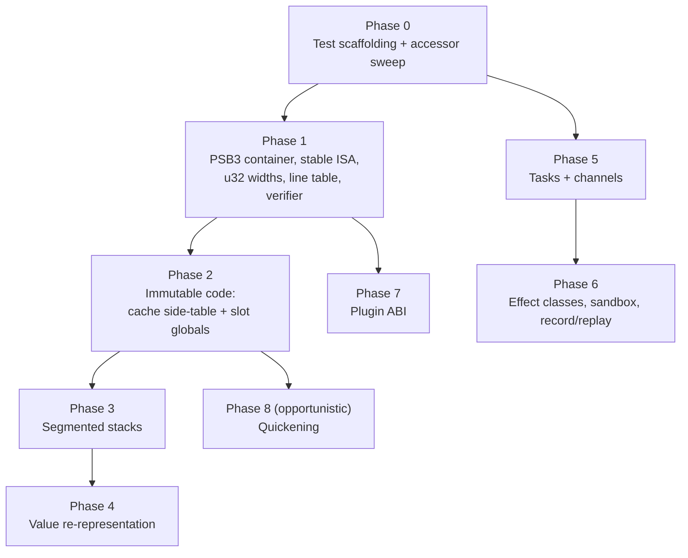

# PSCAL VM 2.0: Design & Implementation Plan

Status: Phase 0 and Phase 1 core (1a-1e, the PSB3 format epoch plus the
load-time verifier) shipped 2026-07-04; Phase 2a (inline caches move to a
side-table) shipped 2026-07-05. Phase 2b and beyond remain proposal.
Companion to the
[VM Technical Manual](pscal_vm_manual/pscal_vm_manual.md), which documents
the 1.x engine this plan modifies.  File/line references are to
`components/pscal-core` at the manual's snapshot.

## 1. Goals and Non-Goals

**Goals**

- G1: Stable, portable, verifiable bytecode.  A `.bc` compiled anywhere runs
  anywhere (same VM major version), survives opcode additions, and cannot
  drive the interpreter out of bounds.
- G2: Immutable code.  No runtime patching of the instruction stream, so
  chunks can be mmap'd, shared across threads, and hashed for integrity.
- G3: Substantially faster value handling without changing the stack
  architecture or rewriting frontend code generators.
- G4: One coherent concurrency story (tasks + channels) replacing the split
  between VM threads and subsystem-private thread pools.
- G5: Effect-aware execution: sandboxing and record/replay for untrusted or
  model-generated programs.
- G6: Extension loading without recompiling pscal-core.

**Non-Goals**

- No register-based ISA conversion.  The stack ISA stays; five frontend code
  generators are not being rewritten.
- No JIT.  Quickening only, and only via the cache side-table (§5.8).
- No breaking of the `VmBuiltinFn` source-level signature
  (`Value (*)(VM*, int, Value*)`).  Builtins recompile; they do not get
  rewritten.
- No change to frontend surface languages required by any phase.  New
  capabilities (tasks, channels) are additive builtins/opcodes that
  frontends adopt on their own schedule.

## 2. Compatibility & Versioning Strategy

The user base is effectively "us", so **recompilation is the compatibility
mechanism** and we do not carry transition machinery:

- **Semantic compatibility is the real contract.** The same source program
  must behave identically on the new VM.  That is guarded by the per-suite
  baselines and the differential harness of §4, and it is where all the
  compat effort in this plan goes.  `.bc` files have no compatibility
  promise at all: they are cache artifacts, and source is always present.
- **Format epoch, hard cutover.** All format-breaking changes land together
  as **PSB3** (new magic `0x50534233`).  The PSB2 read path is deleted in
  the same change; old cache entries miss on the magic/version check and
  recompile, which is the cache's normal cold path.  No dual loader, no
  transition period, no migration.
- **ISA hygiene going forward.** Opcode values become explicit and
  append-only at the PSB3 boundary (§5.1), so post-2.0 opcode additions
  stop invalidating every cached chunk on the fleet.  A quality-of-life
  measure, not a compatibility promise; `PSCAL_VM_VERSION` continues to
  gate semantic changes.
- **Dual-build safety.** Every phase keeps `Tests/run_all_suites.py` green
  against the per-suite baselines, plus the differential harness of §4.
  PBuild's FetchContent override means the umbrella build and the standalone
  aether build must both be exercised before each phase ships (the stale
  `external/` pin trap applies to every phase here).

## 3. Sequencing Overview



Phases 5-7 are parallel tracks after their prerequisites; 1-4 are strictly
ordered because each rests on the previous one's invariants.  Phase 4 is
deliberately last in the core track: it is the highest-value and
highest-risk item, and everything before it shrinks its blast radius.

## 4. Phase 0: Scaffolding (prerequisite for everything)

1. **Differential harness.** A driver that runs a program corpus (the
   existing Pascal/Rea/CLike/Aether test suites plus a sample of
   aether_doc_bench generations) through two VM builds and byte-compares
   stdout/stderr/exit codes.  Every subsequent phase gates on zero diffs.
   **Done:** `Tests/vm_diff_harness.py --vm-a <bin dir> --vm-b <bin dir>`
   (resumable, per-unit results, exits nonzero on any reproducible diff;
   see its module docstring for corpus/statuses/usage).
2. **Performance baseline.** A small benchmark set (arith loop, call-heavy,
   string-heavy, global-heavy, JSON parse/walk, HTTP-loopback) with numbers
   recorded per phase, so wins and regressions are attributed to the phase
   that caused them.
   **Done:** `Tests/vm_bench/` (`run_vm_bench.py`, results appended to
   `history.jsonl` with git SHA + date).
3. **Accessor sweep (prep for Phase 4).** Mechanical PR: replace all direct
   `Value` field pokes (`v->i_val`, `v.type == TYPE_...`) in vm.c, builtins,
   and ext_builtins with the existing accessor/constructor macro families
   (`AS_INTEGER`, `IS_NUMERIC`, `makeInt`, ...), extended to full coverage.
   Zero behavior change; verified by the differential harness.  This is what
   makes Phase 4 a representation swap instead of a codebase rewrite.
   **Done:** payload sweep + metadata-field sweep shipped (2026-07-04), with
   a `PSCAL_VALUE_ACCESS_LINT` build option guarding regressions; sweep
   tooling in `Tests/vm_diff_work/`.
   **Done:** ~2,600 sites swept across vm.c, builtin.c, the network API,
   symbol/compiler, ext_builtins, gl/sdl/audio, the shell `.inc` family and
   smallclue integration.  New exact-alias accessors in core/types.h
   (`VALUE_TYPE`, `VAL_INT`/`VAL_UINT`, `VAL_REAL32/64/_LD`, `AS_RECORD`,
   `AS_ARRAY`, `AS_POINTER`, ..., `SET_VALUE_TYPE`, `SET_CHAR_VALUE`) are
   C11 `_Generic`-pinned to `Value`, so applying one to a Symbol/AST/Token
   is a compile error.  Verified per slice by -O2 object-code
   byte-comparison, the full suites, and zero-diff `vm_diff_harness` runs.
   Regression guard: configure with `-DPSCAL_VALUE_ACCESS_LINT=ON` to
   `#pragma GCC poison` the raw payload field names outside the
   representation layer (core/utils.c, core/cache.c stay raw by design).
   **Metadata follow-up done (2026-07-04):** the array/string/file/pointer
   metadata fields (`lower_bound(s)`, `upper_bound(s)`, `dimensions`,
   `element_type(_def)`, `array_is_packed/_dynamic`, `array_refcount`,
   `base_type_node`, `max_length`, `filename`, `record_size(_explicit)`,
   `enum_meta`) now go through `ARRAY_*`/`STRING_MAX_LENGTH`/
   `PTR_BASE_TYPE_NODE`/`FILE_*`/`ENUM_META` accessors in core/types.h
   (~430 sites in vm.c, builtin.c, network API, symbol/compiler,
   ext_builtins, sdl).  Same verification: -O2 object-code byte-identity
   per file, full suites, zero-diff `vm_diff_harness` (388 MATCH /
   0 diverge).  The lint poison covers the Value-unique metadata names;
   the generic ones (`dimensions`, `element_type`, `filename`, ...) rely
   on the `_Generic` guard.  Item 3 is fully complete; Phase 4 Stage A
   can re-point array/string metadata freely.
4. **`opcodes.def` single source of truth.** Replace the hand-maintained
   enum + `VM_OPCODE_LIST` X-macro + hand-written disassembler switch with
   one table:

   ```c
   /* opcodes.def: OP(name, value, operands, stack_in, stack_out) */
   OP(ADD,            0x08, "",        2, 1)
   OP(CONSTANT,       0x01, "c1",      0, 1)   /* c1 = u8 const idx   */
   OP(CONSTANT16,     0x02, "c2",      0, 1)   /* c2 = u16 const idx  */
   OP(JUMP_IF_FALSE,  0x1C, "j4",      1, 0)   /* j4 = i32 rel offset */
   OP(CALL,           0x55, "c2a4n1", -1, 1)   /* variable arity      */
   ```

   Dispatch table, `kOpcodeNames`, the disassembler's operand decoding, the
   verifier (§5.5), and instruction-length queries all generate from this
   file.  The manual's Chapter 3 tables become checkable against it.
   **Done:** `components/pscal-core/src/compiler/opcodes.def` (explicit
   values pinned by `_Static_assert`s, operand-spec column, stack effects).

Phase 0 is complete as of 2026-07-04.
   **Done (2026-07-04):** `components/pscal-core/src/compiler/opcodes.def`
   holds the full page with explicit ordinals (0x00-0x63), operand-spec
   strings (`b`/`i`/`k`/`K`/`w`/`j`/`f`/`C`; `"?"` for the four
   variable-length opcodes — DEFINE_GLOBAL[16], INIT_LOCAL_ARRAY,
   INIT_FIELD_ARRAY — which keep bespoke decode logic) and stack effects
   (-1 = operand-dependent; informational until the §5.5 verifier).
   Generated from it: the OpCode enum + per-ordinal `_Static_assert` pins
   (bytecode.h), the computed-goto dispatch table, its labels and
   `kOpcodeNames` (vm.c), the `OpcodeInfo` metadata table +
   `pscalOpcodeInfo()`/`pscalOpcodeOperandSpecLength()` driving
   `getInstructionLength()` and the disassembler's operand decoding
   (bytecode.c), and the pscald/pscalasm mnemonic table
   (umbrella `src/disassembler/opcode_meta.c`).  Verified: disassembly
   output byte-identical old-vs-new over a 95-program corpus, old-binary
   .bc cache entries load unchanged in the new binary, zero-diff
   `vm_diff_harness` (401 units), full suites at baseline.

## 5. Core Track

### 5.1 Phase 1a: Stable opcode numbering

- Explicit values in `opcodes.def`, current ordinals preserved as the
  starting assignment (0x00-0x63), then organized reserved ranges for new
  opcodes: 0x64-0x7F core, 0x80-0x9F concurrency, 0xA0-0xBF reserved,
  0xC0-0xFE experimental, 0xFF escape prefix for a future second page.
- `_Static_assert` pinning every existing opcode to its published value.
- Dispatch table becomes 256 entries with holes pointing at
  `LABEL_INVALID`; no measurable dispatch cost change.

**Done (2026-07-04):** `vm.c`'s computed-goto dispatch table is now
`dispatch_table[256]`, one-time-filled (`static bool dispatch_table_ready`
guard) with every slot defaulting to `&&LABEL_INVALID` before the
`opcodes.def`-generated slots overwrite the defined ordinals; the old
`if (instruction_val >= OPCODE_COUNT) goto LABEL_INVALID;` bounds check
ahead of the dispatch is gone; `goto *dispatch_table[instruction_val]` is
now unconditionally safe for any `uint8_t` value with no added branch on
the hot path. Verified with a targeted fuzz pass: every single byte of a
compiled `.bc` file flipped to a reserved/invalid opcode value, run through
`pscalvm` — 0 crashes across 734 mutation points (136 clean errors, 598 no
observable change), confirming the reserved range is dispatch-safe.

### 5.2 Phase 1b: PSB3 container

Replaces the raw-`fwrite` PSB2 layout (`serializeBytecodeChunk`,
`writeChunkCore`) with an explicit little-endian, sectioned format:

```
[magic u32le 'PSB3'] [format_ver u16] [vm_ver u16]
[flags u32] [section_count u32]
section_count × { id:u32  offset:u32  length:u32 }   ; section directory
sections (8-byte aligned):
  CODE   raw instruction bytes (immutable, mmap-executable)
  CONST  constant pool (explicit LE encodings; reals as IEEE754 bits,
         long double serialized as f64 + extension record)
  LINES  varint (pc_delta, line_delta) pairs            ; replaces lines[]
  PROCS  procedure metadata (current fields, LE)
  TYPES  type table
  BMAP   builtin lowercase map + registry fingerprint hash
  META   optional: source path, hashes (cache use only; omitted from
         distributable .bc so artifacts stop embedding absolute local paths)
```

- All integers written through `write_u16le`/`write_u32le` helpers; no more
  host-endianness or host-int-width dependence.
- Unknown section ids are skipped by length, so new sections can be added
  later without another format break.
- The PSB2 writer and reader in `cache.c` are deleted in the same change
  (§2): one format, one loader.
- The registry fingerprint in BMAP replaces the trust dance around
  `CALL_BUILTIN_PROC` baked-in ids: if the fingerprint matches the running
  registry, ids are trusted wholesale; if not, all ids re-resolve by name
  once at load time instead of per call-site checks.

**Done (2026-07-04):** PSB3 container shipped in `components/pscal-core/src/core/cache.c`
exactly as specified above (magic `0x50534233`, `format_ver`/`vm_ver`/`flags`/
`section_count` header, 8-byte-aligned section directory, `CODE`/`LINE`/
`CONS`/`BMAP`/`PROC`/`TYPE`/`META` sections — `PROCS`+const-globals and
`TYPES` bundled as named above; `META` cache-only). All integers little-endian
via `bufU16LE`/`bufU32LE`/`bufU64LE` (write) and `curU16LE`/`curU32LE`/`curU64LE`
(read) helpers. `LINES` is a varint run-length table. The PSB2 reader/writer
are gone from `cache.c` (hard cutover, not a fallback). One deliberate scope
cut: the BMAP fingerprint is computed and stored, but **not** acted on —
resolving builtin ids at write time (`getVmBuiltinID()`, called from
`saveBytecodeToCache()` before VM/extension-builtin setup has finished) was
found to corrupt unrelated interpreter state (surfaced as nil Pascal-closure
upvalues after a cache round-trip); `builtin_resolved_ids` stays `NULL` after
loading, same as PSB2, and the existing per-call-site lazy name resolution in
vm.c is unchanged. Wholesale trust is left for a future phase once the id
lookup can be made safe this early in the load path. See
`Docs/pscal_vm_manual/pscal_vm_manual_ch2.md` for the full on-disk spec.

### 5.3 Phase 1c: u32 widths

- `interpretBytecode(..., uint32_t entry)`; `THREAD_CREATE` operand u32;
  `CALL` address operand u32; jump offsets i32 (`j4` in `opcodes.def`).
- Compiler emit paths updated; this is why it must ride the PSB3 format
  break rather than ship separately.

**Done (2026-07-04):** New `opcodes.def` operand-spec letter `W` (u32 code
address) for `CALL`'s and `THREAD_CREATE`'s address operands; `j` redefined
i16→i32 for `JUMP`/`JUMP_IF_FALSE`. Every emission/patch site across
`compiler/compiler.c` (~40 sites: goto/label backpatch, break/continue,
if/else, case/switch, while/repeat/for loops, short-circuit and/or,
ternary, the peephole optimizer's jump/absolute-address relocation pass,
and `finalizeBytecode`'s CALL-address backpatch) updated in lockstep, plus
the **independent** codegen in `components/exsh/src/shell/codegen.c`
(exsh has its own from-scratch bytecode generator, not routed through
`compiler.c` — missing this the first time produced a real regression,
caught by the full `exsh` scope-test suite, not the differential harness
since `exsh` isn't in its default corpus). `interpretBytecode`'s `entry`
parameter and every `vm.c` local/field that narrowed a code address to
`uint16_t` (closures' `entry_offset` was already `uint32_t`; the local
truncating casts in `CALL`/`CALL_INDIRECT`/`CALL_METHOD`/`PROC_CALL_INDIRECT`/
thread-spawn/closure-creation handling were not) widened to `uint32_t`, so a
chunk's code section is no longer capped at 64KB of addressable jump/call
targets. `vm.c`'s disassembler cases and `pscald`/`pscalasm`'s shared
decoding (driven by the `opcodes.def` operand-spec table) picked up the new
widths automatically.

### 5.4 Phase 1d: Loader hardening

- `.bc` loading goes through bounds-checked cursor reads (no trusting
  stored counts against unchecked buffers).
- Section directory validated (offsets/lengths within file, no overlap).

**Done (2026-07-04):** `cache.c`'s `Cursor` (bounds-checked read cursor,
sticky `error` flag on first overrun) backs every section reader; no `fread`
against unchecked counts remains anywhere in the load path. `psb3ParseHeader()`
validates every directory entry's byte range is fully inside the file and
that no two sections overlap before any section body is touched, with a
sanity cap on `section_count` (>64 rejected outright). Verified: 856
single-byte-flip mutations of a real `.bc` file plus truncation at every
8-byte boundary, all run through `pscalvm` — 0 crashes, only clean errors or
(when a flip happened to land somewhere inert) unchanged output. Targeted
adversarial cases (section offset past EOF, section length `0xFFFFFFFF`,
two sections forced to overlap, `section_count` set to `0x7FFFFFFF` or `0`,
corrupted magic, truncation mid-header/mid-directory) all fail cleanly with
a nonzero exit, never a crash.

### 5.5 Phase 1e: Verifier

Load-time pass over CODE, generated tables from `opcodes.def` doing:

1. Instruction stream walk: every opcode defined, every instruction fully
   inside the section, every jump target on an instruction boundary
   (targets collected in pass 1, checked in pass 2).
2. Operand validation: constant indices < pool size, host-fn ids <
   `HOST_FN_COUNT`, cache ids < cache count (§5.6).
3. Per-procedure abstract stack-depth check using `stack_in`/`stack_out`
   effects: depth never negative, never exceeds a declared max, and merges
   consistently at join points.  Variable-arity calls use the encoded arg
   count.

Verification runs once per load, is skippable for trusted embedded chunks
(`flags` bit), and turns "corrupt cache file" from undefined behavior into
a clean `INTERPRET_COMPILE_ERROR`.  This is also the safety story for
running model-generated bytecode at scale.

**Done (2026-07-04):** `components/pscal-core/src/compiler/bytecode_verify.{h,c}`
implements `pscalVerifyBytecodeChunk()` as three passes, driven by
`opcodes.def`'s generated `OpcodeInfo` table:

1. **Instruction stream walk.** Every byte in `[0, chunk->count)` belongs to
   exactly one instruction with a defined opcode (`pscalOpcodeInfo() != NULL`)
   that is fully in-bounds. The four variable-length ("?") opcodes reuse
   `getInstructionLength()`'s exact logic rather than a second copy: that
   function was split into a shared `pscalDecodeInstructionLength()`
   (bytecode.c) returning both a length and a "was this determinable at all,
   or did truncated input force a bailout" bool, with `getInstructionLength()`
   now a thin wrapper preserving its historical int-only contract for
   existing callers (disassembler etc).
2. **Operand validation.** Every `k`/`K` constant-pool index (including
   those embedded in DEFINE_GLOBAL/16 and INIT_LOCAL_ARRAY/INIT_FIELD_ARRAY
   payloads — re-walked using the same field layout documented in
   opcodes.def) is checked against `constants_count`; `CALL_HOST`'s host id
   against `HOST_FN_COUNT`; every `W` (CALL/THREAD_CREATE target) and `j`
   (JUMP/JUMP_IF_FALSE displacement) resolves to an address that is both
   in-range and an actual instruction boundary from pass 1.
3. **Per-procedure abstract stack-depth walk.** Procedure segments are
   inferred by sorting `procedures`' `bytecode_address` entries (recursing
   into nested class/unit symbol tables, matching vm.c's own address
   lookup) plus an implicit top-level segment at pc 0; each is walked with a
   worklist, tracking depth as either a concrete value or "unknown" (tainted
   by an unresolvable call target). Concrete depth must never go negative,
   never exceed `VM_STACK_MAX`, and must agree exactly at control-flow join
   points; "unknown" never triggers a failure (the runtime's own checked
   `push()`/`pop()`/`peek()` — already bounds-checked, confirmed by reading
   vm.c — remain the backstop there, so precision is only sacrificed, not
   safety). Auditing every opcode's declared `stack_in`/`stack_out` against
   its actual vm.c handler (see opcodes.def's Phase 1e audit comment) found
   and fixed real drift (`DEFINE_GLOBAL`/`16` claimed to pop 1 and pop
   nothing; `THREAD_JOIN` claimed to push a result and doesn't) and
   confirmed several opcodes are not flat-constant at all: `CALL`/
   `CALL_USER_PROC` resolve their net push (the callee's `locals_count`) via
   `procedures` since their target is statically known; `CALL_INDIRECT`/
   `CALL_METHOD`/`CALL_HOST` cannot resolve a target/arg-count statically
   (closure/vtable dispatch, and CALL_HOST's operand is a dispatch id with
   no arg-count convention at all) so they check only their
   statically-knowable precondition and then taint depth to "unknown";
   `PROC_CALL_INDIRECT` turned out fully resolvable despite being
   target-dependent (its `discard_result_on_return` flag plus RETURN's
   unconditional frame-collapse make its net effect exactly
   `-(arity+1)` regardless of callee); `INIT_LOCAL_ARRAY`/`INIT_FIELD_ARRAY`
   pop one value per runtime-sized array dimension (the `0xFFFF`/`0xFFFF`
   sentinel bound), counted by re-walking the payload; `CALL_BUILTIN`'s
   push (0 or 1) is resolved via the builtin registry's routine-type
   (`getBuiltinType()`), falling back to 1 if unresolvable.

**Wiring (cache.c):** a new PSB3 header flag bit
(`PSB3_FLAG_TRUSTED_SKIP_VERIFY`, currently unset by every writer — reserved
for a future embedded/pre-verified chunk producer) and an env override
(`PSCAL_VM_SKIP_VERIFY=1`, for benchmarking/power users) gate a
`pscalVerifyBytecodeChunk()` call inserted right after `psb3ReadChunk()`
succeeds in both `loadBytecodeFromCache()` (a failure here behaves like any
other cache-invalidation reason: reset, unlink, fall through to the next
candidate/recompile-from-source) and `loadBytecodeFromFile()` (the
`pscalvm <file.bc>` path — a failure returns false, caller reports a clean
error and exits, never touches the chunk).

**Verified:**
- `Tests/vm_verify_corpus/` (generator + runner + a 4224-point single-bit
  fuzz sweep, `Tests/vm_verify_corpus/fuzz_bitflip.py`) exercises truncation,
  a retargeted jump, an out-of-range constant index, and a hand-built
  stack-underflow chunk (`ADD;HALT` against an empty stack) — all 11 corpus
  cases and all 4224 fuzz mutations behave cleanly (0 crashes; 4 mutations
  produced an infinite loop via a jump retargeted to itself, expected and
  undetectable in general — not a memory-safety issue, confirmed by the
  runtime's own bounds-checked stack). Critically, **the bad-jump-target
  case reproduces a real SIGBUS crash with the verifier disabled**
  (`PSCAL_VM_SKIP_VERIFY=1`) and a clean `INTERPRET_COMPILE_ERROR`-style
  message with it enabled — direct proof of the "never UB" requirement.
- `Tests/vm_diff_harness.py` zero-diff against a from-scratch pre-Phase-1e
  baseline build (git worktree at the prior commit): 389 MATCH, 5 NONDET
  (pre-existing HTTP-timing flakiness, not new), 7 SKIP, **0 DIFF** across
  401 units.
- `Tests/run_all_suites.py`: at baseline (two pre-existing, confirmed
  unrelated failures — a stale post-split path in an exsh env-snapshot test,
  and a Rea library scope-resolution bug reproducing identically with
  verification disabled — neither touches chunk loading).
- `Tests/vm_bench/bench_verify_overhead.py` (new): cache-hit wall-clock time
  for `calls.p` on a Release build, verifier on vs. off — median delta
  +1.8ms against a ~194ms process time and ~10-20ms run-to-run jitter, i.e.
  not distinguishable from noise. `Tests/vm_bench/run_vm_bench.py` also
  re-run on Release to confirm no execution-time regression (the verifier
  only runs at load time, never in the interpreter's hot path).

**Security follow-up (2026-07-05):** a review of 896aba4 found the
"unknown"-region backstop claim above ("the runtime's own checked
push()/pop()/peek() ... remain the backstop there") was false for four
opcodes, plus three independent gaps. All fixed same-day, still in
`bytecode_verify.c`/`cache.c`/`vm.c`:

1. **Unchecked fast-path stack macros (CRITICAL).** `ADD`/`SUBTRACT`/
   `MULTIPLY`/`DIVIDE`/`NEGATE`/`NOT`/`TO_BOOL` used `FAST_PUSH`/`FAST_POP`
   (`vm.c`), which had *no* bounds check at all — unlike `push()`/`pop()`/
   `peek()`, which do. Once the verifier tainted a region to "unknown"
   (via `CALL_INDIRECT`/`CALL_METHOD`/`CALL_HOST`), these opcodes' stack
   depth was never rechecked, so a crafted chunk reaching one of them with
   a shallower real stack than assumed walked `vm->stackTop` below
   `vm->stack` — real OOB read/write into adjacent `VM_s` fields, not just
   a wrong answer. Fixed by giving `FAST_PUSH`/`FAST_POP`/`FAST_PEEK` the
   same bounds check as `push()`/`pop()`/`peek()` (the "fast" in the name
   was only ever about skipping the fuller error-path setup, never about
   skipping the check itself). `INIT_FIELD_ARRAY`'s direct
   `vm->stackTop - 1` dereference (no `DUP`-style guard) got the same
   treatment. Cost: unmeasurable (see the Release A/B below).
2. **Verifier join-point dataflow bug (HIGH).** `verifySegment()`'s
   worklist gated *all* rechecking on a single `seen[pc]` bit. If a pc was
   first reached via an unknown-tainted edge (no check performed, by
   design) and only later reached via a *known*-depth edge from a
   different branch, the known arrival's own requirement check was
   silently skipped (`seen[pc]` was already true) — an independent path to
   the same OOB class as #1, not requiring any single opcode to have been
   preceded by a taint on *its* path. Fixed: each pc now tracks a known
   visit and an unknown visit separately (`VISITED_KNOWN`/
   `VISITED_UNKNOWN` bits) — a known depth is always checked against the
   opcode's requirement the first time it arrives, however many times the
   pc was already visited via an unknown edge. Worklist capacity bound
   updated from `2*count+8` to `4*count+8` to match (each pc can now be
   processed once per depth-kind instead of once total).
3. **Embedded shell-closure chunks bypassed verification (MEDIUM).**
   `readPointerValue()`'s kind==1 case (`cache.c`) deserializes a nested
   `BytecodeChunk` for a compiled shell function but never verified it —
   only the top-level chunk was. A well-formed outer chunk whose constant
   pool embeds a malformed inner chunk loaded cleanly and only broke when
   the closure was invoked. Fixed: `pscalVerifyBytecodeChunk()` now runs on
   the nested chunk at the point it's deserialized, same as the top-level
   one.
4. **Self-attested trusted-skip-verify flag (MEDIUM).** The `flags` bit
   `PSB3_FLAG_TRUSTED_SKIP_VERIFY` mentioned above was read straight from
   the file's own header with no signature/provenance binding, so any
   hand-crafted `.bc` could set it and skip verification unconditionally —
   a live bypass of "the safety story for running model-generated bytecode
   at scale" even though no writer ever set it. Removed outright rather
   than bound to something trustworthy: verification is cheap (previous
   bullet), so a self-attested skip wasn't worth the attack surface. The
   `PSCAL_VM_SKIP_VERIFY` *environment* override stays — it's set by the
   host process, not read out of attacker-controlled file bytes.
5. Two adjacent, lower-severity bugs fixed alongside: `handleDefineGlobal`'s
   non-array branch read two constant-pool indices with no runtime bounds
   check (the verifier was the *only* thing preventing an OOB read there);
   and `format_version` was parsed but never checked against
   `PSB3_FORMAT_VERSION` at load time (no live consequence yet — one format
   version has ever existed — but cheap to close).

Verified: `Tests/vm_verify_corpus/` grew 4 new hand-crafted adversarial
cases (one per finding above), all rejected cleanly post-fix; each was
independently confirmed to have caused a real AddressSanitizer
stack-buffer-underflow in `vmFastPopUnchecked` (findings 1/2/4) or to have
loaded successfully pre-fix and only failed downstream (finding 3, whose
runtime-side primitive — `READ_CONSTANT()`'s unchecked
`vm->chunk->constants[idx]` — has no bounds check independent of this fix)
when run against a worktree at 896aba4 under `build-asan`. Full
`vm_verify_corpus` fuzz sweep (4224 single-bit-flip mutations) re-run under
ASan/UBSan post-fix: 0 crashes (1998 clean rejections, 2221 inert flips, 5
hangs from self-targeted jump retargets — expected, not a memory-safety
issue, unchanged from the original phase's findings).
`Tests/vm_diff_harness.py` re-run fixed-vs-896aba4: 389 MATCH, 7 SKIP, 5
NONDET (the same pre-existing HTTP-timing flakes as the original phase),
**0 DIFF** — the fixes change no observable behavior for well-formed
programs. `Tests/run_all_suites.py` at baseline (the only two failures —
`dynamic_array_fresh_publish_race`'s pre-existing thread-race flake and a
pre-existing Rea library scope-resolution bug — reproduce identically on
896aba4, confirmed by direct A/B). `Tests/vm_bench/bench_verify_overhead.py`
re-run on a fresh Release build: delta -1.9ms (still noise-dominated, same
conclusion as the original measurement); `run_vm_bench.py` shows no
execution-time regression either.

### 5.6 Phase 2a: Inline caches move to a side-table

- New encoding: `GET_GLOBAL name:u16 cache_id:u16` (5 bytes vs today's 10).
  The loader allocates `CacheSlot caches[cache_count]` per chunk
  (`cache_count` stored in the CODE section header); slots hold the
  `Symbol*` the code stream holds today.
- The code stream is never written after load.  `mprotect(PROT_READ)` in
  debug builds enforces it.  CODE can now be executed directly from an
  mmap'd PSB3 file.
- The `GET/SET_GLOBAL[16]_CACHED` opcode family collapses into the base
  opcodes.  Retired values are left as holes in `opcodes.def` (cheap, and
  keeps old disassembly listings readable), but nothing depends on that.

**Done (2026-07-05):** Shipped largely as designed, with one deliberate
deviation from this section's own example encoding, plus the concrete design
of the pieces the sketch above left open.

- **Encoding actually shipped.** `GET_GLOBAL`/`SET_GLOBAL` keep their existing
  `name:u8` narrow form (the u8/u16 narrow-vs-wide split is an orthogonal,
  pre-existing axis — same pattern as `CONSTANT`/`CONSTANT16` — and this
  phase only touches the cache mechanism): `op name:u8 cache_id:u16` = **4
  bytes** (was 10). `GET_GLOBAL16`/`SET_GLOBAL16`: `op name:u16 cache_id:u16`
  = **5 bytes** (was 11) — this is the variant the plan's example actually
  describes. New operand-spec letter `c` (opcodes.def) for the u16 cache_id,
  distinct from the retired `C` (legacy 8-byte inline-cache-slot spec, kept
  only so the four retired opcodes below still disassemble at their true
  historical width).
- **Side table.** `CacheSlot { Symbol* symbol; }` (`bytecode.h`) — a struct
  rather than a bare pointer so a later Phase 8 quickening state machine has
  somewhere to live without another format break. `BytecodeChunk` gained
  `cache_count` (compile-time constant, incremented once per GET/SET_GLOBAL[16]
  emission by the single shared `compiler.c` helper, `emitGlobalNameIdx`) and
  `caches` (the runtime array, `NULL` until first execution). Deliberately
  **not** shared by name: each call site gets its own slot, because a shared
  per-name cache would fight a future Phase 8 quickening state machine if two
  call sites for the same global see different runtime types — independent
  per-site caches are what "monomorphic per call site" actually means. This
  also let a genuinely dead, pre-existing per-name-constant-index cache
  (`BytecodeChunk.global_symbol_cache`, added 2025-11-08, superseded by the
  in-stream inline cache before Phase 2a began but never removed) get deleted
  outright rather than accreting a second cache mechanism alongside the new
  one.
- **Allocation choke point.** `chunk->caches` is allocated exactly once, in
  `interpretBytecode()`'s prologue, guarded by `globals_mutex` (double-checked
  against `chunk->prepared_for_execution`) — the same lock already used for
  other state shared across a chunk's multiple concurrent executions
  (THREAD_CREATE spawns a new VM against the *same* chunk; an embedded shell
  closure's chunk can likewise be invoked more than once). This is a single
  choke point regardless of whether the chunk arrived via fresh compile,
  cache load, explicit `.bc` load, or as a nested nested `ShellCompiledFunction`
  chunk — `cache_count` is known by then in every case (compiler tally for a
  fresh chunk; deserialized from the CODE section for a loaded one).
- **CODE immutability (goal G2).** `pscalProtectChunkCode()` (`bytecode.c`),
  gated by a new CMake option `PSCAL_VM_CODE_PROTECT` (defaults **on** for
  `CMAKE_BUILD_TYPE=Debug`, i.e. `build-asan`, off otherwise — mmap+mprotect
  has a small per-chunk cost not worth paying by default in Release). `code`
  cannot be `mprotect`'d in place: a `malloc`/`realloc`'d buffer is neither
  page-aligned nor page-sized, so protecting it in place would also fence off
  whatever unrelated heap data shares its page. Instead the buffer is copied
  into a fresh page-rounded anonymous `mmap`, the old buffer freed, and the
  new one `mprotect(PROT_READ)`'d; `pscalReleaseChunkCode()` (used by every
  teardown path that used to call `free(chunk->code)` directly) knows to
  `munmap` instead of `free` once `code_is_mapped` is set. Verified: the full
  suite plus the Phase 1e verifier's adversarial corpus (`vm_verify_corpus`,
  both the 15-case corpus and the 3968-mutation bit-flip fuzz sweep) all run
  clean under this build with zero `SIGSEGV`/ASan reports — proof nothing
  left over from the old self-modifying design still writes into `CODE`,
  which is the actual point of this item (a parallel unused table would not
  have caught a missed self-modification site; an enforced page fault does).
- **Retired opcodes.** `GET_GLOBAL_CACHED`/`SET_GLOBAL_CACHED`/
  `GET_GLOBAL16_CACHED`/`SET_GLOBAL16_CACHED` (0x28-0x2B) keep their original
  `opcodes.def` entries byte-for-byte (name, ordinal, `"kC"`/`"KC"` operand
  spec, stack effects) — never emitted by the compiler and no longer given a
  `case` in `vm.c`'s dispatch switch, so a hand-crafted chunk containing one
  falls through to the existing `default:` and gets a clean "unknown opcode"
  runtime error rather than undefined behavior. Keeping the entries (rather
  than turning them into anonymous holes) is what lets a pre-Phase-2a
  standalone `.bc` still disassemble with its real historical mnemonic and
  byte width instead of "undefined opcode" if someone runs `pscald` against
  an old file directly.
- **Format epoch.** The CODE section gained a new field (`cache_count`,
  written right after `byte_count`) — the first change to any section's
  on-disk *shape* since PSB3's introduction (every phase since Phase 1b had
  only changed what the opaque CODE bytes *mean*, never how the container
  frames a section). `PSB3_FORMAT_VERSION` bumped 1→2 accordingly (this axis
  is exactly what §2 describes as moving independently of
  `PSCAL_VM_VERSION`, which stays untouched at 9). `psb3ParseHeader()` already
  hard-rejects on any format_ver mismatch before touching a single section
  body, so this alone gives "old already-compiled `.bc` files get invalidated
  by the normal cache freshness check, not silently misparsed" for free —
  verified directly by hand-flipping a fresh `.bc`'s format_ver byte back to
  1 and confirming a clean `pscalvm` rejection instead of a misparse.
- **Verifier.** `checkCacheIndex()` (`bytecode_verify.c`) validates every
  `c`-spec `cache_id` against `chunk->cache_count`, same pattern and same
  pass as `checkConstIndex()` for constant-pool indices.
- **A real bug fixed along the way.** The old self-modifying
  `SET_GLOBAL_CACHED`/`SET_GLOBAL16_CACHED` fast path (patched in after a
  call site's first successful execution) never re-checked
  `vmPasExceptionPending()` — only the slow (first-ever, uncached) execution
  did. That means once a `SET_GLOBAL` call site got self-patched, it would
  keep writing to its global even during Pascal exception unwinding, silently
  defeating the unwind-skip check for every subsequent call through that
  site. Unifying the cached/uncached paths (there is only one path now)
  removes the asymmetry: the exception-pending check now runs on every
  execution, matching the *intended* semantics rather than the old
  self-modified fast path's accidental one.
- **Performance.** The obvious naive port (check the cache, but still
  bounds-check `name_idx` and dereference the constant pool for the
  `myself`/textattr special cases on every hit) benchmarked flat-to-negative
  on `Tests/vm_bench/globals.p` against a same-session Release baseline
  built from the pre-Phase-2a commit — because it was doing genuinely more
  work per cache hit than the old design, which never touched the constant
  pool at all once self-patched. Restructured to check the cache *first* on
  all four opcodes: a populated slot resolves straight from `cache_id` to
  `Symbol*` to push/store, using `sym->name` wherever the miss path uses the
  constant-pool string, with the `name_idx` bounds check and constant-pool
  dereference only reachable on an actual miss — the same shape of fast path
  the old self-modified opcode had, just without the opcode mutation. Net
  result on `globals.p`: CODE section shrinks 614→411 bytes (33%) for the
  same source; wall-clock is a noise-dominated wash (~0.22-0.23s median
  either way across repeated same-session interleaved runs), i.e. this phase
  is a clean size/immutability win with no speed regression, not the larger
  speed win a naive read of "cache side-table" might suggest — the old
  design's speed already came from skipping validation via self-modification,
  and the new design gets the same skip via a branch instead, at parity.
- **Verified:** `Tests/run_all_suites.py` at baseline after regenerating 20
  stale fixture goldens (5 Pascal `.err`/`.disasm`, 15 Rea `.err`/`.disasm`)
  whose expected output embedded the old byte offsets/`cache=0x...` format —
  an expected, inherent consequence of shrinking these opcodes' encoding, not
  a regression (confirmed pre-existing-only remaining failures: 3 `tiny_pbc`
  fixtures with a stale post-monorepo-split path, unrelated). `vm_diff_harness`
  vs. a from-scratch pre-Phase-2a worktree build: 372 MATCH, 7 SKIP, 6 NONDET
  (pre-existing self-consistency flakiness, unrelated), **16 DIFF** — all 16
  independently confirmed to be the same expected disassembly-offset/format
  shift (zero `stdout` difference on every one; the only `stderr` deltas are
  numeric offsets and `cache=0x0`→`cache_id=N`). `vm_verify_corpus` (15-case
  corpus + 3968-mutation bit-flip fuzz) clean under both a plain build and
  `build-asan` with `PSCAL_VM_CODE_PROTECT` on. Full suite additionally run
  clean under `build-asan` for pascal/rea/clike/aether/exsh (two pre-existing,
  confirmed-unrelated ASan/UBSan findings in `markClosureLiteralEscapes`
  reproduce identically on the pre-Phase-2a commit under the same flags —
  a misaligned-pointer bug in closure-escape tracking, nothing to do with
  this phase).

### 5.7 Phase 2b: Slot-addressed globals

- Link step at load time: walk PROCS/CONST, assign each distinct global a
  slot in a per-program `Value globals[]` array; `DEFINE_GLOBAL` becomes
  `DEFINE_GLOBAL_SLOT slot:u16 type...`, `GET_GLOBAL` becomes
  `GET_GSLOT slot:u16` (array index, no hash, no cache needed at all).
- The name→slot map is retained as metadata for: the disassembler, `myself`
  resolution, and **exsh**, whose dynamically created variables keep a
  name-addressed escape hatch (`GET_GLOBAL_DYN`, the current hash-table
  path, emitted only by the shell frontend).
- The `vmGlobalSymbols` / `vmConstGlobalSymbols` split disappears; const
  slots are enforced by a bitmap checked on `SET_GSLOT`.
- Cross-thread visibility is unchanged (same shared array), but the
  `globals_mutex` stream-binding dance in the interpreter prologue is
  replaced by one-time link work.

### 5.8 Phase 8 (opportunistic, after Phase 2): Quickening

With caches in a side-table, type-specialization no longer conflicts with
immutable code: a `CacheSlot` can carry a small state machine
(`GENERIC → INT_INT → deopt`) consulted by hot opcodes, giving monomorphic
fast paths for `ADD`/comparisons without patching instructions.  Strictly
optional; gated on Phase 0 benchmarks showing `BINARY_OP` dispatch as a top
cost, which the current macro's overload ladder makes likely.

### 5.9 Phase 3: Segmented stacks

- **The constraint:** `GET_LOCAL_ADDRESS`/`GET_GLOBAL_ADDRESS` push real
  `Value*` into other `Value`s (VAR parameters, §3.3 of the manual), so the
  operand stack can never be moved by `realloc`.  Growth must be
  **segmented**: fixed-size chunks (e.g. 4096 Values) linked in a list;
  a frame's slot window always lives inside one segment (a call whose
  window would straddle a boundary starts it on the next segment).
- `CallFrame.slots` stays a raw pointer (valid because segments never
  move); `frames[]` itself grows by realloc since nothing takes the address
  of a CallFrame.
- Initial allocation shrinks from 8192 Values to one segment, which also
  cuts per-thread VM footprint (today every `Thread`'s VM embeds the full
  8192-Value array inline).
- `VM_STACK_MAX`/`VM_CALL_STACK_MAX` become configurable ceilings
  (default: effectively unbounded, rlimit-style guard), fixing deep
  recursion.

### 5.10 Phase 4: Value re-representation

Two stages, both behind the Phase 0 accessor macros:

- **Stage A (struct shrink):** `Value` becomes
  `{ uint64_t bits; }`-sized tagged word: 48-bit-pointer NaN-boxing on
  64-bit targets (integers ≤ 48 bits inline; larger ints spill to a boxed
  cell), with strings/records/arrays/sets/files as pointers to heap objects
  carrying an `ObjHeader { type, refcount/flags }`.  `TYPE_LONG_DOUBLE`
  becomes a boxed type (measured as rare in generated code).
- **Stage B (ownership rationalization):** with headers in place,
  `DUP`/`CONSTANT`/`push` become word copies + refcount adjust instead of
  deep copies; `freeValue` becomes decref.  Pascal value semantics for
  records/arrays are preserved by copy-on-write (mutation through a
  non-unique reference clones first), which the address-based mutation
  paths (`SET_INDIRECT`, field writes) funnel through a single
  `valueEnsureUnique()` choke point.
- Builtins recompile unchanged thanks to the accessor layer; the ABI break
  is source-compatible.  The differential harness and full suites gate each
  stage; expected outcome per the Phase 0 benchmarks: the largest single
  performance win in the plan (stack traffic drops ~4-8x, allocation churn
  on hot paths drops with it).

## 6. Concurrency Track

### 6.1 Phase 5a: Tasks

- New boxed value type `TYPE_TASK` wrapping today's `Thread`-slot machinery
  (the result-handoff mutex/cond pattern already implements a future; this
  formalizes it).  Builtins/opcodes:
  `TaskSpawn(fn, args...) -> task` (over `ThreadJobQueue`),
  `TaskAwait(task) -> value`, `TaskDone(task) -> bool`,
  `TaskCancel(task)` (existing cooperative atomics).
- `THREAD_CREATE`/`THREAD_JOIN` stay as opcodes (the frontends emit them)
  but their implementation lowers onto tasks; `VM_MAX_THREADS`/
  `VM_MAX_MUTEXES` fixed arrays become dynamic registries.
- The HTTP async pool migrates behind the same interface:
  `HttpRequestAsync` returns a `TYPE_TASK` whose await produces the
  response, retiring the parallel 32-slot job-id world outright.  In-tree
  callers (tests, examples) are retargeted in the same change; no
  deprecation wrappers.  Native subsystems get a small
  `vmTaskCreateNative(work_fn, cancel_fn, progress_fn)` API so any future
  builtin (SQLite busy queries, DNS) can return awaitable tasks without
  inventing another pool.

### 6.2 Phase 5b: Channels

- `TYPE_CHANNEL`: bounded MPMC queue of Values (mutex + two condvars;
  refcounted via ObjHeader so send/receive across tasks is safe).
- `ChannelCreate(capacity)`, `ChannelSend`, `ChannelReceive`,
  `ChannelClose`, `ChannelTrySend/TryReceive`; `select` over channels is
  explicitly deferred until a frontend needs it.
- Positioning: channels + tasks become the recommended concurrency
  idiom; mutexes + shared globals remain supported.  This is the item with
  the most Rea-evolution leverage (agentic Rea wants structured
  concurrency, per rea_evolution_ideas).

### 6.3 Phase 6: Effect classes, sandbox, record/replay

- `registerVmBuiltin` gains an effect mask parameter
  (`FX_PURE | FX_IO | FX_NET | FX_PROC | FX_CLOCK | FX_RANDOM`); the
  existing `kEffectfulNames` list seeds the initial classification, default
  for unclassified extensions is `FX_IO` (conservative).
- VM run modes:
  - **enforce:** a builtin whose mask intersects the denied set raises a
    runtime error before the handler runs (checked at the single
    `CALL_BUILTIN` dispatch point; zero cost when no policy is set).
    This is the sandbox for model-generated code in the benchmark/idea-miner
    harnesses: `--deny net,proc` makes untrusted programs safe to run
    unattended at fleet scale.
  - **record:** effectful builtin results (return Value + VAR-param
    writebacks) are journaled in call order to a file.
  - **replay:** the journal substitutes for execution, making reruns
    deterministic; a journal/call-sequence mismatch aborts with a diff.
    Directly serves flaky-eval triage and regression bisection.
- Explicitly not: static purity checking or an `fx` language construct.
  Frontends may later surface effect annotations that compile to policy
  setup, but the VM mechanism is dynamic.

## 7. Extension Track

### 7.1 Phase 7: Plugin ABI

- Frozen, versioned C ABI in a new `pscal_ext_api.h`: a
  `PscalExtHostApi` struct of function pointers
  (`register_builtin` (with effect mask), `runtime_error`, Value
  accessors/constructors, handle-table helpers) passed to the plugin's
  single entry point:

  ```c
  int pscal_ext_register(const PscalExtHostApi* host, uint32_t host_abi);
  ```

- `dlopen` loading from a configured extension directory plus an explicit
  `--ext <path>` flag; ABI major mismatch rejects the plugin cleanly.
- Existing in-tree categories keep static registration; one category
  (sqlite is the best shape: self-contained, handle-based) is additionally
  built as a plugin to prove the ABI before it is declared stable.
- Note: this depends on Phase 4's accessor discipline (plugins must never
  see raw `Value` internals) which is why it sequences after Phase 1 at the
  earliest and ideally after Phase 4.

## 8. Testing & Verification Strategy (cross-cutting)

Per phase, in order: (1) unit tests for the new mechanism; (2) full
`Tests/run_all_suites.py` against baselines, both PBuild and standalone
aether builds; (3) differential harness zero-diff run; (4) benchmark suite
with results appended to the plan's tracking doc; (5) for format phases, a
corpus of adversarial/corrupt `.bc` files that must all fail cleanly
(fuzzing the loader with the verifier on is a good claw-idle job).  Ship
flow per phase is the standard multi-repo bump (component push, aether
`external/` pins, PBuild gitlinks, autodeploy verify).

## 9. Risk Register

| Risk | Phase | Mitigation |
|------|-------|------------|
| Accessor sweep misses direct field pokes hidden in macros/.inc files | 0/4 | make `Value` fields `_deprecated`-attributed in a lint build; grep-audit `\.inc` shell includes specifically (largest single file family) |
| Escaped stack `Value*` breaks under stack growth | 3 | segmented design (never move memory); debug mode poisons freed segments |
| CoW semantics subtly change Pascal record aliasing behavior | 4B | differential corpus must include the Rea OOP and VAR-param suites; any diff is a stop-ship |
| Registry fingerprint too strict (any builtin addition invalidates ids) | 1b | fingerprint = ordered hash of (name,id) pairs actually referenced by the chunk's BMAP, not the whole registry |
| exsh dynamic globals fight slot addressing | 2b | dual-path design is explicit from the start; exsh keeps the dynamic opcodes |
| iOS build (static libs, no dlopen culture) vs plugin ABI | 7 | plugins are a desktop/server feature; iOS keeps static registration (already special-cased in `register.c`) |
| Long double serialization change alters numeric output | 1b | Pascal suite has numeric-format baselines; acceptable-diff list reviewed explicitly |

## 10. Effort Shape (relative, in PR-sized units)

| Phase | Size | Notes |
|-------|------|-------|
| 0 | 4-6 PRs | harness, benchmarks, accessor sweep (large but mechanical), opcodes.def |
| 1 | 5-8 PRs | container, widths, line table, verifier; the big format epoch |
| 2 | 3-4 PRs | side-table, then slot globals with exsh path |
| 3 | 2 PRs | segmented stack + frame growth |
| 4 | 6-10 PRs | the long pole; Stage A then B, each landable independently |
| 5 | 3-4 PRs | tasks, HTTP migration, channels |
| 6 | 2-3 PRs | masks + enforce, then record/replay |
| 7 | 2-3 PRs | ABI header, loader, sqlite-as-plugin proof |

Recommended cut points if the effort is bounded: Phases 0-2 alone deliver
G1+G2 (portable, verifiable, immutable bytecode) and are worth shipping by
themselves; Phase 6's enforce mode is small and delivers outsized value for
the model-eval workflows even if the rest of the concurrency track waits.
