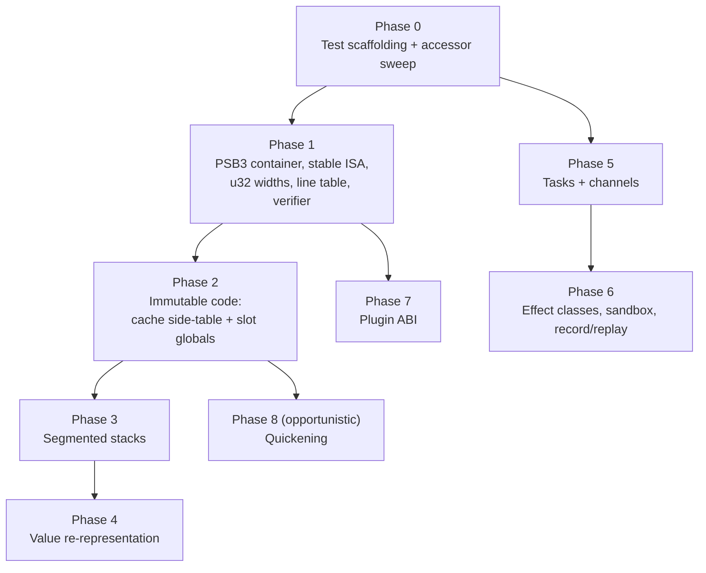

# PSCAL VM 2.0: Design & Implementation Plan

Status: proposal (2026-07-04).  Companion to the
[VM Technical Manual](pscal_vm_manual/pscal_vm_manual.md), which documents
the 1.x engine this plan modifies.  File/line references are to
`components/pscal-core` at the manual's snapshot.

## 1. Goals and Non-Goals

**Goals**

- G1: Stable, portable, verifiable bytecode.  A `.bc` compiled anywhere runs
  anywhere (same VM major version), survives opcode additions, and cannot
  drive the interpreter out of bounds.
- G2: Immutable code.  No runtime patching of the instruction stream, so
  chunks can be mmap'd, shared across threads, and hashed for integrity.
- G3: Substantially faster value handling without changing the stack
  architecture or rewriting frontend code generators.
- G4: One coherent concurrency story (tasks + channels) replacing the split
  between VM threads and subsystem-private thread pools.
- G5: Effect-aware execution: sandboxing and record/replay for untrusted or
  model-generated programs.
- G6: Extension loading without recompiling pscal-core.

**Non-Goals**

- No register-based ISA conversion.  The stack ISA stays; five frontend code
  generators are not being rewritten.
- No JIT.  Quickening only, and only via the cache side-table (§5.8).
- No breaking of the `VmBuiltinFn` source-level signature
  (`Value (*)(VM*, int, Value*)`).  Builtins recompile; they do not get
  rewritten.
- No change to frontend surface languages required by any phase.  New
  capabilities (tasks, channels) are additive builtins/opcodes that
  frontends adopt on their own schedule.

## 2. Compatibility & Versioning Strategy

The user base is effectively "us", so **recompilation is the compatibility
mechanism** and we do not carry transition machinery:

- **Semantic compatibility is the real contract.** The same source program
  must behave identically on the new VM.  That is guarded by the per-suite
  baselines and the differential harness of §4, and it is where all the
  compat effort in this plan goes.  `.bc` files have no compatibility
  promise at all: they are cache artifacts, and source is always present.
- **Format epoch, hard cutover.** All format-breaking changes land together
  as **PSB3** (new magic `0x50534233`).  The PSB2 read path is deleted in
  the same change; old cache entries miss on the magic/version check and
  recompile, which is the cache's normal cold path.  No dual loader, no
  transition period, no migration.
- **ISA hygiene going forward.** Opcode values become explicit and
  append-only at the PSB3 boundary (§5.1), so post-2.0 opcode additions
  stop invalidating every cached chunk on the fleet.  A quality-of-life
  measure, not a compatibility promise; `PSCAL_VM_VERSION` continues to
  gate semantic changes.
- **Dual-build safety.** Every phase keeps `Tests/run_all_suites.py` green
  against the per-suite baselines, plus the differential harness of §4.
  PBuild's FetchContent override means the umbrella build and the standalone
  aether build must both be exercised before each phase ships (the stale
  `external/` pin trap applies to every phase here).

## 3. Sequencing Overview



Phases 5-7 are parallel tracks after their prerequisites; 1-4 are strictly
ordered because each rests on the previous one's invariants.  Phase 4 is
deliberately last in the core track: it is the highest-value and
highest-risk item, and everything before it shrinks its blast radius.

## 4. Phase 0: Scaffolding (prerequisite for everything)

1. **Differential harness.** A driver that runs a program corpus (the
   existing Pascal/Rea/CLike/Aether test suites plus a sample of
   aether_doc_bench generations) through two VM builds and byte-compares
   stdout/stderr/exit codes.  Every subsequent phase gates on zero diffs.
   **Done:** `Tests/vm_diff_harness.py --vm-a <bin dir> --vm-b <bin dir>`
   (resumable, per-unit results, exits nonzero on any reproducible diff;
   see its module docstring for corpus/statuses/usage).
2. **Performance baseline.** A small benchmark set (arith loop, call-heavy,
   string-heavy, global-heavy, JSON parse/walk, HTTP-loopback) with numbers
   recorded per phase, so wins and regressions are attributed to the phase
   that caused them.
3. **Accessor sweep (prep for Phase 4).** Mechanical PR: replace all direct
   `Value` field pokes (`v->i_val`, `v.type == TYPE_...`) in vm.c, builtins,
   and ext_builtins with the existing accessor/constructor macro families
   (`AS_INTEGER`, `IS_NUMERIC`, `makeInt`, ...), extended to full coverage.
   Zero behavior change; verified by the differential harness.  This is what
   makes Phase 4 a representation swap instead of a codebase rewrite.
   **Done:** ~2,600 sites swept across vm.c, builtin.c, the network API,
   symbol/compiler, ext_builtins, gl/sdl/audio, the shell `.inc` family and
   smallclue integration.  New exact-alias accessors in core/types.h
   (`VALUE_TYPE`, `VAL_INT`/`VAL_UINT`, `VAL_REAL32/64/_LD`, `AS_RECORD`,
   `AS_ARRAY`, `AS_POINTER`, ..., `SET_VALUE_TYPE`, `SET_CHAR_VALUE`) are
   C11 `_Generic`-pinned to `Value`, so applying one to a Symbol/AST/Token
   is a compile error.  Verified per slice by -O2 object-code
   byte-comparison, the full suites, and zero-diff `vm_diff_harness` runs.
   Regression guard: configure with `-DPSCAL_VALUE_ACCESS_LINT=ON` to
   `#pragma GCC poison` the raw payload field names outside the
   representation layer (core/utils.c, core/cache.c stay raw by design).
   **Metadata follow-up done (2026-07-04):** the array/string/file/pointer
   metadata fields (`lower_bound(s)`, `upper_bound(s)`, `dimensions`,
   `element_type(_def)`, `array_is_packed/_dynamic`, `array_refcount`,
   `base_type_node`, `max_length`, `filename`, `record_size(_explicit)`,
   `enum_meta`) now go through `ARRAY_*`/`STRING_MAX_LENGTH`/
   `PTR_BASE_TYPE_NODE`/`FILE_*`/`ENUM_META` accessors in core/types.h
   (~430 sites in vm.c, builtin.c, network API, symbol/compiler,
   ext_builtins, sdl).  Same verification: -O2 object-code byte-identity
   per file, full suites, zero-diff `vm_diff_harness` (388 MATCH /
   0 diverge).  The lint poison covers the Value-unique metadata names;
   the generic ones (`dimensions`, `element_type`, `filename`, ...) rely
   on the `_Generic` guard.  Item 3 is fully complete; Phase 4 Stage A
   can re-point array/string metadata freely.
4. **`opcodes.def` single source of truth.** Replace the hand-maintained
   enum + `VM_OPCODE_LIST` X-macro + hand-written disassembler switch with
   one table:

   ```c
   /* opcodes.def: OP(name, value, operands, stack_in, stack_out) */
   OP(ADD,            0x08, "",        2, 1)
   OP(CONSTANT,       0x01, "c1",      0, 1)   /* c1 = u8 const idx   */
   OP(CONSTANT16,     0x02, "c2",      0, 1)   /* c2 = u16 const idx  */
   OP(JUMP_IF_FALSE,  0x1C, "j4",      1, 0)   /* j4 = i32 rel offset */
   OP(CALL,           0x55, "c2a4n1", -1, 1)   /* variable arity      */
   ```

   Dispatch table, `kOpcodeNames`, the disassembler's operand decoding, the
   verifier (§5.5), and instruction-length queries all generate from this
   file.  The manual's Chapter 3 tables become checkable against it.
   **Done (2026-07-04):** `components/pscal-core/src/compiler/opcodes.def`
   holds the full page with explicit ordinals (0x00-0x63), operand-spec
   strings (`b`/`i`/`k`/`K`/`w`/`j`/`f`/`C`; `"?"` for the four
   variable-length opcodes — DEFINE_GLOBAL[16], INIT_LOCAL_ARRAY,
   INIT_FIELD_ARRAY — which keep bespoke decode logic) and stack effects
   (-1 = operand-dependent; informational until the §5.5 verifier).
   Generated from it: the OpCode enum + per-ordinal `_Static_assert` pins
   (bytecode.h), the computed-goto dispatch table, its labels and
   `kOpcodeNames` (vm.c), the `OpcodeInfo` metadata table +
   `pscalOpcodeInfo()`/`pscalOpcodeOperandSpecLength()` driving
   `getInstructionLength()` and the disassembler's operand decoding
   (bytecode.c), and the pscald/pscalasm mnemonic table
   (umbrella `src/disassembler/opcode_meta.c`).  Verified: disassembly
   output byte-identical old-vs-new over a 95-program corpus, old-binary
   .bc cache entries load unchanged in the new binary, zero-diff
   `vm_diff_harness` (401 units), full suites at baseline.

## 5. Core Track

### 5.1 Phase 1a: Stable opcode numbering

- Explicit values in `opcodes.def`, current ordinals preserved as the
  starting assignment (0x00-0x63), then organized reserved ranges for new
  opcodes: 0x64-0x7F core, 0x80-0x9F concurrency, 0xA0-0xBF reserved,
  0xC0-0xFE experimental, 0xFF escape prefix for a future second page.
- `_Static_assert` pinning every existing opcode to its published value.
- Dispatch table becomes 256 entries with holes pointing at
  `LABEL_INVALID`; no measurable dispatch cost change.

### 5.2 Phase 1b: PSB3 container

Replaces the raw-`fwrite` PSB2 layout (`serializeBytecodeChunk`,
`writeChunkCore`) with an explicit little-endian, sectioned format:

```
[magic u32le 'PSB3'] [format_ver u16] [vm_ver u16]
[flags u32] [section_count u32]
section_count × { id:u32  offset:u32  length:u32 }   ; section directory
sections (8-byte aligned):
  CODE   raw instruction bytes (immutable, mmap-executable)
  CONST  constant pool (explicit LE encodings; reals as IEEE754 bits,
         long double serialized as f64 + extension record)
  LINES  varint (pc_delta, line_delta) pairs            ; replaces lines[]
  PROCS  procedure metadata (current fields, LE)
  TYPES  type table
  BMAP   builtin lowercase map + registry fingerprint hash
  META   optional: source path, hashes (cache use only; omitted from
         distributable .bc so artifacts stop embedding absolute local paths)
```

- All integers written through `write_u16le`/`write_u32le` helpers; no more
  host-endianness or host-int-width dependence.
- Unknown section ids are skipped by length, so new sections can be added
  later without another format break.
- The PSB2 writer and reader in `cache.c` are deleted in the same change
  (§2): one format, one loader.
- The registry fingerprint in BMAP replaces the trust dance around
  `CALL_BUILTIN_PROC` baked-in ids: if the fingerprint matches the running
  registry, ids are trusted wholesale; if not, all ids re-resolve by name
  once at load time instead of per call-site checks.

### 5.3 Phase 1c: u32 widths

- `interpretBytecode(..., uint32_t entry)`; `THREAD_CREATE` operand u32;
  `CALL` address operand u32; jump offsets i32 (`j4` in `opcodes.def`).
- Compiler emit paths updated; this is why it must ride the PSB3 format
  break rather than ship separately.

### 5.4 Phase 1d: Loader hardening

- `.bc` loading goes through bounds-checked cursor reads (no trusting
  stored counts against unchecked buffers).
- Section directory validated (offsets/lengths within file, no overlap).

### 5.5 Phase 1e: Verifier

Load-time pass over CODE, generated tables from `opcodes.def` doing:

1. Instruction stream walk: every opcode defined, every instruction fully
   inside the section, every jump target on an instruction boundary
   (targets collected in pass 1, checked in pass 2).
2. Operand validation: constant indices < pool size, host-fn ids <
   `HOST_FN_COUNT`, cache ids < cache count (§5.6).
3. Per-procedure abstract stack-depth check using `stack_in`/`stack_out`
   effects: depth never negative, never exceeds a declared max, and merges
   consistently at join points.  Variable-arity calls use the encoded arg
   count.

Verification runs once per load, is skippable for trusted embedded chunks
(`flags` bit), and turns "corrupt cache file" from undefined behavior into
a clean `INTERPRET_COMPILE_ERROR`.  This is also the safety story for
running model-generated bytecode at scale.

### 5.6 Phase 2a: Inline caches move to a side-table

- New encoding: `GET_GLOBAL name:u16 cache_id:u16` (5 bytes vs today's 10).
  The loader allocates `CacheSlot caches[cache_count]` per chunk
  (`cache_count` stored in the CODE section header); slots hold the
  `Symbol*` the code stream holds today.
- The code stream is never written after load.  `mprotect(PROT_READ)` in
  debug builds enforces it.  CODE can now be executed directly from an
  mmap'd PSB3 file.
- The `GET/SET_GLOBAL[16]_CACHED` opcode family collapses into the base
  opcodes.  Retired values are left as holes in `opcodes.def` (cheap, and
  keeps old disassembly listings readable), but nothing depends on that.

### 5.7 Phase 2b: Slot-addressed globals

- Link step at load time: walk PROCS/CONST, assign each distinct global a
  slot in a per-program `Value globals[]` array; `DEFINE_GLOBAL` becomes
  `DEFINE_GLOBAL_SLOT slot:u16 type...`, `GET_GLOBAL` becomes
  `GET_GSLOT slot:u16` (array index, no hash, no cache needed at all).
- The name→slot map is retained as metadata for: the disassembler, `myself`
  resolution, and **exsh**, whose dynamically created variables keep a
  name-addressed escape hatch (`GET_GLOBAL_DYN`, the current hash-table
  path, emitted only by the shell frontend).
- The `vmGlobalSymbols` / `vmConstGlobalSymbols` split disappears; const
  slots are enforced by a bitmap checked on `SET_GSLOT`.
- Cross-thread visibility is unchanged (same shared array), but the
  `globals_mutex` stream-binding dance in the interpreter prologue is
  replaced by one-time link work.

### 5.8 Phase 8 (opportunistic, after Phase 2): Quickening

With caches in a side-table, type-specialization no longer conflicts with
immutable code: a `CacheSlot` can carry a small state machine
(`GENERIC → INT_INT → deopt`) consulted by hot opcodes, giving monomorphic
fast paths for `ADD`/comparisons without patching instructions.  Strictly
optional; gated on Phase 0 benchmarks showing `BINARY_OP` dispatch as a top
cost, which the current macro's overload ladder makes likely.

### 5.9 Phase 3: Segmented stacks

- **The constraint:** `GET_LOCAL_ADDRESS`/`GET_GLOBAL_ADDRESS` push real
  `Value*` into other `Value`s (VAR parameters, §3.3 of the manual), so the
  operand stack can never be moved by `realloc`.  Growth must be
  **segmented**: fixed-size chunks (e.g. 4096 Values) linked in a list;
  a frame's slot window always lives inside one segment (a call whose
  window would straddle a boundary starts it on the next segment).
- `CallFrame.slots` stays a raw pointer (valid because segments never
  move); `frames[]` itself grows by realloc since nothing takes the address
  of a CallFrame.
- Initial allocation shrinks from 8192 Values to one segment, which also
  cuts per-thread VM footprint (today every `Thread`'s VM embeds the full
  8192-Value array inline).
- `VM_STACK_MAX`/`VM_CALL_STACK_MAX` become configurable ceilings
  (default: effectively unbounded, rlimit-style guard), fixing deep
  recursion.

### 5.10 Phase 4: Value re-representation

Two stages, both behind the Phase 0 accessor macros:

- **Stage A (struct shrink):** `Value` becomes
  `{ uint64_t bits; }`-sized tagged word: 48-bit-pointer NaN-boxing on
  64-bit targets (integers ≤ 48 bits inline; larger ints spill to a boxed
  cell), with strings/records/arrays/sets/files as pointers to heap objects
  carrying an `ObjHeader { type, refcount/flags }`.  `TYPE_LONG_DOUBLE`
  becomes a boxed type (measured as rare in generated code).
- **Stage B (ownership rationalization):** with headers in place,
  `DUP`/`CONSTANT`/`push` become word copies + refcount adjust instead of
  deep copies; `freeValue` becomes decref.  Pascal value semantics for
  records/arrays are preserved by copy-on-write (mutation through a
  non-unique reference clones first), which the address-based mutation
  paths (`SET_INDIRECT`, field writes) funnel through a single
  `valueEnsureUnique()` choke point.
- Builtins recompile unchanged thanks to the accessor layer; the ABI break
  is source-compatible.  The differential harness and full suites gate each
  stage; expected outcome per the Phase 0 benchmarks: the largest single
  performance win in the plan (stack traffic drops ~4-8x, allocation churn
  on hot paths drops with it).

## 6. Concurrency Track

### 6.1 Phase 5a: Tasks

- New boxed value type `TYPE_TASK` wrapping today's `Thread`-slot machinery
  (the result-handoff mutex/cond pattern already implements a future; this
  formalizes it).  Builtins/opcodes:
  `TaskSpawn(fn, args...) -> task` (over `ThreadJobQueue`),
  `TaskAwait(task) -> value`, `TaskDone(task) -> bool`,
  `TaskCancel(task)` (existing cooperative atomics).
- `THREAD_CREATE`/`THREAD_JOIN` stay as opcodes (the frontends emit them)
  but their implementation lowers onto tasks; `VM_MAX_THREADS`/
  `VM_MAX_MUTEXES` fixed arrays become dynamic registries.
- The HTTP async pool migrates behind the same interface:
  `HttpRequestAsync` returns a `TYPE_TASK` whose await produces the
  response, retiring the parallel 32-slot job-id world outright.  In-tree
  callers (tests, examples) are retargeted in the same change; no
  deprecation wrappers.  Native subsystems get a small
  `vmTaskCreateNative(work_fn, cancel_fn, progress_fn)` API so any future
  builtin (SQLite busy queries, DNS) can return awaitable tasks without
  inventing another pool.

### 6.2 Phase 5b: Channels

- `TYPE_CHANNEL`: bounded MPMC queue of Values (mutex + two condvars;
  refcounted via ObjHeader so send/receive across tasks is safe).
- `ChannelCreate(capacity)`, `ChannelSend`, `ChannelReceive`,
  `ChannelClose`, `ChannelTrySend/TryReceive`; `select` over channels is
  explicitly deferred until a frontend needs it.
- Positioning: channels + tasks become the recommended concurrency
  idiom; mutexes + shared globals remain supported.  This is the item with
  the most Rea-evolution leverage (agentic Rea wants structured
  concurrency, per rea_evolution_ideas).

### 6.3 Phase 6: Effect classes, sandbox, record/replay

- `registerVmBuiltin` gains an effect mask parameter
  (`FX_PURE | FX_IO | FX_NET | FX_PROC | FX_CLOCK | FX_RANDOM`); the
  existing `kEffectfulNames` list seeds the initial classification, default
  for unclassified extensions is `FX_IO` (conservative).
- VM run modes:
  - **enforce:** a builtin whose mask intersects the denied set raises a
    runtime error before the handler runs (checked at the single
    `CALL_BUILTIN` dispatch point; zero cost when no policy is set).
    This is the sandbox for model-generated code in the benchmark/idea-miner
    harnesses: `--deny net,proc` makes untrusted programs safe to run
    unattended at fleet scale.
  - **record:** effectful builtin results (return Value + VAR-param
    writebacks) are journaled in call order to a file.
  - **replay:** the journal substitutes for execution, making reruns
    deterministic; a journal/call-sequence mismatch aborts with a diff.
    Directly serves flaky-eval triage and regression bisection.
- Explicitly not: static purity checking or an `fx` language construct.
  Frontends may later surface effect annotations that compile to policy
  setup, but the VM mechanism is dynamic.

## 7. Extension Track

### 7.1 Phase 7: Plugin ABI

- Frozen, versioned C ABI in a new `pscal_ext_api.h`: a
  `PscalExtHostApi` struct of function pointers
  (`register_builtin` (with effect mask), `runtime_error`, Value
  accessors/constructors, handle-table helpers) passed to the plugin's
  single entry point:

  ```c
  int pscal_ext_register(const PscalExtHostApi* host, uint32_t host_abi);
  ```

- `dlopen` loading from a configured extension directory plus an explicit
  `--ext <path>` flag; ABI major mismatch rejects the plugin cleanly.
- Existing in-tree categories keep static registration; one category
  (sqlite is the best shape: self-contained, handle-based) is additionally
  built as a plugin to prove the ABI before it is declared stable.
- Note: this depends on Phase 4's accessor discipline (plugins must never
  see raw `Value` internals) which is why it sequences after Phase 1 at the
  earliest and ideally after Phase 4.

## 8. Testing & Verification Strategy (cross-cutting)

Per phase, in order: (1) unit tests for the new mechanism; (2) full
`Tests/run_all_suites.py` against baselines, both PBuild and standalone
aether builds; (3) differential harness zero-diff run; (4) benchmark suite
with results appended to the plan's tracking doc; (5) for format phases, a
corpus of adversarial/corrupt `.bc` files that must all fail cleanly
(fuzzing the loader with the verifier on is a good claw-idle job).  Ship
flow per phase is the standard multi-repo bump (component push, aether
`external/` pins, PBuild gitlinks, autodeploy verify).

## 9. Risk Register

| Risk | Phase | Mitigation |
|------|-------|------------|
| Accessor sweep misses direct field pokes hidden in macros/.inc files | 0/4 | make `Value` fields `_deprecated`-attributed in a lint build; grep-audit `\.inc` shell includes specifically (largest single file family) |
| Escaped stack `Value*` breaks under stack growth | 3 | segmented design (never move memory); debug mode poisons freed segments |
| CoW semantics subtly change Pascal record aliasing behavior | 4B | differential corpus must include the Rea OOP and VAR-param suites; any diff is a stop-ship |
| Registry fingerprint too strict (any builtin addition invalidates ids) | 1b | fingerprint = ordered hash of (name,id) pairs actually referenced by the chunk's BMAP, not the whole registry |
| exsh dynamic globals fight slot addressing | 2b | dual-path design is explicit from the start; exsh keeps the dynamic opcodes |
| iOS build (static libs, no dlopen culture) vs plugin ABI | 7 | plugins are a desktop/server feature; iOS keeps static registration (already special-cased in `register.c`) |
| Long double serialization change alters numeric output | 1b | Pascal suite has numeric-format baselines; acceptable-diff list reviewed explicitly |

## 10. Effort Shape (relative, in PR-sized units)

| Phase | Size | Notes |
|-------|------|-------|
| 0 | 4-6 PRs | harness, benchmarks, accessor sweep (large but mechanical), opcodes.def |
| 1 | 5-8 PRs | container, widths, line table, verifier; the big format epoch |
| 2 | 3-4 PRs | side-table, then slot globals with exsh path |
| 3 | 2 PRs | segmented stack + frame growth |
| 4 | 6-10 PRs | the long pole; Stage A then B, each landable independently |
| 5 | 3-4 PRs | tasks, HTTP migration, channels |
| 6 | 2-3 PRs | masks + enforce, then record/replay |
| 7 | 2-3 PRs | ABI header, loader, sqlite-as-plugin proof |

Recommended cut points if the effort is bounded: Phases 0-2 alone deliver
G1+G2 (portable, verifiable, immutable bytecode) and are worth shipping by
themselves; Phase 6's enforce mode is small and delivers outsized value for
the model-eval workflows even if the rest of the concurrency track waits.
