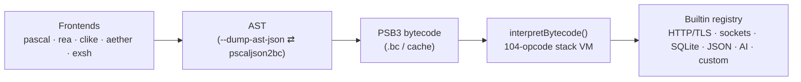

# PSCAL Virtual Machine Technical Manual

A production-grade reference for the PSCAL bytecode engine: the 64-bit
stack-based virtual machine (`components/pscal-core/src/vm/`) shared by the
Pascal, Rea, CLike, Aether, and exsh frontends. Every struct layout, opcode
encoding, constant, and worked example in this manual was taken from — and
where executable, verified against — the current source tree and `build/bin`
binaries, not reconstructed from generic VM lore.

## How the pieces fit

This manual predates the **VM 2.0** modernization
([Docs/pscal_vm2_plan.md](../pscal_vm2_plan.md)) and has been kept current
through Phase 3 (growable stacks) of that effort — the plan doc tracks
in-flight/future phases; this manual documents what has actually shipped.

## Chapters

### [Chapter 1 — System Architecture & Runtime State](pscal_vm_manual_ch1.md)
The execution loop (`interpretBytecode()`, computed-goto dispatch, the
polymorphic `BINARY_OP` fetch-decode-execute path); the memory model —
**VM 2.0 Phase 3**: the operand stack is a growable `mmap(PROT_NONE)`
reservation with an on-demand-committed prefix (default ceiling 1,048,576
Values), and `CallFrame`s are a `realloc`-grown heap array (default ceiling
131,072 frames), both configurable via `PSCAL_VM_MAX_STACK_VALUES`/
`PSCAL_VM_MAX_CALL_FRAMES`; builtins as the side-effect gateway **and the
VM's extension seam** (§1.3); real pthreads multithreading — per-thread VM
instances, the 16-slot worker pool, mutex opcodes, cooperative
pause/cancel/kill (§1.4).

### [Chapter 2 — The Bytecode & Binary File Specification](pscal_vm_manual_ch2.md)
The **PSB3** container (VM 2.0 Phase 1b, a hard cutover from the retired
PSB2 format — no PSB2 reader exists anywhere in the VM): magic
`0x50534233`, format version 3 (a container-shape epoch counter, bumped
1→2→3 across Phase 2a/2b; distinct from `PSCAL_VM_VERSION`=9, the
semantic/AST-cache version), explicit little-endian fields throughout, an
8-byte-aligned section directory (`CODE`/`LINE`/`CONS`/`BMAP`/`PROC`/`TYPE`),
and a varint-run-length line table replacing PSB2's per-code-byte array;
the `pscaljson2bc` AST-JSON pipeline; a worked example run end-to-end
(Pascal source → JSON → `.bc` hexdump → disassembly → execution).

### [Chapter 3 — The Instruction Set Architecture Reference](pscal_vm_manual_ch3.md)
All 104 opcodes (`0x00`–`0x67`) in category tables: hex, mnemonic, exact
operand encoding, Forth-style stack effect, and mechanics. Covers
**VM 2.0 Phase 2a**'s global-access cache side table (replacing the old
8-byte self-patching inline caches that used to live in the code stream —
CODE is now `mprotect(PROT_READ)`'d immutable after load) and **Phase 2b**'s
slot-addressed globals (`GET_GSLOT`/`SET_GSLOT`/`GET_GSLOT_ADDRESS`/
`DEFINE_GLOBAL_SLOT`, opcodes `0x64`-`0x67`, resolved from constant-pool
name indices to array slots by a load-time link step); **Phase 1c**'s
width changes (`JUMP`/`JUMP_IF_FALSE` i16→i32, `CALL`'s address and
`THREAD_CREATE`'s entry u16→u32); big-endian operand convention; the seven
call forms; JSON handle semantics (builtins, not opcodes); threading/mutex
opcodes; and a byte-for-byte validation against the Chapter 2 disassembly.

### [Chapter 4 — Built-in Subsystems & Native Bindings](pscal_vm_manual_ch4.md)
The extensibility model: `registerVmBuiltin()` and why one C registration
is inherited by all five frontend languages; the HTTP/TLS engine
(32-session pool, secure-by-default TLS, the mirror-copy async job layer
with cancel/progress, sequence and state diagrams); sockets/DNS; the
SQLite and yyjson handle runtimes; the OpenAI chat builtin as a
composition case study; the four uniform rules native subsystems follow.

## Errata guarded against

Facts in this manual that commonly circulate incorrectly, pinned here from
source: the ISA has **104** opcodes (not 100, and not 141) — 100 in the
original `0x00`-`0x63` page plus four slot-addressed-global opcodes added at
`0x64`-`0x67` in VM 2.0 Phase 2b; instruction-stream operands are
**big-endian** while the **PSB3** container header and every section body
are **explicit little-endian by design** (not incidentally host-endian —
PSB2, which was host-endian and is now fully retired with no reader left
anywhere in the VM, is what the "host-little-endian" framing used to
describe); the code stream has been genuinely **immutable**
(`mprotect(PROT_READ)`) since Phase 2a — there is no more self-patching
inline-cache scheme; there is **no** `fx`/effect-boundary construct, no
`@pre`/`@post` opcode, and no "TOON" handle system (the structured-data
layer is yyjson-backed JSON handles); SQLite bindings **do** exist
(`ENABLE_EXT_BUILTIN_SQLITE`); and `pscaljson2bc` **does** exist — its
sources live in the umbrella repo (`src/tools/`), not in pscal-core.
