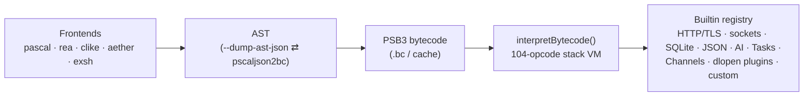

# PSCAL Virtual Machine Technical Manual

A production-grade reference for the PSCAL bytecode engine: the 64-bit
stack-based virtual machine (`components/pscal-core/src/vm/`) shared by the
Pascal, Rea, CLike, Aether, and exsh frontends. Every struct layout, opcode
encoding, constant, and worked example in this manual was taken from — and
where executable, verified against — the current source tree and `build/bin`
binaries, not reconstructed from generic VM lore.

## How the pieces fit

**VM 2.0 ([Docs/pscal_vm2_plan.md](../pscal_vm2_plan.md)) is complete in
full as of Phase 7** (the core track: format/verifier/immutability/growable
stacks/Value re-representation; the concurrency track: Tasks and Channels;
the sandbox track: effect classes/`--deny`/record-replay; the extension
track: the `dlopen` plugin ABI). This manual documents the shipped result of
all seven phases, not a snapshot from partway through — where this manual
and the plan doc describe the same mechanism, this manual is the current
reference and the plan doc is the historical design/implementation record
(checkpoint-by-checkpoint rationale, gotchas, and the full VM 1.x vs VM 2.0
benchmark comparison live there, §11). Phase 8 (opportunistic quickening) is
the only item left unimplemented.

## Chapters

### [Chapter 1 — System Architecture & Runtime State](pscal_vm_manual_ch1.md)
The execution loop (`interpretBytecode()`, computed-goto dispatch, the
polymorphic `BINARY_OP` fetch-decode-execute path); the memory model —
**VM 2.0 Phase 4** collapsed `Value` from a ~176-byte tagged union to a
16-byte NaN-boxed tagged word (`{ VarType type; uint64_t bits; }`) with
`ObjHeader`-refcounted heap objects for every non-trivial type and
copy-on-write ownership (§1.2a); **Phase 3** made the operand stack a
growable `mmap(PROT_NONE)` reservation (default ceiling 1,048,576 Values)
and `CallFrame`s a `realloc`-grown heap array (default ceiling 131,072
frames); builtins as the side-effect gateway **and the VM's extension seam**
(§1.3); real pthreads multithreading — per-thread VM instances, the growable
worker pool, mutex opcodes, cooperative pause/cancel/kill (§1.4); **Phase
5a/5b** added `TYPE_TASK` (§1.4a-b, `TaskSpawn`/`TaskAwait`/`TaskDone`/
`TaskCancel`, plus `vmTaskCreateNative` unifying HTTP-async and future
native async work behind one abstraction) and `TYPE_CHANNEL` (§1.4c, a
bounded MPMC queue — `ChannelCreate`/`Send`/`Receive`/`TrySend`/
`TryReceive`/`Close`).

### [Chapter 2 — The Bytecode & Binary File Specification](pscal_vm_manual_ch2.md)
The **PSB3** container (VM 2.0 Phase 1b, a hard cutover from the retired
PSB2 format — no PSB2 reader exists anywhere in the VM): magic
`0x50534233`, format version 3 (a container-shape epoch counter, bumped
1→2→3 across Phase 2a/2b; distinct from `PSCAL_VM_VERSION`=9, the
semantic/AST-cache version), explicit little-endian fields throughout, an
8-byte-aligned section directory (`CODE`/`LINE`/`CONS`/`BMAP`/`PROC`/`TYPE`),
and a varint-run-length line table replacing PSB2's per-code-byte array;
the `pscaljson2bc` AST-JSON pipeline; a worked example run end-to-end
(Pascal source → JSON → `.bc` hexdump → disassembly → execution). Unaffected
by Phase 4-7: the container format doesn't encode `Value`'s in-memory
representation, only `writeValue`/`readValue`'s on-disk constant encoding,
which stayed stable across the Phase 4 collapse (accessor macros, not the
container, absorbed that change).

### [Chapter 3 — The Instruction Set Architecture Reference](pscal_vm_manual_ch3.md)
All 104 opcodes (`0x00`–`0x67`) in category tables: hex, mnemonic, exact
operand encoding, Forth-style stack effect, and mechanics. Covers
**VM 2.0 Phase 2a**'s global-access cache side table (replacing the old
8-byte self-patching inline caches that used to live in the code stream —
CODE is now `mprotect(PROT_READ)`'d immutable after load) and **Phase 2b**'s
slot-addressed globals (`GET_GSLOT`/`SET_GSLOT`/`GET_GSLOT_ADDRESS`/
`DEFINE_GLOBAL_SLOT`, opcodes `0x64`-`0x67`, resolved from constant-pool
name indices to array slots by a load-time link step); **Phase 1c**'s
width changes (`JUMP`/`JUMP_IF_FALSE` i16→i32, `CALL`'s address and
`THREAD_CREATE`'s entry u16→u32); big-endian operand convention; the seven
call forms; JSON handle semantics (builtins, not opcodes); threading/mutex
opcodes; and a byte-for-byte validation against the Chapter 2 disassembly.
**No opcodes were added by Phase 4, 5, 6, or 7** — Tasks, Channels, effect
policies, and plugin loading are all builtins/host-API surface, not new
ISA entries, so the opcode count has held at 104 since Phase 2b.

### [Chapter 4 — Built-in Subsystems & Native Bindings](pscal_vm_manual_ch4.md)
The extensibility model: `registerVmBuiltin()` (now carrying a Phase 6
`EffectMask`) and why one C registration is inherited by all five frontend
languages; **VM 2.0 Phase 7** extends that same seam out-of-process — a
frozen `PscalExtHostApi` vtable (`pscal_ext_register(host, host_abi)`) lets
a `dlopen`'d shared library register builtins exactly like an in-tree
category, with a `fork()`-isolated dry-run probe rejecting a malformed or
crashing plugin before it ever touches the live process (§4.0b); the
HTTP/TLS engine (32-session pool, secure-by-default TLS, the mirror-copy
async job layer with cancel/progress, sequence and state diagrams,
now returning `TYPE_TASK` per Phase 5a-iii instead of its own parallel job
pool); sockets/DNS; the SQLite and yyjson handle runtimes (SQLite is also
the Phase 7 plugin-ABI proof — the same builtins, loadable either way); the
OpenAI chat builtin as a composition case study; the four uniform rules
native subsystems follow.

## Errata guarded against

Facts in this manual that commonly circulate incorrectly, pinned here from
source: `Value` is **16 bytes** (`{ VarType type; uint64_t bits; }`), not
the ~176-byte tagged-union struct that predates VM 2.0 Phase 4 — every
non-trivial type is a refcounted `ObjHeader`-based heap object reached
through an accessor macro, never a raw struct field (Chapter 1 §1.2a); the
ISA has **104** opcodes (not 100, and not 141), unchanged since Phase 2b
despite Tasks/Channels/plugins all shipping after it — none of those needed
a new opcode; instruction-stream operands are **big-endian** while the
**PSB3** container header and every section body are **explicit
little-endian by design** (not incidentally host-endian — PSB2, which was
host-endian and is now fully retired with no reader left anywhere in the
VM, is what the "host-little-endian" framing used to describe); the code
stream has been genuinely **immutable** (`mprotect(PROT_READ)`) since Phase
2a — there is no more self-patching inline-cache scheme; there is **no**
`fx`/effect-boundary *language* construct (the VM-level `--deny`/effect-mask
sandbox from Phase 6 is dynamic policy enforcement, not a static `fx` type
system), no `@pre`/`@post` opcode, and no "TOON" handle system (the
structured-data layer is yyjson-backed JSON handles); SQLite bindings
**do** exist (`ENABLE_EXT_BUILTIN_SQLITE`) and are also loadable as a
standalone `dlopen` plugin as of Phase 7; `pscaljson2bc` **does** exist —
its sources live in the umbrella repo (`src/tools/`), not in pscal-core;
and the real, measured end-to-end VM 1.x → VM 2.0 speedup (all seven
phases combined, a true isolated-worktree comparison, not a per-phase
estimate) is **1.14x-1.62x depending on workload**, not the much larger
number an early, since-superseded Phase 4 design sketch once floated — see
`Docs/pscal_vm2_plan.md` §11 for the full comparison.
