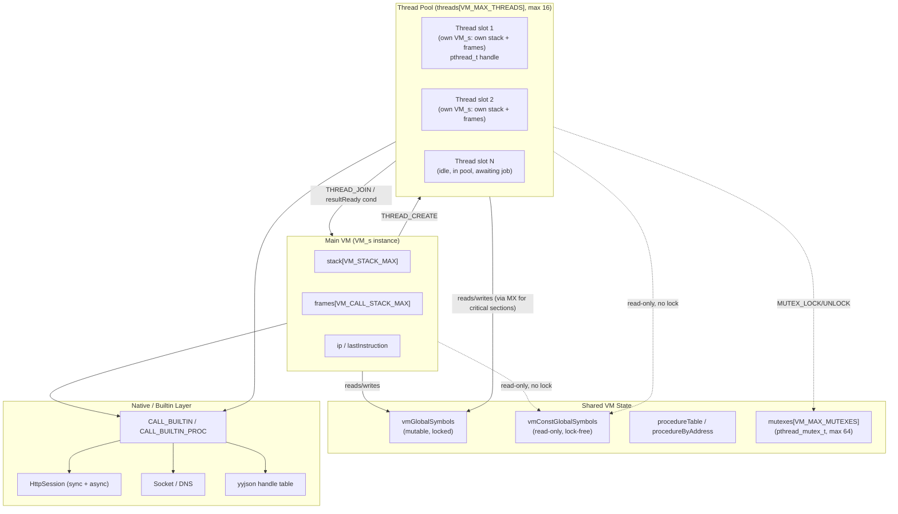

# PSCAL Virtual Machine Technical Manual

## Chapter 1: System Architecture & Runtime State

> Source of truth for this chapter: `components/pscal-core/src/vm/vm.h`,
> `components/pscal-core/src/vm/vm.c`, `components/pscal-core/src/compiler/bytecode.h`.
> All struct fields, opcode names, and constants below are taken verbatim from
> that source, not reconstructed from a generic VM template.

### 1.1 The Virtual Machine Execution Loop

PSCAL's core is a single function: `interpretBytecode()` in `vm.c`. It is not a
tree-walking interpreter and not a JIT — it is a straight bytecode dispatcher
operating over a flat `uint8_t*` instruction stream.

```c
InterpretResult interpretBytecode(VM* vm, BytecodeChunk* chunk,
                                   HashTable* globals, HashTable* const_globals,
                                   HashTable* procedures, uint16_t entry) {
    if (!vm || !chunk) return INTERPRET_RUNTIME_ERROR;

    vm->chunk = chunk;
    vm->ip = vm->chunk->code + entry;       // instruction pointer = code + entry offset
    vm->lastInstruction = vm->ip;
    vm->abort_requested = false;
    vm->suspend_unwind_requested = false;

    vm->vmGlobalSymbols = globals;
    vm->vmConstGlobalSymbols = const_globals;
    vm->procedureTable = procedures;
    vmPopulateProcedureAddressCache(vm);
    ...
```

`entry` is a byte offset into `chunk->code`, letting one chunk hold multiple
entry points (the top-level program plus every procedure/function body,
addressed by offset rather than by a separate function-table jump). Note the
`uint16_t` type: an entry point must sit within the first 65535 bytes of the
chunk.

The prologue does more setup than the excerpt shows: it defensively creates
the `globals`/`const_globals` tables if the caller passed `NULL`, sets
`vm->shellIndexing` from the active frontend (0-based shell indexing vs
1-based Pascal/Rea), lazily binds the `stdin`/`stdout`/`stderr`/`input`/
`output` file globals to the runtime streams (under `globals_mutex`, since
those symbols are shared across concurrent VMs), and — if `vm->frameCount ==
0` — installs a base `CallFrame` covering the main program. Threads that set
up their own initial frame before calling `interpretBytecode()` skip that
last step.

**Dispatch mechanism.** When `VM_USE_COMPUTED_GOTO` is enabled, PSCAL builds a
jump table of label addresses at the top of the function, indexed directly by
opcode byte — avoiding the branch-misprediction cost of a `switch` on a large,
densely-populated opcode space:

```c
#if VM_USE_COMPUTED_GOTO
#define VM_DISPATCH_ENTRY(op) &&LABEL_##op,
    static void *dispatch_table[OPCODE_COUNT] = {
        VM_OPCODE_LIST(VM_DISPATCH_ENTRY)
    };
#undef VM_DISPATCH_ENTRY
#endif
```

`VM_OPCODE_LIST(X)` is a single X-macro (defined once in `vm.c`) that expands
to both the dispatch table and the human-readable name table:

```c
#define OPCODE_NAME_ENTRY(op) #op,
static const char *const kOpcodeNames[OPCODE_COUNT] = {
    VM_OPCODE_LIST(OPCODE_NAME_ENTRY)
};
```

Inside the loop body, each iteration reads one opcode byte and jumps directly
to its label:

```c
        instruction_val = READ_BYTE();
#if VM_USE_COMPUTED_GOTO
        if (instruction_val >= OPCODE_COUNT) goto LABEL_INVALID;
        goto *dispatch_table[instruction_val];

#define VM_DEFINE_DISPATCH_LABEL(op) \
LABEL_##op: \
        instruction_val = op; \
        goto dispatch_switch;
        VM_OPCODE_LIST(VM_DEFINE_DISPATCH_LABEL)
#undef VM_DEFINE_DISPATCH_LABEL
LABEL_INVALID:
        instruction_val = OPCODE_COUNT;
#endif
dispatch_switch:
        switch (instruction_val) {
            case ADD: BINARY_OP("+", instruction_val); break;
            ...
```

Every label falls through into the *same* `switch` — the computed-goto table
exists purely to skip straight to the right `case` without a linear or
binary-search branch; the actual opcode semantics still live in one ordinary
`switch` block, which keeps the non-computed-goto build path (plain `switch`,
no `goto*`) functionally identical for portability.

**Fetch-decode-execute, concretely, for `ADD`:** the instruction stream holds
a single opcode byte (`ADD` takes no operand bytes — its operands are already
on the stack). `BINARY_OP` pops two `Value`s, and is fully polymorphic over
PSCAL's dynamic value types. The macro tries its overloads in a fixed order:
an `INT32 + INT32` fast path, then string/char concatenation (for `ADD`),
then pointer-deref normalization, then enum-ordinal arithmetic, then set
algebra, and finally general numeric arithmetic:

```c
if (IS_NUMERIC(a_val_popped) && IS_NUMERIC(b_val_popped)) {
    bool a_real = IS_REAL(a_val_popped), b_real = IS_REAL(b_val_popped);
    if (a_real || b_real) {
        long double fa = asLd(a_tmp), fb = asLd(b_tmp);
        switch (current_instruction_code) {
            case ADD: result_val = useLong ? makeLongDouble(fa + fb)
                                            : makeReal(fa + fb); break;
            ...
        }
    } else {
        long long ia = asI64(a_val_popped), ib = asI64(b_val_popped);
        // integer path: overflow-checked add/sub/mul (__builtin_*_overflow);
        // DIVIDE on integers is Pascal `/` — it produces a *real* result
        // (div-by-zero checked); integer division is the separate INT_DIV opcode
    }
}
```

So `ADD` is one opcode shared across string/char concatenation, Pascal-family
arithmetic, enum stepping, and set union — dispatched by runtime
`Value.type`, not by separate opcodes. In stack-effect notation:

```
ADD    ( a b -- (a+b) )     ; string/char: concatenation
                            ; numeric: promotes to real if either operand is real
                            ; enum: (enum ordinal) -- (enum'), ordinal-range checked
                            ; set: (set set) -- (set), union
```

**Instruction tracing.** `vm->trace_head_instructions` / `vm->trace_executed`
support tracing the first N instructions of a run (`IP=%04d OPC=%u
STACK=%ld`) — useful for debugging bytecode emitted by a new frontend without
a full disassembly pass.

### 1.2 Memory Model

The `VM` struct (`vm.h:215-270`) is the entire per-VM-instance runtime state.
There is no separate "VM object" wrapping a heap — stacks and tables are
inline members:

```c
typedef struct VM_s {
    BytecodeChunk* chunk;
    uint8_t* ip;
    uint8_t* lastInstruction;

    Value stack[VM_STACK_MAX];   // VM_STACK_MAX == 8192
    Value* stackTop;             // one past the logical top

    HashTable* vmGlobalSymbols;      // mutable globals
    HashTable* vmConstGlobalSymbols; // read-only globals (no locking needed)
    HashTable* procedureTable;       // for disassembly / address lookup
    Symbol** procedureByAddress;     // bytecode-offset -> Symbol cache

    HostFn host_functions[MAX_HOST_FUNCTIONS];  // MAX_HOST_FUNCTIONS == 4096

    CallFrame frames[VM_CALL_STACK_MAX];  // VM_CALL_STACK_MAX == 4096
    int frameCount;
    ...
    Thread threads[VM_MAX_THREADS];       // VM_MAX_THREADS == 16
    Mutex mutexes[VM_MAX_MUTEXES];        // VM_MAX_MUTEXES == 64
    ...
} VM;
```

**Operand stack.** `stack[VM_STACK_MAX]` is a fixed array of `Value` — PSCAL's
tagged-union runtime value type (numeric variants, strings, pointers,
records/objects, sets, files, enums). There is no separate typed-stack
optimization; every push/pop moves a full `Value`. The interpreter's stack
primitives are `push`/`pop` plus a `peek` and `FAST_POP`/fast-path variants
used on hot paths (opcodes like `DUP`/`SWAP`/`POP` are thin wrappers over
stack-top arithmetic).

**Call/frame stack.** `frames[VM_CALL_STACK_MAX]` is a *parallel* fixed array,
not a linked structure. Each `CallFrame` is a window description into the
*same* operand stack rather than a separate stack of its own:

```c
typedef struct {
    uint8_t* return_address;     // IP to resume in the caller
    Value* slots;                // this frame's window onto vm->stack
    Symbol* function_symbol;     // arity/locals metadata for the callee
    uint16_t slotCount;          // total slots (args + locals) reserved
    uint8_t locals_count;        // locals only, excluding params
    uint8_t upvalue_count;
    Value** upvalues;            // closure captures
    bool owns_upvalues;
    ClosureEnvPayload* closureEnv;
    bool discard_result_on_return;  // true for procedure calls (no return value kept)
    Value* vtable;                  // set when executing inside a method (OOP dispatch)
} CallFrame;
```

Locals and parameters are not heap-allocated per call — they occupy a
contiguous slice of `vm->stack` starting at `frame->slots`, sized by
`slotCount`. `CALL` pushes a new `CallFrame` and advances `stackTop` past the
callee's slot window; `RETURN` pops the frame, and — unless
`discard_result_on_return` is set (bare procedure call, no caller expects a
value) — leaves the function's result value where the caller's stack
discipline expects it.

**Object/record memory.** `ALLOC_OBJECT`/`ALLOC_OBJECT16` allocate record and
class instances; fields are addressed by `GET_FIELD_OFFSET`/`GET_FIELD_ADDRESS`
(offset baked in at compile time) or, for dynamic/reflective access,
`LOAD_FIELD_VALUE_BY_NAME`. Array elements go through the parallel
`GET_ELEMENT_ADDRESS(_CONST)` / `LOAD_ELEMENT_VALUE(_CONST)` pair — `_CONST`
variants exist so a compile-time-known constant index skips a runtime bounds
computation. String characters get their own opcodes
(`GET_CHAR_ADDRESS`, `GET_CHAR_FROM_STRING`) because PSCAL strings are a
distinct `Value` variant (`isPascalStringType`), not raw byte arrays — pointer
arithmetic into a string has to go through the pointer-to-string-value
indirection rather than plain address math:

```c
case GET_CHAR_ADDRESS: {
    Value index_val = pop(vm);
    Value* string_ptr_val = vm->stackTop - 1;   // peek the base for validation
    if (string_ptr_val->type != TYPE_POINTER || !string_ptr_val->ptr_val ||
        !isPascalStringType(((Value*)string_ptr_val->ptr_val)->type)) {
        runtimeError(vm, "VM Error: Base for character index is not a pointer to a string.");
        ...
    }
    ...
    Value popped_string_ptr = pop(vm);          // base IS consumed before the push
    freeValue(&popped_string_ptr);
    push(vm, makePointer(&string_val->s_val[char_offset], STRING_CHAR_PTR_SENTINEL));
    break;
}
```

Net stack effect: `( string_ptr index -- char_ptr )` — the base pointer is
only peeked during validation, then popped before the result is pushed.
Index resolution goes through `vmResolveStringIndex()`, which honors
`vm->shellIndexing` (0-based for the shell frontend, 1-based for
Pascal/Rea). `STRING_CHAR_PTR_SENTINEL` marks the resulting pointer as
"points inside a managed string's buffer" rather than an arbitrary heap
pointer, so later frees/copies know not to treat it as an owning reference.

**Globals** live outside the per-call-frame stack entirely, in two separate
`HashTable`s: `vmGlobalSymbols` (mutable) and `vmConstGlobalSymbols`
(immutable, and explicitly *not* mutex-guarded, since it never changes after
load — a deliberate optimization for the multithreaded case described below).
`GET_GLOBAL_CACHED`/`SET_GLOBAL_CACHED` variants exist alongside the plain
`GET_GLOBAL`/`SET_GLOBAL` opcodes as an inline-cache optimization for
hot-path global access, avoiding a full hash lookup on repeat execution of
the same instruction.

### 1.3 Builtins, Extensibility, and Side Effects

There is no distinct "effect boundary" instruction or VM-level purity
tracking in PSCAL — no `fx` block construct exists in the bytecode or the
interpreter. Side effects are ordinary builtin calls, via two opcodes that
both dispatch into native C functions:

- `CALL_BUILTIN` — operands: 2-byte name-constant index + 1-byte argument
  count. The builtin is resolved **by name** at each call (with a
  lowercase-name constant cached alongside for the lookup).
- `CALL_BUILTIN_PROC` — operands: 2-byte builtin registry id + 2-byte
  name-constant index + 1-byte argument count. The baked-in id is a fast
  path, but it is only trusted when it agrees with the name compiled next to
  it: if the id's registered name and the encoded name disagree, the bytecode
  was produced against a different registry layout (stale cache, older
  binary) and the VM re-resolves by name rather than silently running the
  wrong builtin. The name is the stable contract; the id is an optimization.

**The builtin table is the VM's extension seam.** The registry behind these
two opcodes is open: `registerVmBuiltin(name, handler, type, display_name)`
(`builtin.c`) appends a new native function at runtime, and — because
registration also synthesizes a function/procedure *declaration* that every
frontend's compiler resolves identifiers against — a capability registered
once in C is immediately callable from Pascal, Rea, CLike, Aether, and exsh
alike, with no per-frontend binding work. All of the stock subsystems
(HTTP/TLS, sockets, SQLite, JSON, graphics, the OpenAI client) enter the VM
through exactly this mechanism, each as an optional compile-time category;
so do embedder-supplied APIs. This is the intended way to grow the VM — not
new opcodes, which renumber the ISA (§3.0). Chapter 4 documents the registry
and the shipped categories in full.

The same call mechanism serves `Sin()`, `WriteLn()`, and `HttpRequest()`
alike. `vm->current_builtin_name` is set for the duration of the call purely
for diagnostics (error messages, opcode/builtin profiling via
`EXSH_PROFILE_OPCODES`), not for effect tracking.

Practically, this means:
- **Determinism is a property of which builtins a program calls**, not
  something the VM enforces or can statically verify.
- A builtin that blocks (synchronous `HttpRequest`) blocks the calling
  thread's interpreter loop outright; there is no automatic yielding.
- Async variants (`HttpRequestAsync` + `HttpAwait`/`HttpIsDone`) are a
  *library-level* convention layered on top of the plain call mechanism and
  the thread pool below — not a separate VM-level effect system.

If your architecture calls for a genuine effect-isolation layer, it does not
exist yet at the pscal-core level; it would need to be a frontend-level
convention (e.g. a compiler pass in Aether/Rea) enforced before code reaches
this VM, since the VM itself treats every builtin call identically.

### 1.4 Multithreading

Multithreading is real, OS-level, and mutex/condvar-backed — not a
cooperative green-thread illusion. Each `VM` owns a fixed pool of thread
slots:

```c
Thread threads[VM_MAX_THREADS];   // VM_MAX_THREADS == 16
int threadCount;
struct VM_s* threadOwner;

pthread_mutex_t threadRegistryLock;  // protects worker pool state
struct ThreadJobQueue* jobQueue;     // shared job queue for worker reuse
int workerCount;
int availableWorkers;
atomic_bool shuttingDownWorkers;
```

Each `Thread` slot wraps a real `pthread_t` plus its own result hand-off
synchronization and cooperative-scheduling flags (abridged — the full struct
in `vm.h` adds status hand-off, VM-ownership, reuse hand-shake, and
per-job timestamp/metrics fields):

```c
typedef struct {
    pthread_t handle;
    struct VM_s* vm;              // the VM instance running on this thread

    bool resultReady;  Value resultValue;   // result hand-off
    pthread_mutex_t resultMutex;
    pthread_cond_t  resultCond;

    atomic_bool paused;
    atomic_bool cancelRequested;
    atomic_bool killRequested;

    bool inPool; bool idle; int poolGeneration;  // worker-pool recycling
    ThreadJob* currentJob;

    pthread_mutex_t stateMutex;
    pthread_cond_t  stateCond;
    // ... status/ownership/reuse/metrics fields elided ...
} Thread;
```

Each spawned thread runs `interpretBytecode()` over **its own** `VM`
instance (`vm->threadOwner` links a worker's `VM*` back to the owning parent),
with its own operand stack and call-frame array — `Value stack[VM_STACK_MAX]`
and `CallFrame frames[VM_CALL_STACK_MAX]` are per-`VM`, hence per-thread. What
*is* shared across threads is `vmGlobalSymbols`/`vmConstGlobalSymbols` (global
variable state) and the procedure/mutex tables, which is why the const-global
table is deliberately lock-free (read-only after program load) while the
mutable-global table needs the runtime's own locking discipline.

`THREAD_CREATE` (2-byte entry-point offset operand) spawns a worker against a
given bytecode offset and pushes the thread id; `THREAD_JOIN` pops a thread
id and blocks until that worker's `resultReady` condition fires — note that
it consumes and **discards** the worker's result value rather than pushing it
(result retrieval, where a frontend supports it, goes through the host-level
result hand-off, not this opcode). Supporting host-level API: `vmJoinThreadById`,
`vmThreadPause`, `vmThreadResume`, `vmThreadCancel`, `vmThreadKill`,
`vmThreadAssignName`/`vmThreadFindIdByName` — cooperative pause/cancel/kill
are implemented via the `atomic_bool` flags on `Thread`, checked by the
interpreter loop at safe points, not via signal-based preemption.

Mutual exclusion is a first-class VM resource, not just a builtin-library
wrapper: `mutexes[VM_MAX_MUTEXES]` (64 max) backs `MUTEX_CREATE` /
`RCMUTEX_CREATE` (recursive variant) / `MUTEX_LOCK` / `MUTEX_UNLOCK` /
`MUTEX_DESTROY`, each a real `pthread_mutex_t` wrapped in a `Mutex{ handle,
active }` slot.

```
THREAD_CREATE <entry:u16>   ( -- thread_id )   ; spawns worker VM at bytecode offset
THREAD_JOIN                 ( thread_id -- )   ; blocks; result value is discarded
MUTEX_CREATE                ( -- mutex_id )
MUTEX_LOCK                  ( mutex_id -- )
MUTEX_UNLOCK                ( mutex_id -- )
```

### Diagram: Thread Pool, Shared State, and the Native/Builtin Layer



Note what this diagram does *not* show: there is no separate "side-effect
engine" box distinct from the builtin dispatch layer — `CALL_BUILTIN` is the
single gateway both pure functions (`Sin`, `Length`) and stateful native
operations (HTTP, sockets, JSON handles) go through. The isolation the
original design brief describes as an "Effect Boundary Layer" does not exist
as a separate mechanism in this VM; the boundary is simply "inside a builtin
vs. inside bytecode."
