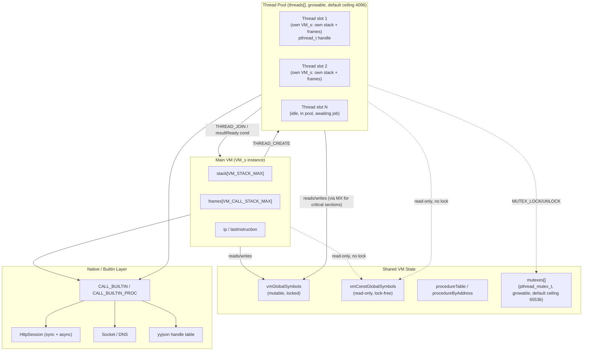

# PSCAL Virtual Machine Technical Manual

## Chapter 1: System Architecture & Runtime State

> Source of truth for this chapter: `components/pscal-core/src/vm/vm.h`,
> `components/pscal-core/src/vm/vm.c`, `components/pscal-core/src/compiler/bytecode.h`.
> All struct fields, opcode names, and constants below are taken verbatim from
> that source, not reconstructed from a generic VM template.

### 1.1 The Virtual Machine Execution Loop

PSCAL's core is a single function: `interpretBytecode()` in `vm.c`. It is not a
tree-walking interpreter and not a JIT — it is a straight bytecode dispatcher
operating over a flat `uint8_t*` instruction stream.

```c
InterpretResult interpretBytecode(VM* vm, BytecodeChunk* chunk,
                                   HashTable* globals, HashTable* const_globals,
                                   HashTable* procedures, uint32_t entry) {
    if (!vm || !chunk) return INTERPRET_RUNTIME_ERROR;

    vm->chunk = chunk;
    vm->ip = vm->chunk->code + entry;       // instruction pointer = code + entry offset
    vm->lastInstruction = vm->ip;
    vm->abort_requested = false;
    vm->suspend_unwind_requested = false;

    vm->vmGlobalSymbols = globals;
    vm->vmConstGlobalSymbols = const_globals;
    vm->procedureTable = procedures;
    vmPopulateProcedureAddressCache(vm);
    ...
```

`entry` is a byte offset into `chunk->code`, letting one chunk hold multiple
entry points (the top-level program plus every procedure/function body,
addressed by offset rather than by a separate function-table jump). **VM 2.0
Phase 1c** widened this from `uint16_t` to `uint32_t` (alongside `CALL`'s
address operand, `THREAD_CREATE`'s entry operand, and `JUMP`/`JUMP_IF_FALSE`'s
displacement — see Chapter 3 §3.3/§3.5) — an entry point is no longer capped
at the first 65535 bytes of the chunk.

The prologue does more setup than the excerpt shows: it defensively creates
the `globals`/`const_globals` tables if the caller passed `NULL`, sets
`vm->shellIndexing` from the active frontend (0-based shell indexing vs
1-based Pascal/Rea), lazily binds the `stdin`/`stdout`/`stderr`/`input`/
`output` file globals to the runtime streams (under `globals_mutex`, since
those symbols are shared across concurrent VMs), and — if `vm->frameCount ==
0` — installs a base `CallFrame` covering the main program. Threads that set
up their own initial frame before calling `interpretBytecode()` skip that
last step.

**Dispatch mechanism.** When `VM_USE_COMPUTED_GOTO` is enabled, PSCAL builds a
jump table of label addresses at the top of the function, indexed directly by
opcode byte — avoiding the branch-misprediction cost of a `switch` on a large,
densely-populated opcode space:

```c
#if VM_USE_COMPUTED_GOTO
#define VM_DISPATCH_ENTRY(op) &&LABEL_##op,
    static void *dispatch_table[OPCODE_COUNT] = {
        VM_OPCODE_LIST(VM_DISPATCH_ENTRY)
    };
#undef VM_DISPATCH_ENTRY
#endif
```

`VM_OPCODE_LIST(X)` is a single X-macro (defined once in `vm.c`) that expands
to both the dispatch table and the human-readable name table:

```c
#define OPCODE_NAME_ENTRY(op) #op,
static const char *const kOpcodeNames[OPCODE_COUNT] = {
    VM_OPCODE_LIST(OPCODE_NAME_ENTRY)
};
```

Inside the loop body, each iteration reads one opcode byte and jumps directly
to its label:

```c
        instruction_val = READ_BYTE();
#if VM_USE_COMPUTED_GOTO
        if (instruction_val >= OPCODE_COUNT) goto LABEL_INVALID;
        goto *dispatch_table[instruction_val];

#define VM_DEFINE_DISPATCH_LABEL(op) \
LABEL_##op: \
        instruction_val = op; \
        goto dispatch_switch;
        VM_OPCODE_LIST(VM_DEFINE_DISPATCH_LABEL)
#undef VM_DEFINE_DISPATCH_LABEL
LABEL_INVALID:
        instruction_val = OPCODE_COUNT;
#endif
dispatch_switch:
        switch (instruction_val) {
            case ADD: BINARY_OP("+", instruction_val); break;
            ...
```

Every label falls through into the *same* `switch` — the computed-goto table
exists purely to skip straight to the right `case` without a linear or
binary-search branch; the actual opcode semantics still live in one ordinary
`switch` block, which keeps the non-computed-goto build path (plain `switch`,
no `goto*`) functionally identical for portability.

**Fetch-decode-execute, concretely, for `ADD`:** the instruction stream holds
a single opcode byte (`ADD` takes no operand bytes — its operands are already
on the stack). `BINARY_OP` pops two `Value`s, and is fully polymorphic over
PSCAL's dynamic value types. The macro tries its overloads in a fixed order:
an `INT32 + INT32` fast path, then string/char concatenation (for `ADD`),
then pointer-deref normalization, then enum-ordinal arithmetic, then set
algebra, and finally general numeric arithmetic:

```c
if (IS_NUMERIC(a_val_popped) && IS_NUMERIC(b_val_popped)) {
    bool a_real = IS_REAL(a_val_popped), b_real = IS_REAL(b_val_popped);
    if (a_real || b_real) {
        long double fa = asLd(a_tmp), fb = asLd(b_tmp);
        switch (current_instruction_code) {
            case ADD: result_val = useLong ? makeLongDouble(fa + fb)
                                            : makeReal(fa + fb); break;
            ...
        }
    } else {
        long long ia = asI64(a_val_popped), ib = asI64(b_val_popped);
        // integer path: overflow-checked add/sub/mul (__builtin_*_overflow);
        // DIVIDE on integers is Pascal `/` — it produces a *real* result
        // (div-by-zero checked); integer division is the separate INT_DIV opcode
    }
}
```

So `ADD` is one opcode shared across string/char concatenation, Pascal-family
arithmetic, enum stepping, and set union — dispatched by runtime
`Value.type`, not by separate opcodes. In stack-effect notation:

```
ADD    ( a b -- (a+b) )     ; string/char: concatenation
                            ; numeric: promotes to real if either operand is real
                            ; enum: (enum ordinal) -- (enum'), ordinal-range checked
                            ; set: (set set) -- (set), union
```

**Instruction tracing.** `vm->trace_head_instructions` / `vm->trace_executed`
support tracing the first N instructions of a run (`IP=%04d OPC=%u
STACK=%ld`) — useful for debugging bytecode emitted by a new frontend without
a full disassembly pass.

### 1.2 Memory Model

The `VM` struct (`vm.h:215-270`) is the entire per-VM-instance runtime state.
There is no separate "VM object" wrapping a heap — stacks and tables are
inline members:

```c
typedef struct VM_s {
    BytecodeChunk* chunk;
    uint8_t* ip;
    uint8_t* lastInstruction;

    Value* stack;                 // base of a growable mmap reservation (VM 2.0 Phase 3)
    Value* stackTop;               // one past the logical top
    size_t stackCommittedValues;   // currently accessible (mprotect'd RW) prefix
    size_t stackReservedValues;    // total reservation size -- the hard ceiling

    HashTable* vmGlobalSymbols;      // mutable globals
    HashTable* vmConstGlobalSymbols; // read-only globals (no locking needed)
    HashTable* procedureTable;       // for disassembly / address lookup
    Symbol** procedureByAddress;     // bytecode-offset -> Symbol cache

    HostFn host_functions[MAX_HOST_FUNCTIONS];  // MAX_HOST_FUNCTIONS == 4096

    CallFrame* frames;              // heap array, grown via realloc (VM 2.0 Phase 3)
    size_t frameCapacity;
    int frameCount;
    ...
    Thread* threads;      // mmap-reserved, growable (VM 2.0 Phase 5a ckpt 5a-ii, see §1.4)
    Mutex* mutexes;        // same technique
    ...
} VM;
```

**Operand stack (VM 2.0 Phase 3, plan §5.9).** `stack` is the base of a
single virtual-memory reservation made once in `initVM()` via
`mmap(PROT_NONE)` and never relocated or freed until `freeVM()` — a
`Value*` taken from a stack slot (see `GET_LOCAL_ADDRESS` below) stays valid
for the VM's entire lifetime. Only a small initial prefix is actually
accessible (`mprotect(PROT_READ|PROT_WRITE)`'d) at first;
`push()`/`vmFastPushUnchecked()` extend that committed prefix in place
(doubling it) whenever the next push would exceed it, up to a configurable
ceiling (`VM_STACK_MAX`, default 1,048,576 Values, overridable via the
`PSCAL_VM_MAX_STACK_VALUES` environment variable) — exceeding the ceiling
is a clean `"VM Error: Stack overflow."`, never a native crash or unbounded
growth. Because the base address never moves, every pointer-difference
computation elsewhere in the interpreter (`vm->stackTop - vm->stack`,
loops like `for (Value* slot = vm->stack; slot < vm->stackTop; slot++)`)
keeps working completely unmodified — the growable design is deliberately
*not* a linked list of fixed-size segments (which would make every one of
those computations undefined behavior across separate allocations); see
the plan's §5.9 writeup for the full rationale. `Value` is PSCAL's
tagged-union runtime value type (numeric variants, strings, pointers,
records/objects, sets, files, enums); there is no separate typed-stack
optimization, every push/pop moves a full `Value`. The interpreter's stack
primitives are `push`/`pop` plus a `peek` and `FAST_POP`/fast-path variants
used on hot paths (opcodes like `DUP`/`SWAP`/`POP` are thin wrappers over
stack-top arithmetic).

**Call/frame stack.** `frames` (VM 2.0 Phase 3: a heap array grown via
ordinary `realloc()`, starting small and doubling up to a configurable
ceiling, `VM_CALL_STACK_MAX` default 131,072 frames, overridable via
`PSCAL_VM_MAX_CALL_FRAMES`) is a *parallel* array, not a linked structure.
Relocating it on growth is safe because nothing holds a `CallFrame*` beyond
the immediate scope of the opcode handler that read it — unlike the operand
stack, no opcode takes the address of a `CallFrame` itself. Each `CallFrame`
is a window description into the *same* operand stack rather than a
separate stack of its own:

```c
typedef struct {
    uint8_t* return_address;     // IP to resume in the caller
    Value* slots;                // this frame's window onto vm->stack
    Symbol* function_symbol;     // arity/locals metadata for the callee
    uint16_t slotCount;          // total slots (args + locals) reserved
    uint8_t locals_count;        // locals only, excluding params
    uint8_t upvalue_count;
    Value** upvalues;            // closure captures
    bool owns_upvalues;
    ClosureEnvPayload* closureEnv;
    bool discard_result_on_return;  // true for procedure calls (no return value kept)
    Value* vtable;                  // set when executing inside a method (OOP dispatch)
} CallFrame;
```

Locals and parameters are not heap-allocated per call — they occupy a
contiguous slice of `vm->stack` starting at `frame->slots`, sized by
`slotCount`. `CALL` pushes a new `CallFrame` and advances `stackTop` past the
callee's slot window; `RETURN` pops the frame, and — unless
`discard_result_on_return` is set (bare procedure call, no caller expects a
value) — leaves the function's result value where the caller's stack
discipline expects it.

**Object/record memory.** `ALLOC_OBJECT`/`ALLOC_OBJECT16` allocate record and
class instances; fields are addressed by `GET_FIELD_OFFSET`/`GET_FIELD_ADDRESS`
(offset baked in at compile time) or, for dynamic/reflective access,
`LOAD_FIELD_VALUE_BY_NAME`. Array elements go through the parallel
`GET_ELEMENT_ADDRESS(_CONST)` / `LOAD_ELEMENT_VALUE(_CONST)` pair — `_CONST`
variants exist so a compile-time-known constant index skips a runtime bounds
computation. String characters get their own opcodes
(`GET_CHAR_ADDRESS`, `GET_CHAR_FROM_STRING`) because PSCAL strings are a
distinct `Value` variant (`isPascalStringType`), not raw byte arrays — pointer
arithmetic into a string has to go through the pointer-to-string-value
indirection rather than plain address math:

```c
case GET_CHAR_ADDRESS: {
    Value index_val = pop(vm);
    Value* string_ptr_val = vm->stackTop - 1;   // peek the base for validation
    if (string_ptr_val->type != TYPE_POINTER || !string_ptr_val->ptr_val ||
        !isPascalStringType(((Value*)string_ptr_val->ptr_val)->type)) {
        runtimeError(vm, "VM Error: Base for character index is not a pointer to a string.");
        ...
    }
    ...
    Value popped_string_ptr = pop(vm);          // base IS consumed before the push
    freeValue(&popped_string_ptr);
    push(vm, makePointer(&string_val->s_val[char_offset], STRING_CHAR_PTR_SENTINEL));
    break;
}
```

Net stack effect: `( string_ptr index -- char_ptr )` — the base pointer is
only peeked during validation, then popped before the result is pushed.
Index resolution goes through `vmResolveStringIndex()`, which honors
`vm->shellIndexing` (0-based for the shell frontend, 1-based for
Pascal/Rea). `STRING_CHAR_PTR_SENTINEL` marks the resulting pointer as
"points inside a managed string's buffer" rather than an arbitrary heap
pointer, so later frees/copies know not to treat it as an owning reference.

**Globals** (VM 2.0 Phase 2b, plan §5.7) live outside the per-call-frame
stack entirely, in a per-chunk **slot table**: `chunk->global_slots`, an
array of `GlobalSlot { Symbol* symbol; }` indexed directly by a `slot:u16`
operand baked into `GET_GSLOT`/`SET_GSLOT`/`GET_GSLOT_ADDRESS`/
`DEFINE_GLOBAL_SLOT`. There is no hash lookup and no per-call-site cache on
this path at all — the array index *is* the address. Two companion arrays
carry per-slot metadata sized to the same `global_slot_count`:
`global_slot_is_const` (a bitmap `SET_GSLOT` checks before writing, raising
a runtime error on a const slot rather than mutating it) and
`global_slot_names` (owned strings, consulted only by the disassembler and
by runtime error messages — never on the read/write hot path). Three
reserved-slot fields (`global_myself_slot`, `global_pas_exc_pending_slot`,
`global_pas_exc_message_slot`) let the three synthetic globals that need
special handling (see below, and the Pascal exception-unwind mechanism) be
recognized by an O(1) integer compare instead of a name string comparison.

This table is populated by a **load-time link step**
(`compiler/bytecode_link.c`, `pscalLinkGlobalSlots()`): every AST frontend's
compiler (Pascal/Rea/CLike/Aether share one `compiler.c`) emits these
opcodes with a *constant-pool name index* in the slot operand's position —
the compiler never assigns or even sees a slot number. The link step walks
the chunk's CODE once, assigns each distinct name a slot in first-reference
order, and rewrites that same 2-byte operand *in place* from a name index
to the resolved slot index, before the chunk is verified (loaded-from-cache
path) or executed (all paths) — see §2.2's CODE section and §3.0 for the
full ordering rationale and why this in-place rewrite does not reopen
Phase 2a's self-modifying-code concern. `chunk->globals_linked` guards
against relinking an already-linked chunk (the on-disk `.bc` cache always
holds the pre-link, name-indexed form — see §2.2 — precisely so a cache hit
can't accidentally run the rewrite twice).

Symbol *ownership* is unchanged from the pre-2b hash-table design: a global
still gets a heap-allocated `Symbol` (name, type, type_def, is_const, and a
separately-heap-allocated `Value*`) the first time `DEFINE_GLOBAL_SLOT`
executes for it (mutable globals) or, for const globals (whole numbers,
enum members, unit-interface constants), at link time from whichever of the
process's `globalSymbols`/`constGlobalSymbols` tables already holds it
(populated during compilation/const-folding or, for a cache-loaded chunk,
during PROCS-section deserialization). `chunk->global_slots[slot].symbol` is
a **non-owning** rider pointing at that same `Symbol` — the slot table adds
an O(1) index on top of the existing allocation/ownership machinery, it does
not replace it. This is a deliberate, documented deviation from a literal
"flatten `Value` into the slot array" reading of the plan: the array holds
`Symbol*`, not a raw `Value`, because `DEFINE_GLOBAL_SLOT`/`SET_GSLOT` still
need type/type_def to construct and coerce array, record, file and pointer
values via the pre-existing `makeValueForType()`/`updateSymbolDirect()`
machinery.

`myself` is special-cased independently of the slot table's own mechanics:
it is a per-VM-thread field (`vm->threadMyself`), not process/chunk-shared
state, so `chunk->global_myself_slot` only marks *which* slot number the
opcodes should recognize and divert away from `global_slots[]` entirely —
`myself` itself is never actually stored there. The retired
`GET_GLOBAL_CACHED`/`SET_GLOBAL_CACHED`/`GET_GLOBAL16_CACHED`/
`SET_GLOBAL16_CACHED` opcodes from Phase 2a, and `GET_GLOBAL`/`SET_GLOBAL`/
`GET_GLOBAL16`/`SET_GLOBAL16`/`DEFINE_GLOBAL`/`DEFINE_GLOBAL16`/
`GET_GLOBAL_ADDRESS`/`GET_GLOBAL_ADDRESS16` retired by this phase, are kept
as opcode holes purely so a pre-2b standalone `.bc` still disassembles with
a readable legacy mnemonic (§3.0).

exsh is untouched by any of this: its independent codegen
(`components/exsh/src/shell/codegen.c`) never emitted `GET_GLOBAL`/
`SET_GLOBAL`/`DEFINE_GLOBAL` in the first place — shell variables, being
creatable at runtime, go through `CALL_HOST`/`CALL_BUILTIN` dispatch
instead. The dual-path design the original Phase 2b proposal anticipated
("exsh keeps a name-addressed escape hatch") turned out to be unnecessary.

### 1.3 Builtins, Extensibility, and Side Effects

There is no `fx` block construct or static purity checking in the bytecode
or the interpreter, and VM 2.0 Phase 6 (below) doesn't add one — but the VM
does now carry a *dynamic* effect classification for every builtin, used to
sandbox untrusted programs and to record/replay effectful calls
deterministically (§4.0a has the full mechanism). Side effects themselves
are still ordinary builtin calls, via two opcodes that both dispatch into
native C functions:

- `CALL_BUILTIN` — operands: 2-byte name-constant index + 1-byte argument
  count. The builtin is resolved **by name** at each call (with a
  lowercase-name constant cached alongside for the lookup).
- `CALL_BUILTIN_PROC` — operands: 2-byte builtin registry id + 2-byte
  name-constant index + 1-byte argument count. The baked-in id is a fast
  path, but it is only trusted when it agrees with the name compiled next to
  it: if the id's registered name and the encoded name disagree, the bytecode
  was produced against a different registry layout (stale cache, older
  binary) and the VM re-resolves by name rather than silently running the
  wrong builtin. The name is the stable contract; the id is an optimization.

**The builtin table is the VM's extension seam.** The registry behind these
two opcodes is open: `registerVmBuiltin(name, handler, type, display_name)`
(`builtin.c`) appends a new native function at runtime, and — because
registration also synthesizes a function/procedure *declaration* that every
frontend's compiler resolves identifiers against — a capability registered
once in C is immediately callable from Pascal, Rea, CLike, Aether, and exsh
alike, with no per-frontend binding work. All of the stock subsystems
(HTTP/TLS, sockets, SQLite, JSON, graphics, the OpenAI client) enter the VM
through exactly this mechanism, each as an optional compile-time category;
so do embedder-supplied APIs. This is the intended way to grow the VM — not
new opcodes, which renumber the ISA (§3.0). Chapter 4 documents the registry
and the shipped categories in full.

The same call mechanism serves `Sin()`, `WriteLn()`, and `HttpRequest()`
alike. `vm->current_builtin_name` is set for the duration of the call purely
for diagnostics (error messages, opcode/builtin profiling via
`EXSH_PROFILE_OPCODES`); effect tracking (§4.0a) is a separate, cheap check
(`vmApplyFxPolicy()`) sitting right before the handler call in both opcodes'
case blocks, not woven into this diagnostic bookkeeping.

Practically, this means:
- **Determinism is a property of which builtins a program calls**, not
  something the VM statically verifies — but it is now something the VM can
  *enforce* (`--deny`) or *replay* (`--fx-replay`) dynamically at the
  dispatch point, per program run, without any frontend involvement.
- A builtin that blocks (synchronous `HttpRequest`) blocks the calling
  thread's interpreter loop outright; there is no automatic yielding.
- Async variants (`HttpRequestAsync` + `HttpAwait`/`HttpIsDone`) are a
  *library-level* convention layered on top of the plain call mechanism and
  the thread pool below — not a separate VM-level effect system.

A genuine *static* effect-isolation layer (a language-level `fx` construct,
compile-time purity checking) still does not exist at the pscal-core level
and isn't in scope for Phase 6 — Aether's own `fx`/`@pure` checks (FX-001,
ANN-001) are a frontend-level convention layered on top, unrelated to this
VM-level mechanism. What Phase 6 adds is dynamic and process-wide: a
`--deny` policy or an active record/replay journal, checked once per
effectful builtin call, with zero cost when neither is configured.

### 1.4 Multithreading

Multithreading is real, OS-level, and mutex/condvar-backed — not a
cooperative green-thread illusion. Each `VM` owns a growable pool of thread
slots (VM 2.0 Phase 5a checkpoint 5a-ii, Docs/pscal_vm2_plan.md §6.1):

```c
Thread* threads;             // mmap-reserved, growable -- see below
size_t threadsReservedCount; // hard ceiling (default 4096, PSCAL_VM_MAX_THREADS)
size_t threadsCommittedCount; // currently accessible prefix, grows on demand
int threadCount;
struct VM_s* threadOwner;

pthread_mutex_t threadRegistryLock;  // protects worker pool state
struct ThreadJobQueue* jobQueue;     // shared job queue for worker reuse
int workerCount;
int availableWorkers;
atomic_bool shuttingDownWorkers;
```

`threads` (and `mutexes`, below) use the operand stack's own technique
(§1.2, Phase 3): a single `mmap(PROT_NONE)` reservation sized to the
ceiling, with only a growing prefix `mprotect`'d accessible, so the base
address never moves. This was found to be required, not merely a stylistic
choice matching the stack: a dedicated audit found several places that take
a raw `Thread*`/`Mutex*` pointer and hold it live across a call that can
block for an arbitrary duration after releasing the owning registry lock
(`lockMutex`/`unlockMutex`, `joinThreadInternal`/`vmThreadTakeResult`), plus
one long-lived struct field (`VM_s.owningThread`) — a realloc-based design
(like `frames[]` below) would dangle every one of those pointers the moment
a grow relocated the array. Growth is on-demand and amortized (doubling,
capped at the ceiling): `createThreadJob`'s slot-scan and `createMutex`'s
allocator both grow the committed prefix only when every already-committed
slot is occupied. The initial committed count (16 threads, 64 mutexes)
matches this codebase's exact pre-5a-ii behavior for any program that never
needs to grow — zero behavioral or measurable performance difference.
`PSCAL_VM_MAX_MUTEXES` overrides the mutex ceiling (default 65536) the same
way `PSCAL_VM_MAX_THREADS` overrides the thread one.

Each `Thread` slot wraps a real `pthread_t` plus its own result hand-off
synchronization and cooperative-scheduling flags (abridged — the full struct
in `vm.h` adds status hand-off, VM-ownership, reuse hand-shake, and
per-job timestamp/metrics fields):

```c
typedef struct {
    pthread_t handle;
    struct VM_s* vm;              // the VM instance running on this thread

    bool resultReady;  Value resultValue;   // result hand-off
    pthread_mutex_t resultMutex;
    pthread_cond_t  resultCond;

    atomic_bool paused;
    atomic_bool cancelRequested;
    atomic_bool killRequested;

    bool inPool; bool idle; int poolGeneration;  // worker-pool recycling
    ThreadJob* currentJob;

    pthread_mutex_t stateMutex;
    pthread_cond_t  stateCond;
    // ... status/ownership/reuse/metrics fields elided ...
} Thread;
```

Each spawned thread runs `interpretBytecode()` over **its own** `VM`
instance (`vm->threadOwner` links a worker's `VM*` back to the owning parent),
with its own operand stack and call-frame array — `stack` (its own growable
mmap reservation, VM 2.0 Phase 3) and `frames` (its own growable heap array)
are per-`VM`, hence per-thread; each worker's storage is allocated by the
same `initVM()` every VM instance goes through, so no special-casing was
needed to preserve this property. What
*is* shared across threads is global variable state and the procedure/mutex
tables. `THREAD_CREATE` spawns a worker against the *same* `BytecodeChunk*`
the parent is executing, and (VM 2.0 Phase 2b, plan §5.7) `chunk->global_slots[]`
— the slot table backing `GET_GSLOT`/`SET_GSLOT` — lives on that shared chunk,
so every thread executing it automatically shares the same slot array purely
by pointer identity; no separate hand-off step was needed to preserve this
property across the hash-table-to-array migration. The array itself is sized
and allocated once at link time, before any `THREAD_CREATE` can possibly run
(link always precedes first execution — see §1.2), so there is no
allocation-time race on the array's existence or size, only on its
*contents*: a mutable global's `Symbol*` slot entry is written exactly once,
by whichever thread's `DEFINE_GLOBAL_SLOT` execution reaches it first, under
`globals_mutex` (the same lock that has always protected global-table
mutation); every `GET_GSLOT`/`SET_GSLOT` after that reads/writes the pointer
without a lock (a benign race on a pointer-sized value, the same tolerance
the pre-2b hash-table lookup and the Phase 2a cache side-table both already
relied on). A slot's `Symbol->value` *contents* follow the pre-existing
discipline unchanged: mutation happens under `globals_mutex` in `SET_GSLOT`
(via `updateSymbolDirect()`), while `GET_GSLOT`'s read of those contents is
unlocked on the hot path, identical to the pre-2b `GET_GLOBAL` fast path.
Const slots need no lock at all, at any point: their `Symbol*` is resolved
once by the link step (single-threaded, before the chunk is ever shared) and
never subsequently written (`SET_GSLOT` rejects a const-slot write outright
via a per-slot bitmap, `global_slot_is_const`, rather than silently
allowing it). Verified with a dedicated stress fixture
(`Tests/vm_thread_stress/globals_concurrency.pas`): six worker threads
hammering ten shared globals with no mutex at all, run 150 consecutive times
under ASan+UBSan with zero sanitizer reports and an exact mutex-protected
control counter every time.

`THREAD_CREATE` (2-byte entry-point offset operand) spawns a worker against a
given bytecode offset and pushes the thread id; `THREAD_JOIN` pops a thread
id and blocks until that worker's `resultReady` condition fires — note that
it consumes and **discards** the worker's result value rather than pushing it
(result retrieval, where a frontend supports it, goes through the host-level
result hand-off, not this opcode). Supporting host-level API: `vmJoinThreadById`,
`vmThreadPause`, `vmThreadResume`, `vmThreadCancel`, `vmThreadKill`,
`vmThreadAssignName`/`vmThreadFindIdByName` — cooperative pause/cancel/kill
are implemented via the `atomic_bool` flags on `Thread`, checked by the
interpreter loop at safe points, not via signal-based preemption.

Mutual exclusion is a first-class VM resource, not just a builtin-library
wrapper: `mutexes[]` (growable, default ceiling 65536, `PSCAL_VM_MAX_MUTEXES`
overridable) backs `MUTEX_CREATE` / `RCMUTEX_CREATE` (recursive variant) /
`MUTEX_LOCK` / `MUTEX_UNLOCK` / `MUTEX_DESTROY`, each a real
`pthread_mutex_t` wrapped in a `Mutex{ handle, active }` slot.

```
THREAD_CREATE <entry:u32>   ( -- thread_id )   ; spawns worker VM at bytecode offset
THREAD_JOIN                 ( thread_id -- )   ; blocks; result value is discarded
MUTEX_CREATE                ( -- mutex_id )
MUTEX_LOCK                  ( mutex_id -- )
MUTEX_UNLOCK                ( mutex_id -- )
```

### 1.4a Tasks (VM 2.0 Phase 5a checkpoint 5a-i)

`TYPE_TASK` is a boxed, `ObjHeader`-refcounted `Value` type (`TaskObj {
ObjHeader; int threadId; VM* owner; }`) formalizing a spawned unit of work
as a first-class value, over the *same* `threads[VM_MAX_THREADS]` pool and
`createThreadJob`/`ThreadJobQueue` machinery `THREAD_CREATE` already uses —
not a second pool. `owner` is whichever `VM*` was actually executing
`TaskSpawn` (a worker's own per-thread VM has its own independent pool,
exactly like a nested `THREAD_CREATE` call would — confirmed by reading
`createThreadJob`, which indexes whatever `VM*` it's handed directly, never
resolving to a shared root), so `TaskAwait`/`TaskDone`/`TaskCancel` are
unambiguous about which pool a `threadId` belongs to, unlike the
historical bare-int-handle builtins' `vm->threadOwner`-vs-`vm` fallback
dance. Unlike most boxed types (which preserve Pascal's by-value copy
semantics via copy-on-construct), a `TaskObj` is retain-and-shared on every
`Value` copy: a task has no meaningful value semantics, its whole identity
*is* the pool slot it names, so every copy must refer to the same slot.

Four builtins, available identically from every frontend (§4.0's usual
one-registration story):

```
TaskSpawn(fn, args...) -> task   ; fn: closure, procedure-name string, or raw
                                  ; entry offset -- same dispatch as THREAD_CREATE
TaskAwait(task) -> value         ; blocks until done, returns the function's
                                  ; result (nil for a procedure or a task
                                  ; canceled before it ever started)
TaskDone(task) -> bool           ; non-blocking poll, does not consume
TaskCancel(task) -> bool         ; cooperative, via the existing vmThreadCancel
                                  ; atomics -- same "checked at safe points,
                                  ; not preemptive" contract as THREAD_CREATE
```

`THREAD_JOB_BYTECODE` jobs (what both `spawn`/`THREAD_CREATE` and
`TaskSpawn` lower onto) now capture a function's return value when the
worker's manually-installed top-level frame unwinds to empty — previously
nothing did this, so `THREAD_JOIN`'s "consumes and discards" behavior was
true only because there was never a result to discard; `TaskAwait` needed
the value to actually exist for functions, so this checkpoint added the
capture. A `spawn`ed function's result is now also retrievable via
`ThreadGetResult`, a bug fix rather than a behavior change worth gating on.

`threads[]`/`mutexes[]` are now growable (checkpoint 5a-ii, §1.4 above).

### 1.4b Native tasks (VM 2.0 Phase 5a checkpoint 5a-iii)

Not every awaitable unit of work is Pascal/CLike/Rea bytecode — HTTP async
(§4.1 below) runs a native C worker function per request. Checkpoint 5a-iii
generalized `TYPE_TASK` to cover this case too, via a new API alongside
`TaskSpawn`'s bytecode path:

```c
typedef void (*VMThreadCallback)(VM* threadVm, void* user_data);
typedef void (*VMThreadCleanup)(void* user_data);

int  vmTaskCreateNative(VM* vm, VMThreadCallback work_fn, void* user_data,
                         VMThreadCleanup cleanup);
void vmTaskReportProgress(VM* threadVm, long long now, long long total);
bool vmTaskGetProgress(VM* owner, int threadId, long long* outNow,
                        long long* outTotal);
```

`vmTaskCreateNative` wraps the pre-existing `vmSpawnCallbackThread`
(previously used only by a fire-and-forget Sierpinski demo) and returns a
`TYPE_TASK` value exactly like `TaskSpawn` does, so callers use the same
`TaskAwait`/`TaskDone`/`TaskCancel` (or the type-specific
`vmThreadTakeResult`/`vmTaskIsDone`/`vmThreadCancel` a builtin implementation
calls directly) regardless of whether the task is running bytecode or native
code. `cleanup` is guaranteed to run exactly once no matter how the task
ends — spawn failure, natural completion, or cancellation — a stronger
contract than `vmSpawnCallbackThread`'s original `!vm || !callback`-only
cleanup guarantee.

**Cancellation has no separate native hook.** An earlier draft added a
per-slot `Thread.nativeCancelFn`, set by `vmTaskCreateNative` right after
spawning and invoked by `vmThreadCancel`. It raced against the *same
worker's own* `threadStart` job-pickup code resetting the slot on its first
loop iteration — two unsynchronized writes on different threads with no
ordering between them, confirmed by an actual failing cancel-demo run (the
cancel call reported success, but the transfer completed anyway). Native
work has no interpreter safe points to cooperatively observe
`Thread.cancelRequested` at the way the bytecode interpreter loop already
does, but a native `work_fn` can poll the flag directly at its own natural
safe points with zero new plumbing — every native worker already has its own
`Thread*` via `VM.owningThread`. HTTP async's curl progress callbacks and its
`file://` fast-path loop do exactly this.

**Progress reporting** is symmetric: `vmTaskReportProgress` (called by
`work_fn` from inside the worker) and `vmTaskGetProgress` (called by a query
builtin from any thread) share two new `Thread` fields,
`nativeProgressNow`/`nativeProgressTotal` (`atomic_llong`, zero total meaning
"unknown" — the same convention HTTP's own `dl_total` already used). This
avoids the unsafe alternative of a query builtin reaching into a
heap-allocated job struct that the owning worker's `cleanup` may have already
freed.

### 1.4c Channels (VM 2.0 Phase 5b checkpoint 5b-i)

`TYPE_CHANNEL` is a bounded MPMC (multi-producer, multi-consumer) queue of
`Value`s, `{ ObjHeader header; pthread_mutex_t lock; pthread_cond_t notEmpty;
pthread_cond_t notFull; Value *buf; size_t capacity, count, head; bool
closed; }` (`ChannelObj`, `core/types.h`) — a ring buffer, not a linked list.
Unlike `TaskObj`, a channel carries no owning VM and lives in no VM-level
registry: it has no natural "slot" the way a task occupies a `threads[]`
entry, so it's a plain heap object created once and shared by however many
tasks/threads hold a reference, potentially outliving the task that created
it. Like `TaskObj`, it's retain-and-shared on every `Value` copy (a channel's
identity is the shared buffer, not something Pascal-style copy-on-construct
should duplicate).

```
ChannelCreate(capacity) -> channel                          ; capacity >= 1
ChannelSend(channel, value)                                  ; blocking
ChannelReceive(channel) -> value                              ; blocking
ChannelTrySend(channel, value) -> integer                    ; non-blocking
ChannelTryReceive(channel, var status, var outValue)          ; non-blocking
ChannelClose(channel)                                         ; idempotent
ChannelIsClosed(channel) -> bool
```

**Blocking Send/Receive reuse `vmThreadTakeResult`'s wait pattern**, not a
new one: a loop around `pthread_cond_timedwait` with a 100ms deadline,
rechecking cancellation/interrupt state on every wake rather than a single
unbounded wait. Two differences from that pattern: there's no single "the
thread this operation is about" to call `vmThreadCancel` on the way
`vmThreadTakeResult`'s own interrupt check does (a channel op blocks the
*calling* thread itself, not some other thread's job, so on interrupt it
just unblocks and returns); and it additionally polls the calling thread's
own `Thread.cancelRequested` (via `vm->owningThread`, `NULL` on the main
VM) so a task blocked on `ChannelSend`/`ChannelReceive` actually wakes when
`TaskCancel`'d — the same poll-don't-callback pattern §1.4b's native tasks
use for HTTP async cancellation, for the identical reason (a callback-based
hook was tried there and reverted after a confirmed race).

`ChannelSend`/`ChannelReceive` return `VM_CHANNEL_OK`, `VM_CHANNEL_CLOSED`,
or `VM_CHANNEL_INTERRUPTED` (`vm.h`'s `VmChannelStatus`); the blocking
builtins surface this as: `ChannelSend` raises a runtime error only on
`CLOSED` (matching Go's "send on closed channel panics" — a programming
error, not a state worth tolerating silently) and is otherwise a no-op on
`INTERRUPTED` (the same soft-outcome tolerance `TaskCancel` racing
`TaskAwait` already has); `ChannelReceive` returns nil on either `CLOSED`
or `INTERRUPTED` — the same nil-overload tolerance `TaskAwait` already
accepts for its own degenerate cases (a procedure task's "no result" and a
canceled-before-start task are both nil too). A caller needing to
disambiguate a legitimately-sent nil from "channel closed, nothing more
will ever arrive" can follow up with `ChannelIsClosed` (race-free, since
`closed` is monotonic), or use `ChannelTryReceive`'s fully-disambiguated
three-way status instead.

**`ChannelTryReceive`'s `(channel, var status, var outValue)` shape, not
`(channel) -> record{ok, closed, value}`, was chosen after two other
designs failed empirically, not by preference.** A record return doesn't
work: Pascal's compiler requires a compile-time-known record shape for
`.field` access, which a generic builtin's dynamically-typed return can't
provide. A single `var outValue` with status as the ordinary return value
doesn't work either: this codebase's `var`-output-parameter mechanism for
builtins (`compiler.c`'s per-builtin-name/param-index table — the same one
`Val`/`Str` already use to pass the address of a caller's variable instead
of its value) only activates when the call compiles as a bare *statement*
with its return value discarded, not inside an assignment/expression. The
shape that works mirrors `Val`'s own `(input, var-out1, var-out2)` exactly:
call it as a bare statement, `ChannelTryReceive(ch, status, outVal);` —
`status` comes back 1 (got a value, now in `outVal`), 0 (buffer momentarily
empty, channel still open, try again), or -1 (closed and drained).

`ChannelClose` is idempotent (closing an already-closed channel is a
harmless no-op, not Go's "close of closed channel panics") and broadcasts
both condvars — every blocked sender *and* receiver wakes, not just one,
verified by a dedicated stress fixture
(`Tests/vm_thread_stress/channel_close_wakes_all.pas`: 8 tasks all blocked
on one empty channel, a single `Close` must wake all 8 — a broadcast/signal
mixup here hangs the fixture rather than failing an assertion).

**Frontend availability (checkpoint 5b-iii):** the seven builtins above are
frontend-neutral (§4.0's usual one-registration story). CLike additionally
gets a `channel` keyword (`task ch = ChannelCreate(...)` becomes
`channel ch = channelcreate(...)`) for static channel-type declarations,
identical plumbing to `task`/`mstream`. `ChannelTryReceive`'s `var`-parameter
call shape works unmodified in CLike — the mechanism lives in the shared
`compiler.c` (§4.1's `Val`/`Str` precedent), not anywhere Pascal-specific —
confirmed by testing, not assumed. Pascal call sites can declare
`var ch: channel;` too (`lookupBuiltinPascalTypeName` recognizes it), though
no in-tree Pascal fixture needs to: Pascal's dynamically-typed `:=`
assignment already carries a `TYPE_CHANNEL` result through an
`integer`-declared variable untouched.

### Diagram: Thread Pool, Shared State, and the Native/Builtin Layer



Note what this diagram does *not* show: there is no separate "side-effect
engine" box distinct from the builtin dispatch layer — `CALL_BUILTIN` is the
single gateway both pure functions (`Sin`, `Length`) and stateful native
operations (HTTP, sockets, JSON handles) go through. The isolation the
original design brief describes as an "Effect Boundary Layer" does not exist
as a separate mechanism in this VM; the boundary is simply "inside a builtin
vs. inside bytecode."
