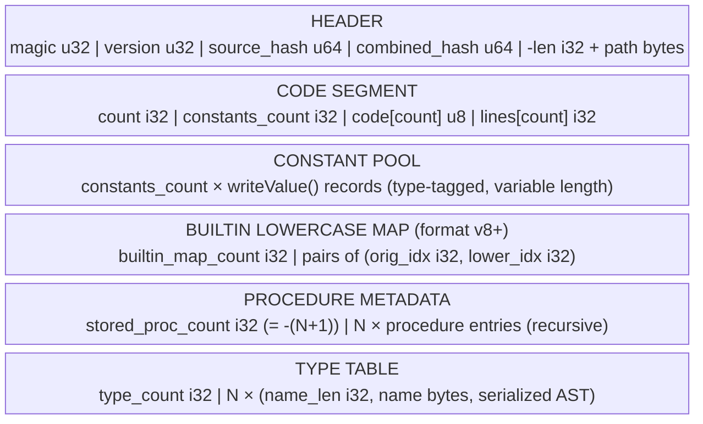
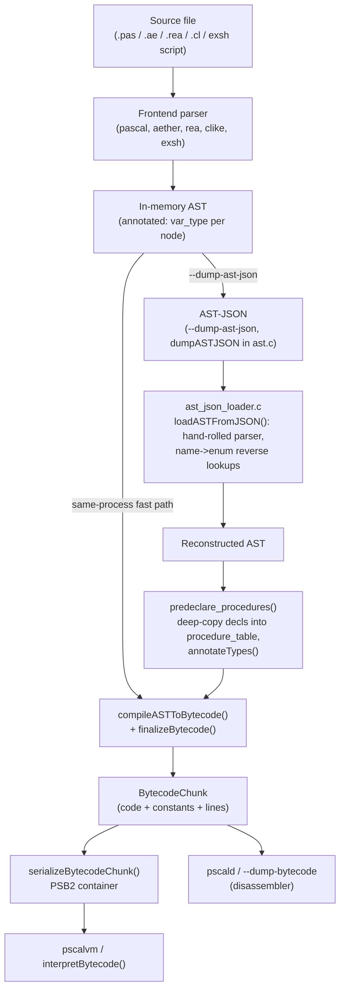

# PSCAL Virtual Machine Technical Manual

## Chapter 2: The Bytecode & Binary File Specification

> Source of truth for this chapter: `components/pscal-core/src/core/cache.c`
> (serialization/deserialization), `components/pscal-core/src/compiler/bytecode.h`
> (`BytecodeChunk`), `components/pscal-core/src/core/version.h` (format version),
> and the umbrella repo's `src/tools/json2bc.c` + `src/tools/ast_json_loader.c`
> (the `pscaljson2bc` tool). The worked example at the end of this chapter was
> generated and executed against the current `build/bin` binaries, not mocked.

### 2.0 One Format, Two Consumers

PSCAL has a single on-disk bytecode container format, produced by
`serializeBytecodeChunk()` in `cache.c`, with two consumers:

1. **The bytecode cache** (`saveBytecodeToCache`) — every frontend
   transparently caches compiled chunks under a per-compiler cache directory,
   keyed by `<compiler_id>-<basename>-<path_hash>-<source_hash>-<combined_hash>.bc`.
   Cache freshness requires the cache file's mtime to be *strictly newer*
   than the source (whole-second resolution, `isCacheFresh()`), plus hash
   verification on load.
2. **Explicit `.bc` files** (`saveBytecodeToFile` / `pscalvm out.bc`) — the
   same byte layout written to a user-chosen path, executable directly by
   `pscalvm` and disassemblable by `pscald`.

Both paths share one writer, so there is exactly one format to document.

### 2.1 File Header Format

The header is written by `serializeBytecodeChunk()` (`cache.c:2420`):

```c
static bool serializeBytecodeChunk(FILE* f, const char* source_path,
                                   const BytecodeChunk* chunk,
                                   uint64_t source_hash, uint64_t combined_hash) {
    uint32_t magic = CACHE_MAGIC, ver = chunk->version;
    fwrite(&magic, sizeof(magic), 1, f);
    fwrite(&ver, sizeof(ver), 1, f);
    fwrite(&source_hash, sizeof(source_hash), 1, f);
    fwrite(&combined_hash, sizeof(combined_hash), 1, f);
    if (!writeSourcePath(f, source_path)) return false;
    return writeChunkCore(f, chunk);
}
```

| Offset | Size | Field | Value / Semantics |
|-------:|-----:|-------|-------------------|
| 0x00 | 4 | `magic` | `CACHE_MAGIC = 0x50534232` ("PSB2"). Written in host (little-endian) byte order, so the file bytes read `32 42 53 50` = `"2BSP"` |
| 0x04 | 4 | `version` | `PSCAL_VM_VERSION`, currently **9** (`version.h:4`); bumped when the chunk layout or cached-AST metadata changes |
| 0x08 | 8 | `source_hash` | FNV-1a hash of the source file contents |
| 0x10 | 8 | `combined_hash` | `computeCombinedHash(source_hash, chunk)` — folds `chunk->version`, code bytes, and constants into one integrity hash |
| 0x18 | 4 + N | `source_path` | `int` length written as **negative** (`-len`) to signal "path present"; followed by N bytes of the `realpath()`-resolved absolute source path, no NUL |

The negative-length trick in `writeSourcePath()` is a backward-compatibility
sentinel: old cache files (pre-path) begin the next section with a
non-negative int, so `verifySourcePath()`/`skipSourcePath()` peek at the sign
and rewind if the path is absent. All multi-byte fields are raw host-endian
`fwrite`s — the format is **not** endian-portable; a `.bc` file is valid on
the architecture family that wrote it (in practice: little-endian everywhere
PSCAL ships).

Real header from the worked example in §2.4 (`xxd add2.bc`):

```
00000000: 3242 5350 0900 0000 f173 b3ba 41e0 d801  2BSP.....s..A...
          └─magic──┘└─ver=9─┘ └─source_hash──────
00000010: 0d42 d197 e054 a591 9dff ffff 2f70 7269  .B...T....../pri
          ──┘└─combined_hash┘ └len=-99┘ └path "/pri..."
```

### 2.2 Segment Layout

After the header, `writeChunkCore()` (`cache.c:893`) writes five sections in
fixed order. The in-memory model is `BytecodeChunk` (`bytecode.h:161-177`):

```c
typedef struct {
    uint32_t version;
    int count;               // bytes in use in 'code'
    int capacity;
    uint8_t* code;            // instruction stream
    int constants_count;
    int constants_capacity;
    Value* constants;         // constant pool
    int* builtin_lowercase_indices;  // string-const idx -> lowercase-copy idx
    int* builtin_resolved_ids;       // string-const idx -> builtin id
    struct Symbol_s** global_symbol_cache;
    char* source_path;
    int* lines;               // source line per code byte
} BytecodeChunk;
```

Note what is *not* serialized: `capacity` fields (recomputed),
`builtin_resolved_ids` and `global_symbol_cache` (runtime caches, rebuilt
lazily), and `source_path` (already in the header).



**Code segment.** `count` and `constants_count` come first (so a reader can
size both arrays), then the raw `code[count]` byte stream, then a *parallel*
`lines[count]` array of `int` — one source line number **per code byte**, not
per instruction. That 4-bytes-of-debug-info-per-code-byte ratio is the price
of exact line attribution in runtime errors without a separate line-run
encoding.

**Constant pool.** Each `Value` is serialized by `writeValue()`
(`cache.c:805`) as a `VarType` tag followed by a type-specific payload:

| Type tag | Payload |
|----------|---------|
| `TYPE_INTEGER`/`WORD`/`BYTE`/`BOOLEAN`/`INT8`/`INT16`/`INT64` | `i_val` (8 bytes) |
| `TYPE_UINT8`..`UINT64` | `u_val` (8 bytes) |
| `TYPE_FLOAT` / `TYPE_REAL` / `TYPE_LONG_DOUBLE` | `f32_val` / `d_val` / `r_val` |
| `TYPE_CHAR` | `c_val` |
| `TYPE_STRING` | `len i32` (−1 = NULL string), then `len` bytes |
| `TYPE_NIL` | nothing |
| `TYPE_ENUM` | name `len i32` + bytes, then `ordinal` |
| `TYPE_SET` | `set_size i32`, then `set_size × i64` members |
| `TYPE_ARRAY` | `dims i32`, `element_type`, per-dim `(lb i32, ub i32)`, then elements recursively via `writeValue` |
| `TYPE_POINTER` | delegated to `writePointerValue()` |

Anything else returns `false` and aborts serialization — file handles, thread
handles, and other runtime-only values are unrepresentable in a `.bc` file by
construction.

**Builtin lowercase map (v8+).** PSCAL identifiers are case-insensitive but
constants preserve source spelling. The compiler emits, for each string
constant that names a builtin, a companion lowercase copy; this section
persists the `(original_idx, lower_idx)` pairing so the VM can resolve
builtin names at load time without re-lowercasing on every call.

**Procedure metadata.** The count is stored as `-(proc_count + 1)` — the
negative encoding is, like the source path, a format-version signal that
distinguishes the current entry layout from an older positive-count one. Each
entry (from `writeProcedureEntriesRecursive`, `cache.c`) is:

```
name_len i32, name bytes          ; lowercased symbol name
bytecode_address                  ; entry offset into the code segment
locals_count u16
upvalue_count u8
type (VarType)                    ; return type; TYPE_VOID for procedures
arity
has_enclosing u8                  ; nested-procedure parent link
  [parent_len i32, parent name]   ; if has_enclosing
upvalue_count × (index u8, isLocal u8, is_ref u8)
```

Entries recurse into nested procedure scopes (`sym->type_def->symbol_table`),
so lexically nested Pascal procedures serialize as a flat stream of entries
with parent-name back-links rather than a tree.

**Type table.** Finally, every named type in `type_table` is written as its
name plus a *fully serialized AST* of the type definition (`writeAst`) — the
VM needs record layouts and enum member lists at runtime, and the AST is the
canonical representation for both.

### 2.3 The Compilation Pipeline: `pscaljson2bc`

The AST-JSON stage is real and is the seam between the thin frontends and
the shared backend. Every frontend can emit its parsed+annotated AST as JSON
(`--dump-ast-json`, implemented by `dumpASTJSON()` in `ast.c:2191`), and
`pscaljson2bc` — sources in the umbrella repo at `src/tools/json2bc.c` +
`src/tools/ast_json_loader.c`, linked against `pscal_core_static` — turns
that JSON back into bytecode. This decouples parsing from code generation
across process (or machine) boundaries:

```
build/bin/pascal --dump-ast-json prog.pas | build/bin/pscaljson2bc -o prog.bc
build/bin/pscalvm prog.bc
```



Key mechanics of the JSON path (`json2bc.c`):

- **The JSON parser is bespoke, not yyjson.** `ast_json_loader.c` is "a
  lightweight JSON parser sufficient to consume the AST JSON produced by
  `dumpASTJSON()`" — it is a schema-specific reader, not a general JSON
  library, and it reconstructs enums by reverse string lookup
  (`astTypeFromString` loops `AST_NOOP..AST_NEW` comparing
  `astTypeToString()` output; likewise `tokenTypeFromString`,
  `varTypeFromString`). Unknown node types degrade to `AST_NOOP`, unknown
  tokens to `TOKEN_IDENTIFIER`.
- **Procedure predeclaration.** Before compiling, `predeclare_procedures()`
  walks the reconstructed AST and inserts a `Symbol` per
  `AST_PROCEDURE_DECL`/`AST_FUNCTION_DECL` into `procedure_table`
  (lowercased name, deep-copied declaration AST, `bytecode_address = -1`),
  then runs `annotateTypes()` on the copy — recreating the state the
  same-process compiler would have accumulated during parsing.
- **The compile call is the same one every frontend uses:**
  `compileASTToBytecode(root, &chunk)` followed by
  `finalizeBytecode(&chunk)` (`compiler.h`). There is no JSON-specific
  code generator; the JSON path just reconstructs the AST and rejoins the
  normal pipeline.
- **Failure hygiene:** on a parse or compile error the tool `unlink()`s any
  partial `-o` output so a broken build can't leave a stale-but-plausible
  `.bc` behind, and returns nonzero.
- The tool is also embedded in exsh as a shell builtin
  (`vmBuiltinShellPscalJson2bc` → `pscaljson2bc_main`), so pipelines like the
  one above work inside PSCAL's own shell without spawning external binaries.

**AST-JSON shape.** Each node is an object with `node_type` (the
`ASTNodeType` name), an optional `token` (`{"type", "value"}`),
`var_type_annotated` (the resolved `VarType`), and structural slots that
mirror the C `AST` struct: named single-child fields (which map onto
`left`/`right`/`extra` — the dumper uses role-specific names like
`program_name_node`, `main_block`, `declarations`, `body`) plus a `children`
array. Excerpt from the worked example:

```json
{
  "node_type": "PROGRAM",
  "token": { "type": "PROGRAM", "value": "program" },
  "var_type_annotated": "VOID",
  "program_name_node": {
    "node_type": "VARIABLE",
    "token": { "type": "IDENTIFIER", "value": "add2" },
    "var_type_annotated": "VOID"
  },
  "main_block": {
    "node_type": "BLOCK",
    "declarations": {
      "node_type": "COMPOUND",
      "children": [
        { "node_type": "VAR_DECL", "var_type_annotated": "INTEGER",
          "right":    { "node_type": "VARIABLE", "token": {"type": "IDENTIFIER", "value": "integer"} },
          "children": [ { "node_type": "VARIABLE", "token": {"type": "IDENTIFIER", "value": "a"} } ] }
      ]
    },
    "body": { "...": "..." }
  }
}
```

### 2.4 Worked Example: Source → JSON → Bytecode → Execution

Input (`add2.pas`):

```pascal
program Add2;
var a, b: integer;
begin
  a := 2;
  b := 40;
  writeln(a + b);
end.
```

Pipeline actually run against the current tree:

```
$ build/bin/pascal --dump-ast-json add2.pas > add2.json     # 3943 bytes of AST-JSON
$ build/bin/pscaljson2bc -o add2.bc add2.json               # 557-byte PSB2 file
$ build/bin/pscalvm add2.bc
42
```

Disassembly (`pscaljson2bc --dump-bytecode-only add2.json`):

```
Offset Line Opcode           Operand  Value / Target (Args)
------ ---- ---------------- -------- --------------------------
0000    0 CONSTANT            1 'nil'
0002    | DEFINE_GLOBAL    NameIdx:0   'myself' Type:POINTER ('')
0007    | DEFINE_GLOBAL    NameIdx:3   'a' Type:INTEGER ('integer')
0012    | DEFINE_GLOBAL    NameIdx:5   'b' Type:INTEGER ('integer')
0017    | PUSH_IMM_I8         2
0019    | GET_GLOBAL_ADDRESS    3 'a'
0021    | SWAP
0022    | SET_INDIRECT
0023    | PUSH_IMM_I8        40
0025    | GET_GLOBAL_ADDRESS    5 'b'
0027    | SWAP
0028    | SET_INDIRECT
0029    | CONST_1
0030    | GET_GLOBAL          3 'a' cache=0x0
0040    | GET_GLOBAL          5 'b' cache=0x0
0050    | ADD
0051    | CALL_BUILTIN_PROC   181 'write' (2 args)
0057    | HALT

Constants (10):
  0000: STR   "myself"    0001: NIL          0002: STR   ""
  0003: STR   "a"         0004: STR   "integer"
  0005: STR   "b"         0006: INT   2      0007: INT   40
  0008: INT   1           0009: STR   "write"
```

Reading this dump against the format spec ties the chapter together:

- Globals are **name-indexed into the constant pool**: `DEFINE_GLOBAL
  NameIdx:3` declares a global whose name is constant #3 (`"a"`) and whose
  type name is the following constant (`"integer"`). The implicit `myself`
  global (constant #0) is the per-VM method-receiver slot from §1.2.
- Assignment compiles to an **address/value/`SET_INDIRECT`** triple: push the
  value (`PUSH_IMM_I8 2`), push the destination address
  (`GET_GLOBAL_ADDRESS`), `SWAP` so the address is under the value, then
  `SET_INDIRECT ( addr value -- )` stores through the pointer.
- Small integers use `PUSH_IMMEDIATE_INT8` (operand embedded in the
  instruction stream) rather than burning constant-pool slots; `2` and `40`
  *also* appear as pool constants #6/#7 because the compiler interned them
  before the immediate-push optimization was chosen — pool slots are cheap,
  unreferenced ones are simply dead weight.
- `GET_GLOBAL` here is the wide **cached** form (`cache=0x0`, an inline-cache
  slot patched on first execution — the `GET_GLOBAL_CACHED` machinery from
  §1.2), which is why each occupies 10 bytes of code.
- `writeln(a+b)` becomes `CONST_1` (argument count context for spacing),
  `ADD`, then `CALL_BUILTIN_PROC 181 'write' (2 args)` — `writeln` lowers to
  the `write` builtin with a newline flag argument (the
  `VM_WRITE_FLAG_NEWLINE` from `vm.h`).
- Top-level programs end in `HALT ( -- )`, not `RETURN` — `RETURN` is for
  call frames; `HALT` terminates `interpretBytecode()` for the whole chunk.

Byte-level check of the first instructions, matching §2.2's layout claim that
`code` is a flat opcode+operand stream: offsets `0017` and `0019` differ by
2 (`PUSH_IMMEDIATE_INT8` = opcode byte + 1 operand byte), while `0030` to
`0040` spans 10 bytes (cached `GET_GLOBAL`: opcode + name index + 8-byte
inline cache pointer slot).
