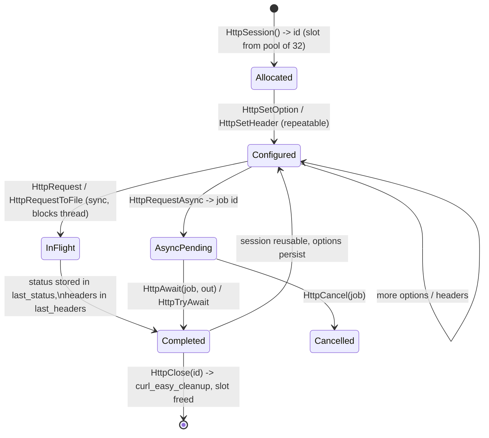

# PSCAL Virtual Machine Technical Manual

## Chapter 4: Built-in Subsystems & Native Bindings

> Source of truth for this chapter:
> `components/pscal-core/src/backend_ast/builtin.c` (the registry),
> `src/ext_builtins/` (the extension categories and their registration),
> `src/backend_ast/builtin_network_api.c` (HTTP/TLS/sockets, 3665 lines),
> `src/ext_builtins/sqlite/sqlite_builtins.c`, and
> `src/ext_builtins/openai/openai_chat.c`.

### 4.0 The Extensibility Model: One Registration, Every Frontend

The single most architecturally consequential property of PSCAL's builtin
layer is that **the VM is extensible through builtins, and every extension is
automatically inherited by every frontend language**. Pascal, Rea, CLike,
Aether, and exsh do not each bind to SQLite or libcurl — they all compile
calls down to the same `CALL_BUILTIN` opcode (§3.3), resolved against one
shared registry. Adding a native capability is one C function plus one
registration call; no frontend changes at all.

The registration primitive (`builtin.c:2203`):

```c
void registerVmBuiltin(const char *name, VmBuiltinFn handler,
                       BuiltinRoutineType type, const char *display_name);
```

where `VmBuiltinFn` is `Value (*)(struct VM_s* vm, int arg_count, Value* args)`
— arguments arrive as a `Value` slice off the operand stack, and the returned
`Value` is pushed back (for `BUILTIN_TYPE_FUNCTION`) or discarded (for
`BUILTIN_TYPE_PROCEDURE`).

Registration does two things, and the second is what makes the frontends
inherit the extension:

1. **Runtime binding:** the canonicalized (lowercased) name → handler mapping
   is appended to the mutex-guarded `extra_vm_builtins` table and indexed for
   O(1)-ish lookup. Re-registering an existing name *replaces* the handler —
   deliberate, so a frontend or embedder can override a stock builtin.
2. **Compile-time visibility:** `registerBuiltinFunction(reg_name, declType,
   NULL)` synthesizes an `AST_FUNCTION_DECL`/`AST_PROCEDURE_DECL` for the
   builtin. Every frontend's semantic pass resolves identifiers against this
   same declaration table, which is exactly why `YyjsonRead(...)` is a valid
   expression in Pascal, Rea, CLike, Aether, and exsh the moment
   `registerYyjsonBuiltins()` has run — the compilers literally see it as a
   pre-declared function.

Names are case-insensitive at the call site (canonicalized on registration
and lookup; the Chapter 2 "builtin lowercase map" persists the pairing into
`.bc` files so the VM never re-lowercases at runtime).

**Extension categories.** Stock extensions live under `src/ext_builtins/`,
one directory per category, each gated by a CMake option and registered
exactly once per process via `pthread_once` (`register.c:25-60`):

| Category | Gate | Surface |
|----------|------|---------|
| `math`, `strings`, `system`, `user` | `ENABLE_EXT_BUILTIN_*` | scalar/string/OS helpers |
| `sqlite` | `ENABLE_EXT_BUILTIN_SQLITE` | full SQLite binding (§4.2) |
| `yyjson` | `ENABLE_EXT_BUILTIN_YYJSON` | JSON handles (§3.4) |
| `graphics`, `threed` | `ENABLE_EXT_BUILTIN_GRAPHICS` / `_3D` | SDL-backed drawing |
| `openai` | `ENABLE_EXT_BUILTIN_OPENAI` | `OpenAIChatCompletions` (§4.3) |
| `query` | always | introspection: programs can ask which categories/functions this binary was built with (`extBuiltinRegisterCategory`/`extBuiltinRegisterFunction` feed the queryable catalog) |

The query category closes the loop on optionality: since any category can be
compiled out, portable PSCAL code can probe for a capability before calling
it instead of dying on an unknown-builtin runtime error.

Because registration is data, not linkage, the same mechanism serves *host
applications embedding the VM*: register your own `VmBuiltinFn`s before
running a chunk and your domain API is a first-class function in all five
languages. This is the intended extension seam — not new opcodes (which
renumber the ISA, §3.0), and not `CALL_HOST` (reserved for the small set of
VM↔frontend-runtime hooks like closure creation).

### 4.1 The Network Operations Engine

#### Session model

HTTP state lives in a fixed pool of 32 slots (`MAX_HTTP_SESSIONS`), each
wrapping a libcurl easy handle. As with JSON and SQLite handles, the PSCAL
program holds only an integer index:

```c
typedef struct HttpSession_s {
    CURL* curl;
    struct curl_slist* headers;   // accumulated request headers
    struct curl_slist* resolve;   // host:port:address pinning entries
    long timeout_ms;              // default 15000
    long follow_redirects;        // default 1
    char* user_agent;             // default "PscalInterpreter/1.0"
    long last_status;
    // TLS / proxy
    char* ca_path;                // CURLOPT_CAINFO
    char* client_cert, *client_key;  // mutual TLS
    char* proxy, *proxy_userpwd;  long proxy_type;  // http/https/socks4/socks5
    long verify_peer, verify_host;   // default 1/1 (verify_host maps 1 -> CURL's 2)
    long force_http2, alpn;
    long tls_min, tls_max;        // 10/11/12/13 -> TLS 1.0..1.3
    char* ciphers;                // CURLOPT_SSL_CIPHER_LIST
    char* pinned_pubkey;          // CURLOPT_PINNEDPUBLICKEY
    // Behavior
    char* accept_encoding;  char* cookie_file, *cookie_jar;
    long max_retries;  long retry_delay_ms;        // exponential-backoff retry
    curl_off_t max_recv_speed, max_send_speed;     // rate limiting
    char* upload_file;  char* basic_auth;
    // Last-result state
    char* last_headers;           // raw response headers, accumulated by callback
    int   last_error_code;  char* last_error_msg;
} HttpSession;
```

Security defaults are correct-by-default: peer and host verification are ON
at allocation; a program must explicitly opt out via `HttpSetOption`. TLS
flexibility runs the full practical range — CA override, mutual TLS
(cert+key), version pinning (`tls_min`/`tls_max`), cipher-list control, and
public-key pinning for the paranoid tier.

#### Session lifecycle



The sync path (`vmBuiltinHttpRequest`) configures the easy handle from
session state on every call — URL, write callback into a PSCAL `MStream`
(or a `DualSink` teeing to both a `FILE*` and the stream for
request-to-file-plus-buffer), header accumulator (`headerAccumCallback`
reallocs `last_headers` as chunks arrive), timeout, redirects, and the whole
TLS block — then runs `curl_easy_perform` on the *calling* interpreter
thread. Post-request, the program inspects `HttpGetLastHeaders`,
`HttpGetHeader(name)`, and `HttpErrorCode`.

#### The async layer

Async requests get their own OS thread per job, from a second 32-slot pool
(`MAX_HTTP_ASYNC`, `g_http_async[]`):

```c
typedef struct HttpAsyncJob_s {
    int active;
    pthread_t th;
    int session;                 // originating session id
    char *method, *url, *body;  size_t body_len;
    MStream* result;             // allocated by the job thread
    long status;  char* error;
    /* ...a full mirror copy of every session option at submission time:
       TLS block, proxy block, retries, rate limits, cookie jars,
       plus deep-copied curl_slist headers/resolve entries... */
    volatile int cancel_requested;      // polled by curl progress callback
    long long dl_now, dl_total;         // live progress counters
    int done;
} HttpAsyncJob;
```

The **mirror copy is the design point**: `HttpRequestAsync` snapshots the
session's entire configuration into the job before the worker starts, so the
program can immediately reconfigure or reuse the session — even fire another
async request from it — without racing the in-flight job. Session and job
share nothing after submission except the session id used to write back
`last_status`/`last_headers` on await.

The waiting API is a small state machine over that job slot:

- `HttpIsDone(id)` — non-blocking poll of `job->done`.
- `HttpTryAwait(id, out)` — non-blocking claim: returns the result only if
  finished.
- `HttpAwait(id, out)` — `pthread_join(job->th)`, then copies the job's
  result buffer into the caller-supplied `MStream`, propagates
  status/headers/error back onto the session, and frees the slot.
- `HttpCancel(id)` — sets `cancel_requested`; the job's curl progress
  callback observes it and aborts the transfer.
- `HttpGetAsyncProgress`/`HttpGetAsyncTotal` — read `dl_now`/`dl_total` for
  progress bars.

#### Sequence: a thread dispatching an async TLS request

```mermaid
sequenceDiagram
    participant BC as Interpreter thread<br/>(bytecode)
    participant REG as Builtin registry
    participant SES as HttpSession[i]<br/>(slot pool)
    participant JOB as HttpAsyncJob[j]<br/>(+ its pthread)
    participant NET as libcurl / TLS / network

    BC->>REG: CALL_BUILTIN 'httpsession'
    REG->>SES: httpAllocSession() — verify_peer=1, verify_host=1, 15s timeout
    SES-->>BC: push session id i
    BC->>SES: CALL_BUILTIN 'httpsetoption'(i,'tls_min','13'), 'httpsetheader'(...)
    BC->>REG: CALL_BUILTIN 'httprequestasync'(i,'GET',url)
    REG->>JOB: alloc job j, MIRROR-COPY all session options,<br/>deep-copy header slists
    JOB->>JOB: pthread_create(httpAsyncThread)
    JOB-->>BC: push job id j (returns immediately)
    par worker thread
        JOB->>NET: curl_easy_perform — TLS handshake per mirrored options<br/>(CAINFO, VERIFYPEER, TLSVERSION, pinned key)
        NET-->>JOB: chunks -> result MStream, headers -> last_headers,<br/>progress -> dl_now/dl_total
        JOB->>JOB: done = 1
    and interpreter thread continues
        BC->>BC: ...other bytecode; optionally CALL_BUILTIN 'httpisdone'(j)
    end
    BC->>JOB: CALL_BUILTIN 'httpawait'(j, out_mstream)
    JOB->>BC: pthread_join; copy result -> out;<br/>write status/headers back to session i; free slot j
    BC->>SES: CALL_BUILTIN 'httpclose'(i)
```

Note the concurrency layering: these job threads are *native* threads owned
by the network engine, entirely separate from the VM's own `THREAD_CREATE`
worker pool (§1.4). A PSCAL program can therefore have 16 VM threads each
juggling up to 32 async transfers without any interpreter-level blocking.

#### Sockets and DNS

Below the HTTP engine sits a raw socket layer (`SocketInfo_s`,
`builtin_network_api.c:46`) with the classic BSD surface as builtins:
`SocketCreate/Close/Connect/Bind/Listen/Accept/Send/Receive`,
`SocketSetBlocking`, `SocketPoll`, and `DnsLookup` — again integer handles,
again available identically from every frontend. HTTP is a convenience tier,
not a wall: servers and custom protocols are written against this layer.

### 4.2 Data & Storage Runtimes

Every native data subsystem follows the same handle discipline established
in §3.4: an integer on the PSCAL stack, a mutex-guarded native-side table
entry behind it, explicit lifecycle builtins, and a `runtimeError` (not
undefined behavior) on a stale or wrong-kind handle.

#### SQLite

The binding (`sqlite_builtins.c`, gated by `ENABLE_EXT_BUILTIN_SQLITE`) is a
faithful projection of the sqlite3 C API onto handles. Its table
distinguishes two handle kinds — connections and prepared statements — and
`SqliteClose` walks the table to finalize any statements still open against
the closing database (preventing the classic sqlite3 "unfinalized statement"
leak from being expressible):

```c
typedef struct {
    SqliteHandleKind kind;       // db or statement
    sqlite3 *db;                 // owner connection
    sqlite3_stmt *stmt;          // statement handles only
} SqliteHandleEntry;
static SqliteHandleEntry *sqliteHandleTable;   // grows on demand
```

The registered surface, grouped as the registration code groups it:

| Group | Builtins |
|-------|----------|
| connection | `SqliteOpen(path) -> db`, `SqliteClose(db)`, `SqliteExec(db, sql)`, `SqliteErrMsg(db)`, `SqliteLastInsertRowId(db)`, `SqliteChanges(db)` |
| statement | `SqlitePrepare(db, sql) -> stmt`, `SqliteStep(stmt)`, `SqliteReset(stmt)`, `SqliteFinalize(stmt)`, `SqliteClearBindings(stmt)` |
| binding | `SqliteBindText/Int/Double/Null(stmt, idx, v)` |
| metadata | `SqliteColumnCount/Type/Name(stmt, col)` |
| results | `SqliteColumnInt/Double/Text(stmt, col)` |

which supports the full prepared-statement loop from any frontend:

```pascal
db := SqliteOpen('bench.db');
stmt := SqlitePrepare(db, 'SELECT name, score FROM runs WHERE score > ?');
SqliteBindInt(stmt, 1, 25);
while SqliteStep(stmt) = 100 do   { SQLITE_ROW }
  writeln(SqliteColumnText(stmt, 0), ': ', SqliteColumnInt(stmt, 1));
SqliteFinalize(stmt);
SqliteClose(db);
```

#### JSON (yyjson)

Documented in §3.4; architecturally it is this same pattern with a
refcounting twist (VAL handles pin their parent DOC).

#### AI integration (OpenAI-compatible chat)

`OpenAIChatCompletions` (`openai_chat.c`, gated by
`ENABLE_EXT_BUILTIN_OPENAI`) rides the HTTP engine internally: it builds a
chat-completions JSON body, POSTs to an OpenAI-compatible endpoint (2–5
arguments: prompt/model plus optional endpoint and API key, with
environment-variable fallback for the key), and returns the response for the
program to pick apart with the yyjson builtins. It is a working demonstration
of the whole chapter's thesis: an "AI integration" required zero VM changes —
it is an ordinary registered builtin composed from two other builtin
subsystems, and the day it was registered it became callable from all five
languages.

### 4.3 Summary: the Composition Rules

The subsystem layer obeys four rules, uniformly:

1. **Handles are integers**; native state lives in mutex-guarded tables
   (sessions: fixed 32; async jobs: fixed 32; sqlite/json: growable).
   Nothing native ever crosses the operand stack.
2. **Lifecycles are explicit** (`*Close`/`*Free`/`*Finalize`); the VM does
   not garbage-collect native resources, but destructors are defensive
   (closing a DB finalizes its statements; freeing a session releases its
   curl handle and slists).
3. **Blocking is a choice**: every subsystem's blocking call runs on the
   calling interpreter thread; concurrency comes from either VM threads
   (§1.4) or subsystem-owned native threads (HTTP async), never from hidden
   yielding inside the interpreter.
4. **Everything enters through `registerVmBuiltin`**, which is why every
   capability in this chapter — and any capability an embedder adds tomorrow
   — is uniformly present in Pascal, Rea, CLike, Aether, and exsh.
